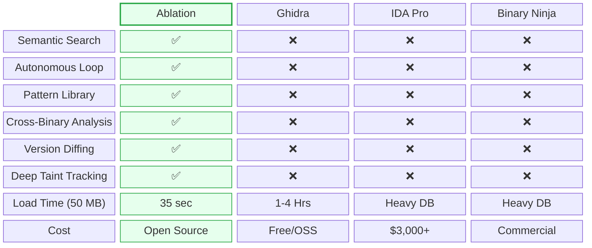

# Ablation Reverse Engineering Framework


Ablation is a reverse engineering framework; combined with any LLM/AI, it becomes a fully autonomous reverse engineering tool. Independent of the legacy reverse engineering tools, it is built for the modern landscape, and more importantly, the human.

By removing the tedious GUI and the license fees, Ablation makes reverse engineering achievable to anyone. No matter your wallet or your barrier of entry into education, you can learn about reverse engineering as you reverse engineer.

---

## Framework Architecture & Module Orchestration


---

## Supported Architectures

`x86 - 32` `x86 - 64` `ARM - 32` `ARM - 64` `MIPS 32+nM` `MIPS - 64` `PPC - 32` `PPC - 64` `ARC EM/HS` `RISC-V 32` `RISC-V 64` `V850 - 32` `Windows .sys`

---

## The Core Capabilities

- **Extreme Performance:** Loading a 50 MB binary in 35 seconds provides a massive architectural advantage. Traditional tools like Ghidra or IDA Pro parse everything into complex proprietary databases upfront. Ablation dynamically builds its intermediate representation (IR) and control flow graphs (CFGs) only for the active scope.
- **Semantic Search via BERT:** Search across every function in plain English. The agent converts binary semantics into behavioral fingerprints using Sentence Transformers. Searching for *"TLV parser that advances pointer without bounds check"* looks for the mathematical shape of the vulnerability, not just literal strings.
- **Version Diffing with DTW:** Ablation uses Dynamic Time Warping (DTW) and Matrix Profiles to diff binaries. If a vendor patches a CVE by changing the logic, the raw bytes will change. DTW tracks the "shape" of the function's execution to confirm whether the logic was actually patched across releases.
- **Cross-Binary Analysis:** Analyze every shared library in a firmware image simultaneously, tracking data flows across binary boundaries.

---

## Specialized Attack Surface Scanners

- **Format String:** Uses backward tracing to mathematically prove whether a format argument is a safe string literal stored in read-only memory, or a vulnerable stack slot/argument register.
- **Heap Analysis:** Actively scans for integer overflows occurring immediately before an allocation, as well as use-after-free and double-free conditions.
- **MIPS32 Taint Tracking:** Traces data originating from network boundaries (`recv`/`read`) straight to system sinks (`execve`/`system`), accounting for MIPS-specific quirks like load-delay slots and endianness.
- **Windows Kernel Drivers:** Extracts IRP/IOCTL dispatch tables, scans for rootkit callbacks, checks for SMEP disablement, and scores drivers for Bring Your Own Vulnerable Driver (BYOVD) primitives.

---

## Feature Comparison vs. Legacy Tools



*(Note: While IDA offers a free tier, it strictly prohibits commercial use. Furthermore, IDA Free limits analysis to only 3 file formats and restricts disassembly support exclusively to x86 32/64 architectures.)*

---

## The Autonomous Loop

When executing commands like `ablation sweep firmware.so --json results.json`, Claude Code can interpret the JSON, identify suspicious functions, and automatically pivot to run `ablation cfg` to visualize logic or `ablation taint` to verify reachability.

This ReAct loop using `claude-sonnet-5` for decompilation effectively replaces the junior analyst role during triage, surfacing only confirmed, exploitable paths for human review.

**Recommended model:** `claude-sonnet-5`

```
/model claude-sonnet-5
```

---

## Real-World Results

Ablation has been used to analyze production firmware and kernel drivers from Fortinet, Cisco, Axis, Fujitsu, MikroTik, Orka, TencentOS, Enigma2, and Skydio.

Following coordinated disclosure on Cisco FMC and ISE, the Cisco Product Security Incident Response Team (PSIRT) has adopted Ablation for internal vulnerability triage. Cisco PSIRT is actively using it to triage ongoing disclosure reports across Firepower Threat Defense (FTD), Cisco Secure Client (AnyConnect), HyperFlex, and Catalyst. Cisco Adaptive Security Appliance (ASA) LINA has also been reverse engineered using Ablation, with findings currently under coordinated triage via CERT/CC VINCE.

| CVE | Product | Title | CVSS | Advisory |
|---|---|---|---|---|
| CVE-2026-76420 | Secure Firewall Management Center (FMC) | Peer Impersonation | 9.0 Critical | [cisco-sa-fmc2-multivulns-HXgcqRG](https://sec.cloudapps.cisco.com/security/center/content/CiscoSecurityAdvisory/cisco-sa-fmc2-multivulns-HXgcqRG) |
| CVE-2026-76412 | Secure Firewall Management Center (FMC) | Privilege Escalation to root | 8.5 High | [cisco-sa-fmc2-multivulns-HXgcqRG](https://sec.cloudapps.cisco.com/security/center/content/CiscoSecurityAdvisory/cisco-sa-fmc2-multivulns-HXgcqRG) |
| CVE-2026-76413 | Secure Firewall Management Center (FMC) | Single Sign-On Token Forgery | 8.5 High | [cisco-sa-fmc2-multivulns-HXgcqRG](https://sec.cloudapps.cisco.com/security/center/content/CiscoSecurityAdvisory/cisco-sa-fmc2-multivulns-HXgcqRG) |
| CVE-2026-76447 | Identity Services Engine (ISE) | OCSP Responder Authentication Bypass | 5.3 Medium | [cisco-sa-ise-multiauth-bypass-sgD2HbL4](https://sec.cloudapps.cisco.com/security/center/content/CiscoSecurityAdvisory/cisco-sa-ise-multiauth-bypass-sgD2HbL4) |

---

## Install

```bash
pip install git+https://github.com/Ablation-Tool/ablation
```

With LLM features:

```bash
pip install "git+https://github.com/Ablation-Tool/ablation#egg=ablation[llm]"
```

---

## Feedback

Found a bug, have an idea, or want to see something added to the tool? Reach out directly.

- [Open an issue](https://github.com/Ablation-Tool/ablation/issues) on GitHub
- X: [@ablation_tool](https://x.com/ablation_tool)
- Signal: [@deadbug.06](https://signal.me/#p/deadbug.06)
- Email: ablation@nuclide-research.com

**Ideas and feature requests:** describe the RE task you want to accomplish and what Ablation currently can't do. All suggestions are welcome.

**Bug reports:** include your Python version, OS, the command that failed, and the full error output.

---

## Requirements

- Python >= 3.10
- `capstone`, `numpy`, `lief`, `sentence-transformers`, `pyelftools`
- Optional: `anthropic` for LLM features

---

## License

See [LICENSE](LICENSE).

---

## Maintainer

Nicholas Michael Kloster & Claude

---

## Reference Material Used to Build Ablation

**Books** (All obtained from O'Reilly Media | [www.oreilly.com](https://www.oreilly.com))

| Title | Author |
|---|---|
| The Art of Software Security Assessment | Dowd, McDonald, Schuh |
| Practical Binary Analysis | Dennis Andriesse |
| Practical Malware Analysis | Sikorski, Honig |
| Practical Reverse Engineering | Dang, Gazet, Bachaalany |
| Hacking: The Art of Exploitation (2e) | Jon Erickson |
| Learning Linux Binary Analysis | Ryan O'Neill |
| Windows Internals Part 1 & 2 | Yosifovich, Russinovich |
| Rootkits: Subverting the Windows Kernel | Hoglund, Butler |
| Advanced Compiler Design and Implementation | Muchnick |
| Engineering a Compiler | Cooper, Torczon |
| Security Engineering (3rd ed.) | Ross Anderson |
| Practical IoT Hacking | Chantzis et al. |
| The Art of Mac Malware | Patrick Wardle |
| Mathematical Concepts and Methods in Modern Biology | Robeva, Hodge |

**Research Papers**

| Title | Authors |
|---|---|
| [Finding Taint-Style Vulnerabilities in Linux-based Embedded Firmware with SSE-based Alias Analysis](https://arxiv.org/abs/2109.12209) | Cheng, Zheng, Liu, Guan, Liu, Li, Zhu, Ye, Sun |
| [iResolveX: Multi-Layered Indirect Call Resolution via Static Reasoning and Learning-Augmented Refinement](https://arxiv.org/abs/2601.17888) | Santra et al. |
| [Extracting Protocol Format as State Machine via Controlled Static Loop Analysis](https://arxiv.org/abs/2305.13483) | Shi, Xu, Zhang [@qingkaishi](https://github.com/qingkaishi) |
| [NEMETYL: Message Type Identification of Binary Network Protocols using Continuous Segment Similarity](https://arxiv.org/abs/2002.03391) | Kleber et al. [@vs-uulm](https://github.com/vs-uulm) |
| [Imperfect Forward Secrecy: How Diffie-Hellman Fails in Practice](https://dl.acm.org/doi/10.1145/2810103.2813707) | Adrian et al. [@dadrian](https://github.com/dadrian) |
| [Nonce-Disrespecting Adversaries: Practical Forgery Attacks on GCM in TLS](https://www.usenix.org/conference/woot16/workshop-program/presentation/bock) | Böck et al. [@hannob](https://github.com/hannob) |
| [Whitening Sentence Representations for Better Semantics and Faster Retrieval](https://arxiv.org/abs/2103.15316) | Su et al. [@bojone](https://github.com/bojone) |
| [Constant Propagation with Conditional Branches](https://dl.acm.org/doi/abs/10.1145/103135.103136) | Wegman, Zadeck |
| [A Simple, Fast Dominance Algorithm](https://www.cs.princeton.edu/techreports/2005/737.pdf) | Cooper, Harvey, Kennedy |
| [libdft: Practical Dynamic Data Flow Tracking for Commodity Systems](https://dl.acm.org/doi/10.1145/2151024.2151042) | Kemerlis et al. [@vkemerlis](https://github.com/vkemerlis) |

**Honorable Mention**

Microsoft Excel (Data Analysis ToolPak) When analyzing closed infrastructure or securing black-box systems, this exact process is called timing analysis or telemetry reverse engineering. Without source code, the Data Analysis ToolPak mathematically deconstructs how an application works on the backend by strictly observing its inputs and outputs.
