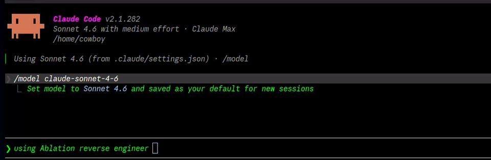
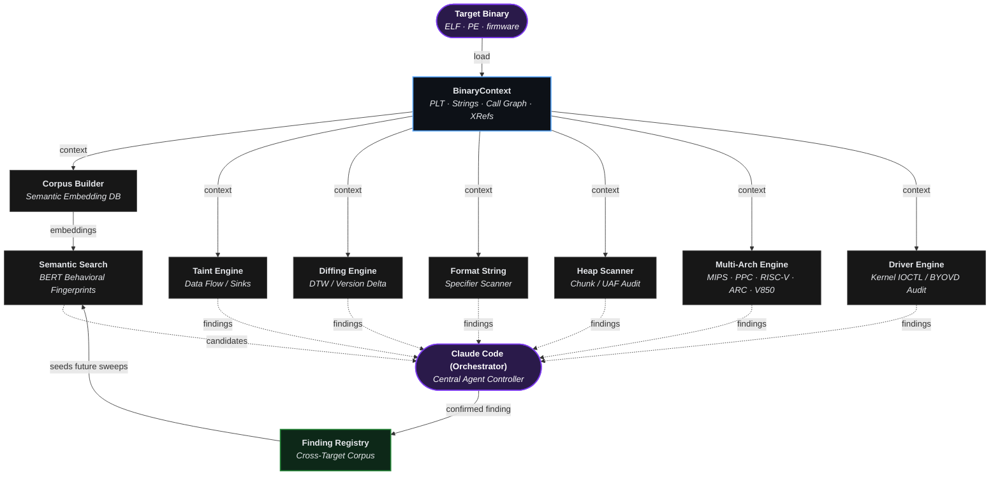
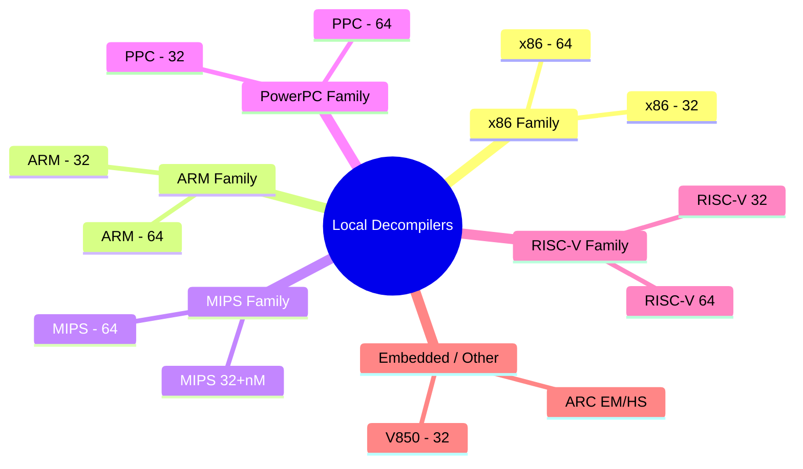
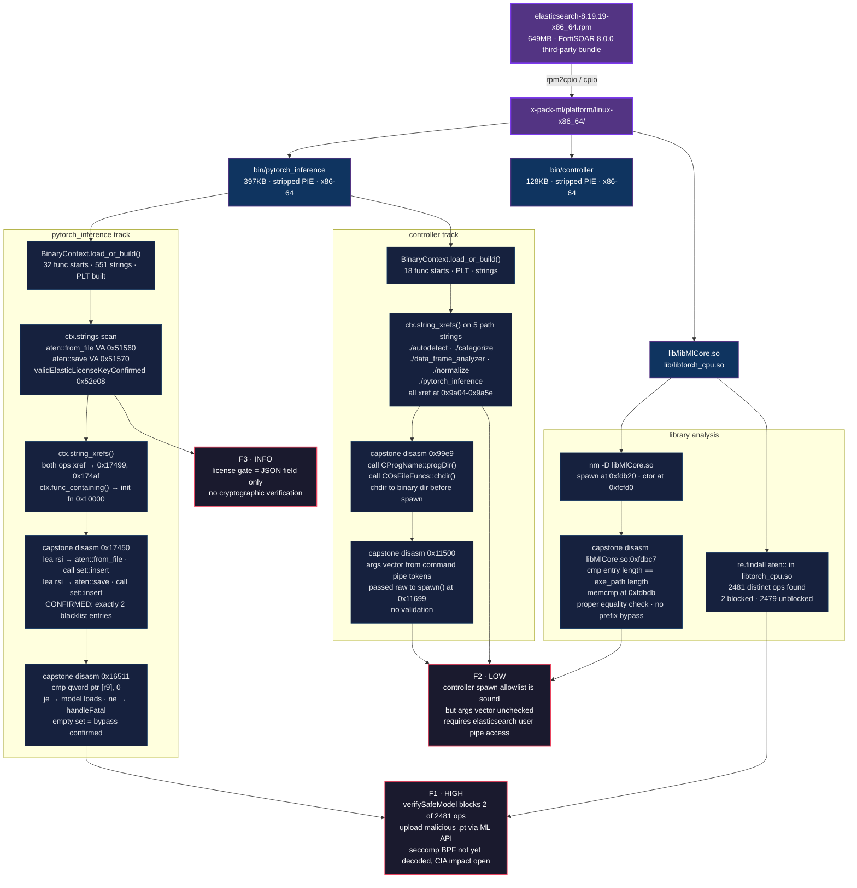

# Ablation Reverse Engineering Framework


Ablation is a reverse engineering framework that provides the exact same core disassembly, decompilation, and binary analysis capabilities as industry-standard tools like Ghidra, IDA Pro, and Binary Ninja. Combined with an LLM, it transforms into a fully autonomous reverse engineering tool.


Ablation is built for the modern landscape, and more importantly, the human.


Now reverse engineering is accessible to anyone. No matter your wallet or your barrier of entry into education, you can learn about reverse engineering as you reverse engineer.

---



---

## Framework Architecture & Module Orchestration



---

## Local Decompilers



---

## The Core Capabilities

- **Semantic Search via BERT:** Semantic search finds results based on meaning rather than exact keywords. BERT reads text and figures out what it means. Similar meanings get similar scores, so you can search by concept instead of exact words. By combining the two, it speeds up the main bottleneck of reverse engineering while finding the vulnerable functions.
- **Extreme Performance:** A 50 MB binary loads in 35 seconds. Ghidra and IDA Pro can take hours because they parse the entire file into a database before you can do anything. Ablation only analyzes the functions you are actively working on, so you start immediately.
- **Version Diffing:** Utilizing the Jaccard method to measure how much a function's behavior overlaps between releases and Dynamic Time Warping that tracks the "shape" of how a function executes across those versions of firmware or software that a vendor updated, Ablation confirms whether a patch actually changed the logic or just the packaging, because a cosmetic recompile can't hide an unpatched vulnerability.
- **Cross-Binary Analysis:** Analyze every shared library in a firmware image simultaneously, tracking data flows across binary boundaries.

---

## Specialized Attack Surface Scanners

- **Format String:** Uses backward tracing to mathematically prove whether a format argument is a safe string literal stored in read-only memory, or a vulnerable stack slot/argument register.
- **Heap Analysis:** Actively scans for integer overflows occurring immediately before an allocation, as well as use-after-free and double-free conditions.
- **MIPS32 Taint Tracking:** Traces data originating from network boundaries (`recv`/`read`) straight to system sinks (`execve`/`system`), accounting for MIPS-specific quirks like load-delay slots and endianness.
- **Windows Kernel Drivers:** Extracts IRP/IOCTL dispatch tables, scans for rootkit callbacks, checks for SMEP disablement, and scores drivers for Bring Your Own Vulnerable Driver (BYOVD) primitives.

---

## Encryption Analysis

- **Entropy Mapper:** Finds encrypted, compressed, or packed sections in a binary.
- **Crypto Audit:** Scans for weak or broken cryptography including JWT alg:none, weak secrets, embedded key material, and outdated TLS versions and ciphers.
- **XorSolver:** Recovers XOR cipher keys using known-plaintext attacks and frequency analysis, then decrypts the target section.

---

## Feature Comparison vs. Legacy Tools

**Everything legacy tools have**

| Feature | Ablation | Ghidra | IDA Pro | Binary Ninja |
|---|:---:|:---:|:---:|:---:|
| Disassembler | ✅ | ✅ | ✅ | ✅ |
| Decompiler | ✅ | ✅ | ✅ | ✅ |
| Scripting API | ✅ | ✅ | ✅ | ✅ |
| Multi-Architecture | ✅ | ✅ | ✅ | ✅ |
| Binary Diffing | ✅ | ✅ | ✅ | ✅ |

**Capabilities legacy tools don't have**

| Feature | Ablation | Ghidra | IDA Pro | Binary Ninja |
|---|:---:|:---:|:---:|:---:|
| Semantic Search | ✅ | ❌ | ❌ | ❌ |
| Autonomous Loop | ✅ | ❌ | ❌ | ❌ |
| Pattern Library | ✅ | ❌ | ❌ | ❌ |
| Cross-Binary Taint Tracking | ✅ | ❌ | ❌ | ❌ |
| Version Diffing via DTW | ✅ | ❌ | ❌ | ❌ |
| Finding Registry | ✅ | ❌ | ❌ | ❌ |
| Load Time (50 MB) | **35 sec** | 1-4 hrs | Heavy DB | Heavy DB |
| Cost | **Open Source** | Free / OSS | $3,000+ | Commercial |

---

## The Autonomous Loop

When executing commands like `ablation sweep firmware.so --json results.json`, Claude Code can interpret the JSON, identify suspicious functions, and automatically pivot to run `ablation cfg` to visualize logic or `ablation taint` to verify reachability.

This ReAct loop using `claude-sonnet-5` for decompilation effectively replaces the junior analyst role during triage, surfacing only confirmed, exploitable paths for human review.

**Recommended model:** `claude-sonnet-4-6` (released January 2026).

```
/model claude-sonnet-4-6
```

---

## Real-World Results

Ablation has been used to analyze production firmware and kernel drivers from Fortinet, Cisco, Axis, Fujitsu, MikroTik, Orka, TencentOS, Enigma2, and Skydio.

Following coordinated disclosure on Cisco FMC and ISE, the Cisco Product Security Incident Response Team (PSIRT) has adopted Ablation for internal vulnerability triage. Cisco PSIRT is actively using it to triage ongoing disclosure reports across Firepower Threat Defense (FTD), Cisco Secure Client (AnyConnect), HyperFlex, and Catalyst. Cisco Adaptive Security Appliance (ASA) LINA has also been reverse engineered using Ablation, with findings currently under coordinated triage via CERT/CC VINCE.

| CVE | Product | Title | CVSS | Advisory |
|---|---|---|---|---|
| CVE-2026-76420 | Secure Firewall Management Center (FMC) | Peer Impersonation | 9.0 Critical | [cisco-sa-fmc2-multivulns-HXgcqRG](https://sec.cloudapps.cisco.com/security/center/content/CiscoSecurityAdvisory/cisco-sa-fmc2-multivulns-HXgcqRG) |
| CVE-2026-76412 | Secure Firewall Management Center (FMC) | Privilege Escalation to root | 8.5 High | [cisco-sa-fmc2-multivulns-HXgcqRG](https://sec.cloudapps.cisco.com/security/center/content/CiscoSecurityAdvisory/cisco-sa-fmc2-multivulns-HXgcqRG) |
| CVE-2026-76413 | Secure Firewall Management Center (FMC) | Single Sign-On Token Forgery | 8.5 High | [cisco-sa-fmc2-multivulns-HXgcqRG](https://sec.cloudapps.cisco.com/security/center/content/CiscoSecurityAdvisory/cisco-sa-fmc2-multivulns-HXgcqRG) |
| CVE-2026-76447 | Identity Services Engine (ISE) | OCSP Responder Authentication Bypass | 5.3 Medium | [cisco-sa-ise-multiauth-bypass-sgD2HbL4](https://sec.cloudapps.cisco.com/security/center/content/CiscoSecurityAdvisory/cisco-sa-ise-multiauth-bypass-sgD2HbL4) |

---

## Example: Elasticsearch 8.19.19 x-pack-ml RE Workflow

End-to-end analysis of the ML native binaries bundled in FortiSOAR 8.0.0, from RPM extraction through BinaryContext, string xrefs, and capstone disassembly to confirmed findings.



---

## Install

```bash
pip install git+https://github.com/Ablation-Tool/ablation
```

With LLM features:

```bash
pip install "git+https://github.com/Ablation-Tool/ablation#egg=ablation[llm]"
```

---

## Feedback

Reach out directly. If there's anything you'd like added or improved on or just report a bug.

- [Open an issue](https://github.com/Ablation-Tool/ablation/issues) on GitHub
- X: [@ablation_tool](https://x.com/ablation_tool)
- Signal: [@deadbug.06](https://signal.me/#p/deadbug.06)
- Email: ablation@nuclide-research.com

---

## Requirements

- Python >= 3.10
- `capstone`, `numpy`, `lief`, `sentence-transformers`, `pyelftools`
- Optional: `anthropic` for LLM features

---

## License

See [LICENSE](LICENSE).

---

## Maintainer

Nicholas Michael Kloster & Claude

---

## Reference Material Used to Build Ablation

**Books** (All obtained from O'Reilly Media | [www.oreilly.com](https://www.oreilly.com))

| Title | Author |
|---|---|
| The Art of Software Security Assessment | Dowd, McDonald, Schuh |
| Practical Binary Analysis | Dennis Andriesse |
| Practical Malware Analysis | Sikorski, Honig |
| Practical Reverse Engineering | Dang, Gazet, Bachaalany |
| Hacking: The Art of Exploitation (2e) | Jon Erickson |
| Learning Linux Binary Analysis | Ryan O'Neill |
| Windows Internals Part 1 & 2 | Yosifovich, Russinovich |
| Rootkits: Subverting the Windows Kernel | Hoglund, Butler |
| Advanced Compiler Design and Implementation | Muchnick |
| Engineering a Compiler | Cooper, Torczon |
| Security Engineering (3rd ed.) | Ross Anderson |
| Practical IoT Hacking | Chantzis et al. |
| The Art of Mac Malware | Patrick Wardle |
| Mathematical Concepts and Methods in Modern Biology | Robeva, Hodge |

**Research Papers**

| Title | Authors |
|---|---|
| [Finding Taint-Style Vulnerabilities in Linux-based Embedded Firmware with SSE-based Alias Analysis](https://arxiv.org/abs/2109.12209) | Cheng, Zheng, Liu, Guan, Liu, Li, Zhu, Ye, Sun |
| [iResolveX: Multi-Layered Indirect Call Resolution via Static Reasoning and Learning-Augmented Refinement](https://arxiv.org/abs/2601.17888) | Santra et al. |
| [Extracting Protocol Format as State Machine via Controlled Static Loop Analysis](https://arxiv.org/abs/2305.13483) | Shi, Xu, Zhang [@qingkaishi](https://github.com/qingkaishi) |
| [NEMETYL: Message Type Identification of Binary Network Protocols using Continuous Segment Similarity](https://arxiv.org/abs/2002.03391) | Kleber et al. [@vs-uulm](https://github.com/vs-uulm) |
| [Imperfect Forward Secrecy: How Diffie-Hellman Fails in Practice](https://dl.acm.org/doi/10.1145/2810103.2813707) | Adrian et al. [@dadrian](https://github.com/dadrian) |
| [Nonce-Disrespecting Adversaries: Practical Forgery Attacks on GCM in TLS](https://www.usenix.org/conference/woot16/workshop-program/presentation/bock) | Böck et al. [@hannob](https://github.com/hannob) |
| [Whitening Sentence Representations for Better Semantics and Faster Retrieval](https://arxiv.org/abs/2103.15316) | Su et al. [@bojone](https://github.com/bojone) |
| [Constant Propagation with Conditional Branches](https://dl.acm.org/doi/abs/10.1145/103135.103136) | Wegman, Zadeck |
| [A Simple, Fast Dominance Algorithm](https://www.cs.princeton.edu/techreports/2005/737.pdf) | Cooper, Harvey, Kennedy |
| [libdft: Practical Dynamic Data Flow Tracking for Commodity Systems](https://dl.acm.org/doi/10.1145/2151024.2151042) | Kemerlis et al. [@vkemerlis](https://github.com/vkemerlis) |

**Honorable Mention**

Microsoft Excel (Data Analysis ToolPak) When analyzing closed infrastructure or securing black-box systems, this exact process is called timing analysis or telemetry reverse engineering. Without source code, the Data Analysis ToolPak mathematically deconstructs how an application works on the backend by strictly observing its inputs and outputs.
