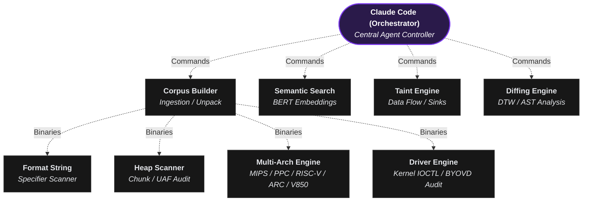
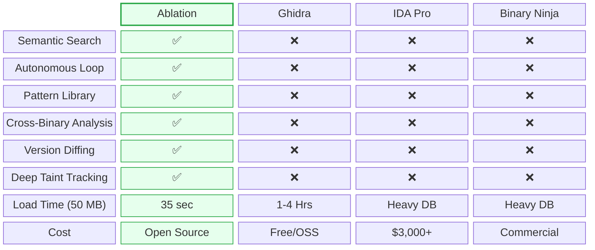

# Ablation Reverse Engineering Framework


Ablation fundamentally shifts the reverse engineering workflow by operating as an orchestration engine rather than just a static disassembler. By delegating the triage phase to an agent (like Claude Code), Ablation acts as the specialized toolbelt the agent uses to interact with the binary. It performs all the core functions of Ghidra, IDA Pro, and Binary Ninja, but eliminates tedious GUI interactions and license fees.

---

## Framework Architecture & Module Orchestration



---

## Supported Architectures

`x86 - 32` `x86 - 64` `ARM - 32` `ARM - 64` `MIPS 32+nM` `MIPS - 64` `PPC - 32` `PPC - 64` `ARC EM/HS` `RISC-V 32` `RISC-V 64` `V850 - 32` `Windows .sys`

---

## The Core Capabilities

- **Extreme Performance:** Loading a 50 MB binary in 35 seconds provides a massive architectural advantage. Traditional tools like Ghidra or IDA Pro parse everything into complex proprietary databases upfront. Ablation dynamically builds its intermediate representation (IR) and control flow graphs (CFGs) only for the active scope.
- **Semantic Search via BERT:** Search across every function in plain English. The agent converts binary semantics into behavioral fingerprints using Sentence Transformers. Searching for *"TLV parser that advances pointer without bounds check"* looks for the mathematical shape of the vulnerability, not just literal strings.
- **Version Diffing with DTW:** Ablation uses Dynamic Time Warping (DTW) and Matrix Profiles to diff binaries. If a vendor patches a CVE by changing the logic, the raw bytes will change. DTW tracks the "shape" of the function's execution to confirm whether the logic was actually patched across releases.
- **Cross-Binary Analysis:** Analyze every shared library in a firmware image simultaneously, tracking data flows across binary boundaries.

---

## Specialized Attack Surface Scanners

- **Format String (`ablation fmtstr`):** Uses backward tracing to mathematically prove whether a format argument is a safe string literal stored in read-only memory, or a vulnerable stack slot/argument register.
- **Heap Analysis (`ablation heap`):** Actively scans for integer overflows occurring immediately before an allocation, as well as use-after-free and double-free conditions.
- **MIPS32 Taint Tracking (`ablation mips`):** Traces data originating from network boundaries (`recv`/`read`) straight to system sinks (`execve`/`system`), accounting for MIPS-specific quirks like load-delay slots and endianness.
- **Windows Kernel Drivers (`ablation driver` / `ablation byovd`):** Extracts IRP/IOCTL dispatch tables, scans for rootkit callbacks, checks for SMEP disablement, and scores drivers for Bring Your Own Vulnerable Driver (BYOVD) primitives.

---

## Feature Comparison vs. Legacy Tools



*(Note: While IDA offers a free tier, it strictly prohibits commercial use. Furthermore, IDA Free limits analysis to only 3 file formats and restricts disassembly support exclusively to x86 32/64 architectures.)*

---

## The Autonomous Loop

When executing commands like `ablation sweep firmware.so --json results.json`, Claude Code can interpret the JSON, identify suspicious functions, and automatically pivot to run `ablation cfg` to visualize logic or `ablation taint` to verify reachability.

This ReAct loop using `claude-sonnet-5` for decompilation effectively replaces the junior analyst role during triage, surfacing only confirmed, exploitable paths for human review.

**Recommended model:** `claude-sonnet-4-6` (released January 2026).

```
/model claude-sonnet-4-6
```

---

## Real-World Results

Ablation has been used to analyze production firmware and kernel drivers from Fortinet, Cisco, Axis, Fujitsu, MikroTik, Orka, TencentOS, Enigma2, and Skydio.

Following coordinated disclosure on Cisco FMC and ISE, the Cisco Product Security Incident Response Team (PSIRT) has adopted Ablation for internal vulnerability triage. Cisco PSIRT is actively using it to triage ongoing disclosure reports across Firepower Threat Defense (FTD), Cisco Secure Client (AnyConnect), UCS, and Catalyst.

Three vulnerabilities discovered in Cisco Secure Firewall Management Center (FMC) using Ablation were published in Cisco Security Advisory [cisco-sa-fmc2-multivulns-HXgcqRG](https://sec.cloudapps.cisco.com/security/center/content/CiscoSecurityAdvisory/cisco-sa-fmc2-multivulns-HXgcqRG):

| CVE | Title | CVSS |
|---|---|---|
| CVE-2026-76420 | Peer Impersonation | 9.0 Critical |
| CVE-2026-76412 | Privilege Escalation to root | 8.5 High |
| CVE-2026-76413 | Single Sign-On Token Forgery | 8.5 High |

One vulnerability discovered in Cisco Identity Services Engine (ISE) using Ablation was published in Cisco Security Advisory [cisco-sa-ise-multiauth-bypass-sgD2HbL4](https://sec.cloudapps.cisco.com/security/center/content/CiscoSecurityAdvisory/cisco-sa-ise-multiauth-bypass-sgD2HbL4):

| CVE | Title | CVSS |
|---|---|---|
| CVE-2026-76447 | OCSP Responder Authentication Bypass | 5.3 Medium |

---

## Install

```bash
pip install git+https://github.com/Ablation-Tool/ablation
```

With LLM features:

```bash
pip install "git+https://github.com/Ablation-Tool/ablation#egg=ablation[llm]"
```

---

## Run

```bash
ablation corpus      firmware.so --product my-target --version 1.0 --sigs
ablation sweep       firmware.so --json results.json
ablation search      firmware.so "TLV parser that advances pointer without bounds check"
ablation cfg         firmware.so 0x17b660 --insns
ablation taint       firmware.so
ablation findings    --sarif findings.sarif
ablation driver      driver.sys
ablation driver      driver.sys --json driver_report.json
ablation fmtstr      firmware.so
ablation fmtstr      firmware.so --json fmt_findings.json
ablation heap        firmware.so
ablation heap        firmware.so --json heap_findings.json
ablation mips        router.elf
ablation mips        router.elf --le --json mips_findings.json
ablation mips64      iosd --json mips64_findings.json
ablation mips64      routeros64.elf --le --interprocedural --depth 6
ablation nanomips    ingenic.bin --le --base 0x80000000
ablation nanomips    ingenic.bin --le --frames --limit 100
ablation ppc32       iosd
ablation ppc32       vxworks.elf --le --interprocedural --depth 6
ablation ppc32       iosd --json ppc32_findings.json
ablation ppc64       power_bin
ablation ppc64       power_bin --le --interprocedural --depth 6
ablation ppc64       power_bin --json ppc64_findings.json
ablation arc         arc_binary.elf
ablation arc         arc_binary.elf --interprocedural --depth 4
ablation arc         arc_binary.elf --be --json arc_findings.json
ablation arc-decode  arc_binary.elf --frames --limit 200
ablation riscv32     rv32_elf
ablation riscv32     rv32_elf --interprocedural --depth 4
ablation riscv32     rv32_elf --json riscv32_findings.json
ablation riscv64     rv64_elf
ablation riscv64     rv64_elf --interprocedural --depth 4
ablation riscv64     rv64_elf --json riscv64_findings.json
ablation v850        v850_elf
ablation v850        v850_elf --interprocedural --depth 4
ablation v850        v850_elf --json v850_findings.json
ablation v850-decode v850_elf --frames --limit 200
ablation byovd       driver.sys
ablation byovd       driver.sys --json byovd_report.json
ablation news
```

---

## Feedback

Found a bug, have an idea, or want to see something added to the tool? Reach out directly.

- [Open an issue](https://github.com/Ablation-Tool/ablation/issues) on GitHub
- X: [@ablation_tool](https://x.com/ablation_tool)
- Signal: [@deadbug.06](https://signal.me/#p/deadbug.06)
- Email: ablation@nuclide-research.com

**Ideas and feature requests:** describe the RE task you want to accomplish and what Ablation currently can't do. All suggestions are welcome.

**Bug reports:** include your Python version, OS, the command that failed, and the full error output.

---

## Requirements

- Python >= 3.10
- `capstone`, `numpy`, `lief`, `sentence-transformers`, `pyelftools`
- Optional: `anthropic` for LLM features

---

## License

See [LICENSE](LICENSE).

---

## Maintainer

Nicholas Michael Kloster & Claude
