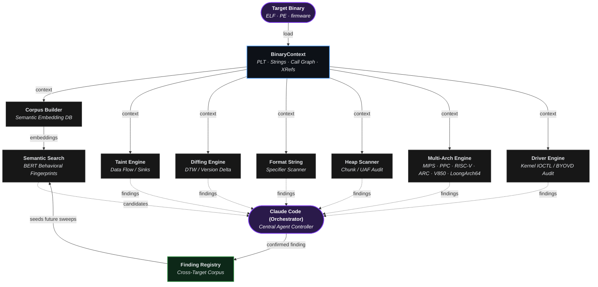
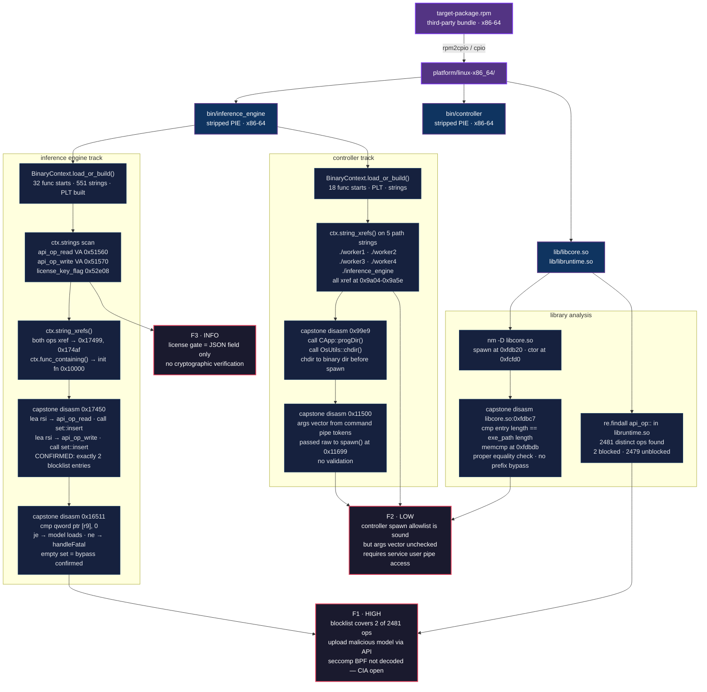

*[Español](docs/i18n/es/README.md) · [Português](docs/i18n/pt-BR/README.md) · [Français](docs/i18n/fr/README.md) · [Deutsch](docs/i18n/de/README.md) · [中文](docs/i18n/zh/README.md) · [日本語](docs/i18n/ja/README.md) · [Русский](docs/i18n/ru/README.md) · [العربية](docs/i18n/ar/README.md) · [한국어](docs/i18n/ko/README.md) · [हिन्दी](docs/i18n/hi/README.md) · [Italiano](docs/i18n/it/README.md) · [Türkçe](docs/i18n/tr/README.md) · [Tiếng Việt](docs/i18n/vi/README.md) · [Indonesia](docs/i18n/id/README.md) · [Polski](docs/i18n/pl/README.md) · [Nederlands](docs/i18n/nl/README.md)*

Ablation is a reverse engineering framework that provides the exact same core disassembly, decompilation, and binary analysis capabilities as industry-standard tools like Ghidra, IDA Pro, and Binary Ninja. 

Combined with Claude Code or OpenAI Codex, it transforms into a fully autonomous reverse engineering tool.

---


## Capabilities

**Semantic Search via BERT:** Searches code by concept instead of exact words. By mapping the actual meaning of the text, it cuts through the heaviest bottleneck of reverse engineering to help you pinpoint vulnerabilities faster.

**Extreme Performance:** Loads massive binaries in seconds rather than hours. By only analyzing the code you are actively looking at, it skips the heavy upfront processing of traditional tools so you can start reverse engineering immediately.

**Version Diffing:** Analyzes the actual behavior of updated software to verify vendor patches. It cuts through superficial repackaging to confirm if a vulnerability was genuinely fixed or just hidden.

**Cross-Binary Analysis:** Analyze every shared library in a firmware image simultaneously, tracking data flows across binary boundaries.

**Source Code Audit:** Audit any large codebase faster than reading it linearly, with higher accuracy than pattern matching alone. Every source file gets a 5-bit security profile that determines exactly how much attention it needs, so nothing gets missed and nothing gets read twice.

**Windows Kernel Driver & BYOVD Analysis:** Scans kernel drivers for risky entry points to stop attackers from using vulnerable, signed drivers to bypass your security software.

**Android / APK Analysis:** Maps out Android app attack surfaces without needing to decompile the code. It automatically scans and ranks internal libraries by security risk, allowing you to immediately target the most vulnerable components.

**Erlang / BEAM Analysis:** Safely scans Erlang bytecode to instantly highlight dangerous functions and hidden attack surfaces without running the application.


**Cryptographic Analysis**

Ablation strips away every layer that makes cryptography invisible in a compiled binary. Entropy Mapper locates the encrypted region. Crypto Audit and HashAlgoDiscriminator identify the algorithm. XorSolver, BmpKeyExtractor, and CustomCBCDetector break the encryption or recover the key. ELFVtableReconstructor and VtableDispatchScanner reconstruct what the runtime does with the result.

A binary can hide its crypto from import-table analysis, from symbol tables, and from string search. These eight tools collectively close that gap, so by the end you know the algorithm, the key, and the ciphertext.

---

## Real-World Results

Ablation has been used to analyze production firmware and kernel drivers from Cisco, Fortinet, TencentOS, Huawei, Dahua Security System, and others.


Following coordinated disclosure on Cisco FMC and ISE, the Cisco Product Security Incident Response Team (PSIRT) has adopted Ablation for internal vulnerability triage. Cisco PSIRT is actively using it to triage ongoing disclosure reports across Firepower Threat Defense (FTD), Cisco Secure Client (AnyConnect), and Catalyst. Cisco Adaptive Security Appliance (ASA) LINA has also been reverse engineered using Ablation, with findings currently under coordinated triage via CERT/CC VINCE.

| CVE | Product | Title | CVSS | Advisory |
|---|---|---|---|---|
| CVE-2026-76420 | Secure Firewall Management Center (FMC) | Peer Impersonation | 9.0 Critical | [cisco-sa-fmc2-multivulns-HXgcqRG](https://sec.cloudapps.cisco.com/security/center/content/CiscoSecurityAdvisory/cisco-sa-fmc2-multivulns-HXgcqRG) |
| CVE-2026-76412 | Secure Firewall Management Center (FMC) | Privilege Escalation to root | 8.5 High | [cisco-sa-fmc2-multivulns-HXgcqRG](https://sec.cloudapps.cisco.com/security/center/content/CiscoSecurityAdvisory/cisco-sa-fmc2-multivulns-HXgcqRG) |
| CVE-2026-76413 | Secure Firewall Management Center (FMC) | Single Sign-On Token Forgery | 8.5 High | [cisco-sa-fmc2-multivulns-HXgcqRG](https://sec.cloudapps.cisco.com/security/center/content/CiscoSecurityAdvisory/cisco-sa-fmc2-multivulns-HXgcqRG) |
| CVE-2026-76447 | Identity Services Engine (ISE) | OCSP Responder Authentication Bypass | 5.3 Medium | [cisco-sa-ise-multiauth-bypass-sgD2HbL4](https://sec.cloudapps.cisco.com/security/center/content/CiscoSecurityAdvisory/cisco-sa-ise-multiauth-bypass-sgD2HbL4) |

---

## Decompilers

| ISA / Runtime | Variants |
|---|---|
| x86 | x86-32 · x86-64 |
| ARM | ARM-32 · ARM-64 |
| MIPS | MIPS-32 · nanoMIPS · MIPS-64 |
| PowerPC | PPC-32 · PPC-64 |
| RISC-V | RISC-V 32 · RISC-V 64 |
| ARC | ARC EM/HS |
| V850 | V850-32 |
| LoongArch | LoongArch64 |
| DEX | Dalvik · ART |
| ARK | ArkTS |
| BEAM | Erlang · Elixir |

---

## LLM Compatibility

| Provider | Models |
|---|---|
| **Claude Code** | /model claude-sonnet-4-6 |
| **OpenAI Codex** | All known models |

---

## Install

```bash
pip install git+https://github.com/Ablation-Tool/ablation
```

---

## Requirements

- Python >= 3.10
- `capstone`, `numpy`, `lief`, `sentence-transformers`, `pyelftools`

---

## Responsible Use

Ablation is built for authorized security research. Use it only against systems you own or have explicit written permission to test. Running it against systems without authorization violates computer fraud laws in most jurisdictions. The authors are not responsible for misuse.

---

## Acknowledgments
This project was greatly informed and inspired by several key literary works.

**Research Papers**

| Title | Authors | Citation |
|---|---|---|
| [Finding Taint-Style Vulnerabilities in Linux-based Embedded Firmware with SSE-based Alias Analysis](https://arxiv.org/abs/2109.12209) | Cheng, Zheng, Liu, Guan, Liu, Li, Zhu, Ye, Sun | [sse_slicer.py](https://github.com/Ablation-Tool/ablation/blob/main/ablation/analyzers/sse_slicer.py) · [arm64_global_tracker.py](https://github.com/Ablation-Tool/ablation/blob/main/ablation/analyzers/arm64_global_tracker.py) |
| [iResolveX: Multi-Layered Indirect Call Resolution via Static Reasoning and Learning-Augmented Refinement](https://arxiv.org/abs/2601.17888) | Monika Santra, Bokai Zhang, Mark Lim, [Vishnu Asutosh Dasu](https://github.com/vdasu), Dongrui Zeng, [Gang Tan](https://github.com/gangtan) | [vtable_resolver.py](https://github.com/Ablation-Tool/ablation/blob/main/ablation/analyzers/vtable_resolver.py) · [interproc_field_writer.py](https://github.com/Ablation-Tool/ablation/blob/main/ablation/analyzers/interproc_field_writer.py) · [arm64_global_tracker.py](https://github.com/Ablation-Tool/ablation/blob/main/ablation/analyzers/arm64_global_tracker.py) |
| [Extracting Protocol Format as State Machine via Controlled Static Loop Analysis](https://arxiv.org/abs/2305.13483) | [Qingkai Shi](https://github.com/qingkaishi), Xiangzhe Xu, Xiangyu Zhang | [proto_fsm.py](https://github.com/Ablation-Tool/ablation/blob/main/ablation/analyzers/proto_fsm.py) |
| [NEMETYL: Message Type Identification of Binary Network Protocols using Continuous Segment Similarity](https://arxiv.org/abs/2002.03391) | [Stephan Kleber](https://github.com/vs-uulm), Rens Wouter van der Heijden, [Frank Kargl](https://github.com/fkargl) | [proto_fsm.py](https://github.com/Ablation-Tool/ablation/blob/main/ablation/analyzers/proto_fsm.py) |
| [Imperfect Forward Secrecy: How Diffie-Hellman Fails in Practice](https://dl.acm.org/doi/10.1145/2810103.2813707) | [David Adrian](https://github.com/dadrian), Karthikeyan Bhargavan, [Zakir Durumeric](https://github.com/zakird), Pierrick Gaudry, Matthew Green, [J. Alex Halderman](https://github.com/jhalderm), [Nadia Heninger](https://github.com/factorable), Drew Springall, Emmanuel Thomé, [Luke Valenta](https://github.com/lukevalenta) | [tls_analyzer.py](https://github.com/Ablation-Tool/ablation/blob/main/ablation/core/tls_analyzer.py) |
| [Nonce-Disrespecting Adversaries: Practical Forgery Attacks on GCM in TLS](https://www.usenix.org/conference/woot16/workshop-program/presentation/bock) | [Hanno Böck](https://github.com/hannob), [Aaron Zauner](https://github.com/azet), Sean Devlin, [Juraj Somorovsky](https://github.com/jurajsomorovsky), [Philipp Jovanovic](https://github.com/Daeinar) | [tls_analyzer.py](https://github.com/Ablation-Tool/ablation/blob/main/ablation/core/tls_analyzer.py) |
| [Whitening Sentence Representations for Better Semantics and Faster Retrieval](https://arxiv.org/abs/2103.15316) | [Jianlin Su](https://github.com/bojone), [Jiarun Cao](https://github.com/jiaruncao), Weijie Liu, Yangyiwen Ou | [semantic_search.py](https://github.com/Ablation-Tool/ablation/blob/main/ablation/analyzers/semantic_search.py) |
| [Constant Propagation with Conditional Branches](https://dl.acm.org/doi/abs/10.1145/103135.103136) | Mark N. Wegman, F. Kenneth Zadeck | [dataflow_engine.py](https://github.com/Ablation-Tool/ablation/blob/main/ablation/analyzers/dataflow_engine.py) |
| [A Simple, Fast Dominance Algorithm](https://www.cs.princeton.edu/techreports/2005/737.pdf) | Cooper, Harvey, Kennedy | [dataflow_engine.py](https://github.com/Ablation-Tool/ablation/blob/main/ablation/analyzers/dataflow_engine.py) |
| [libdft: Practical Dynamic Data Flow Tracking for Commodity Systems](https://dl.acm.org/doi/10.1145/2151024.2151042) | [Vasileios P. Kemerlis](https://github.com/vkemerlis), [Georgios Portokalidis](https://github.com/portokalidis), [Kangkook Jee](https://github.com/jikk), Angelos D. Keromytis | [taint_tracker_x86.py](https://github.com/Ablation-Tool/ablation/blob/main/ablation/analyzers/taint_tracker_x86.py) · [taint_tracker_arm32.py](https://github.com/Ablation-Tool/ablation/blob/main/ablation/analyzers/taint_tracker_arm32.py) |
| [Reverse Compilation Techniques](https://scholar.google.com/citations?view_op=view_citation&hl=en&user=iseZ69MAAAAJ&citation_for_view=iseZ69MAAAAJ:u-x6o8ySG0sC) | Dr. Cristina Cifuentes | [abc_parser.py](https://github.com/Ablation-Tool/ablation/blob/main/ablation/analyzers/abc_parser.py) · [abc_disasm.py](https://github.com/Ablation-Tool/ablation/blob/main/ablation/analyzers/abc_disasm.py) · [abc_decompiler.py](https://github.com/Ablation-Tool/ablation/blob/main/ablation/analyzers/abc_decompiler.py) · [dataflow_engine.py](https://github.com/Ablation-Tool/ablation/blob/main/ablation/analyzers/dataflow_engine.py) |
| [Design of a Retargetable Decompiler for a Static Platform-Independent Malware Analysis](https://www.researchgate.net/publication/220849941_Design_of_a_Retargetable_Decompiler_for_a_Static_Platform-Independent_Malware_Analysis) | [Petr Zemek](https://github.com/s3rvac), Lukáš Ďurfina, Jakub Křoustek, Dušan Kolář, Tomas Hruska, Karel Masařík, Alexander Meduna | [abc_decompiler.py](https://github.com/Ablation-Tool/ablation/blob/main/ablation/analyzers/abc_decompiler.py) |

**Books** supplied by [www.oreilly.com](https://www.oreilly.com) | [github.com/oreillymedia](https://github.com/oreillymedia)

| Title | Authors | Citation |
|---|---|---|
| The Art of Software Security Assessment | [Mark Dowd](https://github.com/mdowd79), John McDonald, [Justin Schuh](https://github.com/jschuh) | [heap_vuln_scanner.py](https://github.com/Ablation-Tool/ablation/blob/main/ablation/analyzers/heap_vuln_scanner.py) · [format_string_scanner.py](https://github.com/Ablation-Tool/ablation/blob/main/ablation/analyzers/format_string_scanner.py) · [ioctl_attack_surface.py](https://github.com/Ablation-Tool/ablation/blob/main/ablation/analyzers/ioctl_attack_surface.py) |
| Practical Binary Analysis | [Dennis Andriesse](https://github.com/dennisaa) | [taint_tracker_x86.py](https://github.com/Ablation-Tool/ablation/blob/main/ablation/analyzers/taint_tracker_x86.py) · [disasm_engine.py](https://github.com/Ablation-Tool/ablation/blob/main/ablation/core/disasm_engine.py) |
| Practical Malware Analysis | Michael Sikorski, Andrew Honig | [pe_parser.py](https://github.com/Ablation-Tool/ablation/blob/main/ablation/core/pe_parser.py) · [shellcode_utils.py](https://github.com/Ablation-Tool/ablation/blob/main/ablation/core/shellcode_utils.py) |
| Practical Reverse Engineering | Bruce Dang, Alexandre Gazet, [Elias Bachaalany](https://github.com/0xeb) | [pe_analyzer.py](https://github.com/Ablation-Tool/ablation/blob/main/ablation/core/pe_analyzer.py) · [kernel_driver_analyzer.py](https://github.com/Ablation-Tool/ablation/blob/main/ablation/analyzers/kernel_driver_analyzer.py) |
| Hacking: The Art of Exploitation (2e) | Jon Erickson | [platform_detect.py](https://github.com/Ablation-Tool/ablation/blob/main/ablation/core/platform_detect.py) |
| Learning Linux Binary Analysis | [Ryan O'Neill](https://github.com/elfmaster) | [elf_parser.py](https://github.com/Ablation-Tool/ablation/blob/main/ablation/core/elf_parser.py) · [binary_parser.py](https://github.com/Ablation-Tool/ablation/blob/main/ablation/core/binary_parser.py) |
| Windows Internals Part 1 & 2 | [Pavel Yosifovich](https://github.com/zodiacon), [Mark Russinovich](https://github.com/markrussinovich), David Solomon, [Alex Ionescu](https://github.com/ionescu007), [Andrea Allievi](https://github.com/AaLl86) | [kernel_driver_analyzer.py](https://github.com/Ablation-Tool/ablation/blob/main/ablation/analyzers/kernel_driver_analyzer.py) · [ioctl_attack_surface.py](https://github.com/Ablation-Tool/ablation/blob/main/ablation/analyzers/ioctl_attack_surface.py) |
| Rootkits: Subverting the Windows Kernel | Greg Hoglund, Jamie Butler | [kernel_driver_analyzer.py](https://github.com/Ablation-Tool/ablation/blob/main/ablation/analyzers/kernel_driver_analyzer.py) · [yara_generator.py](https://github.com/Ablation-Tool/ablation/blob/main/ablation/core/yara_generator.py) |
| Advanced Compiler Design and Implementation | Steven Muchnick | [dataflow_engine.py](https://github.com/Ablation-Tool/ablation/blob/main/ablation/analyzers/dataflow_engine.py) |
| Engineering a Compiler | Keith Cooper, Linda Torczon | [disasm_engine.py](https://github.com/Ablation-Tool/ablation/blob/main/ablation/core/disasm_engine.py) |
| Practical IoT Hacking | [Fotios Chantzis](https://github.com/ithilgore), Ioannis Stais, Paulino Calderon, Evangelos Deirmentzoglou, Beau Woods | [firmware_analyzer.py](https://github.com/Ablation-Tool/ablation/blob/main/ablation/core/firmware_analyzer.py) |
| Inside the Android OS: Building, Customizing, Managing and Operating Android System Services | [G. Blake Meike](https://github.com/bmeike) | [apk_parser.py](https://github.com/Ablation-Tool/ablation/blob/main/ablation/core/apk_parser.py) · [jni_bridge_scanner.py](https://github.com/Ablation-Tool/ablation/blob/main/ablation/analyzers/jni_bridge_scanner.py) · [binder_scanner.py](https://github.com/Ablation-Tool/ablation/blob/main/ablation/analyzers/binder_scanner.py) |
| Malware Analysis and Detection Engineering | [Abhijit Mohanta](https://github.com/amohanta), Anoop Saldanha | [yara_generator.py](https://github.com/Ablation-Tool/ablation/blob/main/ablation/core/yara_generator.py) |
| Evasive Malware | [Kyle Cucci](https://github.com/d4rksystem) | [process_enum.py](https://github.com/Ablation-Tool/ablation/blob/main/modules/process_enum.py) |
| Hacking Cryptography | [Kamran Khan](https://github.com/krkhan), [Bill Cox](https://github.com/waywardgeek) | [tls_enum.py](https://github.com/Ablation-Tool/ablation/blob/main/modules/tls_enum.py) |
| Real-World Cryptography | David Wong | [tls_analyzer.py](https://github.com/Ablation-Tool/ablation/blob/main/ablation/core/tls_analyzer.py) |

**Honorable Mention**

[Microsoft Excel (Data Analysis ToolPak)](https://support.microsoft.com/en-us/office/use-the-analysis-toolpak-to-perform-complex-data-analysis-6c67ccf0-f4a9-487c-8dec-bdb5a2cefab6) When analyzing closed infrastructure or securing black-box systems, this exact process is called timing analysis or telemetry reverse engineering. Without source code, the Data Analysis ToolPak mathematically deconstructs how an application works on the backend by strictly observing its inputs and outputs.

---

## Framework Architecture & Module Orchestration


```mermaid
flowchart TD
    Binary(["<b>Target Binary</b><br/><i>ELF · PE · firmware</i>"])
    Claude(["<b>Claude Code (Orchestrator)</b><br/><i>Central Agent Controller</i>"])

    Binary -->|"load"| BCtx["<b>BinaryContext</b><br/><i>PLT · Strings · Call Graph · XRefs</i>"]
    BCtx -->|"context"| Corpus["<b>Corpus Builder</b><br/><i>Semantic Embedding DB</i>"]
    BCtx -->|"context"| Taint["<b>Taint Engine</b><br/><i>Data Flow / Sinks</i>"]
    BCtx -->|"context"| Diffing["<b>Diffing Engine</b><br/><i>DTW / Version Delta</i>"]
    BCtx -->|"context"| FmtStr["<b>Format String</b><br/><i>Specifier Scanner</i>"]
    BCtx -->|"context"| Heap["<b>Heap Scanner</b><br/><i>Chunk / UAF Audit</i>"]
    BCtx -->|"context"| MultiArch["<b>Multi-Arch Engine</b><br/><i>MIPS · PPC · RISC-V · ARC · V850 · LoongArch64</i>"]
    BCtx -->|"context"| Driver["<b>Driver Engine</b><br/><i>Kernel IOCTL / BYOVD Audit</i>"]

    Corpus -->|"embeddings"| Semantic["<b>Semantic Search</b><br/><i>BERT Behavioral Fingerprints</i>"]

    Semantic -. "candidates" .-> Claude
    Taint -. "findings" .-> Claude
    Diffing -. "findings" .-> Claude
    FmtStr -. "findings" .-> Claude
    Heap -. "findings" .-> Claude
    MultiArch -. "findings" .-> Claude
    Driver -. "findings" .-> Claude

    Claude -->|"confirmed finding"| Registry["<b>Finding Registry</b><br/><i>Cross-Target Corpus</i>"]
    Registry -->|"seeds future sweeps"| Semantic

    classDef primary fill:#2a1a4a,stroke:#7c3aed,stroke-width:2px,color:#fff
    classDef foundation fill:#0d1117,stroke:#58a6ff,stroke-width:2px,color:#e5e7eb
    classDef engine fill:#171717,stroke:#404040,stroke-width:1px,color:#e5e7eb
    classDef feedback fill:#0d2818,stroke:#238636,stroke-width:2px,color:#e5e7eb

    class Claude,Binary primary
    class BCtx foundation
    class Corpus,Semantic,Taint,Diffing,FmtStr,Heap,MultiArch,Driver engine
    class Registry feedback
```

---

## Example RE Workflow

End-to-end analysis of stripped binaries from an RPM bundle. Extraction through BinaryContext, string xrefs, and capstone disassembly to confirmed findings.


```mermaid
flowchart TD
    RPM["target-package.rpm<br/>third-party bundle · x86-64"]

    RPM -->|rpm2cpio / cpio| EXTRACT["platform/linux-x86_64/"]

    EXTRACT --> PI["bin/inference_engine<br/>stripped PIE · x86-64"]
    EXTRACT --> CTRL["bin/controller<br/>stripped PIE · x86-64"]
    EXTRACT --> LIBS["lib/libcore.so<br/>lib/libruntime.so"]

    subgraph TRACK_PI ["inference engine track"]
        direction TB
        BCI["BinaryContext.load_or_build()<br/>32 func starts · 551 strings · PLT built"]
        BCI --> SS["ctx.strings scan<br/>api_op_read VA 0x51560<br/>api_op_write VA 0x51570<br/>license_key_flag 0x52e08"]
        SS --> XREF["ctx.string_xrefs()<br/>both ops xref → 0x17499, 0x174af<br/>ctx.func_containing() → init fn 0x10000"]
        XREF --> DA1["capstone disasm 0x17450<br/>lea rsi → api_op_read · call set::insert<br/>lea rsi → api_op_write · call set::insert<br/>CONFIRMED: exactly 2 blocklist entries"]
        DA1 --> DA2["capstone disasm 0x16511<br/>cmp qword ptr [r9], 0<br/>je → model loads · ne → handleFatal<br/>empty set = bypass confirmed"]
    end

    subgraph TRACK_LIBS ["library analysis"]
        direction TB
        NM["nm -D libcore.so<br/>spawn at 0xfdb20 · ctor at 0xfcfd0"]
        NM --> DA3["capstone disasm libcore.so:0xfdbc7<br/>cmp entry length == exe_path length<br/>memcmp at 0xfdbdb<br/>proper equality check · no prefix bypass"]
        LSCAN["re.findall api_op:: in libruntime.so<br/>2481 distinct ops found<br/>2 blocked · 2479 unblocked"]
    end

    subgraph TRACK_CTRL ["controller track"]
        direction TB
        BCC["BinaryContext.load_or_build()<br/>18 func starts · PLT · strings"]
        BCC --> XREF2["ctx.string_xrefs() on 5 path strings<br/>./worker1 · ./worker2<br/>./worker3 · ./worker4<br/>./inference_engine<br/>all xref at 0x9a04-0x9a5e"]
        XREF2 --> DA4["capstone disasm 0x99e9<br/>call CApp::progDir()<br/>call OsUtils::chdir()<br/>chdir to binary dir before spawn"]
        DA4 --> DA5["capstone disasm 0x11500<br/>args vector from command pipe tokens<br/>passed raw to spawn() at 0x11699<br/>no validation"]
    end

    PI --> BCI
    PI --> BCC
    LIBS --> NM
    LIBS --> LSCAN

    DA2 --> F1
    LSCAN --> F1["F1 · HIGH<br/>blocklist covers 2 of 2481 ops<br/>upload malicious model via API<br/>seccomp BPF not decoded — CIA open"]

    DA3 --> F2
    XREF2 --> F2["F2 · LOW<br/>controller spawn allowlist is sound<br/>but args vector unchecked<br/>requires service user pipe access"]

    DA5 --> F2

    SS --> F3["F3 · INFO<br/>license gate = JSON field only<br/>no cryptographic verification"]

    classDef finding fill:#1a1a2e,stroke:#e94560,stroke-width:2px,color:#fff
    classDef tool fill:#16213e,stroke:#0f3460,stroke-width:1px,color:#e5e7eb
    classDef binary fill:#0f3460,stroke:#533483,stroke-width:2px,color:#fff
    classDef input fill:#533483,stroke:#7c3aed,stroke-width:2px,color:#fff

    class F1,F2,F3 finding
    class BCI,BCC,NM,LSCAN,SS,XREF,XREF2,DA1,DA2,DA3,DA4,DA5 tool
    class PI,CTRL,LIBS binary
    class RPM,EXTRACT input
```
