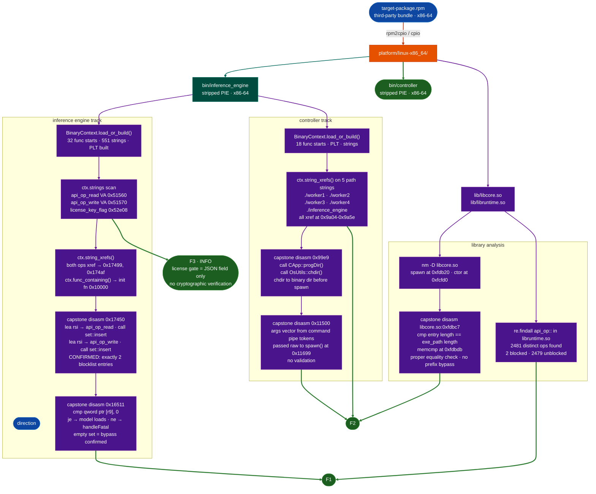

## RPM Bundle RE Workflow

```mermaid
flowchart TD
    RPM(["target-package.rpm<br/>third-party bundle · x86-64"]):::input

    RPM:::input -->|rpm2cpio / cpio| EXTRACT["platform/linux-x86_64/"]:::primary

    EXTRACT:::primary --> PI["bin/inference_engine<br/>stripped PIE · x86-64"]:::secondary
    EXTRACT:::primary --> CTRL(["bin/controller<br/>stripped PIE · x86-64"]):::output
    EXTRACT:::primary --> LIBS["lib/libcore.so<br/>lib/libruntime.so"]:::tertiary

    subgraph TRACK_PI ["inference engine track"]
    direction(["direction"]):::input
    BCI["BinaryContext.load_or_build()<br/>32 func starts · 551 strings · PLT built"]:::tertiary
    BCI:::tertiary --> SS["ctx.strings scan<br/>api_op_read VA 0x51560<br/>api_op_write VA 0x51570<br/>license_key_flag 0x52e08"]:::tertiary
    SS:::tertiary --> XREF["ctx.string_xrefs()<br/>both ops xref → 0x17499, 0x174af<br/>ctx.func_containing() → init fn 0x10000"]:::tertiary
    XREF:::tertiary --> DA1["capstone disasm 0x17450<br/>lea rsi → api_op_read · call set::insert<br/>lea rsi → api_op_write · call set::insert<br/>CONFIRMED: exactly 2 blocklist entries"]:::tertiary
    DA1:::tertiary --> DA2["capstone disasm 0x16511<br/>cmp qword ptr [r9], 0<br/>je → model loads · ne → handleFatal<br/>empty set = bypass confirmed"]:::tertiary
    end

    subgraph TRACK_LIBS ["library analysis"]
    direction:::input
    NM["nm -D libcore.so<br/>spawn at 0xfdb20 · ctor at 0xfcfd0"]:::tertiary
    NM:::tertiary --> DA3["capstone disasm libcore.so:0xfdbc7<br/>cmp entry length == exe_path length<br/>memcmp at 0xfdbdb<br/>proper equality check · no prefix bypass"]:::tertiary
    LSCAN["re.findall api_op:: in libruntime.so<br/>2481 distinct ops found<br/>2 blocked · 2479 unblocked"]:::tertiary
    end

    subgraph TRACK_CTRL ["controller track"]
    direction:::input
    BCC["BinaryContext.load_or_build()<br/>18 func starts · PLT · strings"]:::tertiary
    BCC:::tertiary --> XREF2["ctx.string_xrefs() on 5 path strings<br/>./worker1 · ./worker2<br/>./worker3 · ./worker4<br/>./inference_engine<br/>all xref at 0x9a04-0x9a5e"]:::tertiary
    XREF2:::tertiary --> DA4["capstone disasm 0x99e9<br/>call CApp::progDir()<br/>call OsUtils::chdir()<br/>chdir to binary dir before spawn"]:::tertiary
    DA4:::tertiary --> DA5["capstone disasm 0x11500<br/>args vector from command pipe tokens<br/>passed raw to spawn() at 0x11699<br/>no validation"]:::tertiary
    end

    PI:::secondary --> BCI:::tertiary
    PI:::secondary --> BCC:::tertiary
    LIBS:::tertiary --> NM:::tertiary
    LIBS:::tertiary --> LSCAN:::tertiary

    DA2:::tertiary --> F1(["F1"]):::output
    LSCAN:::tertiary --> F1:::output

    DA3:::tertiary --> F2(["F2"]):::output
    XREF2:::tertiary --> F2:::output

    DA5:::tertiary --> F2:::output

    SS:::tertiary --> F3(["F3 · INFO<br/>license gate = JSON field only<br/>no cryptographic verification"]):::output
    classDef input     fill:#0d47a1,stroke:#1565c0,color:#fff
    classDef primary   fill:#e65100,stroke:#bf360c,color:#fff
    classDef secondary fill:#004d40,stroke:#00695c,color:#fff
    classDef tertiary  fill:#4a148c,stroke:#6a1b9a,color:#fff
    classDef neutral   fill:#37474f,stroke:#546e7a,color:#fff
    classDef output    fill:#1b5e20,stroke:#2e7d32,color:#fff
    linkStyle 0 stroke:#bf360c,stroke-width:2px
    linkStyle 1 stroke:#00695c,stroke-width:2px
    linkStyle 2 stroke:#2e7d32,stroke-width:3px
    linkStyle 3 stroke:#6a1b9a,stroke-width:2px
    linkStyle 4 stroke:#6a1b9a,stroke-width:2px
    linkStyle 5 stroke:#6a1b9a,stroke-width:2px
    linkStyle 6 stroke:#6a1b9a,stroke-width:2px
    linkStyle 7 stroke:#6a1b9a,stroke-width:2px
    linkStyle 8 stroke:#6a1b9a,stroke-width:2px
    linkStyle 9 stroke:#6a1b9a,stroke-width:2px
    linkStyle 10 stroke:#6a1b9a,stroke-width:2px
    linkStyle 11 stroke:#6a1b9a,stroke-width:2px
    linkStyle 12 stroke:#6a1b9a,stroke-width:2px
    linkStyle 13 stroke:#6a1b9a,stroke-width:2px
    linkStyle 14 stroke:#6a1b9a,stroke-width:2px
    linkStyle 15 stroke:#6a1b9a,stroke-width:2px
    linkStyle 16 stroke:#2e7d32,stroke-width:3px
    linkStyle 17 stroke:#2e7d32,stroke-width:3px
    linkStyle 18 stroke:#2e7d32,stroke-width:3px
    linkStyle 19 stroke:#2e7d32,stroke-width:3px
    linkStyle 20 stroke:#2e7d32,stroke-width:3px
    linkStyle 21 stroke:#2e7d32,stroke-width:3px
```
