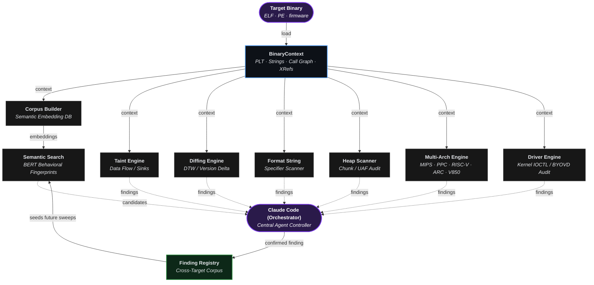
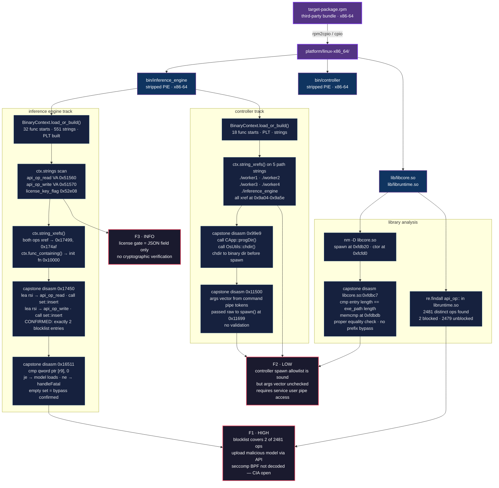

[English](../../../README.md) · [Español](../es/README.md) · [Português](../pt-BR/README.md) · [Français](../fr/README.md) · [Deutsch](../de/README.md) · [中文](../zh/README.md) · [日本語](../ja/README.md) · [Русский](../ru/README.md) · [العربية](../ar/README.md) · [한국어](../ko/README.md) · **हिन्दी** · [Italiano](../it/README.md) · [Türkçe](../tr/README.md) · [Tiếng Việt](../vi/README.md) · [Indonesia](../id/README.md) · [Polski](../pl/README.md) · [Nederlands](../nl/README.md)

Ablation एक रिवर्स इंजीनियरिंग फ्रेमवर्क है जो Ghidra, IDA Pro और Binary Ninja जैसे उद्योग-मानक टूल के समान डिसअसेंबली, डीकंपाइलेशन और बाइनरी विश्लेषण क्षमताएं प्रदान करता है।

Claude Code या OpenAI Codex के साथ मिलाने पर यह एक पूर्ण स्वायत्त रिवर्स इंजीनियरिंग टूल बन जाता है।

---


## क्षमताएं

**BERT के माध्यम से सिमेंटिक सर्च:** सिमेंटिक सर्च सटीक कीवर्ड की बजाय अर्थ के आधार पर परिणाम खोजती है। BERT टेक्स्ट पढ़ता है और उसका अर्थ निकालता है। समान अर्थों को समान स्कोर मिलते हैं, इसलिए सटीक शब्दों की बजाय अवधारणा से खोज कर सकते हैं। दोनों को मिलाने पर रिवर्स इंजीनियरिंग की मुख्य बाधा तेज होती है और कमजोर फंक्शन मिलते हैं।

**अत्यधिक प्रदर्शन:** 50 MB बाइनरी 35 सेकंड में लोड होती है। Ghidra और IDA Pro घंटों लग सकते हैं क्योंकि वे पूरी फाइल को डेटाबेस में पार्स करने के बाद ही काम शुरू करते हैं। Ablation केवल उन्हीं फंक्शन का विश्लेषण करता है जिन पर आप काम कर रहे हैं, इसलिए तुरंत शुरू होता है।

**वर्शन डिफिंग:** Jaccard विधि से फंक्शन व्यवहार के ओवरलैप को मापकर और Dynamic Time Warping से फर्मवेयर वर्शन में फंक्शन निष्पादन की "आकृति" ट्रैक करके, Ablation पुष्टि करता है कि पैच ने वास्तव में लॉजिक बदला या केवल पैकेजिंग। एक कॉस्मेटिक रीकंपाइल बिना पैच की कमजोरी नहीं छुपा सकता।

**क्रॉस-बाइनरी विश्लेषण:** फर्मवेयर इमेज में सभी शेयर्ड लाइब्रेरी का एक साथ विश्लेषण करें, बाइनरी सीमाओं के पार डेटा फ्लो ट्रैक करें।

**सोर्स कोड ऑडिट:** किसी भी बड़े कोडबेस को लीनियर पढ़ने से तेज और अकेले पैटर्न मैचिंग से अधिक सटीकता से ऑडिट करें। हर सोर्स फाइल को 5-बिट सिक्योरिटी प्रोफाइल मिलता है जो ठीक-ठीक बताता है कि कितना ध्यान चाहिए, इसलिए कुछ छूटता नहीं और दो बार नहीं पढ़ा जाता।

**Windows कर्नेल ड्राइवर और BYOVD विश्लेषण:** IRP डिस्पैच टेबल मैप करता है, हर IOCTL कोड डीकोड करता है, और पहचानता है कि कौन से कर्नेल API यूजर मोड से फिजिकल मेमोरी और टोकन प्रिमिटिव एक्सपोज करते हैं। BYOVD डिटेक्टर उन साइन किए गए ड्राइवरों को फिंगरप्रिंट करता है जिनमें ये क्षमताएं हैं, क्योंकि एक वैध साइन ड्राइवर रिंग-0 से EDR को अंधा करने के लिए काफी है।

**Android/APK विश्लेषण:** बिना किसी डिपेंडेंसी के बाइनरी स्तर पर Android APK पढ़ता है। कंपाइल्ड बाइटकोड से नेटिव कोड एंट्री पॉइंट और IPC सर्फेस मैप करता है, इसलिए डीकंपाइल किए बिना पूरी सर्फेस दिखती है।

**Erlang/BEAM विश्लेषण:** Erlang .beam फाइलों में कंपाइल होता है, और ELF के लिए इस्तेमाल किया गया सर्फेस-मैप अप्रोच सीधे लागू होता है, इसलिए एटम सर्च, इम्पोर्ट ऑडिटिंग और ऑबफस्केशन डिटेक्शन को विशेष हैंडलिंग की जरूरत नहीं। रिलीज डायरेक्टरी स्कैन सेकंडों में होती है।

**डिक्रिप्शन**
- **Entropy Mapper:** बाइनरी में एन्क्रिप्टेड, कंप्रेस्ड या पैक्ड सेक्शन खोजता है।
- **Crypto Audit:** क्रिप्टोग्राफी स्कैन करता है।
- **XorSolver:** टारगेट सेक्शन रिकवर करके डिक्रिप्ट करता है जिससे आगे रिवर्स इंजीनियरिंग संभव हो।
- **BmpKeyExtractor:** Lagrange पॉलिनोमियल इंटरपोलेशन का उपयोग करके BMP पिक्सेल स्टेगानोग्राफी में छुपी सीक्रेट कीज़ को पुनर्निर्माण करता है।

---

## वास्तविक परिणाम

Ablation का उपयोग Fortinet, Cisco, Juniper, Axis, Fujitsu, MikroTik, Orka, TencentOS, Enigma2, Skydio और Dahua Security System के प्रोडक्शन फर्मवेयर और कर्नेल ड्राइवरों के विश्लेषण में किया गया है।

Cisco FMC और ISE पर समन्वित प्रकटीकरण के बाद, Cisco Product Security Incident Response Team (PSIRT) ने आंतरिक भेद्यता ट्राइएज के लिए Ablation अपनाया है। Cisco PSIRT इसे Firepower Threat Defense (FTD), Cisco Secure Client (AnyConnect), HyperFlex और Catalyst पर चल रही डिस्क्लोजर रिपोर्ट ट्राइएज करने में सक्रिय रूप से उपयोग कर रहा है। Cisco ASA LINA को भी Ablation से रिवर्स इंजीनियर किया गया है।

| CVE | उत्पाद | शीर्षक | CVSS | सलाह |
|---|---|---|---|---|
| CVE-2026-76420 | Secure Firewall Management Center (FMC) | Peer Impersonation | 9.0 Critical | [cisco-sa-fmc2-multivulns-HXgcqRG](https://sec.cloudapps.cisco.com/security/center/content/CiscoSecurityAdvisory/cisco-sa-fmc2-multivulns-HXgcqRG) |
| CVE-2026-76412 | Secure Firewall Management Center (FMC) | Privilege Escalation to root | 8.5 High | [cisco-sa-fmc2-multivulns-HXgcqRG](https://sec.cloudapps.cisco.com/security/center/content/CiscoSecurityAdvisory/cisco-sa-fmc2-multivulns-HXgcqRG) |
| CVE-2026-76413 | Secure Firewall Management Center (FMC) | Single Sign-On Token Forgery | 8.5 High | [cisco-sa-fmc2-multivulns-HXgcqRG](https://sec.cloudapps.cisco.com/security/center/content/CiscoSecurityAdvisory/cisco-sa-fmc2-multivulns-HXgcqRG) |
| CVE-2026-76447 | Identity Services Engine (ISE) | OCSP Responder Authentication Bypass | 5.3 Medium | [cisco-sa-ise-multiauth-bypass-sgD2HbL4](https://sec.cloudapps.cisco.com/security/center/content/CiscoSecurityAdvisory/cisco-sa-ise-multiauth-bypass-sgD2HbL4) |

---

## स्थानीय डीकंपाइलर

| आर्किटेक्चर | वेरिएंट |
|---|---|
| x86 | x86-32 · x86-64 |
| ARM | ARM-32 · ARM-64 |
| MIPS | MIPS-32 · nanoMIPS · MIPS-64 |
| PowerPC | PPC-32 · PPC-64 |
| RISC-V | RISC-V 32 · RISC-V 64 |
| एम्बेडेड | ARC EM/HS · V850-32 |

---

## LLM संगतता

| प्रदाता | मॉडल |
|---|---|
| **Claude Code** | /model claude-sonnet-4-6 |
| **OpenAI Codex** | सभी ज्ञात मॉडल |

---

## स्थापना

```bash
pip install git+https://github.com/Ablation-Tool/ablation
```

---

## आवश्यकताएं

- Python >= 3.10
- `capstone`, `numpy`, `lief`, `sentence-transformers`, `pyelftools`

---

## जिम्मेदार उपयोग

Ablation अधिकृत सुरक्षा अनुसंधान के लिए बनाया गया है। इसे केवल उन सिस्टम पर उपयोग करें जिनके आप मालिक हैं या जिनके लिए आपके पास स्पष्ट लिखित अनुमति है। बिना अनुमति के सिस्टम पर चलाना अधिकांश न्यायक्षेत्रों में कंप्यूटर धोखाधड़ी कानूनों का उल्लंघन है। लेखक दुरुपयोग के लिए जिम्मेदार नहीं हैं।

---

## आभार
यह प्रोजेक्ट कई प्रमुख साहित्यिक कार्यों से प्रेरित और सूचित है।

**शोध पत्र**

| शीर्षक | लेखक | उद्धरण |
|---|---|---|
| [Finding Taint-Style Vulnerabilities in Linux-based Embedded Firmware with SSE-based Alias Analysis](https://arxiv.org/abs/2109.12209) | Cheng, Zheng, Liu, Guan, Liu, Li, Zhu, Ye, Sun | [sse_slicer.py](https://github.com/Ablation-Tool/ablation/blob/main/ablation/analyzers/sse_slicer.py) · [arm64_global_tracker.py](https://github.com/Ablation-Tool/ablation/blob/main/ablation/analyzers/arm64_global_tracker.py) |
| [iResolveX: Multi-Layered Indirect Call Resolution via Static Reasoning and Learning-Augmented Refinement](https://arxiv.org/abs/2601.17888) | Monika Santra, Bokai Zhang, Mark Lim, [Vishnu Asutosh Dasu](https://github.com/vdasu), Dongrui Zeng, [Gang Tan](https://github.com/gangtan) | [vtable_resolver.py](https://github.com/Ablation-Tool/ablation/blob/main/ablation/analyzers/vtable_resolver.py) · [interproc_field_writer.py](https://github.com/Ablation-Tool/ablation/blob/main/ablation/analyzers/interproc_field_writer.py) · [arm64_global_tracker.py](https://github.com/Ablation-Tool/ablation/blob/main/ablation/analyzers/arm64_global_tracker.py) |
| [Extracting Protocol Format as State Machine via Controlled Static Loop Analysis](https://arxiv.org/abs/2305.13483) | [Qingkai Shi](https://github.com/qingkaishi), Xiangzhe Xu, Xiangyu Zhang | [proto_fsm.py](https://github.com/Ablation-Tool/ablation/blob/main/ablation/analyzers/proto_fsm.py) |
| [NEMETYL: Message Type Identification of Binary Network Protocols using Continuous Segment Similarity](https://arxiv.org/abs/2002.03391) | [Stephan Kleber](https://github.com/vs-uulm), Rens Wouter van der Heijden, [Frank Kargl](https://github.com/fkargl) | [proto_fsm.py](https://github.com/Ablation-Tool/ablation/blob/main/ablation/analyzers/proto_fsm.py) |
| [Imperfect Forward Secrecy: How Diffie-Hellman Fails in Practice](https://dl.acm.org/doi/10.1145/2810103.2813707) | [David Adrian](https://github.com/dadrian), Karthikeyan Bhargavan, [Zakir Durumeric](https://github.com/zakird), Pierrick Gaudry, Matthew Green, [J. Alex Halderman](https://github.com/jhalderm), [Nadia Heninger](https://github.com/factorable), Drew Springall, Emmanuel Thomé, [Luke Valenta](https://github.com/lukevalenta) | [tls_analyzer.py](https://github.com/Ablation-Tool/ablation/blob/main/ablation/core/tls_analyzer.py) |
| [Nonce-Disrespecting Adversaries: Practical Forgery Attacks on GCM in TLS](https://www.usenix.org/conference/woot16/workshop-program/presentation/bock) | [Hanno Böck](https://github.com/hannob), [Aaron Zauner](https://github.com/azet), Sean Devlin, [Juraj Somorovsky](https://github.com/jurajsomorovsky), [Philipp Jovanovic](https://github.com/Daeinar) | [tls_analyzer.py](https://github.com/Ablation-Tool/ablation/blob/main/ablation/core/tls_analyzer.py) |
| [Whitening Sentence Representations for Better Semantics and Faster Retrieval](https://arxiv.org/abs/2103.15316) | [Jianlin Su](https://github.com/bojone), [Jiarun Cao](https://github.com/jiaruncao), Weijie Liu, Yangyiwen Ou | [semantic_search.py](https://github.com/Ablation-Tool/ablation/blob/main/ablation/analyzers/semantic_search.py) |
| [Constant Propagation with Conditional Branches](https://dl.acm.org/doi/abs/10.1145/103135.103136) | Mark N. Wegman, F. Kenneth Zadeck | [dataflow_engine.py](https://github.com/Ablation-Tool/ablation/blob/main/ablation/analyzers/dataflow_engine.py) |
| [A Simple, Fast Dominance Algorithm](https://www.cs.princeton.edu/techreports/2005/737.pdf) | Cooper, Harvey, Kennedy | [dataflow_engine.py](https://github.com/Ablation-Tool/ablation/blob/main/ablation/analyzers/dataflow_engine.py) |
| [libdft: Practical Dynamic Data Flow Tracking for Commodity Systems](https://dl.acm.org/doi/10.1145/2151024.2151042) | [Vasileios P. Kemerlis](https://github.com/vkemerlis), [Georgios Portokalidis](https://github.com/portokalidis), [Kangkook Jee](https://github.com/jikk), Angelos D. Keromytis | [taint_tracker_x86.py](https://github.com/Ablation-Tool/ablation/blob/main/ablation/analyzers/taint_tracker_x86.py) · [taint_tracker_arm32.py](https://github.com/Ablation-Tool/ablation/blob/main/ablation/analyzers/taint_tracker_arm32.py) |

**पुस्तकें** [www.oreilly.com](https://www.oreilly.com) | [github.com/oreillymedia](https://github.com/oreillymedia) द्वारा प्रदत्त

| शीर्षक | लेखक | उद्धरण |
|---|---|---|
| The Art of Software Security Assessment | [Mark Dowd](https://github.com/mdowd79), John McDonald, [Justin Schuh](https://github.com/jschuh) | [heap_vuln_scanner.py](https://github.com/Ablation-Tool/ablation/blob/main/ablation/analyzers/heap_vuln_scanner.py) · [format_string_scanner.py](https://github.com/Ablation-Tool/ablation/blob/main/ablation/analyzers/format_string_scanner.py) · [ioctl_attack_surface.py](https://github.com/Ablation-Tool/ablation/blob/main/ablation/analyzers/ioctl_attack_surface.py) |
| Practical Binary Analysis | [Dennis Andriesse](https://github.com/dennisaa) | [taint_tracker_x86.py](https://github.com/Ablation-Tool/ablation/blob/main/ablation/analyzers/taint_tracker_x86.py) · [disasm_engine.py](https://github.com/Ablation-Tool/ablation/blob/main/ablation/core/disasm_engine.py) |
| Practical Malware Analysis | Michael Sikorski, Andrew Honig | [pe_parser.py](https://github.com/Ablation-Tool/ablation/blob/main/ablation/core/pe_parser.py) · [shellcode_utils.py](https://github.com/Ablation-Tool/ablation/blob/main/ablation/core/shellcode_utils.py) |
| Practical Reverse Engineering | Bruce Dang, Alexandre Gazet, [Elias Bachaalany](https://github.com/0xeb) | [pe_analyzer.py](https://github.com/Ablation-Tool/ablation/blob/main/ablation/core/pe_analyzer.py) · [kernel_driver_analyzer.py](https://github.com/Ablation-Tool/ablation/blob/main/ablation/analyzers/kernel_driver_analyzer.py) |
| Hacking: The Art of Exploitation (2e) | Jon Erickson | [platform_detect.py](https://github.com/Ablation-Tool/ablation/blob/main/ablation/core/platform_detect.py) |
| Learning Linux Binary Analysis | [Ryan O'Neill](https://github.com/elfmaster) | [elf_parser.py](https://github.com/Ablation-Tool/ablation/blob/main/ablation/core/elf_parser.py) · [binary_parser.py](https://github.com/Ablation-Tool/ablation/blob/main/ablation/core/binary_parser.py) |
| Windows Internals Part 1 & 2 | [Pavel Yosifovich](https://github.com/zodiacon), [Mark Russinovich](https://github.com/markrussinovich), David Solomon, [Alex Ionescu](https://github.com/ionescu007), [Andrea Allievi](https://github.com/AaLl86) | [kernel_driver_analyzer.py](https://github.com/Ablation-Tool/ablation/blob/main/ablation/analyzers/kernel_driver_analyzer.py) · [ioctl_attack_surface.py](https://github.com/Ablation-Tool/ablation/blob/main/ablation/analyzers/ioctl_attack_surface.py) |
| Rootkits: Subverting the Windows Kernel | Greg Hoglund, Jamie Butler | [kernel_driver_analyzer.py](https://github.com/Ablation-Tool/ablation/blob/main/ablation/analyzers/kernel_driver_analyzer.py) · [yara_generator.py](https://github.com/Ablation-Tool/ablation/blob/main/ablation/core/yara_generator.py) |
| Advanced Compiler Design and Implementation | Steven Muchnick | [dataflow_engine.py](https://github.com/Ablation-Tool/ablation/blob/main/ablation/analyzers/dataflow_engine.py) |
| Engineering a Compiler | Keith Cooper, Linda Torczon | [disasm_engine.py](https://github.com/Ablation-Tool/ablation/blob/main/ablation/core/disasm_engine.py) |
| Practical IoT Hacking | [Fotios Chantzis](https://github.com/ithilgore), Ioannis Stais, Paulino Calderon, Evangelos Deirmentzoglou, Beau Woods | [firmware_analyzer.py](https://github.com/Ablation-Tool/ablation/blob/main/ablation/core/firmware_analyzer.py) |
| Inside the Android OS | [G. Blake Meike](https://github.com/bmeike) | [apk_parser.py](https://github.com/Ablation-Tool/ablation/blob/main/ablation/core/apk_parser.py) · [jni_bridge_scanner.py](https://github.com/Ablation-Tool/ablation/blob/main/ablation/analyzers/jni_bridge_scanner.py) · [binder_scanner.py](https://github.com/Ablation-Tool/ablation/blob/main/ablation/analyzers/binder_scanner.py) |
| Malware Analysis and Detection Engineering | [Abhijit Mohanta](https://github.com/amohanta), Anoop Saldanha | [yara_generator.py](https://github.com/Ablation-Tool/ablation/blob/main/ablation/core/yara_generator.py) |
| Evasive Malware | [Kyle Cucci](https://github.com/d4rksystem) | [process_enum.py](https://github.com/Ablation-Tool/ablation/blob/main/modules/process_enum.py) |
| Hacking Cryptography | [Kamran Khan](https://github.com/krkhan), [Bill Cox](https://github.com/waywardgeek) | [tls_enum.py](https://github.com/Ablation-Tool/ablation/blob/main/modules/tls_enum.py) |
| Real-World Cryptography | David Wong | [tls_analyzer.py](https://github.com/Ablation-Tool/ablation/blob/main/ablation/core/tls_analyzer.py) |

**विशेष उल्लेख**

[Microsoft Excel (Data Analysis ToolPak)](https://support.microsoft.com/en-us/office/use-the-analysis-toolpak-to-perform-complex-data-analysis-6c67ccf0-f4a9-487c-8dec-bdb5a2cefab6) बंद इन्फ्रास्ट्रक्चर का विश्लेषण करते या ब्लैक-बॉक्स सिस्टम सुरक्षित करते समय, इस सटीक प्रक्रिया को टाइमिंग एनालिसिस या टेलीमेट्री रिवर्स इंजीनियरिंग कहते हैं। सोर्स कोड के बिना, Data Analysis ToolPak केवल इनपुट और आउटपुट देखकर गणितीय रूप से विश्लेषण करता है कि एप्लिकेशन बैकएंड पर कैसे काम करती है।

---

## फ्रेमवर्क आर्किटेक्चर और मॉड्यूल ऑर्केस्ट्रेशन



---

## RE वर्कफ्लो उदाहरण

RPM बंडल से स्ट्रिप्ड बाइनरी का एंड-टू-एंड विश्लेषण। BinaryContext, स्ट्रिंग xref और capstone डिसअसेंबली के माध्यम से निष्कर्ष तक।


