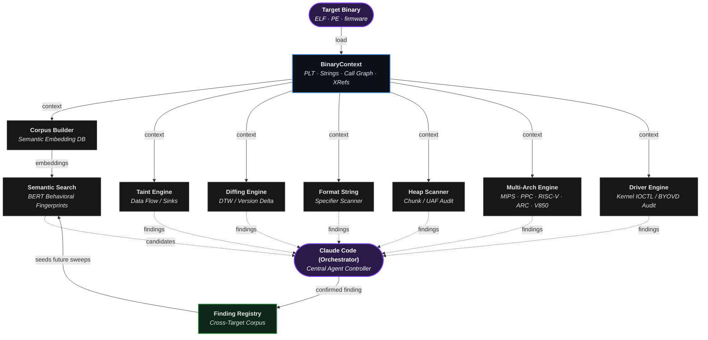
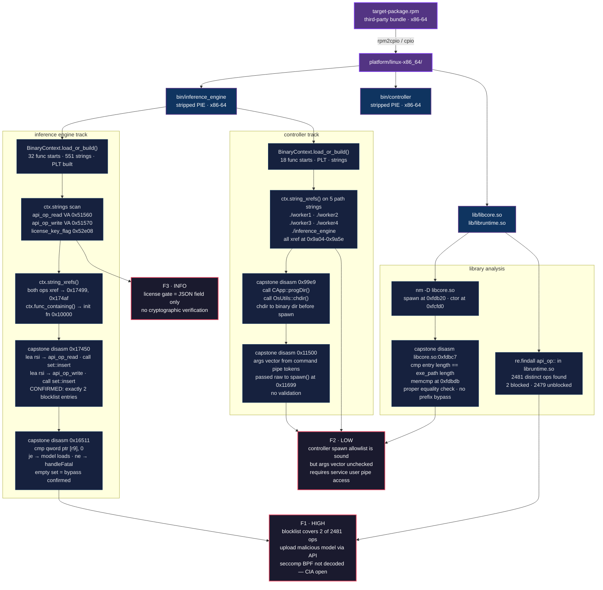

[English](../../../README.md) · [Español](../es/README.md) · [Português](../pt-BR/README.md) · [Français](../fr/README.md) · [Deutsch](../de/README.md) · [中文](../zh/README.md) · [日本語](../ja/README.md) · [Русский](../ru/README.md) · [العربية](../ar/README.md) · [한국어](../ko/README.md) · [हिन्दी](../hi/README.md) · [Italiano](../it/README.md) · [Türkçe](../tr/README.md) · [Tiếng Việt](../vi/README.md) · **Indonesia** · [Polski](../pl/README.md) · [Nederlands](../nl/README.md)

Ablation adalah framework rekayasa terbalik yang menyediakan kemampuan disassembly, dekompilasi, dan analisis biner yang sama dengan alat standar industri seperti Ghidra, IDA Pro, dan Binary Ninja.

Dikombinasikan dengan Claude Code atau OpenAI Codex, ia menjadi alat rekayasa terbalik yang sepenuhnya otonom.

---


## Kemampuan

**Pencarian Semantik via BERT:** Pencarian semantik menemukan hasil berdasarkan makna, bukan kata kunci yang tepat. BERT membaca teks dan memahami artinya. Makna serupa mendapat skor serupa, sehingga Anda dapat mencari berdasarkan konsep alih-alih kata yang tepat. Menggabungkan keduanya mempercepat hambatan utama rekayasa terbalik sambil menemukan fungsi yang rentan.

**Performa Ekstrem:** Biner 50 MB dimuat dalam 35 detik. Ghidra dan IDA Pro bisa memakan waktu berjam-jam karena mereka mengurai seluruh file ke database sebelum dapat melakukan apa pun. Ablation hanya menganalisis fungsi yang sedang Anda kerjakan, sehingga Anda langsung mulai.

**Version Diffing:** Menggunakan metode Jaccard untuk mengukur seberapa banyak perilaku fungsi tumpang tindih antar rilis dan Dynamic Time Warping yang melacak "bentuk" eksekusi fungsi di seluruh versi firmware, Ablation mengkonfirmasi apakah sebuah patch benar-benar mengubah logika atau hanya kemasan. Rekompilasi kosmetik tidak dapat menyembunyikan kerentanan yang belum dipatch.

**Analisis Lintas Biner:** Analisis setiap pustaka bersama dalam citra firmware secara bersamaan, melacak aliran data melintasi batas biner.

**Audit Kode Sumber:** Audit codebase besar lebih cepat dari membaca secara linier, dengan akurasi lebih tinggi dari pencocokan pola saja. Setiap file sumber mendapat profil keamanan 5-bit yang menentukan persis berapa banyak perhatian yang dibutuhkan, sehingga tidak ada yang terlewat dan tidak ada yang dibaca dua kali.

**Analisis Driver Kernel Windows dan BYOVD:** Memetakan tabel dispatch IRP, mendekode setiap kode IOCTL, dan mengidentifikasi API kernel mana yang mengekspos memori fisik dan token primitif dari mode pengguna. Detektor BYOVD mengambil sidik jari driver yang ditandatangani dengan kemampuan tersebut, karena satu driver yang ditandatangani saja cukup untuk membutakan EDR dari ring-0.

**Analisis Android/APK:** Membaca APK Android di tingkat biner tanpa dependensi. Memetakan titik masuk kode native dan permukaan IPC dari bytecode yang dikompilasi, sehingga seluruh permukaan terlihat tanpa dekompilasi.

**Analisis Erlang/BEAM:** Erlang dikompilasi ke file .beam, dan pendekatan pemetaan permukaan yang sama yang digunakan untuk ELF berlaku langsung, sehingga pencarian atom, audit impor, dan deteksi obfuskasi tidak memerlukan penanganan khusus. Memindai direktori rilis membutuhkan waktu beberapa detik.

**Dekripsi**
- **Entropy Mapper:** Bagian binary yang berisi data terenkripsi atau terkompresi terlihat acak secara statistik. Entropy Mapper mengukur keacakan itu di seluruh file dan menandai wilayah yang layak diperiksa.
- **Crypto Audit:** Memindai binary untuk konstanta kriptografi, tanda tangan algoritma yang dikenal, dan materi kunci sehingga Anda tahu apa yang sebenarnya dilakukan kode terhadap data sebelum membaca satu baris pun.
- **XorSolver:** Enkripsi XOR umum di firmware karena cepat dan mudah diimplementasikan. XorSolver memulihkan kunci dan mendekripsi bagian tersebut sehingga konten aslinya dapat dibaca.
- **BmpKeyExtractor:** Beberapa firmware dan APK membagi kunci rahasia menjadi bagian-bagian yang disembunyikan di file gambar daripada bagian data, karena aset gambar mendapat pengawasan yang lebih sedikit. BmpKeyExtractor menemukan dan merangkai ulang bagian-bagian itu.
- **ELFVtableReconstructor:** Dalam shared library, vtable kosong di disk dan hanya diisi oleh OS saat dimuat. ELFVtableReconstructor membaca instruksi relokasi yang akan digunakan OS dan membangun kembali tabel secara statis, sehingga Anda dapat melihat fungsi mana yang ada di slot mana tanpa menjalankan binary.
- **VtableDispatchScanner:** Memiliki entri vtable tidak berarti kode memanggilnya di suatu tempat. VtableDispatchScanner mencari di seluruh binary setiap tempat di mana metode virtual benar-benar dipanggil, sehingga Anda dapat membedakan slot yang dapat dijangkau dari dead code yang tidak pernah dipicu oleh apapun.

---

## Hasil Nyata

Ablation telah digunakan untuk menganalisis firmware produksi dan driver kernel dari Fortinet, Cisco, Juniper, Axis, Fujitsu, MikroTik, Orka, TencentOS, Enigma2, Skydio, dan Dahua Security System.

Setelah pengungkapan terkoordinasi pada Cisco FMC dan ISE, Cisco Product Security Incident Response Team (PSIRT) telah mengadopsi Ablation untuk triase kerentanan internal. Cisco PSIRT secara aktif menggunakannya untuk mentriase laporan pengungkapan yang sedang berlangsung di Firepower Threat Defense (FTD), Cisco Secure Client (AnyConnect), HyperFlex, dan Catalyst. Cisco ASA LINA juga telah direkayasa terbalik menggunakan Ablation.

| CVE | Produk | Judul | CVSS | Advisory |
|---|---|---|---|---|
| CVE-2026-76420 | Secure Firewall Management Center (FMC) | Peer Impersonation | 9.0 Critical | [cisco-sa-fmc2-multivulns-HXgcqRG](https://sec.cloudapps.cisco.com/security/center/content/CiscoSecurityAdvisory/cisco-sa-fmc2-multivulns-HXgcqRG) |
| CVE-2026-76412 | Secure Firewall Management Center (FMC) | Privilege Escalation to root | 8.5 High | [cisco-sa-fmc2-multivulns-HXgcqRG](https://sec.cloudapps.cisco.com/security/center/content/CiscoSecurityAdvisory/cisco-sa-fmc2-multivulns-HXgcqRG) |
| CVE-2026-76413 | Secure Firewall Management Center (FMC) | Single Sign-On Token Forgery | 8.5 High | [cisco-sa-fmc2-multivulns-HXgcqRG](https://sec.cloudapps.cisco.com/security/center/content/CiscoSecurityAdvisory/cisco-sa-fmc2-multivulns-HXgcqRG) |
| CVE-2026-76447 | Identity Services Engine (ISE) | OCSP Responder Authentication Bypass | 5.3 Medium | [cisco-sa-ise-multiauth-bypass-sgD2HbL4](https://sec.cloudapps.cisco.com/security/center/content/CiscoSecurityAdvisory/cisco-sa-ise-multiauth-bypass-sgD2HbL4) |

---

## 13 Decompiler Lokal

| Arsitektur | Varian |
|---|---|
| x86 | x86-32 · x86-64 |
| ARM | ARM-32 · ARM-64 |
| MIPS | MIPS-32 · nanoMIPS · MIPS-64 |
| PowerPC | PPC-32 · PPC-64 |
| RISC-V | RISC-V 32 · RISC-V 64 |
| Embedded | ARC EM/HS · V850-32 |

---

## Kompatibilitas LLM

| Penyedia | Model |
|---|---|
| **Claude Code** | /model claude-sonnet-4-6 |
| **OpenAI Codex** | Semua model yang diketahui |

---

## Instalasi

```bash
pip install git+https://github.com/Ablation-Tool/ablation
```

---

## Persyaratan

- Python >= 3.10
- `capstone`, `numpy`, `lief`, `sentence-transformers`, `pyelftools`

---

## Penggunaan Bertanggung Jawab

Ablation dibangun untuk penelitian keamanan yang diotorisasi. Gunakan hanya pada sistem yang Anda miliki atau memiliki izin tertulis eksplisit untuk diuji. Menjalankannya pada sistem tanpa otorisasi melanggar undang-undang penipuan komputer di sebagian besar yurisdiksi. Penulis tidak bertanggung jawab atas penyalahgunaan.

---

## Ucapan Terima Kasih
Proyek ini sangat diinformasikan dan diilhami oleh beberapa karya sastra utama.

**Makalah Penelitian**

| Judul | Penulis | Kutipan |
|---|---|---|
| [Finding Taint-Style Vulnerabilities in Linux-based Embedded Firmware with SSE-based Alias Analysis](https://arxiv.org/abs/2109.12209) | Cheng, Zheng, Liu, Guan, Liu, Li, Zhu, Ye, Sun | [sse_slicer.py](https://github.com/Ablation-Tool/ablation/blob/main/ablation/analyzers/sse_slicer.py) · [arm64_global_tracker.py](https://github.com/Ablation-Tool/ablation/blob/main/ablation/analyzers/arm64_global_tracker.py) |
| [iResolveX: Multi-Layered Indirect Call Resolution via Static Reasoning and Learning-Augmented Refinement](https://arxiv.org/abs/2601.17888) | Monika Santra, Bokai Zhang, Mark Lim, [Vishnu Asutosh Dasu](https://github.com/vdasu), Dongrui Zeng, [Gang Tan](https://github.com/gangtan) | [vtable_resolver.py](https://github.com/Ablation-Tool/ablation/blob/main/ablation/analyzers/vtable_resolver.py) · [interproc_field_writer.py](https://github.com/Ablation-Tool/ablation/blob/main/ablation/analyzers/interproc_field_writer.py) · [arm64_global_tracker.py](https://github.com/Ablation-Tool/ablation/blob/main/ablation/analyzers/arm64_global_tracker.py) |
| [Extracting Protocol Format as State Machine via Controlled Static Loop Analysis](https://arxiv.org/abs/2305.13483) | [Qingkai Shi](https://github.com/qingkaishi), Xiangzhe Xu, Xiangyu Zhang | [proto_fsm.py](https://github.com/Ablation-Tool/ablation/blob/main/ablation/analyzers/proto_fsm.py) |
| [NEMETYL: Message Type Identification of Binary Network Protocols using Continuous Segment Similarity](https://arxiv.org/abs/2002.03391) | [Stephan Kleber](https://github.com/vs-uulm), Rens Wouter van der Heijden, [Frank Kargl](https://github.com/fkargl) | [proto_fsm.py](https://github.com/Ablation-Tool/ablation/blob/main/ablation/analyzers/proto_fsm.py) |
| [Imperfect Forward Secrecy: How Diffie-Hellman Fails in Practice](https://dl.acm.org/doi/10.1145/2810103.2813707) | [David Adrian](https://github.com/dadrian), Karthikeyan Bhargavan, [Zakir Durumeric](https://github.com/zakird), Pierrick Gaudry, Matthew Green, [J. Alex Halderman](https://github.com/jhalderm), [Nadia Heninger](https://github.com/factorable), Drew Springall, Emmanuel Thomé, [Luke Valenta](https://github.com/lukevalenta) | [tls_analyzer.py](https://github.com/Ablation-Tool/ablation/blob/main/ablation/core/tls_analyzer.py) |
| [Nonce-Disrespecting Adversaries: Practical Forgery Attacks on GCM in TLS](https://www.usenix.org/conference/woot16/workshop-program/presentation/bock) | [Hanno Böck](https://github.com/hannob), [Aaron Zauner](https://github.com/azet), Sean Devlin, [Juraj Somorovsky](https://github.com/jurajsomorovsky), [Philipp Jovanovic](https://github.com/Daeinar) | [tls_analyzer.py](https://github.com/Ablation-Tool/ablation/blob/main/ablation/core/tls_analyzer.py) |
| [Whitening Sentence Representations for Better Semantics and Faster Retrieval](https://arxiv.org/abs/2103.15316) | [Jianlin Su](https://github.com/bojone), [Jiarun Cao](https://github.com/jiaruncao), Weijie Liu, Yangyiwen Ou | [semantic_search.py](https://github.com/Ablation-Tool/ablation/blob/main/ablation/analyzers/semantic_search.py) |
| [Constant Propagation with Conditional Branches](https://dl.acm.org/doi/abs/10.1145/103135.103136) | Mark N. Wegman, F. Kenneth Zadeck | [dataflow_engine.py](https://github.com/Ablation-Tool/ablation/blob/main/ablation/analyzers/dataflow_engine.py) |
| [A Simple, Fast Dominance Algorithm](https://www.cs.princeton.edu/techreports/2005/737.pdf) | Cooper, Harvey, Kennedy | [dataflow_engine.py](https://github.com/Ablation-Tool/ablation/blob/main/ablation/analyzers/dataflow_engine.py) |
| [libdft: Practical Dynamic Data Flow Tracking for Commodity Systems](https://dl.acm.org/doi/10.1145/2151024.2151042) | [Vasileios P. Kemerlis](https://github.com/vkemerlis), [Georgios Portokalidis](https://github.com/portokalidis), [Kangkook Jee](https://github.com/jikk), Angelos D. Keromytis | [taint_tracker_x86.py](https://github.com/Ablation-Tool/ablation/blob/main/ablation/analyzers/taint_tracker_x86.py) · [taint_tracker_arm32.py](https://github.com/Ablation-Tool/ablation/blob/main/ablation/analyzers/taint_tracker_arm32.py) |

**Buku** disediakan oleh [www.oreilly.com](https://www.oreilly.com) | [github.com/oreillymedia](https://github.com/oreillymedia)

| Judul | Penulis | Kutipan |
|---|---|---|
| The Art of Software Security Assessment | [Mark Dowd](https://github.com/mdowd79), John McDonald, [Justin Schuh](https://github.com/jschuh) | [heap_vuln_scanner.py](https://github.com/Ablation-Tool/ablation/blob/main/ablation/analyzers/heap_vuln_scanner.py) · [format_string_scanner.py](https://github.com/Ablation-Tool/ablation/blob/main/ablation/analyzers/format_string_scanner.py) · [ioctl_attack_surface.py](https://github.com/Ablation-Tool/ablation/blob/main/ablation/analyzers/ioctl_attack_surface.py) |
| Practical Binary Analysis | [Dennis Andriesse](https://github.com/dennisaa) | [taint_tracker_x86.py](https://github.com/Ablation-Tool/ablation/blob/main/ablation/analyzers/taint_tracker_x86.py) · [disasm_engine.py](https://github.com/Ablation-Tool/ablation/blob/main/ablation/core/disasm_engine.py) |
| Practical Malware Analysis | Michael Sikorski, Andrew Honig | [pe_parser.py](https://github.com/Ablation-Tool/ablation/blob/main/ablation/core/pe_parser.py) · [shellcode_utils.py](https://github.com/Ablation-Tool/ablation/blob/main/ablation/core/shellcode_utils.py) |
| Practical Reverse Engineering | Bruce Dang, Alexandre Gazet, [Elias Bachaalany](https://github.com/0xeb) | [pe_analyzer.py](https://github.com/Ablation-Tool/ablation/blob/main/ablation/core/pe_analyzer.py) · [kernel_driver_analyzer.py](https://github.com/Ablation-Tool/ablation/blob/main/ablation/analyzers/kernel_driver_analyzer.py) |
| Hacking: The Art of Exploitation (2e) | Jon Erickson | [platform_detect.py](https://github.com/Ablation-Tool/ablation/blob/main/ablation/core/platform_detect.py) |
| Learning Linux Binary Analysis | [Ryan O'Neill](https://github.com/elfmaster) | [elf_parser.py](https://github.com/Ablation-Tool/ablation/blob/main/ablation/core/elf_parser.py) · [binary_parser.py](https://github.com/Ablation-Tool/ablation/blob/main/ablation/core/binary_parser.py) |
| Windows Internals Part 1 & 2 | [Pavel Yosifovich](https://github.com/zodiacon), [Mark Russinovich](https://github.com/markrussinovich), David Solomon, [Alex Ionescu](https://github.com/ionescu007), [Andrea Allievi](https://github.com/AaLl86) | [kernel_driver_analyzer.py](https://github.com/Ablation-Tool/ablation/blob/main/ablation/analyzers/kernel_driver_analyzer.py) · [ioctl_attack_surface.py](https://github.com/Ablation-Tool/ablation/blob/main/ablation/analyzers/ioctl_attack_surface.py) |
| Rootkits: Subverting the Windows Kernel | Greg Hoglund, Jamie Butler | [kernel_driver_analyzer.py](https://github.com/Ablation-Tool/ablation/blob/main/ablation/analyzers/kernel_driver_analyzer.py) · [yara_generator.py](https://github.com/Ablation-Tool/ablation/blob/main/ablation/core/yara_generator.py) |
| Advanced Compiler Design and Implementation | Steven Muchnick | [dataflow_engine.py](https://github.com/Ablation-Tool/ablation/blob/main/ablation/analyzers/dataflow_engine.py) |
| Engineering a Compiler | Keith Cooper, Linda Torczon | [disasm_engine.py](https://github.com/Ablation-Tool/ablation/blob/main/ablation/core/disasm_engine.py) |
| Practical IoT Hacking | [Fotios Chantzis](https://github.com/ithilgore), Ioannis Stais, Paulino Calderon, Evangelos Deirmentzoglou, Beau Woods | [firmware_analyzer.py](https://github.com/Ablation-Tool/ablation/blob/main/ablation/core/firmware_analyzer.py) |
| Inside the Android OS | [G. Blake Meike](https://github.com/bmeike) | [apk_parser.py](https://github.com/Ablation-Tool/ablation/blob/main/ablation/core/apk_parser.py) · [jni_bridge_scanner.py](https://github.com/Ablation-Tool/ablation/blob/main/ablation/analyzers/jni_bridge_scanner.py) · [binder_scanner.py](https://github.com/Ablation-Tool/ablation/blob/main/ablation/analyzers/binder_scanner.py) |
| Malware Analysis and Detection Engineering | [Abhijit Mohanta](https://github.com/amohanta), Anoop Saldanha | [yara_generator.py](https://github.com/Ablation-Tool/ablation/blob/main/ablation/core/yara_generator.py) |
| Evasive Malware | [Kyle Cucci](https://github.com/d4rksystem) | [process_enum.py](https://github.com/Ablation-Tool/ablation/blob/main/modules/process_enum.py) |
| Hacking Cryptography | [Kamran Khan](https://github.com/krkhan), [Bill Cox](https://github.com/waywardgeek) | [tls_enum.py](https://github.com/Ablation-Tool/ablation/blob/main/modules/tls_enum.py) |
| Real-World Cryptography | David Wong | [tls_analyzer.py](https://github.com/Ablation-Tool/ablation/blob/main/ablation/core/tls_analyzer.py) |

**Penyebutan Khusus**

[Microsoft Excel (Data Analysis ToolPak)](https://support.microsoft.com/en-us/office/use-the-analysis-toolpak-to-perform-complex-data-analysis-6c67ccf0-f4a9-487c-8dec-bdb5a2cefab6) Saat menganalisis infrastruktur tertutup atau mengamankan sistem kotak hitam, proses tepat ini disebut analisis waktu atau rekayasa terbalik telemetri. Tanpa kode sumber, Data Analysis ToolPak secara matematis membongkar cara kerja aplikasi di backend dengan ketat mengamati input dan outputnya.

---

## Arsitektur Framework dan Orkestrasi Modul



---

## Contoh Alur Kerja RE

Analisis ujung-ke-ujung biner stripped dari bundel RPM. Ekstraksi melalui BinaryContext, xref string, dan disassembly capstone hingga temuan yang dikonfirmasi.


