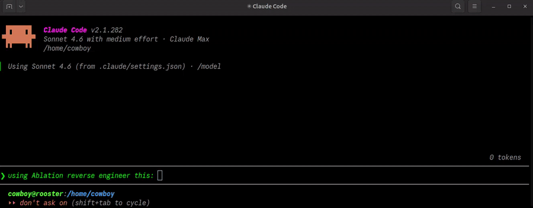
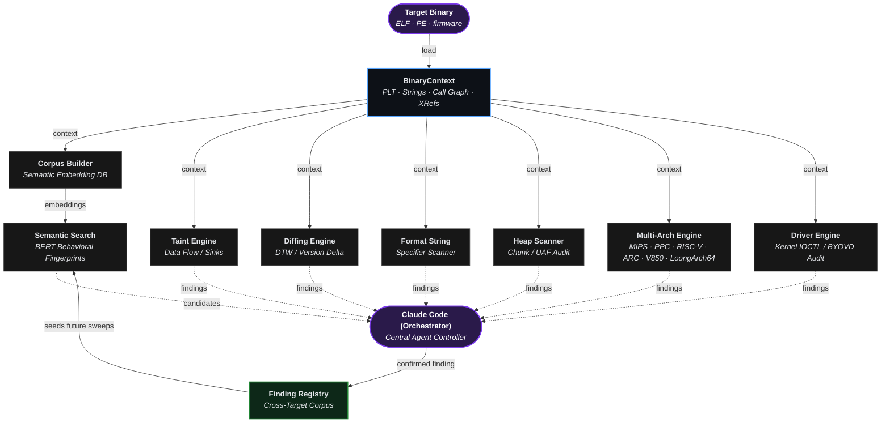
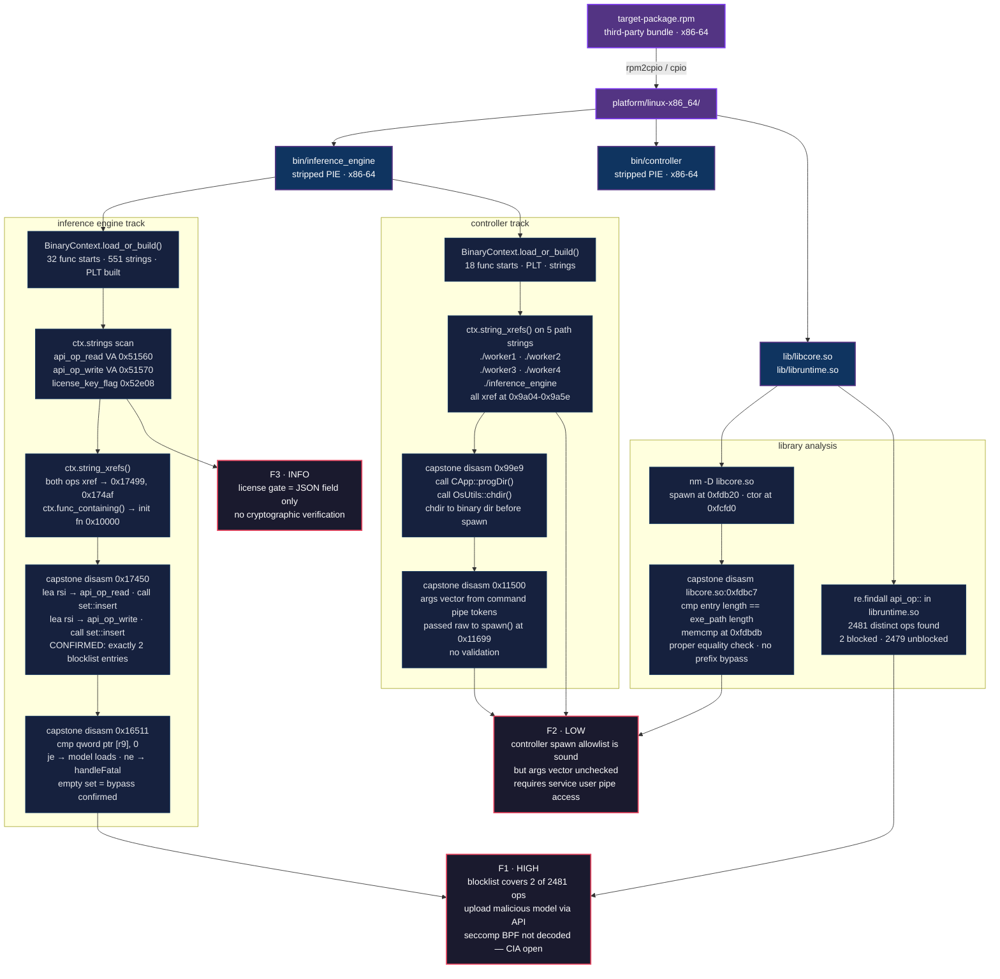

[English](../../../README.md) · [Español](../es/README.md) · [Português](../pt-BR/README.md) · [Français](../fr/README.md) · [Deutsch](../de/README.md) · [中文](../zh/README.md) · [日本語](../ja/README.md) · [Русский](../ru/README.md) · [العربية](../ar/README.md) · [한국어](../ko/README.md) · [हिन्दी](../hi/README.md) · **Italiano** · [Türkçe](../tr/README.md) · [Tiếng Việt](../vi/README.md) · [Indonesia](../id/README.md) · [Polski](../pl/README.md) · [Nederlands](../nl/README.md)

Ablation è un framework di reverse engineering che fornisce le stesse capacità fondamentali di disassemblaggio, decompilazione e analisi binaria degli strumenti standard del settore come Ghidra, IDA Pro e Binary Ninja.

Combinato con Claude Code o OpenAI Codex, diventa uno strumento di reverse engineering completamente autonomo.

---



## Funzionalità

**Ricerca semantica con BERT:** Cerca codice per concetto invece di parole esatte. Mappando il significato reale del testo, supera il principale collo di bottiglia del reverse engineering per aiutarti a individuare le vulnerabilità più rapidamente.

**Prestazioni estreme:** Carica binari massicci in secondi invece di ore. Analizzando solo il codice che stai guardando attivamente, salta la pesante elaborazione iniziale degli strumenti tradizionali per iniziare immediatamente il reverse engineering.

**Version diffing:** Analizza il comportamento reale del software aggiornato per verificare le patch del fornitore. Penetra il reimpacchettamento superficiale per confermare se una vulnerabilità è stata effettivamente corretta o solo nascosta.

**Analisi cross-binary:** Analizza ogni libreria condivisa in un'immagine firmware simultaneamente, tracciando i flussi di dati attraverso i confini binari.

**Audit del codice sorgente:** Controlla qualsiasi codebase di grandi dimensioni più velocemente della lettura lineare, con maggiore precisione del solo pattern matching. Ogni file sorgente riceve un profilo di sicurezza a 5 bit che determina esattamente quanta attenzione richiede, così nulla viene tralasciato e nulla viene letto due volte.

**Analisi driver kernel Windows e BYOVD:** Analizza i driver del kernel per individuare punti di accesso rischiosi per bloccare gli attaccanti che usano driver firmati e vulnerabili per aggirare il software di sicurezza.

**Analisi Android/APK:** Mappa le superfici di attacco delle app Android senza bisogno di decompilare il codice. Analizza e classifica automaticamente le librerie interne per rischio di sicurezza, permettendoti di colpire immediatamente i componenti più vulnerabili.

**Analisi Erlang/BEAM:** Analizza in sicurezza il bytecode Erlang per evidenziare istantaneamente funzioni pericolose e superfici di attacco nascoste senza eseguire l'applicazione.

**Analisi crittografica**

Ablation rimuove ogni strato che rende la crittografia invisibile in un binary compilato. Entropy Mapper individua la regione cifrata. Crypto Audit e HashAlgoDiscriminator identificano l'algoritmo. XorSolver, BmpKeyExtractor e CustomCBCDetector rompono la cifratura o recuperano la chiave. ELFVtableReconstructor e VtableDispatchScanner ricostruiscono cosa fa il runtime con il risultato.

Un binary può nascondere la sua crittografia dall'analisi della tabella delle importazioni, dalle tabelle dei simboli e dalla ricerca di stringhe. Questi otto strumenti chiudono collettivamente quel divario, così alla fine conosci l'algoritmo, la chiave e il testo cifrato.

---

## Risultati reali

Ablation è stato utilizzato per analizzare firmware di produzione e driver del kernel di Cisco, Fortinet, TencentOS, Huawei, Dahua Security System e altri.

Dopo la divulgazione coordinata su Cisco FMC e ISE, il Cisco Product Security Incident Response Team (PSIRT) ha adottato Ablation per il triage interno delle vulnerabilità. Cisco PSIRT lo usa attivamente per il triage dei report di divulgazione su Firepower Threat Defense (FTD), Cisco Secure Client (AnyConnect), Catalyst. Cisco Adaptive Security Appliance (ASA) LINA è stato anch'esso sottoposto a reverse engineering con Ablation, con i risultati attualmente in fase di triage coordinato tramite CERT/CC VINCE.

| CVE | Prodotto | Titolo | CVSS | Advisory |
|---|---|---|---|---|
| CVE-2026-76420 | Secure Firewall Management Center (FMC) | Peer Impersonation | 9.0 Critical | [cisco-sa-fmc2-multivulns-HXgcqRG](https://sec.cloudapps.cisco.com/security/center/content/CiscoSecurityAdvisory/cisco-sa-fmc2-multivulns-HXgcqRG) |
| CVE-2026-76412 | Secure Firewall Management Center (FMC) | Privilege Escalation to root | 8.5 High | [cisco-sa-fmc2-multivulns-HXgcqRG](https://sec.cloudapps.cisco.com/security/center/content/CiscoSecurityAdvisory/cisco-sa-fmc2-multivulns-HXgcqRG) |
| CVE-2026-76413 | Secure Firewall Management Center (FMC) | Single Sign-On Token Forgery | 8.5 High | [cisco-sa-fmc2-multivulns-HXgcqRG](https://sec.cloudapps.cisco.com/security/center/content/CiscoSecurityAdvisory/cisco-sa-fmc2-multivulns-HXgcqRG) |
| CVE-2026-76447 | Identity Services Engine (ISE) | OCSP Responder Authentication Bypass | 5.3 Medium | [cisco-sa-ise-multiauth-bypass-sgD2HbL4](https://sec.cloudapps.cisco.com/security/center/content/CiscoSecurityAdvisory/cisco-sa-ise-multiauth-bypass-sgD2HbL4) |

---

## Decompilatori

| ISA / Runtime | Varianti |
|---|---|
| x86 | x86-32 · x86-64 |
| ARM | ARM-32 · ARM-64 |
| MIPS | MIPS-32 · nanoMIPS · MIPS-64 |
| PowerPC | PPC-32 · PPC-64 |
| RISC-V | RISC-V 32 · RISC-V 64 |
| ARC | ARC EM/HS |
| V850 | V850-32 |
| LoongArch | LoongArch64 |
| DEX | Dalvik · ART |
| ARK | ArkTS |
| BEAM | Erlang · Elixir |

---

## Compatibilità LLM

| Provider | Modelli |
|---|---|
| **Claude Code** | /model claude-sonnet-4-6 |
| **OpenAI Codex** | Tutti i modelli noti |

---

## Installazione

```bash
pip install git+https://github.com/Ablation-Tool/ablation
```

---

## Requisiti

- Python >= 3.10
- `capstone`, `numpy`, `lief`, `sentence-transformers`, `pyelftools`

---

## Uso responsabile

Ablation è progettato per la ricerca di sicurezza autorizzata. Usalo solo su sistemi che possiedi o per cui hai esplicita autorizzazione scritta. Eseguirlo su sistemi non autorizzati viola le leggi sulla frode informatica nella maggior parte delle giurisdizioni. Gli autori non sono responsabili per usi impropri.

---

## Riconoscimenti
Questo progetto è stato ampiamente informato e ispirato da diverse opere letterarie chiave.

**Articoli di ricerca**

| Titolo | Autori | Citazione |
|---|---|---|
| [Reverse Compilation Techniques](https://scholar.google.com/citations?view_op=view_citation&hl=en&user=iseZ69MAAAAJ&citation_for_view=iseZ69MAAAAJ:u-x6o8ySG0sC) · [Specifying the Semantics of Machine Instructions](https://ieeexplore.ieee.org/document/693702) · [UQBT: Adaptable Binary Translation at Low Cost](https://ieeexplore.ieee.org/document/825697) · [Machine-Adaptable Dynamic Binary Translation](https://dl.acm.org/doi/10.1145/351397.351414) | [Dr. Cristina Cifuentes](https://scholar.google.com/citations?hl=en&user=iseZ69MAAAAJ) | [abc_parser.py](https://github.com/Ablation-Tool/ablation/blob/main/ablation/analyzers/abc_parser.py) · [abc_disasm.py](https://github.com/Ablation-Tool/ablation/blob/main/ablation/analyzers/abc_disasm.py) · [abc_decompiler.py](https://github.com/Ablation-Tool/ablation/blob/main/ablation/analyzers/abc_decompiler.py) · [dataflow_engine.py](https://github.com/Ablation-Tool/ablation/blob/main/ablation/analyzers/dataflow_engine.py) · [loongarch_decoder_v2.py](https://github.com/Ablation-Tool/ablation/blob/main/ablation/analyzers/loongarch_decoder_v2.py) |
| [Design of a Retargetable Decompiler for a Static Platform-Independent Malware Analysis](https://www.researchgate.net/publication/220849941_Design_of_a_Retargetable_Decompiler_for_a_Static_Platform-Independent_Malware_Analysis) | [Petr Zemek](https://github.com/s3rvac), Lukáš Ďurfina, Jakub Křoustek, Dušan Kolář, Tomas Hruska, Karel Masařík, Alexander Meduna | [abc_decompiler.py](https://github.com/Ablation-Tool/ablation/blob/main/ablation/analyzers/abc_decompiler.py) |
| [Finding Taint-Style Vulnerabilities in Linux-based Embedded Firmware with SSE-based Alias Analysis](https://arxiv.org/abs/2109.12209) | Cheng, Zheng, Liu, Guan, Liu, Li, Zhu, Ye, Sun | [sse_slicer.py](https://github.com/Ablation-Tool/ablation/blob/main/ablation/analyzers/sse_slicer.py) · [arm64_global_tracker.py](https://github.com/Ablation-Tool/ablation/blob/main/ablation/analyzers/arm64_global_tracker.py) |
| [iResolveX: Multi-Layered Indirect Call Resolution via Static Reasoning and Learning-Augmented Refinement](https://arxiv.org/abs/2601.17888) | Monika Santra, Bokai Zhang, Mark Lim, [Vishnu Asutosh Dasu](https://github.com/vdasu), Dongrui Zeng, [Gang Tan](https://github.com/gangtan) | [vtable_resolver.py](https://github.com/Ablation-Tool/ablation/blob/main/ablation/analyzers/vtable_resolver.py) · [interproc_field_writer.py](https://github.com/Ablation-Tool/ablation/blob/main/ablation/analyzers/interproc_field_writer.py) · [arm64_global_tracker.py](https://github.com/Ablation-Tool/ablation/blob/main/ablation/analyzers/arm64_global_tracker.py) |
| [Extracting Protocol Format as State Machine via Controlled Static Loop Analysis](https://arxiv.org/abs/2305.13483) | [Qingkai Shi](https://github.com/qingkaishi), Xiangzhe Xu, Xiangyu Zhang | [proto_fsm.py](https://github.com/Ablation-Tool/ablation/blob/main/ablation/analyzers/proto_fsm.py) |
| [NEMETYL: Message Type Identification of Binary Network Protocols using Continuous Segment Similarity](https://arxiv.org/abs/2002.03391) | [Stephan Kleber](https://github.com/vs-uulm), Rens Wouter van der Heijden, [Frank Kargl](https://github.com/fkargl) | [proto_fsm.py](https://github.com/Ablation-Tool/ablation/blob/main/ablation/analyzers/proto_fsm.py) |
| [Imperfect Forward Secrecy: How Diffie-Hellman Fails in Practice](https://dl.acm.org/doi/10.1145/2810103.2813707) | [David Adrian](https://github.com/dadrian), Karthikeyan Bhargavan, [Zakir Durumeric](https://github.com/zakird), Pierrick Gaudry, Matthew Green, [J. Alex Halderman](https://github.com/jhalderm), [Nadia Heninger](https://github.com/factorable), Drew Springall, Emmanuel Thomé, [Luke Valenta](https://github.com/lukevalenta) | [tls_analyzer.py](https://github.com/Ablation-Tool/ablation/blob/main/ablation/core/tls_analyzer.py) |
| [Nonce-Disrespecting Adversaries: Practical Forgery Attacks on GCM in TLS](https://www.usenix.org/conference/woot16/workshop-program/presentation/bock) | [Hanno Böck](https://github.com/hannob), [Aaron Zauner](https://github.com/azet), Sean Devlin, [Juraj Somorovsky](https://github.com/jurajsomorovsky), [Philipp Jovanovic](https://github.com/Daeinar) | [tls_analyzer.py](https://github.com/Ablation-Tool/ablation/blob/main/ablation/core/tls_analyzer.py) |
| [Whitening Sentence Representations for Better Semantics and Faster Retrieval](https://arxiv.org/abs/2103.15316) | [Jianlin Su](https://github.com/bojone), [Jiarun Cao](https://github.com/jiaruncao), Weijie Liu, Yangyiwen Ou | [semantic_search.py](https://github.com/Ablation-Tool/ablation/blob/main/ablation/analyzers/semantic_search.py) |
| [Constant Propagation with Conditional Branches](https://dl.acm.org/doi/abs/10.1145/103135.103136) | Mark N. Wegman, F. Kenneth Zadeck | [dataflow_engine.py](https://github.com/Ablation-Tool/ablation/blob/main/ablation/analyzers/dataflow_engine.py) |
| [A Simple, Fast Dominance Algorithm](https://www.cs.princeton.edu/techreports/2005/737.pdf) | Cooper, Harvey, Kennedy | [dataflow_engine.py](https://github.com/Ablation-Tool/ablation/blob/main/ablation/analyzers/dataflow_engine.py) |
| [libdft: Practical Dynamic Data Flow Tracking for Commodity Systems](https://dl.acm.org/doi/10.1145/2151024.2151042) | [Vasileios P. Kemerlis](https://github.com/vkemerlis), [Georgios Portokalidis](https://github.com/portokalidis), [Kangkook Jee](https://github.com/jikk), Angelos D. Keromytis | [taint_tracker_x86.py](https://github.com/Ablation-Tool/ablation/blob/main/ablation/analyzers/taint_tracker_x86.py) · [taint_tracker_arm32.py](https://github.com/Ablation-Tool/ablation/blob/main/ablation/analyzers/taint_tracker_arm32.py) |

**Libri** forniti da [www.oreilly.com](https://www.oreilly.com) | [github.com/oreillymedia](https://github.com/oreillymedia)

| Titolo | Autori | Citazione |
|---|---|---|
| The Art of Software Security Assessment | [Mark Dowd](https://github.com/mdowd79), John McDonald, [Justin Schuh](https://github.com/jschuh) | [heap_vuln_scanner.py](https://github.com/Ablation-Tool/ablation/blob/main/ablation/analyzers/heap_vuln_scanner.py) · [format_string_scanner.py](https://github.com/Ablation-Tool/ablation/blob/main/ablation/analyzers/format_string_scanner.py) · [ioctl_attack_surface.py](https://github.com/Ablation-Tool/ablation/blob/main/ablation/analyzers/ioctl_attack_surface.py) |
| Practical Binary Analysis | [Dennis Andriesse](https://github.com/dennisaa) | [taint_tracker_x86.py](https://github.com/Ablation-Tool/ablation/blob/main/ablation/analyzers/taint_tracker_x86.py) · [disasm_engine.py](https://github.com/Ablation-Tool/ablation/blob/main/ablation/core/disasm_engine.py) |
| Practical Malware Analysis | Michael Sikorski, Andrew Honig | [pe_parser.py](https://github.com/Ablation-Tool/ablation/blob/main/ablation/core/pe_parser.py) · [shellcode_utils.py](https://github.com/Ablation-Tool/ablation/blob/main/ablation/core/shellcode_utils.py) |
| Practical Reverse Engineering | Bruce Dang, Alexandre Gazet, [Elias Bachaalany](https://github.com/0xeb) | [pe_analyzer.py](https://github.com/Ablation-Tool/ablation/blob/main/ablation/core/pe_analyzer.py) · [kernel_driver_analyzer.py](https://github.com/Ablation-Tool/ablation/blob/main/ablation/analyzers/kernel_driver_analyzer.py) |
| Hacking: The Art of Exploitation (2e) | Jon Erickson | [platform_detect.py](https://github.com/Ablation-Tool/ablation/blob/main/ablation/core/platform_detect.py) |
| Learning Linux Binary Analysis | [Ryan O'Neill](https://github.com/elfmaster) | [elf_parser.py](https://github.com/Ablation-Tool/ablation/blob/main/ablation/core/elf_parser.py) · [binary_parser.py](https://github.com/Ablation-Tool/ablation/blob/main/ablation/core/binary_parser.py) |
| Windows Internals Part 1 & 2 | [Pavel Yosifovich](https://github.com/zodiacon), [Mark Russinovich](https://github.com/markrussinovich), David Solomon, [Alex Ionescu](https://github.com/ionescu007), [Andrea Allievi](https://github.com/AaLl86) | [kernel_driver_analyzer.py](https://github.com/Ablation-Tool/ablation/blob/main/ablation/analyzers/kernel_driver_analyzer.py) · [ioctl_attack_surface.py](https://github.com/Ablation-Tool/ablation/blob/main/ablation/analyzers/ioctl_attack_surface.py) |
| Rootkits: Subverting the Windows Kernel | Greg Hoglund, Jamie Butler | [kernel_driver_analyzer.py](https://github.com/Ablation-Tool/ablation/blob/main/ablation/analyzers/kernel_driver_analyzer.py) · [yara_generator.py](https://github.com/Ablation-Tool/ablation/blob/main/ablation/core/yara_generator.py) |
| Advanced Compiler Design and Implementation | Steven Muchnick | [dataflow_engine.py](https://github.com/Ablation-Tool/ablation/blob/main/ablation/analyzers/dataflow_engine.py) |
| Engineering a Compiler | Keith Cooper, Linda Torczon | [disasm_engine.py](https://github.com/Ablation-Tool/ablation/blob/main/ablation/core/disasm_engine.py) |
| Practical IoT Hacking | [Fotios Chantzis](https://github.com/ithilgore), Ioannis Stais, Paulino Calderon, Evangelos Deirmentzoglou, Beau Woods | [firmware_analyzer.py](https://github.com/Ablation-Tool/ablation/blob/main/ablation/core/firmware_analyzer.py) |
| Inside the Android OS | [G. Blake Meike](https://github.com/bmeike) | [apk_parser.py](https://github.com/Ablation-Tool/ablation/blob/main/ablation/core/apk_parser.py) · [jni_bridge_scanner.py](https://github.com/Ablation-Tool/ablation/blob/main/ablation/analyzers/jni_bridge_scanner.py) · [binder_scanner.py](https://github.com/Ablation-Tool/ablation/blob/main/ablation/analyzers/binder_scanner.py) |
| Malware Analysis and Detection Engineering | [Abhijit Mohanta](https://github.com/amohanta), Anoop Saldanha | [yara_generator.py](https://github.com/Ablation-Tool/ablation/blob/main/ablation/core/yara_generator.py) |
| Evasive Malware | [Kyle Cucci](https://github.com/d4rksystem) | [process_enum.py](https://github.com/Ablation-Tool/ablation/blob/main/modules/process_enum.py) |
| Hacking Cryptography | [Kamran Khan](https://github.com/krkhan), [Bill Cox](https://github.com/waywardgeek) | [tls_enum.py](https://github.com/Ablation-Tool/ablation/blob/main/modules/tls_enum.py) |
| Real-World Cryptography | David Wong | [tls_analyzer.py](https://github.com/Ablation-Tool/ablation/blob/main/ablation/core/tls_analyzer.py) |

**Menzione speciale**

[Microsoft Excel (Data Analysis ToolPak)](https://support.microsoft.com/en-us/office/use-the-analysis-toolpak-to-perform-complex-data-analysis-6c67ccf0-f4a9-487c-8dec-bdb5a2cefab6) Nell'analisi di infrastrutture chiuse o nella protezione di sistemi black-box, questo esatto processo si chiama analisi temporale o reverse engineering della telemetria. Senza codice sorgente, il Data Analysis ToolPak scompone matematicamente come funziona un'applicazione sul backend osservando rigorosamente i suoi input e output.

---

## Architettura del framework e orchestrazione dei moduli



---

## Esempio di flusso di lavoro RE

Analisi end-to-end di binari stripped da un bundle RPM. Estrazione tramite BinaryContext, xref di stringhe e disassemblaggio capstone fino ai risultati confermati.


