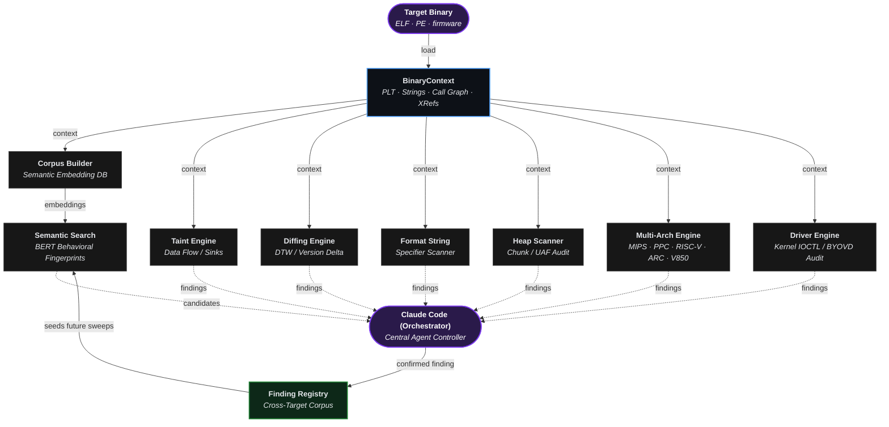
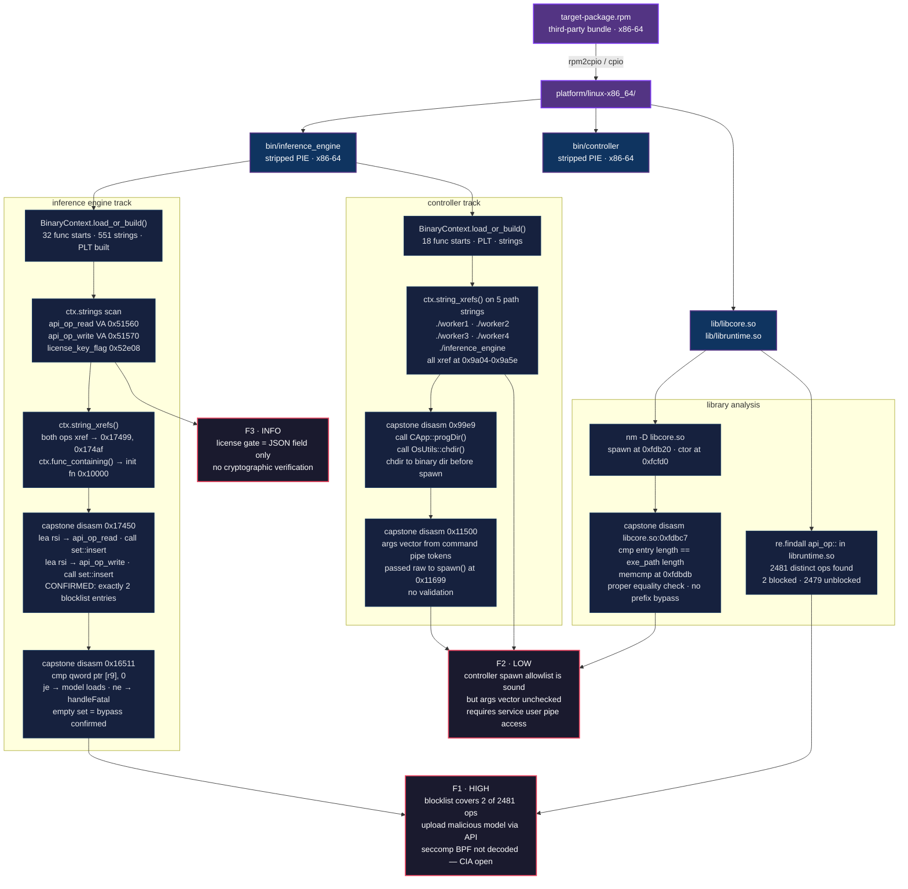

[English](../../../README.md) · [Español](../es/README.md) · [Português](../pt-BR/README.md) · [Français](../fr/README.md) · [Deutsch](../de/README.md) · [中文](../zh/README.md) · [日本語](../ja/README.md) · [Русский](../ru/README.md) · [العربية](../ar/README.md) · **한국어** · [हिन्दी](../hi/README.md) · [Italiano](../it/README.md) · [Türkçe](../tr/README.md) · [Tiếng Việt](../vi/README.md) · [Indonesia](../id/README.md) · [Polski](../pl/README.md) · [Nederlands](../nl/README.md)

Ablation은 Ghidra, IDA Pro, Binary Ninja 같은 업계 표준 도구와 동일한 핵심 역어셈블, 디컴파일, 바이너리 분석 기능을 제공하는 리버스 엔지니어링 프레임워크입니다.

Claude Code 또는 OpenAI Codex와 결합하면 완전 자율 리버스 엔지니어링 도구로 전환됩니다.

---


## 기능

**BERT를 활용한 시맨틱 검색:** 시맨틱 검색은 정확한 키워드가 아닌 의미를 기반으로 결과를 찾습니다. BERT는 텍스트를 읽고 의미를 파악합니다. 유사한 의미는 유사한 점수를 받으므로 정확한 단어 대신 개념으로 검색할 수 있습니다. 두 기술을 결합하면 리버스 엔지니어링의 주요 병목 현상을 가속화하면서 취약한 함수를 찾습니다.

**극한의 성능:** 50MB 바이너리가 35초 안에 로드됩니다. Ghidra와 IDA Pro는 파일 전체를 데이터베이스로 파싱한 후에야 작업을 시작할 수 있어 수 시간이 걸릴 수 있습니다. Ablation은 현재 작업 중인 함수만 분석하므로 즉시 시작합니다.

**버전 차이 분석:** Jaccard 방법으로 버전 간 함수 동작 중복을 측정하고 Dynamic Time Warping으로 펌웨어 버전에 걸쳐 함수 실행 "형태"를 추적하여, Ablation은 패치가 실제로 로직을 변경했는지 아니면 패키징만 변경했는지 확인합니다. 겉모습만 바꾼 재컴파일은 패치되지 않은 취약점을 숨길 수 없기 때문입니다.

**크로스 바이너리 분석:** 펌웨어 이미지의 모든 공유 라이브러리를 동시에 분석하여 바이너리 경계를 넘어 데이터 흐름을 추적합니다.

**소스 코드 감사:** 선형 읽기보다 빠르고 패턴 매칭 단독보다 높은 정확도로 대형 코드베이스를 감사합니다. 각 소스 파일은 5비트 보안 프로파일을 받아 필요한 주의량을 정확히 결정하므로 놓치는 것도 없고 두 번 읽는 것도 없습니다.

**Windows 커널 드라이버 및 BYOVD 분석:** IRP 디스패치 테이블을 매핑하고 모든 IOCTL 코드를 디코딩하며 사용자 모드에서 물리 메모리와 토큰 프리미티브를 노출하는 커널 API를 식별합니다. BYOVD 감지기는 이러한 기능을 가진 서명된 드라이버를 지문화하는데, 정당한 서명된 드라이버 하나만으로도 링-0에서 EDR을 무력화할 수 있기 때문입니다.

**Android/APK 분석:** 종속성 없이 바이너리 수준에서 Android APK를 읽습니다. 컴파일된 바이트코드에서 네이티브 코드 진입점과 IPC 표면을 매핑하므로 디컴파일 없이도 전체 표면이 보입니다.

**Erlang/BEAM 분석:** Erlang은 .beam 파일로 컴파일되며 ELF에 사용된 표면 매핑 접근법이 직접 적용됩니다. 원자 검색, 임포트 감사, 난독화 감지에 특별한 처리가 필요 없습니다. 릴리스 디렉토리 스캔은 수 초 만에 완료됩니다.

**복호화**
- **Entropy Mapper:** 바이너리에서 암호화, 압축 또는 패킹된 섹션을 찾습니다.
- **Crypto Audit:** 암호화를 스캔합니다.
- **XorSolver:** 대상 섹션을 복구한 후 복호화하여 추가 리버스 엔지니어링을 가능하게 합니다.
- **BmpKeyExtractor:** Lagrange 다항식 보간법을 사용해 BMP 픽셀 스테가노그래피에 숨겨진 비밀 키를 재구성합니다. 펌웨어와 APK는 때때로 데이터 섹션이 아닌 이미지 자산에 키 조각을 저장하기 때문입니다.

---

## 실제 결과

Ablation은 Fortinet, Cisco, Juniper, Axis, Fujitsu, MikroTik, Orka, TencentOS, Enigma2, Skydio, Dahua Security System의 프로덕션 펌웨어와 커널 드라이버를 분석하는 데 사용되었습니다.

Cisco FMC와 ISE에 대한 조율된 공개 이후, Cisco 제품 보안 사고 대응팀(PSIRT)은 내부 취약점 분류를 위해 Ablation을 채택했습니다. Cisco PSIRT는 Firepower Threat Defense(FTD), Cisco Secure Client(AnyConnect), HyperFlex, Catalyst에 걸쳐 진행 중인 공개 보고서를 분류하는 데 적극적으로 사용하고 있습니다. Cisco Adaptive Security Appliance(ASA) LINA도 Ablation으로 리버스 엔지니어링되었으며, 현재 CERT/CC VINCE를 통해 조율된 분류 중입니다.

| CVE | 제품 | 제목 | CVSS | 권고사항 |
|---|---|---|---|---|
| CVE-2026-76420 | Secure Firewall Management Center (FMC) | Peer Impersonation | 9.0 Critical | [cisco-sa-fmc2-multivulns-HXgcqRG](https://sec.cloudapps.cisco.com/security/center/content/CiscoSecurityAdvisory/cisco-sa-fmc2-multivulns-HXgcqRG) |
| CVE-2026-76412 | Secure Firewall Management Center (FMC) | Privilege Escalation to root | 8.5 High | [cisco-sa-fmc2-multivulns-HXgcqRG](https://sec.cloudapps.cisco.com/security/center/content/CiscoSecurityAdvisory/cisco-sa-fmc2-multivulns-HXgcqRG) |
| CVE-2026-76413 | Secure Firewall Management Center (FMC) | Single Sign-On Token Forgery | 8.5 High | [cisco-sa-fmc2-multivulns-HXgcqRG](https://sec.cloudapps.cisco.com/security/center/content/CiscoSecurityAdvisory/cisco-sa-fmc2-multivulns-HXgcqRG) |
| CVE-2026-76447 | Identity Services Engine (ISE) | OCSP Responder Authentication Bypass | 5.3 Medium | [cisco-sa-ise-multiauth-bypass-sgD2HbL4](https://sec.cloudapps.cisco.com/security/center/content/CiscoSecurityAdvisory/cisco-sa-ise-multiauth-bypass-sgD2HbL4) |

---

## 로컬 디컴파일러

| 아키텍처 | 변형 |
|---|---|
| x86 | x86-32 · x86-64 |
| ARM | ARM-32 · ARM-64 |
| MIPS | MIPS-32 · nanoMIPS · MIPS-64 |
| PowerPC | PPC-32 · PPC-64 |
| RISC-V | RISC-V 32 · RISC-V 64 |
| 임베디드 | ARC EM/HS · V850-32 |

---

## LLM 호환성

| 공급자 | 모델 |
|---|---|
| **Claude Code** | /model claude-sonnet-4-6 |
| **OpenAI Codex** | 알려진 모든 모델 |

---

## 설치

```bash
pip install git+https://github.com/Ablation-Tool/ablation
```

---

## 요구 사항

- Python >= 3.10
- `capstone`, `numpy`, `lief`, `sentence-transformers`, `pyelftools`

---

## 책임 있는 사용

Ablation은 승인된 보안 연구를 위해 만들어졌습니다. 소유하거나 명시적인 서면 허가를 받은 시스템에만 사용하십시오. 허가 없이 시스템에 실행하는 것은 대부분의 관할권에서 컴퓨터 사기법을 위반합니다. 저자는 오용에 대해 책임지지 않습니다.

---

## 감사의 말
이 프로젝트는 여러 핵심 문헌 작품에 크게 영향을 받았습니다.

**연구 논문**

| 제목 | 저자 | 인용 |
|---|---|---|
| [Finding Taint-Style Vulnerabilities in Linux-based Embedded Firmware with SSE-based Alias Analysis](https://arxiv.org/abs/2109.12209) | Cheng, Zheng, Liu, Guan, Liu, Li, Zhu, Ye, Sun | [sse_slicer.py](https://github.com/Ablation-Tool/ablation/blob/main/ablation/analyzers/sse_slicer.py) · [arm64_global_tracker.py](https://github.com/Ablation-Tool/ablation/blob/main/ablation/analyzers/arm64_global_tracker.py) |
| [iResolveX: Multi-Layered Indirect Call Resolution via Static Reasoning and Learning-Augmented Refinement](https://arxiv.org/abs/2601.17888) | Monika Santra, Bokai Zhang, Mark Lim, [Vishnu Asutosh Dasu](https://github.com/vdasu), Dongrui Zeng, [Gang Tan](https://github.com/gangtan) | [vtable_resolver.py](https://github.com/Ablation-Tool/ablation/blob/main/ablation/analyzers/vtable_resolver.py) · [interproc_field_writer.py](https://github.com/Ablation-Tool/ablation/blob/main/ablation/analyzers/interproc_field_writer.py) · [arm64_global_tracker.py](https://github.com/Ablation-Tool/ablation/blob/main/ablation/analyzers/arm64_global_tracker.py) |
| [Extracting Protocol Format as State Machine via Controlled Static Loop Analysis](https://arxiv.org/abs/2305.13483) | [Qingkai Shi](https://github.com/qingkaishi), Xiangzhe Xu, Xiangyu Zhang | [proto_fsm.py](https://github.com/Ablation-Tool/ablation/blob/main/ablation/analyzers/proto_fsm.py) |
| [NEMETYL: Message Type Identification of Binary Network Protocols using Continuous Segment Similarity](https://arxiv.org/abs/2002.03391) | [Stephan Kleber](https://github.com/vs-uulm), Rens Wouter van der Heijden, [Frank Kargl](https://github.com/fkargl) | [proto_fsm.py](https://github.com/Ablation-Tool/ablation/blob/main/ablation/analyzers/proto_fsm.py) |
| [Imperfect Forward Secrecy: How Diffie-Hellman Fails in Practice](https://dl.acm.org/doi/10.1145/2810103.2813707) | [David Adrian](https://github.com/dadrian), Karthikeyan Bhargavan, [Zakir Durumeric](https://github.com/zakird), Pierrick Gaudry, Matthew Green, [J. Alex Halderman](https://github.com/jhalderm), [Nadia Heninger](https://github.com/factorable), Drew Springall, Emmanuel Thomé, [Luke Valenta](https://github.com/lukevalenta) | [tls_analyzer.py](https://github.com/Ablation-Tool/ablation/blob/main/ablation/core/tls_analyzer.py) |
| [Nonce-Disrespecting Adversaries: Practical Forgery Attacks on GCM in TLS](https://www.usenix.org/conference/woot16/workshop-program/presentation/bock) | [Hanno Böck](https://github.com/hannob), [Aaron Zauner](https://github.com/azet), Sean Devlin, [Juraj Somorovsky](https://github.com/jurajsomorovsky), [Philipp Jovanovic](https://github.com/Daeinar) | [tls_analyzer.py](https://github.com/Ablation-Tool/ablation/blob/main/ablation/core/tls_analyzer.py) |
| [Whitening Sentence Representations for Better Semantics and Faster Retrieval](https://arxiv.org/abs/2103.15316) | [Jianlin Su](https://github.com/bojone), [Jiarun Cao](https://github.com/jiaruncao), Weijie Liu, Yangyiwen Ou | [semantic_search.py](https://github.com/Ablation-Tool/ablation/blob/main/ablation/analyzers/semantic_search.py) |
| [Constant Propagation with Conditional Branches](https://dl.acm.org/doi/abs/10.1145/103135.103136) | Mark N. Wegman, F. Kenneth Zadeck | [dataflow_engine.py](https://github.com/Ablation-Tool/ablation/blob/main/ablation/analyzers/dataflow_engine.py) |
| [A Simple, Fast Dominance Algorithm](https://www.cs.princeton.edu/techreports/2005/737.pdf) | Cooper, Harvey, Kennedy | [dataflow_engine.py](https://github.com/Ablation-Tool/ablation/blob/main/ablation/analyzers/dataflow_engine.py) |
| [libdft: Practical Dynamic Data Flow Tracking for Commodity Systems](https://dl.acm.org/doi/10.1145/2151024.2151042) | [Vasileios P. Kemerlis](https://github.com/vkemerlis), [Georgios Portokalidis](https://github.com/portokalidis), [Kangkook Jee](https://github.com/jikk), Angelos D. Keromytis | [taint_tracker_x86.py](https://github.com/Ablation-Tool/ablation/blob/main/ablation/analyzers/taint_tracker_x86.py) · [taint_tracker_arm32.py](https://github.com/Ablation-Tool/ablation/blob/main/ablation/analyzers/taint_tracker_arm32.py) |

**도서** [www.oreilly.com](https://www.oreilly.com) | [github.com/oreillymedia](https://github.com/oreillymedia) 제공

| 제목 | 저자 | 인용 |
|---|---|---|
| The Art of Software Security Assessment | [Mark Dowd](https://github.com/mdowd79), John McDonald, [Justin Schuh](https://github.com/jschuh) | [heap_vuln_scanner.py](https://github.com/Ablation-Tool/ablation/blob/main/ablation/analyzers/heap_vuln_scanner.py) · [format_string_scanner.py](https://github.com/Ablation-Tool/ablation/blob/main/ablation/analyzers/format_string_scanner.py) · [ioctl_attack_surface.py](https://github.com/Ablation-Tool/ablation/blob/main/ablation/analyzers/ioctl_attack_surface.py) |
| Practical Binary Analysis | [Dennis Andriesse](https://github.com/dennisaa) | [taint_tracker_x86.py](https://github.com/Ablation-Tool/ablation/blob/main/ablation/analyzers/taint_tracker_x86.py) · [disasm_engine.py](https://github.com/Ablation-Tool/ablation/blob/main/ablation/core/disasm_engine.py) |
| Practical Malware Analysis | Michael Sikorski, Andrew Honig | [pe_parser.py](https://github.com/Ablation-Tool/ablation/blob/main/ablation/core/pe_parser.py) · [shellcode_utils.py](https://github.com/Ablation-Tool/ablation/blob/main/ablation/core/shellcode_utils.py) |
| Practical Reverse Engineering | Bruce Dang, Alexandre Gazet, [Elias Bachaalany](https://github.com/0xeb) | [pe_analyzer.py](https://github.com/Ablation-Tool/ablation/blob/main/ablation/core/pe_analyzer.py) · [kernel_driver_analyzer.py](https://github.com/Ablation-Tool/ablation/blob/main/ablation/analyzers/kernel_driver_analyzer.py) |
| Hacking: The Art of Exploitation (2e) | Jon Erickson | [platform_detect.py](https://github.com/Ablation-Tool/ablation/blob/main/ablation/core/platform_detect.py) |
| Learning Linux Binary Analysis | [Ryan O'Neill](https://github.com/elfmaster) | [elf_parser.py](https://github.com/Ablation-Tool/ablation/blob/main/ablation/core/elf_parser.py) · [binary_parser.py](https://github.com/Ablation-Tool/ablation/blob/main/ablation/core/binary_parser.py) |
| Windows Internals Part 1 & 2 | [Pavel Yosifovich](https://github.com/zodiacon), [Mark Russinovich](https://github.com/markrussinovich), David Solomon, [Alex Ionescu](https://github.com/ionescu007), [Andrea Allievi](https://github.com/AaLl86) | [kernel_driver_analyzer.py](https://github.com/Ablation-Tool/ablation/blob/main/ablation/analyzers/kernel_driver_analyzer.py) · [ioctl_attack_surface.py](https://github.com/Ablation-Tool/ablation/blob/main/ablation/analyzers/ioctl_attack_surface.py) |
| Rootkits: Subverting the Windows Kernel | Greg Hoglund, Jamie Butler | [kernel_driver_analyzer.py](https://github.com/Ablation-Tool/ablation/blob/main/ablation/analyzers/kernel_driver_analyzer.py) · [yara_generator.py](https://github.com/Ablation-Tool/ablation/blob/main/ablation/core/yara_generator.py) |
| Advanced Compiler Design and Implementation | Steven Muchnick | [dataflow_engine.py](https://github.com/Ablation-Tool/ablation/blob/main/ablation/analyzers/dataflow_engine.py) |
| Engineering a Compiler | Keith Cooper, Linda Torczon | [disasm_engine.py](https://github.com/Ablation-Tool/ablation/blob/main/ablation/core/disasm_engine.py) |
| Practical IoT Hacking | [Fotios Chantzis](https://github.com/ithilgore), Ioannis Stais, Paulino Calderon, Evangelos Deirmentzoglou, Beau Woods | [firmware_analyzer.py](https://github.com/Ablation-Tool/ablation/blob/main/ablation/core/firmware_analyzer.py) |
| Inside the Android OS: Building, Customizing, Managing and Operating Android System Services | [G. Blake Meike](https://github.com/bmeike) | [apk_parser.py](https://github.com/Ablation-Tool/ablation/blob/main/ablation/core/apk_parser.py) · [jni_bridge_scanner.py](https://github.com/Ablation-Tool/ablation/blob/main/ablation/analyzers/jni_bridge_scanner.py) · [binder_scanner.py](https://github.com/Ablation-Tool/ablation/blob/main/ablation/analyzers/binder_scanner.py) |
| Malware Analysis and Detection Engineering | [Abhijit Mohanta](https://github.com/amohanta), Anoop Saldanha | [yara_generator.py](https://github.com/Ablation-Tool/ablation/blob/main/ablation/core/yara_generator.py) |
| Evasive Malware | [Kyle Cucci](https://github.com/d4rksystem) | [process_enum.py](https://github.com/Ablation-Tool/ablation/blob/main/modules/process_enum.py) |
| Hacking Cryptography | [Kamran Khan](https://github.com/krkhan), [Bill Cox](https://github.com/waywardgeek) | [tls_enum.py](https://github.com/Ablation-Tool/ablation/blob/main/modules/tls_enum.py) |
| Real-World Cryptography | David Wong | [tls_analyzer.py](https://github.com/Ablation-Tool/ablation/blob/main/ablation/core/tls_analyzer.py) |

**특별 언급**

[Microsoft Excel (Data Analysis ToolPak)](https://support.microsoft.com/en-us/office/use-the-analysis-toolpak-to-perform-complex-data-analysis-6c67ccf0-f4a9-487c-8dec-bdb5a2cefab6) 폐쇄형 인프라를 분석하거나 블랙박스 시스템을 보안할 때, 이 정확한 과정을 타이밍 분석 또는 텔레메트리 리버스 엔지니어링이라고 합니다. 소스 코드 없이도 Data Analysis ToolPak은 입력과 출력만을 관찰하여 애플리케이션이 백엔드에서 어떻게 작동하는지를 수학적으로 분해합니다.

---

## 프레임워크 아키텍처 및 모듈 오케스트레이션



---

## RE 워크플로 예시

심볼 없는 RPM 번들 바이너리의 엔드-투-엔드 분석. BinaryContext, 문자열 xref, capstone 역어셈블을 통한 확인된 결과까지의 추출.


