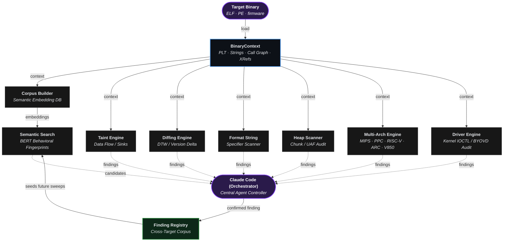
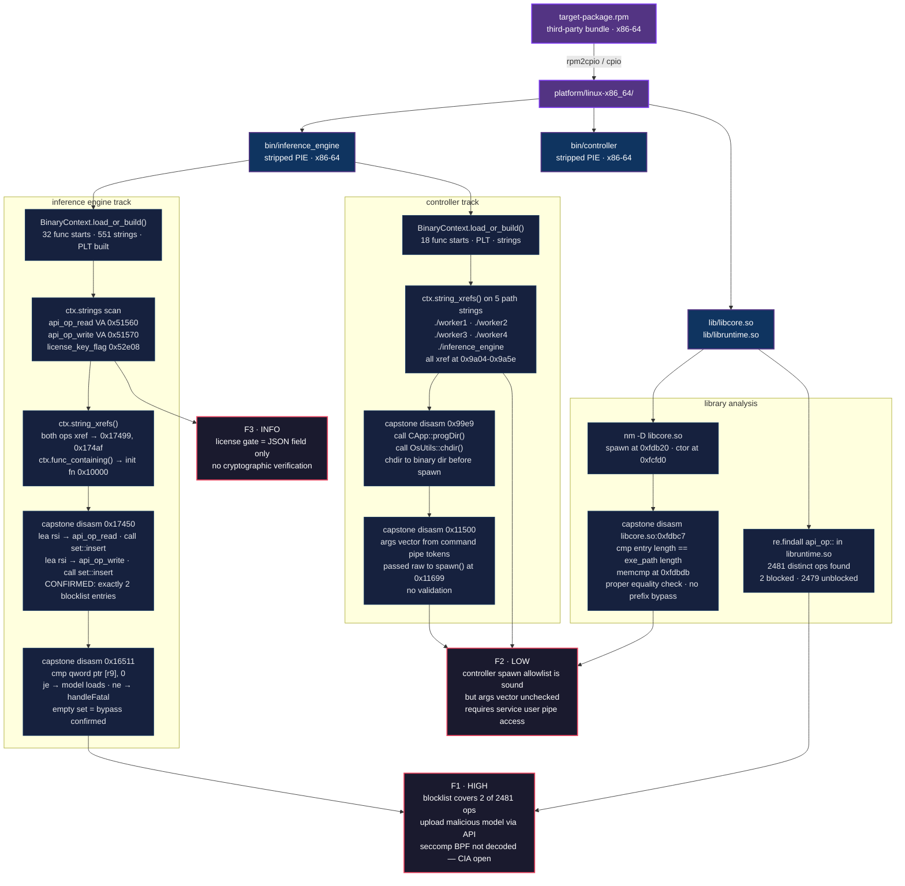

[English](../../../README.md) · [Español](../es/README.md) · [Português](../pt-BR/README.md) · [Français](../fr/README.md) · [Deutsch](../de/README.md) · [中文](../zh/README.md) · [日本語](../ja/README.md) · **Русский** · [العربية](../ar/README.md)

Ablation — это фреймворк для реверс-инжиниринга, предоставляющий те же основные возможности дизассемблирования, декомпиляции и бинарного анализа, что и отраслевые инструменты Ghidra, IDA Pro и Binary Ninja.

В сочетании с Claude Code или OpenAI Codex он становится автономным инструментом для реверс-инжиниринга.

---


## Возможности

**Семантический поиск с BERT:** Семантический поиск находит результаты по смыслу, а не по точным ключевым словам. BERT читает текст и понимает его смысл. Похожие значения получают похожие оценки, поэтому можно искать по концепции, а не по точным словам. Их сочетание ускоряет главное узкое место в реверс-инжиниринге и находит уязвимые функции.

**Экстремальная производительность:** Бинарный файл размером 50 МБ загружается за 35 секунд. Ghidra и IDA Pro могут занимать часы, потому что они разбирают весь файл в базу данных, прежде чем позволить что-либо сделать. Ablation анализирует только те функции, с которыми вы активно работаете, поэтому начало работы не требует ожидания.

**Сравнение версий:** Используя метод Жаккара для измерения совпадения поведения функций между версиями и Dynamic Time Warping для отслеживания «формы» выполнения функций в разных версиях прошивки, Ablation подтверждает, изменил ли патч реальную логику или только упаковку, потому что косметическая перекомпиляция не может скрыть неисправленную уязвимость.

**Межбинарный анализ:** Анализирует каждую общую библиотеку в образе прошивки одновременно, отслеживая потоки данных через границы бинарных файлов.

**Аудит исходного кода:** Аудит любой большой кодовой базы выполняется быстрее, чем линейное чтение, с большей точностью, чем сопоставление шаблонов в одиночку. Каждый исходный файл получает 5-битный профиль безопасности, который точно определяет, сколько внимания он требует, поэтому ничего не пропускается и ничего не читается дважды.

**Анализ драйверов ядра Windows и BYOVD:** Составляет карту таблицы диспетчеризации IRP, декодирует каждый код IOCTL и определяет, какие API ядра открывают примитивы физической памяти и токенов из пользовательского режима. Детектор BYOVD снимает отпечатки подписанных драйверов с этими возможностями, потому что одного законного подписанного драйвера достаточно, чтобы ослепить EDR с ring-0.

**Анализ Android и APK:** Читает APK-файлы Android на бинарном уровне без зависимостей. Составляет карту точек входа нативного кода и поверхности IPC из скомпилированного байткода, поэтому вся поверхность видна без декомпиляции.

**Анализ Erlang и BEAM:** Erlang компилируется в файлы .beam, и тот же подход к картированию поверхности, используемый для ELF, применяется напрямую, поэтому поиск атомов, аудит импорта и обнаружение обфускации не требуют особой обработки. Сканирование директории релиза занимает секунды.

**Расшифровка**
- **Entropy Mapper:** Находит зашифрованные, сжатые или упакованные секции в бинарном файле.
- **Crypto Audit:** Сканирует на наличие криптографии.
- **XorSolver:** Восстанавливает, затем расшифровывает целевую секцию, что позволяет продолжить реверс-инжиниринг.
- **BmpKeyExtractor:** Восстанавливает секретные ключи, скрытые в стеганографии пикселей BMP, используя полиномиальную интерполяцию Лагранжа, потому что прошивки и APK иногда хранят части ключей в графических ресурсах вместо секций данных.

---

## Реальные результаты

Ablation использовался для анализа производственной прошивки и драйверов ядра от Fortinet, Cisco, Juniper, Axis, Fujitsu, MikroTik, Orka, TencentOS, Enigma2, Skydio и Dahua Security System.

После скоординированного раскрытия информации о Cisco FMC и ISE команда Cisco Product Security Incident Response Team (PSIRT) приняла Ablation для внутренней сортировки уязвимостей. Cisco PSIRT активно использует его для сортировки текущих отчётов в Firepower Threat Defense (FTD), Cisco Secure Client (AnyConnect), HyperFlex и Catalyst. Реверс-инжиниринг Cisco Adaptive Security Appliance (ASA) LINA также был выполнен с помощью Ablation, а результаты в настоящее время находятся на координированной проверке через CERT/CC VINCE.

| CVE | Продукт | Название | CVSS | Уведомление |
|---|---|---|---|---|
| CVE-2026-76420 | Secure Firewall Management Center (FMC) | Peer Impersonation | 9.0 Critical | [cisco-sa-fmc2-multivulns-HXgcqRG](https://sec.cloudapps.cisco.com/security/center/content/CiscoSecurityAdvisory/cisco-sa-fmc2-multivulns-HXgcqRG) |
| CVE-2026-76412 | Secure Firewall Management Center (FMC) | Privilege Escalation to root | 8.5 High | [cisco-sa-fmc2-multivulns-HXgcqRG](https://sec.cloudapps.cisco.com/security/center/content/CiscoSecurityAdvisory/cisco-sa-fmc2-multivulns-HXgcqRG) |
| CVE-2026-76413 | Secure Firewall Management Center (FMC) | Single Sign-On Token Forgery | 8.5 High | [cisco-sa-fmc2-multivulns-HXgcqRG](https://sec.cloudapps.cisco.com/security/center/content/CiscoSecurityAdvisory/cisco-sa-fmc2-multivulns-HXgcqRG) |
| CVE-2026-76447 | Identity Services Engine (ISE) | OCSP Responder Authentication Bypass | 5.3 Medium | [cisco-sa-ise-multiauth-bypass-sgD2HbL4](https://sec.cloudapps.cisco.com/security/center/content/CiscoSecurityAdvisory/cisco-sa-ise-multiauth-bypass-sgD2HbL4) |

---

## Локальные декомпиляторы

| Архитектура | Варианты |
|---|---|
| x86 | x86-32 · x86-64 |
| ARM | ARM-32 · ARM-64 |
| MIPS | MIPS-32 · nanoMIPS · MIPS-64 |
| PowerPC | PPC-32 · PPC-64 |
| RISC-V | RISC-V 32 · RISC-V 64 |
| Встраиваемые | ARC EM/HS · V850-32 |

---

## Совместимость с LLM

| Провайдер | Модели |
|---|---|
| **Claude Code** | /model claude-sonnet-4-6 |
| **OpenAI Codex** | Все известные модели |

---

## Установка

```bash
pip install git+https://github.com/Ablation-Tool/ablation
```

---

## Требования

- Python >= 3.10
- `capstone`, `numpy`, `lief`, `sentence-transformers`, `pyelftools`
- Опционально: `anthropic` для функций LLM

---

## Ответственное использование

Ablation создан для авторизованных исследований безопасности. Используйте его только против систем, которыми вы владеете, или на которые у вас есть явное письменное разрешение на тестирование. Запуск против систем без авторизации нарушает законы о компьютерном мошенничестве в большинстве юрисдикций. Авторы не несут ответственности за неправомерное использование.

---

## Благодарности

Проект был в значительной мере вдохновлён и сформирован несколькими ключевыми литературными произведениями.

**Исследовательские статьи**

| Название | Авторы | Ссылка |
|---|---|---|
| [Finding Taint-Style Vulnerabilities in Linux-based Embedded Firmware with SSE-based Alias Analysis](https://arxiv.org/abs/2109.12209) | Cheng, Zheng, Liu, Guan, Liu, Li, Zhu, Ye, Sun | [sse_slicer.py](https://github.com/Ablation-Tool/ablation/blob/main/ablation/analyzers/sse_slicer.py) · [arm64_global_tracker.py](https://github.com/Ablation-Tool/ablation/blob/main/ablation/analyzers/arm64_global_tracker.py) |
| [iResolveX: Multi-Layered Indirect Call Resolution via Static Reasoning and Learning-Augmented Refinement](https://arxiv.org/abs/2601.17888) | Monika Santra, Bokai Zhang, Mark Lim, [Vishnu Asutosh Dasu](https://github.com/vdasu), Dongrui Zeng, [Gang Tan](https://github.com/gangtan) | [vtable_resolver.py](https://github.com/Ablation-Tool/ablation/blob/main/ablation/analyzers/vtable_resolver.py) · [interproc_field_writer.py](https://github.com/Ablation-Tool/ablation/blob/main/ablation/analyzers/interproc_field_writer.py) · [arm64_global_tracker.py](https://github.com/Ablation-Tool/ablation/blob/main/ablation/analyzers/arm64_global_tracker.py) |
| [Extracting Protocol Format as State Machine via Controlled Static Loop Analysis](https://arxiv.org/abs/2305.13483) | [Qingkai Shi](https://github.com/qingkaishi), Xiangzhe Xu, Xiangyu Zhang | [proto_fsm.py](https://github.com/Ablation-Tool/ablation/blob/main/ablation/analyzers/proto_fsm.py) |
| [NEMETYL: Message Type Identification of Binary Network Protocols using Continuous Segment Similarity](https://arxiv.org/abs/2002.03391) | [Stephan Kleber](https://github.com/vs-uulm), Rens Wouter van der Heijden, [Frank Kargl](https://github.com/fkargl) | [proto_fsm.py](https://github.com/Ablation-Tool/ablation/blob/main/ablation/analyzers/proto_fsm.py) |
| [Imperfect Forward Secrecy: How Diffie-Hellman Fails in Practice](https://dl.acm.org/doi/10.1145/2810103.2813707) | [David Adrian](https://github.com/dadrian), Karthikeyan Bhargavan, [Zakir Durumeric](https://github.com/zakird), Pierrick Gaudry, Matthew Green, [J. Alex Halderman](https://github.com/jhalderm), [Nadia Heninger](https://github.com/factorable), Drew Springall, Emmanuel Thomé, [Luke Valenta](https://github.com/lukevalenta) | [tls_analyzer.py](https://github.com/Ablation-Tool/ablation/blob/main/ablation/core/tls_analyzer.py) |
| [Nonce-Disrespecting Adversaries: Practical Forgery Attacks on GCM in TLS](https://www.usenix.org/conference/woot16/workshop-program/presentation/bock) | [Hanno Böck](https://github.com/hannob), [Aaron Zauner](https://github.com/azet), Sean Devlin, [Juraj Somorovsky](https://github.com/jurajsomorovsky), [Philipp Jovanovic](https://github.com/Daeinar) | [tls_analyzer.py](https://github.com/Ablation-Tool/ablation/blob/main/ablation/core/tls_analyzer.py) |
| [Whitening Sentence Representations for Better Semantics and Faster Retrieval](https://arxiv.org/abs/2103.15316) | [Jianlin Su](https://github.com/bojone), [Jiarun Cao](https://github.com/jiaruncao), Weijie Liu, Yangyiwen Ou | [semantic_search.py](https://github.com/Ablation-Tool/ablation/blob/main/ablation/analyzers/semantic_search.py) |
| [Constant Propagation with Conditional Branches](https://dl.acm.org/doi/abs/10.1145/103135.103136) | Mark N. Wegman, F. Kenneth Zadeck | [dataflow_engine.py](https://github.com/Ablation-Tool/ablation/blob/main/ablation/analyzers/dataflow_engine.py) |
| [A Simple, Fast Dominance Algorithm](https://www.cs.princeton.edu/techreports/2005/737.pdf) | Cooper, Harvey, Kennedy | [dataflow_engine.py](https://github.com/Ablation-Tool/ablation/blob/main/ablation/analyzers/dataflow_engine.py) |
| [libdft: Practical Dynamic Data Flow Tracking for Commodity Systems](https://dl.acm.org/doi/10.1145/2151024.2151042) | [Vasileios P. Kemerlis](https://github.com/vkemerlis), [Georgios Portokalidis](https://github.com/portokalidis), [Kangkook Jee](https://github.com/jikk), Angelos D. Keromytis | [taint_tracker_x86.py](https://github.com/Ablation-Tool/ablation/blob/main/ablation/analyzers/taint_tracker_x86.py) · [taint_tracker_arm32.py](https://github.com/Ablation-Tool/ablation/blob/main/ablation/analyzers/taint_tracker_arm32.py) |

**Книги** предоставлены [www.oreilly.com](https://www.oreilly.com) | [github.com/oreillymedia](https://github.com/oreillymedia)

| Название | Авторы | Ссылка |
|---|---|---|
| The Art of Software Security Assessment | [Mark Dowd](https://github.com/mdowd79), John McDonald, [Justin Schuh](https://github.com/jschuh) | [heap_vuln_scanner.py](https://github.com/Ablation-Tool/ablation/blob/main/ablation/analyzers/heap_vuln_scanner.py) · [format_string_scanner.py](https://github.com/Ablation-Tool/ablation/blob/main/ablation/analyzers/format_string_scanner.py) · [ioctl_attack_surface.py](https://github.com/Ablation-Tool/ablation/blob/main/ablation/analyzers/ioctl_attack_surface.py) |
| Practical Binary Analysis | [Dennis Andriesse](https://github.com/dennisaa) | [taint_tracker_x86.py](https://github.com/Ablation-Tool/ablation/blob/main/ablation/analyzers/taint_tracker_x86.py) · [disasm_engine.py](https://github.com/Ablation-Tool/ablation/blob/main/ablation/core/disasm_engine.py) |
| Practical Malware Analysis | Michael Sikorski, Andrew Honig | [pe_parser.py](https://github.com/Ablation-Tool/ablation/blob/main/ablation/core/pe_parser.py) · [shellcode_utils.py](https://github.com/Ablation-Tool/ablation/blob/main/ablation/core/shellcode_utils.py) |
| Practical Reverse Engineering | Bruce Dang, Alexandre Gazet, [Elias Bachaalany](https://github.com/0xeb) | [pe_analyzer.py](https://github.com/Ablation-Tool/ablation/blob/main/ablation/core/pe_analyzer.py) · [kernel_driver_analyzer.py](https://github.com/Ablation-Tool/ablation/blob/main/ablation/analyzers/kernel_driver_analyzer.py) |
| Hacking: The Art of Exploitation (2e) | Jon Erickson | [platform_detect.py](https://github.com/Ablation-Tool/ablation/blob/main/ablation/core/platform_detect.py) |
| Learning Linux Binary Analysis | [Ryan O'Neill](https://github.com/elfmaster) | [elf_parser.py](https://github.com/Ablation-Tool/ablation/blob/main/ablation/core/elf_parser.py) · [binary_parser.py](https://github.com/Ablation-Tool/ablation/blob/main/ablation/core/binary_parser.py) |
| Windows Internals Part 1 & 2 | [Pavel Yosifovich](https://github.com/zodiacon), [Mark Russinovich](https://github.com/markrussinovich), David Solomon, [Alex Ionescu](https://github.com/ionescu007), [Andrea Allievi](https://github.com/AaLl86) | [kernel_driver_analyzer.py](https://github.com/Ablation-Tool/ablation/blob/main/ablation/analyzers/kernel_driver_analyzer.py) · [ioctl_attack_surface.py](https://github.com/Ablation-Tool/ablation/blob/main/ablation/analyzers/ioctl_attack_surface.py) |
| Rootkits: Subverting the Windows Kernel | Greg Hoglund, Jamie Butler | [kernel_driver_analyzer.py](https://github.com/Ablation-Tool/ablation/blob/main/ablation/analyzers/kernel_driver_analyzer.py) · [yara_generator.py](https://github.com/Ablation-Tool/ablation/blob/main/ablation/core/yara_generator.py) |
| Advanced Compiler Design and Implementation | Steven Muchnick | [dataflow_engine.py](https://github.com/Ablation-Tool/ablation/blob/main/ablation/analyzers/dataflow_engine.py) |
| Engineering a Compiler | Keith Cooper, Linda Torczon | [disasm_engine.py](https://github.com/Ablation-Tool/ablation/blob/main/ablation/core/disasm_engine.py) |
| Practical IoT Hacking | [Fotios Chantzis](https://github.com/ithilgore), Ioannis Stais, Paulino Calderon, Evangelos Deirmentzoglou, Beau Woods | [firmware_analyzer.py](https://github.com/Ablation-Tool/ablation/blob/main/ablation/core/firmware_analyzer.py) |
| Inside the Android OS: Building, Customizing, Managing and Operating Android System Services | [G. Blake Meike](https://github.com/bmeike) | [apk_parser.py](https://github.com/Ablation-Tool/ablation/blob/main/ablation/core/apk_parser.py) · [jni_bridge_scanner.py](https://github.com/Ablation-Tool/ablation/blob/main/ablation/analyzers/jni_bridge_scanner.py) · [binder_scanner.py](https://github.com/Ablation-Tool/ablation/blob/main/ablation/analyzers/binder_scanner.py) |
| Malware Analysis and Detection Engineering | [Abhijit Mohanta](https://github.com/amohanta), Anoop Saldanha | [yara_generator.py](https://github.com/Ablation-Tool/ablation/blob/main/ablation/core/yara_generator.py) |
| Evasive Malware | [Kyle Cucci](https://github.com/d4rksystem) | [process_enum.py](https://github.com/Ablation-Tool/ablation/blob/main/modules/process_enum.py) |
| Hacking Cryptography | [Kamran Khan](https://github.com/krkhan), [Bill Cox](https://github.com/waywardgeek) | [tls_enum.py](https://github.com/Ablation-Tool/ablation/blob/main/modules/tls_enum.py) |
| Real-World Cryptography | David Wong | [tls_analyzer.py](https://github.com/Ablation-Tool/ablation/blob/main/ablation/core/tls_analyzer.py) |

**Особая благодарность**

[Microsoft Excel (Data Analysis ToolPak)](https://support.microsoft.com/en-us/office/use-the-analysis-toolpak-to-perform-complex-data-analysis-6c67ccf0-f4a9-487c-8dec-bdb5a2cefab6) При анализе закрытой инфраструктуры или обеспечении безопасности систем «чёрного ящика» этот процесс называется временным анализом или реверс-инжинирингом телеметрии. Без исходного кода Data Analysis ToolPak математически разбирает работу приложения, строго наблюдая за его входными и выходными данными.

---

## Архитектура фреймворка и оркестрация модулей



---

## Пример рабочего процесса реверс-инжиниринга

Сквозной анализ stripped-бинарных файлов из RPM-пакета. Извлечение через BinaryContext, строковые xref и дизассемблирование Capstone до подтверждённых результатов.


