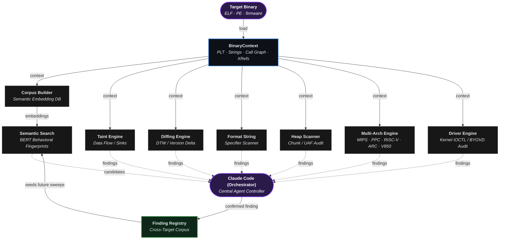
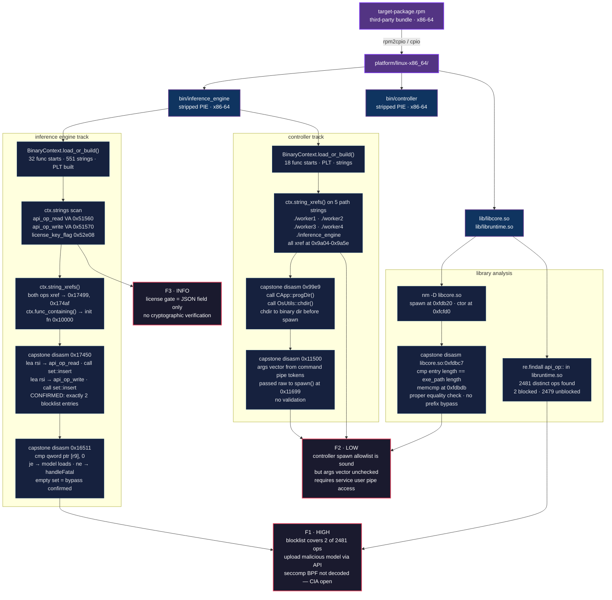

[English](../../../README.md) · [Español](../es/README.md) · [Português](../pt-BR/README.md) · [Français](../fr/README.md) · [Deutsch](../de/README.md) · **中文** · [日本語](../ja/README.md) · [Русский](../ru/README.md) · [العربية](../ar/README.md) · [한국어](../ko/README.md) · [हिन्दी](../hi/README.md) · [Italiano](../it/README.md) · [Türkçe](../tr/README.md) · [Tiếng Việt](../vi/README.md) · [Indonesia](../id/README.md) · [Polski](../pl/README.md) · [Nederlands](../nl/README.md)

Ablation 是一个逆向工程框架，提供与 Ghidra、IDA Pro 和 Binary Ninja 等行业标准工具相同的核心反汇编、反编译和二进制分析能力。

与 Claude Code 或 OpenAI Codex 结合后，它可以成为自主逆向工程工具。

---


## 功能特性

**基于 BERT 的语义搜索：** 语义搜索按含义而非精确关键词查找结果。BERT 读取文本并理解其含义。含义相近的内容得分相近，因此可以按概念而非精确词语进行搜索。两者结合加速了逆向工程的主要瓶颈，同时找到存在漏洞的函数。

**极致性能：** 50 MB 的二进制文件在 35 秒内加载完成。Ghidra 和 IDA Pro 可能需要数小时，因为它们在允许操作前会将整个文件解析到数据库。Ablation 只分析当前正在处理的函数，因此可以立即开始工作。

**版本对比：** 使用 Jaccard 方法衡量函数行为在版本间的重叠程度，使用 Dynamic Time Warping 追踪函数在各固件版本中的执行"形态"，Ablation 确认补丁是否真正改变了逻辑而非仅改变了打包，因为表面重编译无法掩盖未修补的漏洞。

**跨二进制分析：** 同时分析固件镜像中的每个共享库，跨二进制边界追踪数据流。

**源代码审计：** 审计大型代码库的速度比线性阅读快，精确度比单纯的模式匹配高。每个源文件获得一个 5 位安全配置文件，精确确定其需要的关注程度，因此不会遗漏任何内容，也不会重复阅读。

**Windows 内核驱动与 BYOVD 分析：** 映射 IRP 调度表，解码每个 IOCTL 代码，识别哪些内核 API 从用户模式暴露物理内存和令牌原语。BYOVD 检测器对携带这些能力的签名驱动进行指纹识别，因为一个合法签名的驱动就足以从 ring-0 致盲 EDR。

**Android / APK 分析：** 在无任何依赖的情况下在二进制层面读取 Android APK。从编译后的字节码映射本机代码入口点和 IPC 表面，因此无需反编译即可看到完整表面。

**Erlang / BEAM 分析：** Erlang 编译为 .beam 文件，用于 ELF 的表面映射方法直接适用，因此原子搜索、导入审计和混淆检测无需特殊处理。扫描一个发布目录只需数秒。

**解密**
- **Entropy Mapper：** 在二进制文件中查找加密、压缩或打包的节区。
- **Crypto Audit：** 扫描密码学内容。
- **XorSolver：** 恢复并解密目标节区，从而允许进一步的逆向工程。
- **BmpKeyExtractor：** 使用 Lagrange 多项式插值重建隐藏在 BMP 像素隐写术中的密钥，因为固件和 APK 有时将密钥片段存储在图像资产而非数据节区中。
- **ELFVtableReconstructor：** 从 x86-64 ET_DYN ELF 二进制文件的 .rela.dyn 重建 C++ 虚表槽到函数的映射，无需执行二进制文件，因此仅凭静态分析即可看清所有虚方法调度路径。
- **VtableDispatchScanner：** 扫描可执行节区中的 `call [reg+disp]` 模式，以确定哪些虚函数槽实际被调度（活跃）与从未调用（死代码）。

---

## 真实案例

Ablation 已用于分析来自 Fortinet、Cisco、Juniper、Axis、Fujitsu、MikroTik、Orka、TencentOS、Enigma2、Skydio 和大华安全系统的生产固件和内核驱动程序。

在对 Cisco FMC 和 ISE 进行协调披露后，Cisco 产品安全事件响应团队（PSIRT）已采用 Ablation 进行内部漏洞分类。Cisco PSIRT 正在积极使用它对 Firepower Threat Defense（FTD）、Cisco Secure Client（AnyConnect）、HyperFlex 和 Catalyst 的持续披露报告进行分类。Cisco Adaptive Security Appliance（ASA）LINA 也已使用 Ablation 进行逆向工程，相关发现目前正通过 CERT/CC VINCE 进行协调分类。

| CVE | 产品 | 标题 | CVSS | 公告 |
|---|---|---|---|---|
| CVE-2026-76420 | Secure Firewall Management Center (FMC) | Peer Impersonation | 9.0 Critical | [cisco-sa-fmc2-multivulns-HXgcqRG](https://sec.cloudapps.cisco.com/security/center/content/CiscoSecurityAdvisory/cisco-sa-fmc2-multivulns-HXgcqRG) |
| CVE-2026-76412 | Secure Firewall Management Center (FMC) | Privilege Escalation to root | 8.5 High | [cisco-sa-fmc2-multivulns-HXgcqRG](https://sec.cloudapps.cisco.com/security/center/content/CiscoSecurityAdvisory/cisco-sa-fmc2-multivulns-HXgcqRG) |
| CVE-2026-76413 | Secure Firewall Management Center (FMC) | Single Sign-On Token Forgery | 8.5 High | [cisco-sa-fmc2-multivulns-HXgcqRG](https://sec.cloudapps.cisco.com/security/center/content/CiscoSecurityAdvisory/cisco-sa-fmc2-multivulns-HXgcqRG) |
| CVE-2026-76447 | Identity Services Engine (ISE) | OCSP Responder Authentication Bypass | 5.3 Medium | [cisco-sa-ise-multiauth-bypass-sgD2HbL4](https://sec.cloudapps.cisco.com/security/center/content/CiscoSecurityAdvisory/cisco-sa-ise-multiauth-bypass-sgD2HbL4) |

---

## 13 个本地反编译器

| 架构 | 变体 |
|---|---|
| x86 | x86-32 · x86-64 |
| ARM | ARM-32 · ARM-64 |
| MIPS | MIPS-32 · nanoMIPS · MIPS-64 |
| PowerPC | PPC-32 · PPC-64 |
| RISC-V | RISC-V 32 · RISC-V 64 |
| 嵌入式 | ARC EM/HS · V850-32 |

---

## LLM 兼容性

| 提供商 | 模型 |
|---|---|
| **Claude Code** | /model claude-sonnet-4-6 |
| **OpenAI Codex** | 所有已知模型 |

---

## 安装

```bash
pip install git+https://github.com/Ablation-Tool/ablation
```

---

## 系统要求

- Python >= 3.10
- `capstone`, `numpy`, `lief`, `sentence-transformers`, `pyelftools`
- 可选：`anthropic`（用于 LLM 功能）

---

## 负责任使用

Ablation 专为授权安全研究而构建。仅对您拥有或获得明确书面授权进行测试的系统使用。未经授权对系统运行它在大多数司法管辖区违反计算机欺诈法。作者对滥用行为不承担责任。

---

## 致谢

本项目受到多部关键文献的深刻影响和启发。

**研究论文**

| 标题 | 作者 | 引用 |
|---|---|---|
| [Finding Taint-Style Vulnerabilities in Linux-based Embedded Firmware with SSE-based Alias Analysis](https://arxiv.org/abs/2109.12209) | Cheng, Zheng, Liu, Guan, Liu, Li, Zhu, Ye, Sun | [sse_slicer.py](https://github.com/Ablation-Tool/ablation/blob/main/ablation/analyzers/sse_slicer.py) · [arm64_global_tracker.py](https://github.com/Ablation-Tool/ablation/blob/main/ablation/analyzers/arm64_global_tracker.py) |
| [iResolveX: Multi-Layered Indirect Call Resolution via Static Reasoning and Learning-Augmented Refinement](https://arxiv.org/abs/2601.17888) | Monika Santra, Bokai Zhang, Mark Lim, [Vishnu Asutosh Dasu](https://github.com/vdasu), Dongrui Zeng, [Gang Tan](https://github.com/gangtan) | [vtable_resolver.py](https://github.com/Ablation-Tool/ablation/blob/main/ablation/analyzers/vtable_resolver.py) · [interproc_field_writer.py](https://github.com/Ablation-Tool/ablation/blob/main/ablation/analyzers/interproc_field_writer.py) · [arm64_global_tracker.py](https://github.com/Ablation-Tool/ablation/blob/main/ablation/analyzers/arm64_global_tracker.py) |
| [Extracting Protocol Format as State Machine via Controlled Static Loop Analysis](https://arxiv.org/abs/2305.13483) | [Qingkai Shi](https://github.com/qingkaishi), Xiangzhe Xu, Xiangyu Zhang | [proto_fsm.py](https://github.com/Ablation-Tool/ablation/blob/main/ablation/analyzers/proto_fsm.py) |
| [NEMETYL: Message Type Identification of Binary Network Protocols using Continuous Segment Similarity](https://arxiv.org/abs/2002.03391) | [Stephan Kleber](https://github.com/vs-uulm), Rens Wouter van der Heijden, [Frank Kargl](https://github.com/fkargl) | [proto_fsm.py](https://github.com/Ablation-Tool/ablation/blob/main/ablation/analyzers/proto_fsm.py) |
| [Imperfect Forward Secrecy: How Diffie-Hellman Fails in Practice](https://dl.acm.org/doi/10.1145/2810103.2813707) | [David Adrian](https://github.com/dadrian), Karthikeyan Bhargavan, [Zakir Durumeric](https://github.com/zakird), Pierrick Gaudry, Matthew Green, [J. Alex Halderman](https://github.com/jhalderm), [Nadia Heninger](https://github.com/factorable), Drew Springall, Emmanuel Thomé, [Luke Valenta](https://github.com/lukevalenta) | [tls_analyzer.py](https://github.com/Ablation-Tool/ablation/blob/main/ablation/core/tls_analyzer.py) |
| [Nonce-Disrespecting Adversaries: Practical Forgery Attacks on GCM in TLS](https://www.usenix.org/conference/woot16/workshop-program/presentation/bock) | [Hanno Böck](https://github.com/hannob), [Aaron Zauner](https://github.com/azet), Sean Devlin, [Juraj Somorovsky](https://github.com/jurajsomorovsky), [Philipp Jovanovic](https://github.com/Daeinar) | [tls_analyzer.py](https://github.com/Ablation-Tool/ablation/blob/main/ablation/core/tls_analyzer.py) |
| [Whitening Sentence Representations for Better Semantics and Faster Retrieval](https://arxiv.org/abs/2103.15316) | [Jianlin Su](https://github.com/bojone), [Jiarun Cao](https://github.com/jiaruncao), Weijie Liu, Yangyiwen Ou | [semantic_search.py](https://github.com/Ablation-Tool/ablation/blob/main/ablation/analyzers/semantic_search.py) |
| [Constant Propagation with Conditional Branches](https://dl.acm.org/doi/abs/10.1145/103135.103136) | Mark N. Wegman, F. Kenneth Zadeck | [dataflow_engine.py](https://github.com/Ablation-Tool/ablation/blob/main/ablation/analyzers/dataflow_engine.py) |
| [A Simple, Fast Dominance Algorithm](https://www.cs.princeton.edu/techreports/2005/737.pdf) | Cooper, Harvey, Kennedy | [dataflow_engine.py](https://github.com/Ablation-Tool/ablation/blob/main/ablation/analyzers/dataflow_engine.py) |
| [libdft: Practical Dynamic Data Flow Tracking for Commodity Systems](https://dl.acm.org/doi/10.1145/2151024.2151042) | [Vasileios P. Kemerlis](https://github.com/vkemerlis), [Georgios Portokalidis](https://github.com/portokalidis), [Kangkook Jee](https://github.com/jikk), Angelos D. Keromytis | [taint_tracker_x86.py](https://github.com/Ablation-Tool/ablation/blob/main/ablation/analyzers/taint_tracker_x86.py) · [taint_tracker_arm32.py](https://github.com/Ablation-Tool/ablation/blob/main/ablation/analyzers/taint_tracker_arm32.py) |

**书籍** 由 [www.oreilly.com](https://www.oreilly.com) | [github.com/oreillymedia](https://github.com/oreillymedia) 提供

| 标题 | 作者 | 引用 |
|---|---|---|
| The Art of Software Security Assessment | [Mark Dowd](https://github.com/mdowd79), John McDonald, [Justin Schuh](https://github.com/jschuh) | [heap_vuln_scanner.py](https://github.com/Ablation-Tool/ablation/blob/main/ablation/analyzers/heap_vuln_scanner.py) · [format_string_scanner.py](https://github.com/Ablation-Tool/ablation/blob/main/ablation/analyzers/format_string_scanner.py) · [ioctl_attack_surface.py](https://github.com/Ablation-Tool/ablation/blob/main/ablation/analyzers/ioctl_attack_surface.py) |
| Practical Binary Analysis | [Dennis Andriesse](https://github.com/dennisaa) | [taint_tracker_x86.py](https://github.com/Ablation-Tool/ablation/blob/main/ablation/analyzers/taint_tracker_x86.py) · [disasm_engine.py](https://github.com/Ablation-Tool/ablation/blob/main/ablation/core/disasm_engine.py) |
| Practical Malware Analysis | Michael Sikorski, Andrew Honig | [pe_parser.py](https://github.com/Ablation-Tool/ablation/blob/main/ablation/core/pe_parser.py) · [shellcode_utils.py](https://github.com/Ablation-Tool/ablation/blob/main/ablation/core/shellcode_utils.py) |
| Practical Reverse Engineering | Bruce Dang, Alexandre Gazet, [Elias Bachaalany](https://github.com/0xeb) | [pe_analyzer.py](https://github.com/Ablation-Tool/ablation/blob/main/ablation/core/pe_analyzer.py) · [kernel_driver_analyzer.py](https://github.com/Ablation-Tool/ablation/blob/main/ablation/analyzers/kernel_driver_analyzer.py) |
| Hacking: The Art of Exploitation (2e) | Jon Erickson | [platform_detect.py](https://github.com/Ablation-Tool/ablation/blob/main/ablation/core/platform_detect.py) |
| Learning Linux Binary Analysis | [Ryan O'Neill](https://github.com/elfmaster) | [elf_parser.py](https://github.com/Ablation-Tool/ablation/blob/main/ablation/core/elf_parser.py) · [binary_parser.py](https://github.com/Ablation-Tool/ablation/blob/main/ablation/core/binary_parser.py) |
| Windows Internals Part 1 & 2 | [Pavel Yosifovich](https://github.com/zodiacon), [Mark Russinovich](https://github.com/markrussinovich), David Solomon, [Alex Ionescu](https://github.com/ionescu007), [Andrea Allievi](https://github.com/AaLl86) | [kernel_driver_analyzer.py](https://github.com/Ablation-Tool/ablation/blob/main/ablation/analyzers/kernel_driver_analyzer.py) · [ioctl_attack_surface.py](https://github.com/Ablation-Tool/ablation/blob/main/ablation/analyzers/ioctl_attack_surface.py) |
| Rootkits: Subverting the Windows Kernel | Greg Hoglund, Jamie Butler | [kernel_driver_analyzer.py](https://github.com/Ablation-Tool/ablation/blob/main/ablation/analyzers/kernel_driver_analyzer.py) · [yara_generator.py](https://github.com/Ablation-Tool/ablation/blob/main/ablation/core/yara_generator.py) |
| Advanced Compiler Design and Implementation | Steven Muchnick | [dataflow_engine.py](https://github.com/Ablation-Tool/ablation/blob/main/ablation/analyzers/dataflow_engine.py) |
| Engineering a Compiler | Keith Cooper, Linda Torczon | [disasm_engine.py](https://github.com/Ablation-Tool/ablation/blob/main/ablation/core/disasm_engine.py) |
| Practical IoT Hacking | [Fotios Chantzis](https://github.com/ithilgore), Ioannis Stais, Paulino Calderon, Evangelos Deirmentzoglou, Beau Woods | [firmware_analyzer.py](https://github.com/Ablation-Tool/ablation/blob/main/ablation/core/firmware_analyzer.py) |
| Inside the Android OS: Building, Customizing, Managing and Operating Android System Services | [G. Blake Meike](https://github.com/bmeike) | [apk_parser.py](https://github.com/Ablation-Tool/ablation/blob/main/ablation/core/apk_parser.py) · [jni_bridge_scanner.py](https://github.com/Ablation-Tool/ablation/blob/main/ablation/analyzers/jni_bridge_scanner.py) · [binder_scanner.py](https://github.com/Ablation-Tool/ablation/blob/main/ablation/analyzers/binder_scanner.py) |
| Malware Analysis and Detection Engineering | [Abhijit Mohanta](https://github.com/amohanta), Anoop Saldanha | [yara_generator.py](https://github.com/Ablation-Tool/ablation/blob/main/ablation/core/yara_generator.py) |
| Evasive Malware | [Kyle Cucci](https://github.com/d4rksystem) | [process_enum.py](https://github.com/Ablation-Tool/ablation/blob/main/modules/process_enum.py) |
| Hacking Cryptography | [Kamran Khan](https://github.com/krkhan), [Bill Cox](https://github.com/waywardgeek) | [tls_enum.py](https://github.com/Ablation-Tool/ablation/blob/main/modules/tls_enum.py) |
| Real-World Cryptography | David Wong | [tls_analyzer.py](https://github.com/Ablation-Tool/ablation/blob/main/ablation/core/tls_analyzer.py) |

**特别致谢**

[Microsoft Excel (Data Analysis ToolPak)](https://support.microsoft.com/en-us/office/use-the-analysis-toolpak-to-perform-complex-data-analysis-6c67ccf0-f4a9-487c-8dec-bdb5a2cefab6) 在分析封闭基础设施或保护黑盒系统时，这一过程被称为时序分析或遥测逆向工程。没有源代码时，Data Analysis ToolPak 通过严格观察应用程序的输入和输出，以数学方式解构其后端工作原理。

---

## 框架架构与模块编排



---

## 逆向工程工作流示例

对来自 RPM 包的无符号二进制文件的端到端分析。通过 BinaryContext、字符串交叉引用和 Capstone 反汇编提取，直至确认发现。


