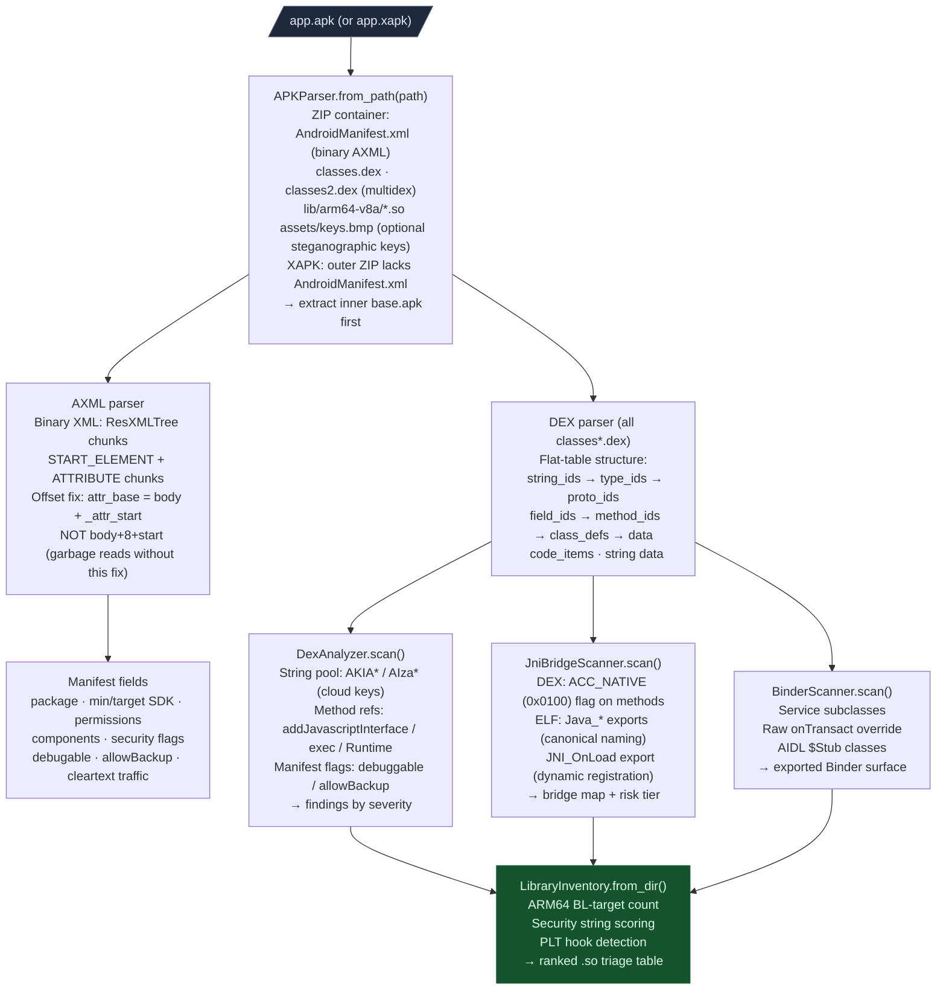

# Android / APK Analysis

Zero-dependency analysis for Android APK files. No androguard, no apktool, no jadx — pure Python stdlib. Works on raw `.apk` files and APKPure `.xapk` containers.

Four analysis layers: **APKParser** (ZIP + AXML + DEX format), **DexAnalyzer** (security scanner over DEX bytecode), **JniBridgeScanner** (JNI bridge RE), **BinderScanner** (exported Binder service surface).

---

## Why this exists

Three things made APK security analysis slow before this stack:

**1. External tool dependencies blocked scripted analysis.**
androguard, apktool, and jadx are GUI-focused tools with installation friction. Running them headlessly in a scan pipeline required subprocess wrappers, output parsing, and version compatibility management. APKParser uses only `zipfile`, `struct`, and `io` from the Python stdlib. It runs anywhere Python runs.

**2. DEX bytecode was opaque without disassembly.**
Finding `addJavascriptInterface` calls or `InMemoryDexClassLoader` usage required full decompilation or searching decompiled Java output. DEXDisasm decodes the DEX flat-table format directly: method references, string pool, field references, and the instruction stream are all addressable by offset from the binary file. No decompilation step is needed to find dangerous API patterns.

**3. JNI bridge reconstruction required manual symbol table reading.**
Knowing which Java methods have native implementations and whether those implementations use canonical naming (`Java_*`) or dynamic registration (`RegisterNatives`) required reading both the DEX access flags and the ELF symbol table. JniBridgeScanner cross-references both automatically and flags the harder-to-analyze dynamic registration case.

---

## Full analysis pipeline



---

## APKParser

**File:** `ablation/core/apk_parser.py`

### Construction

```python
from ablation.core.apk_parser import APKParser

# Context manager (preferred — closes the ZIP automatically)
with APKParser.from_path('/path/to/app.apk') as apk:
    mf = apk.parse_manifest()
    print(mf.package, mf.version_name, mf.version_code)
```

XAPK containers are supported: the parser transparently unpacks the inner `base.apk` when the outer ZIP does not contain `AndroidManifest.xml` directly.

### AXML binary format

Android binary XML is a chunk-based format. The critical offset fix: in `ResXMLTree_attrExt`, the `attributeStart` field is relative to the start of the `ResXMLTree_attrExt` struct (which begins at `body+8`), not relative to the chunk body start. Using `attr_base = body + _attr_start` instead of `attr_base = body + 8 + _attr_start` silently reads garbage attribute data.

```
  AndroidManifest.xml (binary AXML)
  ┌─────────────────────────────────────────────────────────────
  │ RES_XML_TYPE chunk header (0x00080003)
  │   → file size, header size
  ├─────────────────────────────────────────────────────────────
  │ RES_STRING_POOL_TYPE (0x00080001)
  │   → string table: all attribute names and values as UTF-16
  ├─────────────────────────────────────────────────────────────
  │ RES_XML_START_NAMESPACE_TYPE (0x00100100)
  │   → android namespace URI
  ├─────────────────────────────────────────────────────────────
  │ RES_XML_START_ELEMENT_TYPE (0x00100102) per XML tag
  │   ResXMLTree_attrExt:
  │     attributeStart: RELATIVE to this struct's start (+8 from body)
  │     attributeCount: number of attributes
  │   per attribute (attributeStart + i*attributeSize bytes from body+8):
  │     ns_idx, name_idx, raw_value_idx, data_type, data
  └─────────────────────────────────────────────────────────────
```

### Manifest

```python
mf = apk.parse_manifest()
mf.package             # "com.example.app"
mf.version_name        # "1.2.3"
mf.min_sdk             # 24
mf.target_sdk          # 34
mf.permissions         # requested: ["android.permission.CAMERA", ...]
mf.dangerous_permissions()  # filtered to DANGEROUS-level perms only
mf.exported_components()    # only exported=true components
mf.debuggable          # True → not a production build
mf.allow_backup        # True → adb backup allowed (data exfil)
mf.uses_cleartext_traffic   # True → HTTP allowed
```

### DEX iteration

```python
for dex in apk.iter_dex():
    for s in dex.iter_strings():
        if s.startswith('AKIA'):
            print('AWS key:', s)
    for m in dex.iter_method_refs():
        if 'loadLibrary' in m.method_name:
            print('native lib load:', m)
```

### Native libs

```python
libs = apk.native_libs('arm64-v8a')
dest = apk.extract_native_lib('lib/arm64-v8a/libfoo.so', Path('/tmp/out/'))
```

---

## DexAnalyzer

**File:** `ablation/analyzers/dex_analyzer.py`

Security scanner over DEX string pool and method reference table. Runs on the full APK (iterates all `classes*.dex` files).

```python
from ablation.analyzers.dex_analyzer import DexAnalyzer

scanner = DexAnalyzer.from_path('/path/to/app.apk')
findings = scanner.scan()
print(DexAnalyzer.report(findings))
```

### Finding categories

| Severity | Category | What triggers it |
|---|---|---|
| CRITICAL | `manifest/debuggable` | `android:debuggable="true"` |
| CRITICAL | `api/js_interface` | `addJavascriptInterface` call |
| CRITICAL | `api/dynamic_dex_load` | `InMemoryDexClassLoader` |
| CRITICAL | `api/device_wipe` | `wipeData` |
| CRITICAL | `secret/aws_key` | `AKIA`-prefixed string |
| HIGH | `manifest/cleartext` | `usesCleartextTraffic=true` |
| HIGH | `manifest/allow_backup` | `android:allowBackup=true` |
| HIGH | `api/exec` | `Runtime.exec` |
| HIGH | `api/eval_js` | `evaluateJavascript` |
| HIGH | `secret/google_api_key` | `AIza`-prefixed string |
| HIGH | `secret/jwt_bearer` | `eyJ`-prefixed string |
| HIGH | `secret/private_key_pem` | `BEGIN PRIVATE KEY` |
| MEDIUM | `manifest/exported_N` | N exported components |
| LOW | `manifest/permission_N` | dangerous permission count |

---

## JniBridgeScanner

**File:** `ablation/analyzers/jni_bridge_scanner.py`

Reconstructs the Java-native boundary from DEX `class_data_item` access flags and ELF dynsym. Three-way classification: confirmed native in both DEX and ELF, ACC_NATIVE with no ELF symbol (stripped or dynamically registered), and `Java_*` ELF symbols with no ACC_NATIVE flag (helpers or dead code).

### Two JNI registration modes

```
  Mode 1: Canonical naming (easier to RE)
    ART resolves Java_pkg_ClassName_methodName automatically.
    ELF export: Java_com_example_Foo_bar
      → Java class: com.example.Foo, method: bar
    Symbol name directly encodes the Java-native binding.
    ARM64TaintTracker starts from the function VA directly.

  Mode 2: Dynamic registration via JNI_OnLoad (harder to RE)
    Library exports only JNI_OnLoad.
    JNI_OnLoad calls: env->FindClass("com/example/Foo")
                      env->RegisterNatives(klass, methods, count)
    'methods' is an array of JNINativeMethod structs:
      { char* name, char* signature, void* fnPtr }
    Function pointers may be stripped (no name in dynsym).
    ARM64TaintTracker must start from JNI_OnLoad,
    walk the RegisterNatives call's third argument (the array),
    and read the fnPtr values to recover the binding.
```

### Usage

```python
from ablation.analyzers.jni_bridge_scanner import JniBridgeScanner

scanner = JniBridgeScanner.from_path('/path/to/app.apk')
findings = scanner.scan()
print(JniBridgeScanner.report(findings))
```

### Finding categories

| Severity | Category | Meaning |
|---|---|---|
| HIGH | `jni/dynamic_registration` | `JNI_OnLoad`+`RegisterNatives`; function pointers not in symbol table |
| MEDIUM | `jni/canonical_naming` | `Java_*` symbols; naming is recoverable |
| HIGH | `jni/opaque_peer` | Class has `long` field with peer-like name; native holds raw pointer |
| INFO | `jni/load_sites` | Count of `System.loadLibrary` call sites |

---

## BinderScanner

**File:** `ablation/analyzers/binder_scanner.py`

Maps the exported Binder service surface from DEX class definitions and the manifest. Binder is Android's primary IPC mechanism. Exported services are the first-hop attack surface for privilege escalation and authentication bypass.

### Binder IPC dispatch path

```
  Client process calls:
    IBinder binder = context.getSystemService("my_service")
    IMyService iface = IMyService.Stub.asInterface(binder)
    iface.doSomething(arg)

  This generates a Binder transaction:
    code = TRANSACTION_doSomething  (= 1 for first method)
    data = Parcel(arg serialized)
    reply = Parcel()
    binder.transact(code, data, reply, 0)

  Server side receives in onTransact(code, data, reply, flags):
    switch (code):
      case TRANSACTION_doSomething:
        // deserialize from data Parcel
        // process
        // write to reply Parcel

  AIDL-generated $Stub.onTransact handles this dispatch automatically.
  Raw Binder subclasses write it manually — missing auth checks here are CRITICAL.
```

### Usage

```python
from ablation.analyzers.binder_scanner import BinderScanner

scanner = BinderScanner.from_path('/path/to/app.apk')
findings = scanner.scan()
print(BinderScanner.report(findings))
```

### Finding categories

| Severity | Category | Meaning |
|---|---|---|
| HIGH | `binder/exported_service` | Service exported=true; accepts binds from other apps |
| HIGH | `binder/raw_transact` | Class overrides `onTransact`; manual dispatch; missing auth check risk |
| MEDIUM | `binder/aidl_stub` | AIDL-generated `$Stub` class; dispatch by integer transaction code |
| MEDIUM | `binder/service_subclass` | Service subclass; potential Binder server |
| INFO | `binder/messenger` | Messenger IPC usage |

---

## android_sweep.py

**File:** `sweeps/android_sweep.py`

Orchestration script that runs the full APK RE pass in one call: manifest analysis, DexAnalyzer, JniBridgeScanner, BinderScanner, and native lib ELF security properties.

```python
from sweeps.android_sweep import run_sweep

results = run_sweep('/path/to/app.apk')
# results: dict with keys manifest, dex_findings, jni_findings,
#          binder_findings, native_lib_findings
```

Or from the command line:

```bash
python sweeps/android_sweep.py /path/to/app.apk
```

XAPK containers are handled transparently. Pass the `.xapk` file directly.

---

## DEXDisasm

**File:** `ablation/analyzers/dex_disasm.py`

Disassembles DEX bytecode to smali-style text. Covers all 17 DEX instruction formats and annotates every reference with the full descriptor from the DEX flat tables: method signatures, field types, class names, and string literals.

### DEX flat-table structure

DEX does not use a traditional symbol table. All references are encoded as indices into four flat arrays:

```
  DEX file layout:
  ┌──────────────────────────────────────────────────────────
  │ header (112 bytes): magic, checksum, SHA-1, file_size...
  ├──────────────────────────────────────────────────────────
  │ string_ids[N]:   4-byte offsets into string_data section
  │   string_data[i]: ULEB128 length + UTF-16 chars
  ├──────────────────────────────────────────────────────────
  │ type_ids[N]:     4-byte indices into string_ids
  │   type descriptor: "Ljava/lang/String;" or "I" or "[B"
  ├──────────────────────────────────────────────────────────
  │ proto_ids[N]:    (shorty_idx, return_type_idx, params_off)
  │   shorty: "VLjava/lang/String;" encodes return+param types
  ├──────────────────────────────────────────────────────────
  │ field_ids[N]:    (class_idx, type_idx, name_idx)
  ├──────────────────────────────────────────────────────────
  │ method_ids[N]:   (class_idx, proto_idx, name_idx)
  │   every method reference (invoke-*) indexes into this table
  ├──────────────────────────────────────────────────────────
  │ class_defs[N]:   (class_idx, access_flags, superclass_idx,
  │                   interfaces_off, source_file_idx,
  │                   annotations_off, class_data_off,
  │                   static_values_off)
  │   class_data_item: static_fields, instance_fields,
  │                    direct_methods, virtual_methods
  │   encoded_method: (method_idx_diff, access_flags, code_off)
  │     access_flags & 0x0100 == 0x0100 → ACC_NATIVE
  └──────────────────────────────────────────────────────────
```

### Usage

```python
from ablation.core.apk_parser import APKParser
from ablation.analyzers.dex_disasm import DEXDisasm

with APKParser.from_path('/path/to/app.apk') as apk:
    dexes = list(apk.iter_dex())

dd = DEXDisasm(dexes[0])
smali = dd.disasm_method('Lcom/example/Foo;', 'onCreate')
print(smali)
```

Covers all 17 DEX formats: `10x`, `10t`, `11x`, `11n`, `12x`, `20t`, `21c`, `21h`, `21s`, `21t`, `22b`, `22c`, `22s`, `22t`, `22x`, `23x`, `30t`, `31c`, `31i`, `31t`, `32x`, `35c`, `3rc`, `45cc`, `4rcc`, `51l`. Unknown opcodes emit `data-XX` and advance one code unit so decoding continues past data payloads.

---

## DEXLifter

**File:** `ablation/analyzers/dex_lifter.py`

Lifts DEX bytecode to pseudo-Java IR without external dependencies or SSA construction.

```python
from ablation.analyzers.dex_lifter import DEXLifter

lifter = DEXLifter(dexes[0])
pseudo_java = lifter.lift_method('Lcom/thingclips/smart/sdk/ThingNfcPlugin;', 'findDeviceKeys')
print(pseudo_java)
```

### What the lifter translates

| DEX bytecode | Pseudo-Java output |
|---|---|
| `const-string v0, "uid"` | `String v0 = "uid";` |
| `iget-object v0, v1, Lf/Bar;->mField:Ljava/lang/String;` | `String v0 = v1.mField;` |
| `invoke-virtual {v0, v1}, Landroid/widget/TV;->setText(I)V` | `v0.setText(v1);` |
| `invoke-static + move-result-object vA` | `RetType vA = ClassName.method(args);` |
| `if-eqz v0, :L000a` | `if (v0 == null) goto :L000a;` |
| backward `goto :L0000` | `// loop end → :L0000` |

---

## LibraryInventory

**File:** `ablation/analyzers/library_inventory.py`

Batch triage scanner for directories of native ELF `.so` files. Returns a scored summary table for every library in one call.

### ARM64 internal function count

`internal` is the count of BL-call targets inside `.text` that are not in the dynamic export table. This measures implementation depth. A library with `internal=0` is a pure passthrough stub. One with `internal=4553` contains a full protocol engine. Computed via single-pass opcode scan: `(w >> 26) == 0x25` identifies BL instructions; sign-extend the 26-bit immediate; targets in `.text` range but absent from dynsym are internal.

### Security scoring

| Signal | Points |
|---|---|
| Credential-field format string (`sk=%s`, `password=%s`, `token=%s`) | +3 |
| Credential-field name or exec pattern (`system(`, `/bin/sh`) | +2 |
| Crypto primitive string (`AES`, `HMAC`, `SHA256`, `DTLS`) | +1 |
| JNI count >= 50 | +2 |
| JNI count >= 10 | +1 |
| Internal function count >= 1000 | +2 |
| `SSL_CTX_set_keylog_callback` in symbols | +3 |
| `bytehook_hook_all` or `bytehook_hook_single` in PLT | +2 |

```python
from ablation.analyzers.library_inventory import LibraryInventory

inv = LibraryInventory.from_dir('/tmp/target/lib/arm64-v8a/')
entries = inv.scan()
print(LibraryInventory.report(entries))

for e in LibraryInventory.security_entries(entries, min_score=3):
    print(LibraryInventory.report_strings(e))
```
