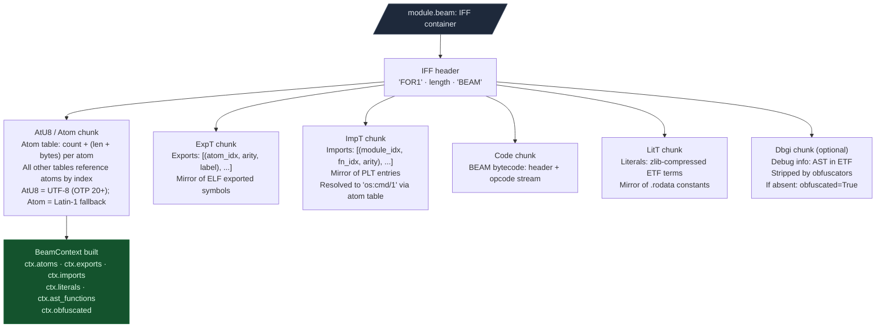

# Erlang / BEAM Analysis

**File:** `ablation/analyzers/beam_context.py`

`BeamContext` extracts the full attack surface from a compiled Erlang `.beam` file. The model mirrors ELF binary RE: exports approximate ELF exported symbols, imports approximate PLT entries, atoms approximate the string table, literals approximate `.rodata`. Once the surface is mapped, dangerous import patterns and atom signals drive the same triage flow as binary RE.

---

## Why this exists

Two things blocked BEAM security analysis before this module:

**1. No Erlang-native equivalent of PLT scanning.**
In ELF binaries, the PLT is the authoritative list of external function calls. Finding `system` or `popen` in a C binary means scanning the import table. In BEAM, the equivalent is the ImpT (Import Table) chunk, but it encodes calls as `{Module, Function, Arity}` tuples in Erlang's External Term Format (ETF), not as symbol table entries. No tool exposed this as a queryable Python API. `BeamContext.imports` provides `dangerous_imports(min_severity=...)` with the same interface as a PLT scan.

**2. Obfuscation detection required manual chunk inspection.**
Erlang obfuscators strip or corrupt the `Dbgi` debug chunk and the `AtU8` atom table. Without these chunks, a BEAM file has no readable function names or source locations. `BeamContext.obfuscated` and `ctx.obfuscation_indicators` expose this as a flag rather than requiring the analyst to read the IFF chunk headers manually.

---

## How BEAM files are structured

A BEAM file is an IFF (Interchange File Format) container. IFF was designed for structured binary data exchange. The BEAM format uses it to pack all module information into one file with self-describing chunk types.

```
  IFF header (12 bytes):
    "FOR1"   4 bytes — IFF form marker
    length   4 bytes BE — total file size minus 8
    "BEAM"   4 bytes — form type identifier

  Each chunk that follows:
    chunk_id  4 bytes ASCII tag (e.g. "AtU8", "Code")
    length    4 bytes BE — payload size
    payload   length bytes, padded to 4-byte alignment
```



The atom table is the foundation of all other tables. Exports, imports, and literals all reference atoms by index. `AtU8` is the UTF-8 atom table (OTP 20+). `Atom` is the Latin-1 predecessor. `BeamContext` tries `AtU8` first and falls back to `Atom`.

The ImpT entries encode calls as three atom indices: `(module_atom_idx, function_atom_idx, arity)`. `BeamContext` resolves these to readable `"os:cmd/1"` strings using the atom table.

---

## BeamContext

### Build and load

```python
from ablation.analyzers.beam_context import BeamContext

ctx = BeamContext.from_path('/path/to/module.beam')
print(ctx.summary())
# Module: my_module
# Exports: 12  Imports: 34  Atoms: 187  Literals: 5
# Debug info: yes (42 functions)
```

### What gets extracted

| Chunk | Field | Analog in ELF |
|---|---|---|
| ExpT | `exports` | ELF exported symbols |
| ImpT | `imports` | PLT entries |
| AtU8 / Atom | `atoms` | String table |
| LitT | `literals` | `.rodata` constants (ETF-decoded) |
| StrT | `strings` | Raw string table segments |
| Dbgi | `ast_functions` | DWARF debug info: source file, function names, line numbers |

### Atom and string search

```python
for atom in ctx.atoms:
    if any(kw in atom for kw in ('password', 'secret', 'token', 'key', 'admin')):
        print(f"[atom] {atom}")

for s in ctx.strings:
    if 'sql' in s.lower() or 'exec' in s.lower():
        print(f"[str]  {s}")
```

### Dangerous import detection

```python
from ablation.analyzers.beam_context import BeamContext, SEVERITY_CODE_EVAL

ctx = BeamContext.from_path('/path/to/module.beam')
dangerous = ctx.dangerous_imports(min_severity=SEVERITY_CODE_EVAL)
for imp in dangerous:
    print(f"[{imp.severity}] {imp.module}:{imp.function}/{imp.arity}")
```

### Severity tiers

| Constant | Meaning |
|---|---|
| `SEVERITY_DISPATCH` | Dynamic dispatch (`erlang:apply`); very common in OTP |
| `SEVERITY_NETWORK` | Outbound connections (`ssl:connect`, `gen_tcp:connect`, `httpc:request`) |
| `SEVERITY_INFO` | Local system enumeration (`inet:getifaddrs`) |
| `SEVERITY_CODE_EVAL` | Runtime code loading or ETF AST evaluation (`erl_eval:exprs`, `code:load_binary`) |
| `SEVERITY_CODE_EXEC` | OS-level process execution or port driver spawn (`os:cmd`, `erlang:open_port`) |

### High-risk import signatures

| Module | Function | Severity | What it does |
|---|---|---|---|
| `os` | `cmd` | CODE_EXEC | Execute OS shell command |
| `erlang` | `open_port` | CODE_EXEC | Spawn OS subprocess or port driver |
| `erl_eval` | `exprs` | CODE_EVAL | Evaluate Erlang AST at runtime |
| `code` | `load_binary` | CODE_EVAL | Hot-load module from binary blob |
| `ssl` | `connect` | NETWORK | Outbound TLS connection |
| `gen_tcp` | `connect` | NETWORK | Outbound TCP connection |
| `erlang` | `apply` | DISPATCH | Dynamic dispatch (high volume) |

### Why `erlang:open_port` is dangerous

`erlang:open_port({spawn, "ls -la"}, [])` executes an OS command in a subprocess and returns its output. It is Erlang's equivalent of `popen`. Unlike `os:cmd` (which shells through `/bin/sh`), `open_port` with `{spawn_executable, "/bin/sh"}` passes arguments directly. Both patterns are CODE_EXEC severity.

### Obfuscation detection

```python
if ctx.obfuscated:
    print(f"Obfuscation indicators: {ctx.obfuscation_indicators}")
    # e.g. ['missing Dbgi chunk', 'stripped atom table']
```

Missing or stripped chunks indicate deliberate obfuscation. A missing Dbgi chunk means no source-level function names or line numbers. Triage falls back to export/import analysis only.

### Source-level function list

When the Dbgi chunk is present, `ast_functions` gives AST-level function definitions:

```python
for fn in ctx.ast_functions:
    print(fn)   # "handle_call/3  line 142"
```

---

## Sweeping a release directory

OTP applications compile to a directory of `.beam` files under `ebin/`. Sweep the whole directory at once:

```python
from ablation.analyzers.beam_context import sweep_beam_dir, fmt_sweep, SEVERITY_CODE_EXEC

results = sweep_beam_dir('/path/to/app/ebin/')
print(fmt_sweep(results, min_severity=SEVERITY_CODE_EXEC))
```

### Diffing releases

```python
from ablation.analyzers.beam_context import sweep_beam_diff, fmt_sweep_diff

diff = sweep_beam_diff(
    '/path/to/app-1.0/ebin/',
    '/path/to/app-1.1/ebin/',
)
print(fmt_sweep_diff(diff))
# Shows: added/removed exports, new dangerous imports, changed function arities
```

---

## CLI

```bash
# Summarize a single .beam file
python3 -m ablation.analyzers.beam_context /path/to/module.beam

# Sweep a release directory
python3 -m ablation.analyzers.beam_context --dir /path/to/ebin/

# Diff two releases
python3 -m ablation.analyzers.beam_context --diff /path/v1/ebin/ /path/v2/ebin/

# Filter by minimum severity
python3 -m ablation.analyzers.beam_context --dir /path/to/ebin/ --min-severity CODE_EXEC
```
