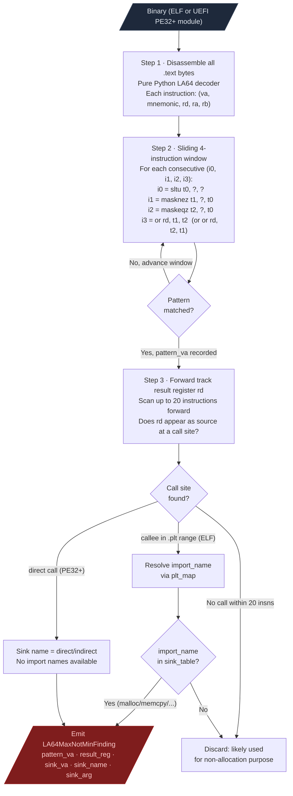

# Compiler Defect Detection

Finds security vulnerabilities the compiler introduced through miscompilation. The primary target is GCC 12.3.1.7 for LoongArch64, which miscompiles `std::max()` and `std::min()` comparisons in a way that selects the wrong operand and produces heap overflow conditions.

---

## Why this exists

One class of vulnerability was completely invisible before this module:

**Compiler bugs are not detectable by code review or manual RE.**
A developer writes correct C++: `size_t n = std::max(input_len, min_len)`. The compiler emits a four-instruction sequence that produces the opposite result. The source code is correct. The disassembly looks like a bounds check is present. Only a scanner that knows the specific buggy instruction pattern can detect it. Auditing TencentOS 4.6 without `LA64MaxNotMinScanner` would not surface these 172 findings because there is nothing wrong with the source. The defect exists only in the binary.

---

## The GCC 12.3.1.7 max-not-min bug

GCC 12.3.1.7 for LoongArch64 miscompiles comparison operations that feed into size calculations. The compiler emits a correct-looking four-instruction sequence but swaps the operands in the final combination step. The result is that `max(a, b)` returns `min(a, b)`.

### The four-instruction sequence

```
  Source intent: n = std::max(input_len, min_len)
  Correct result: n = the LARGER of the two operands

  What GCC 12.3.1.7 actually emits:

    sltu    t0, a, b       ; t0 = 1 if a < b, else 0   (unsigned less-than)
    masknez t1, a, t0      ; t1 = a if t0 != 0, else 0  (select a when a < b)
    maskeqz t2, b, t0      ; t2 = b if t0 == 0, else 0  (select b when a >= b)
    or      rd, t1, t2     ; rd = a-when-a<b OR b-when-a>=b = MIN(a, b)

  Expected: rd = MAX(a, b)   Actual: rd = MIN(a, b)   <-- WRONG
```

The LA64 `masknez` and `maskeqz` instructions are branchless select primitives: `masknez dst, src, cond` writes `src` to `dst` if `cond != 0`, otherwise writes zero. The correct `max` implementation uses `masknez` to select the LARGER operand. GCC inverts the selection: it uses `masknez` on `a` when `a < b` is true, so it selects `a` (the smaller value). The `or` then combines the two conditional slots and delivers the minimum.

### Security impact

When `rd` flows into a `malloc` size argument, the allocation is smaller than the code expects. Any subsequent write of `max(input_len, min_len)` bytes into that buffer is a heap overflow because the actual allocation is only `min(input_len, min_len)` bytes.

```
  Input: input_len = 4096 (attacker-controlled)
         min_len   = 64   (developer's floor)

  Intended: alloc_size = max(4096, 64) = 4096
  Actual:   alloc_size = min(4096, 64) = 64

  Then: memcpy(buf, input, 4096) into a 64-byte buffer
  Result: 4032-byte heap overflow
```

---

## How the scanner works



### Why forward tracking stops at 20 instructions

GCC places the size calculation immediately before the allocation call. Twenty instructions covers any intervening register moves or address computations while keeping the false-positive rate low. A result register that travels more than 20 instructions before reaching a sink is almost certainly consumed for a different purpose in between.

---

## Confirmed impact

| Target | Format | Findings |
|---|---|---|
| TencentOS 4.6 libstd | ELF | 5 confirmed (F-030..F-034) |
| TencentOS EDK2 UEFI | PE32+ | 63 across 26 modules (TlsDxe highest risk) |
| TencentOS kernel modules | ELF | 104 across kernel tree |

Total confirmed: 172 (2 CRITICAL, 55 HIGH, 115 MEDIUM).

---

## Usage

ELF binary:

```python
from ablation.analyzers.loongarch64_max_not_min_scanner import LA64MaxNotMinScanner

findings = LA64MaxNotMinScanner.from_path('libc.so.la64').scan()
for f in findings:
    print(f"0x{f.pattern_va:x}  {f.result_reg} -> {f.sink_name}({f.sink_arg})")
```

UEFI PE32+ DXE module:

```python
data = open('TlsDxe.efi', 'rb').read()
findings = LA64MaxNotMinScanner.from_pe32plus(data).scan()
```

### False positive class

Rust `Vec` append patterns use `bltu remaining_cap, ...` to guard the write. These have a conditional branch between the `or` instruction and the sink call that guards against the wrong result. The branch means the minimum is never actually used as an allocation size without first checking capacity. Verify manually before reporting any finding where a conditional branch on the result register appears within the 20-instruction tracking window.
