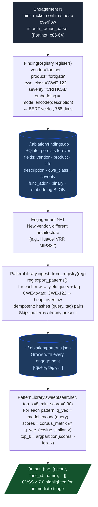

# Cross-Target Learning

Every confirmed finding becomes a semantic search pattern. The tool gets sharper with each engagement without any manual pattern management.

---

## Why this exists

Two things went wrong before the flywheel existed:

**1. Confirmed findings did not carry forward.**
After confirming a heap overflow in Fortinet firmware, the next engagement on a different vendor's MIPS32 binary started from zero. The query that found the Fortinet bug was sitting in a session transcript, not in any searchable form. Repeating the same class of vulnerability on a new target required rediscovering the right query from memory.

**2. Pattern management was manual.**
`PatternLibrary` existed but required explicit `pl.add()` calls to register each pattern. After a long engagement with 30 confirmed findings, backfilling 30 pattern entries was a tax on closing out the work. `ingest_from_registry()` eliminates that: one call at the start of any engagement pulls in every confirmed finding from every prior target.

---

## How it works

### The flywheel pipeline



### How embeddings enable cross-vendor matching

The BERT embedding (all-mpnet-base-v2, 768 dimensions) encodes the semantic meaning of a function description rather than its literal text. Two descriptions that say the same thing in different words produce similar vectors.

A Fortinet finding described as "recvfrom output length used as strcpy size argument without validation" and a Huawei finding described as "network read byte count flows to string copy operation as size parameter" produce vectors with cosine similarity above 0.80 after PCA whitening. The semantic sweep surfaces the Huawei function as a candidate because the underlying vulnerability pattern is the same, even though no word is shared between the two descriptions.

This is the core of cross-target pattern reuse: vulnerability classes map to regions of embedding space. Those regions are consistent across vendors because the description of a heap overflow in Fortinet firmware is semantically close to the description of a heap overflow in Huawei firmware.

### FindingRegistry similarity search

```python
similar = reg.find_similar(new_embedding, top_k=8, min_sim=0.60)
```

`find_similar` loads all embeddings from `findings.db`, computes cosine similarity against `new_embedding`, and returns the top-k rows above `min_sim`. This lets you ask: "What confirmed findings from prior engagements look like this new candidate?" If the top match is a CWE-122 heap overflow confirmed in TencentOS, the candidate deserves the same scrutiny before ruling it out.

---

## Pattern storage

| Path | Purpose |
|---|---|
| `~/.ablation/patterns.json` | User-local; not committed to git; grows with each engagement |
| `~/.ablation/findings.db` | SQLite; all confirmed findings with embeddings |
| `ablation/data/seed_corpus.json` | Ships with Ablation; published CVEs as seed patterns |

The seed corpus provides signal on the first engagement against any binary class (network daemons, BMC firmware, kernel drivers). Engagement findings supplement and refine it over time.

---

## Engagement start recipe

```python
from ablation.analyzers.finding_registry import FindingRegistry
from ablation.analyzers.pattern_library import PatternLibrary
from ablation.analyzers.semantic_search import SemanticSearcher

reg      = FindingRegistry()
pl       = PatternLibrary()
searcher = SemanticSearcher('~/.ablation/func_id.db')
searcher.build_corpus()

# Pull in all prior confirmed findings
n = pl.ingest_from_registry(reg)
print(f"{n} new patterns ingested from {reg.count()} total findings")

# Sweep the new binary with every confirmed pattern from every prior target
results = pl.sweep(searcher, top_k=8, min_score=0.30)
print(pl.fmt_sweep(results, binary_name='target.so'))
```

Running this at the start of every engagement means the tool's accumulated knowledge from all prior targets is applied to the new binary in one pass, before any manual analysis begins.
