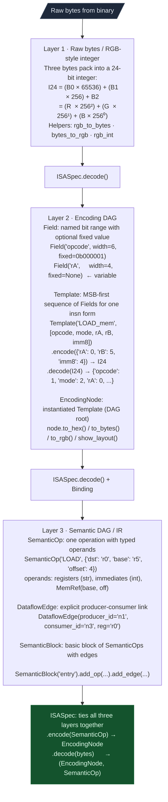
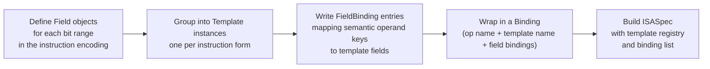

# Encoding DAG

**File:** `ablation/analyzers/encoding_dag.py`

The EncodingDAG is a bitfield-to-instruction encoding framework for fixed-width ISAs. It implements a three-layer model: raw bytes map to named bitfields, named bitfields map to semantic operations, and semantic operations link through dataflow edges into basic blocks.

---

## Why this exists

3 things that were not possible before in Ablation:

**1. No shared bit-extraction layer.** Every ISA decoder embedded its own field extraction logic: bit masks, shifts, and width calculations repeated across each architecture. Adding a new ISA meant writing those operations from scratch. `Field` and `Template` centralize this so each bit range is defined once and reused by every encoder, decoder, and disassembler that needs it.

**2. No reusable encode/decode round-trip.** Taint trackers and lifters needed to reconstruct instruction encodings to verify byte sequences. Without a shared model, every tool that touched raw bytes had its own ad-hoc packing and unpacking, and they disagreed on edge cases (fixed-field mismatches, register numbering). `ISASpec.encode()` and `ISASpec.decode()` give every tool a single verified round-trip path.

**3. No semantic-layer dataflow graph.** Before `SemanticBlock`, taint results were flat lists of (sink, source) pairs with no explicit producer-consumer links. Confirming that a LOAD result flows into an ADD that feeds a STORE required manual tracing. `DataflowEdge` records those links explicitly so any tool can walk the DAG without re-deriving it.

---

## Three-layer architecture



---

## Quick start

```python
from ablation.analyzers.encoding_dag import ISA24, SemanticOp

# Encode a semantic op to bytes
op = SemanticOp("LOAD", {"dst": "r0", "base": "r5", "offset": 4}, node_id="n1")
node = ISA24.encode(op)
print(node.to_hex())        # 0x060504
print(node.to_rgb())        # (6, 5, 4)
print(node.to_rgb_int())    # 394500 = 6*65536 + 5*256 + 4

# Decode bytes back to semantic
enode, sop = ISA24.decode(bytes.fromhex("060504"))
print(sop)                  # LOAD  dst=r0, base=r5, offset=4

# ASCII bit layout
print(node.show_layout())
# Bit ranges:  [23:18]  [17:16]  [15:12]  [11:8]  [7:0]
# Fields:      opcode   mode     rA       rB      imm8
# Values:      000001   10       0000     0101    00000100
# Hex: 0x060504  I=394500
```

---

## Layer 1: Raw bytes and the I24 integer

Layer 1 is the byte representation layer. It normalizes any fixed-width instruction to an
integer so that `Field` and `Template` arithmetic operates on a single value rather than
a byte array.

For a 3-byte (24-bit) instruction, the integer is:

```
I24 = (byte[0] × 65536) + (byte[1] × 256) + byte[2]
    = (R × 256²)        + (G × 256¹)      + (B × 256⁰)
```

This is identical to the way a 24-bit RGB color is stored, so the integer is also called
the **RGB integer**. The mapping is deliberate: it means you can visualize an instruction
stream as a sequence of colors. Two instructions with the same opcode but different
operands produce visually distinct hues, which is useful when scanning for repeated
patterns across a disassembly.

The three Layer 1 helpers convert between representations:

| Helper | Input | Output |
|---|---|---|
| `rgb_to_bytes(r, g, b)` | Three integers (0-255) | `bytes` of length 3 |
| `bytes_to_rgb(b)` | `bytes` of length 3 | `(r, g, b)` tuple |
| `rgb_int(r, g, b)` | Three integers | Single `int` (0-16777215) |

For ISAs with instruction widths other than 24 bits, the packing extends naturally: a
32-bit ISA uses a 4-byte RGBA integer. The field arithmetic in Layer 2 is width-agnostic;
only the byte packing helpers in Layer 1 are width-specific.

---

## Layer 2: Encoding DAG

Layer 2 is the structural layer. It describes how bits are arranged inside an instruction
and how to pack or unpack them.

### Field

A `Field` represents one named bit range inside an instruction word.

```python
@dataclass(frozen=True)
class Field:
    name: str
    width: int           # number of bits this field occupies
    fixed: Optional[int] # None = variable operand; int = opcode discriminator
```

**Variable fields** (`fixed=None`) carry operand values. During encode, the caller
supplies a value; during decode, the extracted bits are returned as-is.

**Fixed fields** (`fixed=<int>`) are opcode discriminators. During encode, the fixed
value is packed unconditionally; the caller does not supply it. During decode, if the
extracted bits do not equal `fixed`, a `DecodingError` is raised. This is how Template
dispatch works: each Template has a fixed `opcode` field, and decode tries Templates
in order until one's fixed fields all match the raw integer.

The constraint `value < 2**width` is checked at encode time; a value that does not fit
raises `EncodingError`.

### Template

A Template is a named, MSB-first sequence of Fields representing one instruction form.
The Fields are listed from the most-significant bit to the least-significant bit; the
first Field occupies the top bits of the integer.

**How encoding works:**

`Template.encode(values)` iterates Fields from MSB to LSB. For each Field it takes
`values[name]` (or `fixed` for fixed Fields), validates the width, then packs the value
into the running integer by shifting:

```
I = 0
for field in fields:          # MSB to LSB
    value = values[field.name] or field.fixed
    assert value < 2**field.width
    I = (I << field.width) | value
return I
```

**How decoding works:**

`Template.decode(I)` reverses the process. It shifts out bits from the MSB end and
assigns them to each field in order:

```
remaining_bits = total_width   # e.g. 24
for field in fields:
    remaining_bits -= field.width
    value = (I >> remaining_bits) & ((1 << field.width) - 1)
    if field.fixed is not None and value != field.fixed:
        raise DecodingError(...)
    result[field.name] = value
```

A fixed-field mismatch means this Template does not match the instruction; `ISASpec`
tries the next Template.

```python
from ablation.analyzers.encoding_dag import Template, Field

tmpl = Template("ADD_reg", [
    Field("opcode", 6, fixed=0b000100),   # bits [23:18]
    Field("mode",   2, fixed=0b11),        # bits [17:16]
    Field("rA",     4),                    # bits [15:12]
    Field("rB",     4),                    # bits [11:8]
    Field("imm8",   8, fixed=0),           # bits [7:0]
])

tmpl.encode({"rA": 0, "rB": 1})
# → 0x130100
# opcode=0b000100 (4), mode=0b11 (3), rA=0b0000 (0), rB=0b0001 (1), imm8=0

tmpl.decode(0x130100)
# → {"opcode": 4, "mode": 3, "rA": 0, "rB": 1, "imm8": 0}
```

**Template.show_layout()** prints an ASCII bit-field diagram:

```
Bit ranges:  [23:18]  [17:16]  [15:12]  [11:8]  [7:0]
Fields:      opcode   mode     rA       rB      imm8
Values:      000100   11       0000     0001    00000000
Hex: 0x130100  I=1245440
```

### EncodingNode

An `EncodingNode` is an instantiated `Template` and serves as the DAG root. It bundles
the Template with a concrete set of field values so that the same encoded instruction can
be inspected, serialized, or displayed in multiple formats without re-encoding.

```python
node = EncodingNode(tmpl, {"rA": 0, "rB": 1})
```

| Method | Returns | Description |
|---|---|---|
| `node.to_hex()` | `str` | Hex string, e.g. `"0x130100"` |
| `node.to_bytes()` | `bytes` | Raw byte sequence, e.g. `b'\x13\x01\x00'` |
| `node.to_rgb()` | `(int, int, int)` | RGB triple, e.g. `(19, 1, 0)` |
| `node.to_rgb_int()` | `int` | Single integer, e.g. `1245440` |
| `node.all_fields()` | `dict` | All field values including fixed fields |
| `node.show_layout()` | `str` | ASCII bit-field diagram |
| `node.template` | `Template` | The backing Template |
| `node.values` | `dict` | The variable field values passed at construction |

`to_rgb_int()` is used as a corpus key in `SAXIndex` because it maps each unique
instruction encoding to a unique integer, making sorted search and clustering efficient.

---

## Layer 3: Semantic DAG

Layer 3 is the meaning layer. It names what an instruction does and records how the
result of one instruction flows into the operands of another.

### SemanticOp

A `SemanticOp` represents one instruction at the semantic level: an operation name, a
dictionary of typed operands, and an optional node ID that uniquely identifies this
instance in a `SemanticBlock`.

```python
@dataclass
class SemanticOp:
    op: str                 # operation name, e.g. "LOAD", "ADD", "STORE"
    operands: dict          # keys are role names; values are reg str, int, or MemRef
    node_id: str            # unique ID within a SemanticBlock, e.g. "n1"
    taint: bool = False     # True when this op is on a taint path
```

Operand value types:

| Type | Python type | Example |
|---|---|---|
| Register | `str` | `"r0"`, `"rdi"`, `"$a0"` |
| Immediate | `int` | `4`, `0x1000`, `-8` |
| Memory reference | `MemRef(base, offset)` | `MemRef("r5", 4)` = `mem[r5 + 4]` |

```python
# Register operand
SemanticOp("MOV",   {"dst": "r0", "src": "r1"},             "n1")

# Immediate operand
SemanticOp("ADD",   {"dst": "r0", "src": "r1", "imm": 4},   "n2")

# Memory reference
SemanticOp("STORE", {"src": "r0", "addr": MemRef("r5", 12)}, "n3")
```

### DataflowEdge

A `DataflowEdge` is an explicit producer-consumer dependency between two `SemanticOp`
nodes. It records which register carries the value.

```python
@dataclass
class DataflowEdge:
    producer_id: str   # node_id of the op that writes the register
    consumer_id: str   # node_id of the op that reads it
    reg: str           # register name
```

Edges are what makes a `SemanticBlock` a DAG rather than just a list. Without edges,
you know which operations exist but not in what order their values depend on each other.
A taint tracker uses edges to propagate taint from source to sink without re-analysing
register liveness. A lifter uses them to produce correct SSA form.

### SemanticBlock

A `SemanticBlock` is a basic block: a named, ordered list of `SemanticOp` nodes plus a
set of `DataflowEdge` connections.

```python
from ablation.analyzers.encoding_dag import SemanticBlock, DataflowEdge, SemanticOp

blk = SemanticBlock("entry")
blk.add_op(SemanticOp("LOAD",  {"dst": "r0", "base": "r5", "offset": 4},  "n1"))
blk.add_op(SemanticOp("LOAD",  {"dst": "r1", "base": "r5", "offset": 8},  "n2"))
blk.add_op(SemanticOp("ADD",   {"dst": "r0", "src": "r1"},                "n3"))
blk.add_op(SemanticOp("STORE", {"src": "r0", "base": "r5", "offset": 12}, "n4"))

# n1 writes r0; n3 reads r0 → edge n1→n3
# n2 writes r1; n3 reads r1 → edge n2→n3
# n3 writes r0; n4 reads r0 → edge n3→n4
blk.add_edge(DataflowEdge("n1", "n3", "r0"))
blk.add_edge(DataflowEdge("n2", "n3", "r1"))
blk.add_edge(DataflowEdge("n3", "n4", "r0"))
```

**SemanticBlock API:**

| Method | Returns | Description |
|---|---|---|
| `blk.add_op(op)` | `self` | Append a `SemanticOp`; raises if `node_id` collides |
| `blk.add_edge(edge)` | `self` | Record a producer-consumer dependency |
| `blk.get_op(node_id)` | `SemanticOp` | Look up an op by ID; raises `KeyError` if absent |
| `blk.ops` | `list[SemanticOp]` | All ops in insertion order |
| `blk.edges` | `list[DataflowEdge]` | All edges |
| `blk.dag_nodes()` | generator | Topological traversal of ops following edge order |
| `blk.tainted_ops()` | `list[SemanticOp]` | Ops with `taint=True` |
| `blk.mark_taint(node_id)` | `None` | Set `taint=True` on one op |

**dag_nodes() and cycle detection:**

`dag_nodes()` yields ops in topological order: a producer is always yielded before all
its consumers. If the edge graph contains a cycle, it raises `ValueError("cycle
detected")`. Callers that build blocks from analyzed binaries should wrap the call in
`try/except ValueError` and fall back to insertion-order iteration (`blk.ops`) when
a cycle is present. Cycles are rare in well-formed basic blocks but can appear when
taint edges are added manually.

```python
# Safe topological walk
try:
    for op in blk.dag_nodes():
        print(op.op, op.operands)
except ValueError:
    for op in blk.ops:       # insertion order fallback
        print(op.op, op.operands)
```

---

## ISASpec: Round-Trip Encode and Decode

`ISASpec` owns a template registry plus `Binding` objects that map semantic op names to
template names and semantic operand keys to template field names.

### Binding and FieldBinding

A `Binding` connects one semantic op name to one `Template`. It lists a `FieldBinding`
for each variable field, declaring which semantic operand key maps to which template
field and what type the operand is.

```python
@dataclass
class FieldBinding:
    field_name: str       # Template field name, e.g. "rA"
    operand_key: str      # SemanticOp operand key, e.g. "dst"
    operand_type: str     # "reg", "imm", or "memref"
```

When `operand_type="reg"`, `ISASpec.encode()` looks up the register name in
`reg_table` to get its integer encoding. When `operand_type="imm"`, the operand is
used directly as an integer. When `operand_type="memref"`, the `MemRef.base` is
looked up in `reg_table` and the `MemRef.offset` fills the immediate field.

```python
from ablation.analyzers.encoding_dag import ISASpec, Template, Field, Binding, FieldBinding

spec = ISASpec(
    name="my-isa",
    templates={
        "LOAD_mem": Template("LOAD_mem", [
            Field("opcode", 6, fixed=0b000001),
            Field("mode",   2, fixed=0b10),
            Field("rA",     4),
            Field("rB",     4),
            Field("imm8",   8),
        ]),
    },
    bindings=[
        Binding("LOAD", "LOAD_mem", [
            FieldBinding("rA",   "dst",    operand_type="reg"),
            FieldBinding("rB",   "base",   operand_type="reg"),
            FieldBinding("imm8", "offset", operand_type="imm"),
        ]),
    ],
    reg_table={"r0": 0, "r1": 1, "r2": 2, "r3": 3,
               "r4": 4, "r5": 5, "r6": 6, "r7": 7},
    opcode_field="opcode",
)
```

### How encode() works

`ISASpec.encode(sop)` finds the `Binding` whose op name matches `sop.op`, then:

1. Looks up the `Template` named in the binding.
2. Builds a `values` dict by iterating `FieldBinding` entries: resolves registers via
   `reg_table`, copies immediates as-is, splits `MemRef` into base register + offset.
3. Calls `Template.encode(values)` to get the integer.
4. Returns an `EncodingNode(template, values)`.

### How decode() works

`ISASpec.decode(raw_bytes)` converts bytes to an integer and tries each registered
`Template` in order:

1. Calls `Template.decode(I)` on the integer.
2. If all fixed fields match, decode succeeds; a `SemanticOp` is reconstructed by
   reversing the `FieldBinding` mappings (integers → register names via `reg_table`
   inversion, immediates passed through).
3. If any fixed field mismatches, a `DecodingError` is caught internally and the next
   Template is tried.
4. If no Template matches, `ISASpec.decode()` raises `DecodingError`.

The `opcode_field` parameter names the field used as the primary dispatch key. When
present, decode skips Templates whose `opcode_field` fixed value does not match the
extracted opcode bits, so the search is O(templates_with_matching_opcode) rather than
O(all_templates).

```python
node = spec.encode(SemanticOp("LOAD", {"dst": "r0", "base": "r5", "offset": 4}))
enode, sop = spec.decode(node.to_bytes())
# sop.op == "LOAD"
# sop.operands == {"dst": "r0", "base": "r5", "offset": 4}
```

---

## ISA-24 (bundled example)

`ISA24` is a pre-built `ISASpec` for a 24-bit toy ISA bundled with Ablation for testing
and examples:

```
  [ opcode(6) | mode(2) | rA(4) | rB(4) | imm8(8) ] = 24 bits
```

The 6-bit opcode gives 64 possible instruction forms. Mode distinguishes addressing
variants (`00` = PC-relative, `10` = register-indirect, `11` = register-register).

| Mnemonic | opcode (bin) | mode | Semantics |
|---|---|---|---|
| LOAD | 000001 | 10 | `rA = mem[rB + imm8]` |
| STORE | 000010 | 10 | `mem[rB + imm8] = rA` |
| ADD | 000100 | 11 | `rA += rB` |
| MUL | 001000 | 11 | `rA *= rB` |
| JMP | 010000 | 00 | `PC += imm8` (signed) |
| MOV | 010101 | 11 | `rA = rB` |

```python
from ablation.analyzers.encoding_dag import ISA24, SemanticOp

ops = [
    SemanticOp("LOAD",  {"dst": "r0", "base": "r5", "offset":  4}, "n1"),
    SemanticOp("LOAD",  {"dst": "r1", "base": "r5", "offset":  8}, "n2"),
    SemanticOp("ADD",   {"dst": "r0", "src":  "r1"},                "n3"),
    SemanticOp("STORE", {"src": "r0", "base": "r5", "offset": 12}, "n4"),
]
for op in ops:
    node = ISA24.encode(op)
    r, g, b = node.to_rgb()
    print(f"{op.node_id}: {op.op:6s}  {node.to_hex()}  I24={node.to_rgb_int():<10}  R={r} G={g} B={b}")

# n1: LOAD    0x060504  I24=394500      R=6  G=5  B=4
# n2: LOAD    0x061508  I24=398600      R=6  G=21 B=8
# n3: ADD     0x130100  I24=1245440     R=19 G=1  B=0
# n4: STORE   0x0A050C  I24=656652      R=10 G=5  B=12
```

The R channel carries most of the opcode information because the opcode occupies bits
[23:18]: LOAD and STORE share R=6 and R=10 respectively regardless of their operands,
while ADD and MUL produce much higher R values. This makes instruction class
distinguishable by color at a glance.

---

## Extending to a new ISA



**Step-by-step example: adding a RISC-V-style R-type instruction.**

R-type encodes three register fields: `rd` (destination), `rs1`, `rs2`, with a 7-bit
opcode and a 3-bit `funct3` discriminator packed into a 32-bit word:

```
[ funct7(7) | rs2(5) | rs1(5) | funct3(3) | rd(5) | opcode(7) ] = 32 bits
```

```python
from ablation.analyzers.encoding_dag import Field, Template, Binding, FieldBinding, ISASpec

# 1. Define fields
f_funct7 = Field("funct7",  7, fixed=0b0000000)   # ADD: funct7=0
f_rs2    = Field("rs2",     5)
f_rs1    = Field("rs1",     5)
f_funct3 = Field("funct3",  3, fixed=0b000)        # ADD: funct3=0
f_rd     = Field("rd",      5)
f_opcode = Field("opcode",  7, fixed=0b0110011)    # R-type opcode

# 2. Group into a Template (MSB first)
add_tmpl = Template("ADD_rv32", [f_funct7, f_rs2, f_rs1, f_funct3, f_rd, f_opcode])

# 3. Write FieldBindings
add_binding = Binding("ADD", "ADD_rv32", [
    FieldBinding("rd",  "dst",  operand_type="reg"),
    FieldBinding("rs1", "src1", operand_type="reg"),
    FieldBinding("rs2", "src2", operand_type="reg"),
])

# 4. Build ISASpec
rv32_int = ISASpec(
    name="rv32i",
    templates={"ADD_rv32": add_tmpl},
    bindings=[add_binding],
    reg_table={"x0": 0, "x1": 1, "x2": 2, ..., "x31": 31},
    opcode_field="opcode",
)

# Encode: ADD x1, x2, x3
node = rv32_int.encode(SemanticOp("ADD", {"dst": "x1", "src1": "x2", "src2": "x3"}))
print(node.to_hex())     # 0x00310033
print(node.show_layout())
```

Variable-length ISAs such as x86 need hierarchical templates: one for the opcode byte,
one for ModRM, one for SIB, and so on. The EncodingDAG composition nodes are `Template`
references; the root template aggregates sub-templates by concatenating their encodings.

---

## Real-world usage: PEFABIClobberScanner

`PEFABIClobberScanner` uses the EncodingDAG to verify PPC32 PEF ABI register usage at
call sites for `OTStrCat`, `OTStrCopy`, and `OTMemcpy`. The scanner reconstructs each
call site's instruction stream as a `SemanticBlock` and adds `DataflowEdge` entries to
trace which registers are live at the call. The `dag_nodes()` traversal then confirms
whether the correct argument registers (r4, r5) hold caller-supplied values without
intermediate clobbers.

The EncodingDAG is used here because the PPC32 `ori` encoding has a subtle field
layout issue: the RA field is bits [20:16], not bits [25:21] as in the standard
D-form. Defining this as an explicit `Field("RA", 5)` in the PPC32 `Template` for `ori`
catches the layout error at encode time rather than silently producing the wrong
instruction encoding.

---

## Exceptions

| Exception | When raised |
|---|---|
| `EncodingError` | Field value too wide for its bit width; no `Binding` found for op name; register not in `reg_table` |
| `DecodingError` | No `Template` matches the integer (all fixed-field checks fail); raw bytes have wrong length for the ISA width |
