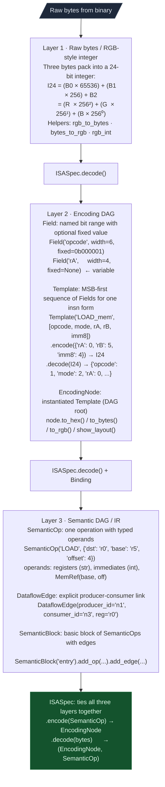
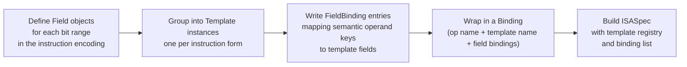

# Encoding DAG

**File:** `ablation/analyzers/encoding_dag.py`

The EncodingDAG is a bitfield-to-instruction encoding framework for fixed-width ISAs. It implements a three-layer model: raw bytes map to named bitfields, named bitfields map to semantic operations, and semantic operations link through dataflow edges into basic blocks.

---

## Why this exists

3 things that were not possible before in Ablation:

**1. No shared bit-extraction layer.** Every ISA decoder embedded its own field extraction logic: bit masks, shifts, and width calculations repeated across each architecture. Adding a new ISA meant writing those operations from scratch. `Field` and `Template` centralize this so each bit range is defined once and reused by every encoder, decoder, and disassembler that needs it.

**2. No reusable encode/decode round-trip.** Taint trackers and lifters needed to reconstruct instruction encodings to verify byte sequences. Without a shared model, every tool that touched raw bytes had its own ad-hoc packing and unpacking, and they disagreed on edge cases (fixed-field mismatches, register numbering). `ISASpec.encode()` and `ISASpec.decode()` give every tool a single verified round-trip path.

**3. No semantic-layer dataflow graph.** Before `SemanticBlock`, taint results were flat lists of (sink, source) pairs with no explicit producer-consumer links. Confirming that a LOAD result flows into an ADD that feeds a STORE required manual tracing. `DataflowEdge` records those links explicitly so any tool can walk the DAG without re-deriving it.

---

## Three-layer architecture



---

## Quick start

```python
from ablation.analyzers.encoding_dag import ISA24, SemanticOp

# Encode a semantic op to bytes
op = SemanticOp("LOAD", {"dst": "r0", "base": "r5", "offset": 4}, node_id="n1")
node = ISA24.encode(op)
print(node.to_hex())        # 0x060504
print(node.to_rgb())        # (6, 5, 4)
print(node.to_rgb_int())    # 394500 = 6*65536 + 5*256 + 4

# Decode bytes back to semantic
enode, sop = ISA24.decode(bytes.fromhex("060504"))
print(sop)                  # LOAD  dst=r0, base=r5, offset=4

# ASCII bit layout
print(node.show_layout())
# Bit ranges:  [23:18]  [17:16]  [15:12]  [11:8]  [7:0]
# Fields:      opcode   mode     rA       rB      imm8
# Values:      000001   10       0000     0101    00000100
# Hex: 0x060504  I=394500
```

---

## Layer 2: Encoding DAG

### Field

```python
@dataclass(frozen=True)
class Field:
    name: str
    width: int           # bits
    fixed: Optional[int] # None = variable; int = fixed value checked on decode
```

### Template

A Template is a named, MSB-first sequence of Fields representing one instruction form.

```python
from ablation.analyzers.encoding_dag import Template, Field

tmpl = Template("ADD_reg", [
    Field("opcode", 6, fixed=0b000100),
    Field("mode",   2, fixed=0b11),
    Field("rA",     4),
    Field("rB",     4),
    Field("imm8",   8, fixed=0),
])

tmpl.encode({"rA": 0, "rB": 1})   # 0x130100
tmpl.decode(0x130100)
# {"opcode": 4, "mode": 3, "rA": 0, "rB": 1, "imm8": 0}
```

### EncodingNode

An `EncodingNode` is an instantiated `Template` and serves as the DAG root.

```python
node = EncodingNode(tmpl, {"rA": 0, "rB": 1})
node.to_hex()        # "0x130100"
node.to_bytes()      # b'\x13\x01\x00'
node.to_rgb()        # (19, 1, 0)
node.to_rgb_int()    # 1245440
node.all_fields()    # {"opcode": 4, "mode": 3, "rA": 0, "rB": 1, "imm8": 0}
node.show_layout()   # ASCII diagram
```

---

## Layer 3: Semantic DAG

### SemanticBlock with dataflow edges

```python
from ablation.analyzers.encoding_dag import SemanticBlock, DataflowEdge

blk = SemanticBlock("entry")
blk.add_op(SemanticOp("LOAD",  {"dst": "r0", "base": "r5", "offset": 4},  "n1"))
blk.add_op(SemanticOp("LOAD",  {"dst": "r1", "base": "r5", "offset": 8},  "n2"))
blk.add_op(SemanticOp("ADD",   {"dst": "r0", "src": "r1"},                "n3"))
blk.add_op(SemanticOp("STORE", {"src": "r0", "base": "r5", "offset": 12}, "n4"))

# Explicit dataflow edges: n1→n3 via r0, n2→n3 via r1, n3→n4 via r0
blk.add_edge(DataflowEdge("n1", "n3", "r0"))
blk.add_edge(DataflowEdge("n2", "n3", "r1"))
blk.add_edge(DataflowEdge("n3", "n4", "r0"))
```

---

## ISASpec: Round-Trip Encode and Decode

`ISASpec` owns a template registry plus Bindings that map semantic op names to template names and semantic operand keys to template field names.

```python
from ablation.analyzers.encoding_dag import ISASpec, Template, Field, Binding, FieldBinding

spec = ISASpec(
    name="my-isa",
    templates={"LOAD_mem": Template(...)},
    bindings=[Binding("LOAD", "LOAD_mem", [
        FieldBinding("rA",   "dst",    operand_type="reg"),
        FieldBinding("rB",   "base",   operand_type="reg"),
        FieldBinding("imm8", "offset", operand_type="imm"),
    ])],
    reg_table={"r0": 0, "r1": 1, ..., "r15": 15},
    opcode_field="opcode",
)

node = spec.encode(SemanticOp("LOAD", {"dst": "r0", "base": "r5", "offset": 4}))
enode, sop = spec.decode(node.to_bytes())
```

---

## ISA-24 (bundled example)

`ISA24` is a pre-built `ISASpec` for a 24-bit toy ISA bundled with Ablation for testing and examples:

```
  [ opcode(6) | mode(2) | rA(4) | rB(4) | imm8(8) ] = 24 bits
```

| Mnemonic | opcode | mode | Semantics |
|---|---|---|---|
| LOAD | 000001 | 10 | `rA = mem[rB + imm8]` |
| STORE | 000010 | 10 | `mem[rB + imm8] = rA` |
| ADD | 000100 | 11 | `rA += rB` |
| MUL | 001000 | 11 | `rA *= rB` |
| JMP | 010000 | 00 | `PC += imm8` (signed) |
| MOV | 010101 | 11 | `rA = rB` |

```python
from ablation.analyzers.encoding_dag import ISA24

ops = [
    SemanticOp("LOAD",  {"dst": "r0", "base": "r5", "offset":  4}, "n1"),
    SemanticOp("LOAD",  {"dst": "r1", "base": "r5", "offset":  8}, "n2"),
    SemanticOp("ADD",   {"dst": "r0", "src":  "r1"},                "n3"),
    SemanticOp("STORE", {"src": "r0", "base": "r5", "offset": 12}, "n4"),
]
for op in ops:
    node = ISA24.encode(op)
    r, g, b = node.to_rgb()
    print(f"{op.node_id}: {op.op:6s}  {node.to_hex()}  I24={node.to_rgb_int():<10}  R={r} G={g} B={b}")

# n1: LOAD    0x060504  I24=394500      R=6  G=5  B=4
# n2: LOAD    0x061508  I24=398600      R=6  G=21 B=8
# n3: ADD     0x130100  I24=1245440     R=19 G=1  B=0
# n4: STORE   0x0A050C  I24=656652      R=10 G=5  B=12
```

---

## Extending to a new ISA



Variable-length ISAs such as x86 need hierarchical templates: one for the opcode byte, one for ModRM, one for SIB, and so on. The EncodingDAG composition nodes are `Template` references; the root template aggregates sub-templates by concatenating their encodings.

---

## Exceptions

| Exception | When raised |
|---|---|
| `EncodingError` | Field value too wide; no binding for op; register not in table |
| `DecodingError` | No template matches the opcode; fixed-field mismatch |
