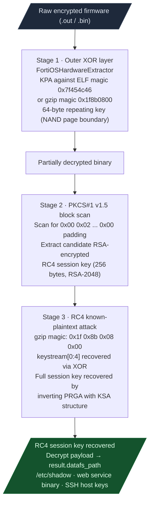
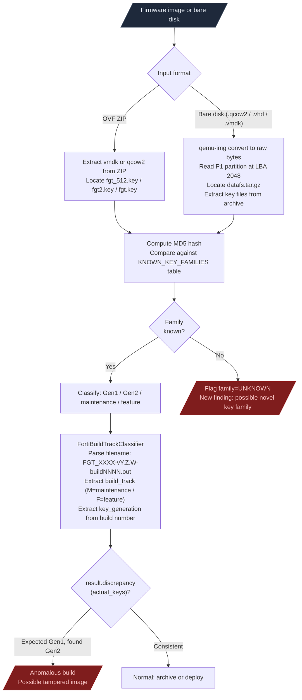
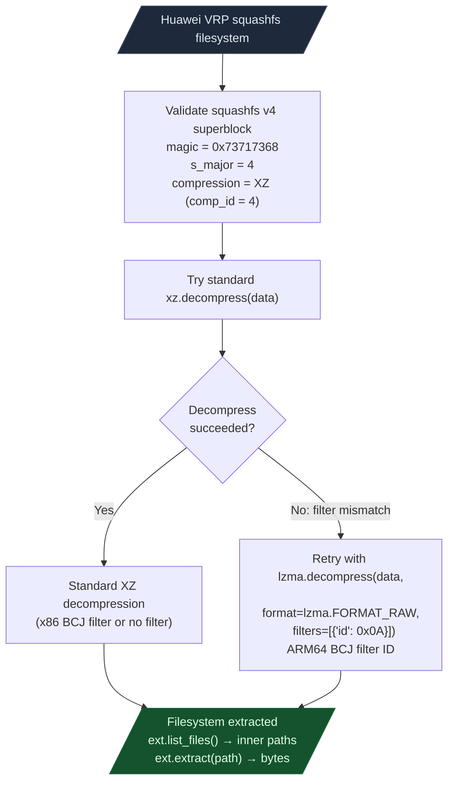

# Firmware Analysis

Decrypts and extracts proprietary firmware through a three-stage key recovery chain. Huawei VRP squashfs with ARM64 BCJ filter is also supported. Both tools target formats where standard extraction tools silently fail.

---

## Why this exists

Two things blocked firmware analysis before these modules:

**1. Proprietary firmware encryption was a dead end.**
Many vendor firmware images use a layered encryption scheme: an outer XOR key applied to the entire image, then an inner PKCS#1 v1.5 RSA-encrypted RC4 session key embedded in the partially-decrypted data, then the actual payload encrypted with RC4. Each layer requires a different recovery method. Without a reusable chain, each engagement re-discovered the same key recovery steps from scratch. `FirmwareContainerKeyExtractor` packages the full three-stage chain as one call.

**2. Huawei VRP squashfs used a non-standard XZ filter.**
Standard `unsquashfs` cannot extract Huawei VRP v600R024+ squashfs images because they use the ARM64 BCJ (Branch Call Jump) XZ filter (filter ID 0x0A) rather than the x86 BCJ filter (0x04) that most tools assume. The ARM64 BCJ filter transforms branch target offsets in ARM64 instructions to improve compression ratios. `HuaweiSquashfsExtractor` handles this filter without external tool dependencies.

---

## How the decryption chain works



### Stage 1: Outer XOR layer

FortiWiFi/FortiGate appliances use NAND flash. Unprogrammed NAND cells read as 0xFF. The XOR key is derived by XOR-ing the encrypted bytes against the known plaintext: ELF magic `0x7f 0x45 0x4c 0x46` or gzip magic `0x1f 0x8b 0x08` at the payload start.

```
  key recovery:
    known_plain = b'\x7f\x45\x4c\x46'  (ELF magic)
    key[:4] = encrypted[:4] ^ known_plain
    key repeats at 64-byte period (NAND page boundary)
```

### Stage 2: PKCS#1 v1.5 block scan

PKCS#1 v1.5 encryption padding has a fixed structure: `0x00 0x02 [8+ non-zero random bytes] 0x00 [message]`. The scanner finds `0x00 0x02 ... 0x00` sequences in the partially-decrypted binary and extracts candidate RSA-encrypted RC4 session key blocks. The typical key block size is 256 bytes (RSA-2048), positioned 128 bytes from the start of the cert partition.

### Stage 3: RC4 known-plaintext attack

RC4 is a stream cipher. The keystream XORs with plaintext to produce ciphertext: `ciphertext[i] = plaintext[i] XOR keystream[i]`. The payload is known to start with a gzip archive, so the first four bytes of keystream are recoverable:

```
  keystream[0] = ciphertext[0] XOR 0x1f
  keystream[1] = ciphertext[1] XOR 0x8b
  keystream[2] = ciphertext[2] XOR 0x08
  keystream[3] = ciphertext[3] XOR 0x00
```

The RC4 KSA (Key Scheduling Algorithm) initializes the permutation S from the 128-byte session key. Given the first four keystream bytes and the KSA structure, the full session key is recoverable by inverting the PRGA.

Override the key if already known: `override_key=bytes.fromhex('...')`.

---

## Firmware Key Corpus

`FortiGateCertKeyScanner` and `FortiBuildTrackClassifier` together maintain a cross-firmware key family corpus that identifies anomalous firmware builds before decryption begins.



The KNOWN_KEY_FAMILIES table is a cross-firmware corpus of MD5 hashes accumulated across engagements. Each new engagement that identifies a new key family adds to the corpus. `batch_scan(dir)` scans a directory of firmware images and reports all family classifications in one pass, flagging unknown families for immediate investigation.

---

## Huawei VRP Squashfs

### Why standard unsquashfs fails

XZ compression supports optional branch-and-call transformation (BCJ) filters that improve compression by making instruction addresses relative before compression. The x86 BCJ filter (filter ID 0x04) is the default in most squashfs implementations. Huawei VRP v600R024+ uses the ARM64 BCJ filter (filter ID 0x0A), which transforms the target addresses in AArch64 `bl`, `blr`, and `b` instructions. No standard squashfs tool ships with ARM64 BCJ support.

### Extraction pipeline



Decompression limits: 8 MB per metadata block, 512 MB per file. Use as a context manager: `with HuaweiSquashfsExtractor(path) as ext:`. Not thread-safe.
