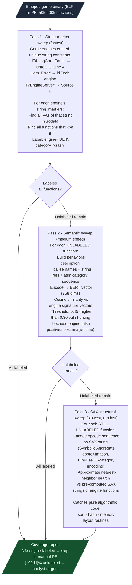
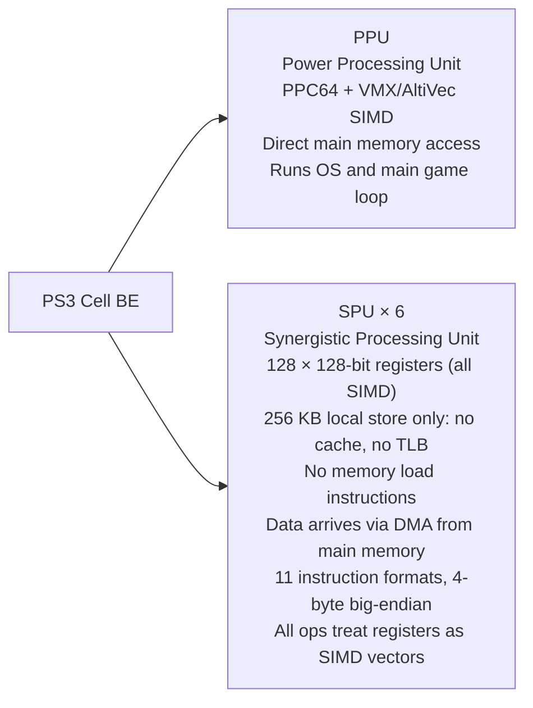

# Game and Legacy RE

Labels stripped game binaries as known engine code so the analyst works only on game-specific logic. Also covers PS3 Cell SPU decoding and Mac OS 8/9 PEF binaries.

---

## Why this exists

Two things were not possible before the game RE stack:

**1. Engine code separation without symbols.**
A stripped AAA game binary has 50,000 to 200,000 functions. 60 to 80 percent of those functions are engine infrastructure: memory allocators, renderer, physics, input, audio. An analyst spending time on those functions is not finding game-specific vulnerabilities or logic. `EnginePatternLibrary` labels engine functions in one pass so the analyst starts on the 20 to 40 percent that is game-specific code.

**2. Cell SPU and PEF binary analysis.**
PS3 game binaries split logic between the main PPU core and up to six SPU coprocessors. The SPU ISA is entirely different from PPC64: 128-bit SIMD-first, no memory hierarchy, no cache. No public RE tool had a Python-accessible SPU disassembler before Ablation. Similarly, Mac OS 8/9 PEF (Preferred Executable Format) binaries require a different ABI scanner than modern Mach-O. Both gaps blocked game RE work on legacy targets.

---

## Engine Pattern Library

### How three-pass labeling works



### Why three passes instead of one

String markers are fast and precise but miss engine functions that contain no strings (pure computation). The semantic pass is accurate for functions with behavioral signatures but expensive to run on every function. The SAX pass is a structural catch-all but has a higher false-positive rate at lower thresholds, so it runs only on the residual after the more precise passes have claimed their candidates.

### Supported engines

| Engine | Versions | Detection method |
|---|---|---|
| Unreal Engine 4/5 | UE4, UE5 | String markers: `LogCore`, `UObjectBase`, crash reporter strings |
| id Tech | 3, 4, 5, 7 | String markers: `Com_Error`, `Sys_Error`, `R_DrawElements` |
| Unity il2cpp | any | `il2cpp_` export prefix; `UnityEngine` string markers |
| Source 2 | Valve 2015+ | `IVEngineServer`, `CBaseEntity`, network table markers |
| CryEngine | 3+ | `CryLogAlways`, `CryFatalError`, `ISystem` |

### Usage

```python
from ablation.analyzers.engine_pattern_library import EnginePatternLibrary
from ablation.analyzers.binary_context import BinaryContext
from ablation.analyzers.xref_graph import XRefGraph

lib = EnginePatternLibrary.default()
ctx = BinaryContext.load_or_build('/path/to/game.exe')
xg  = XRefGraph.from_path('/path/to/game.exe')
xg.build()

labels = lib.label_binary(ctx, xg)
print(lib.strip_report(labels, len(ctx.func_starts)))

unlabeled = lib.unlabeled(ctx.func_starts, labels)
print(f"{len(unlabeled)} functions to analyze")
```

Custom engine signatures:

```python
from ablation.analyzers.engine_pattern_library import EnginePatternLibrary, EngineSignature

lib = EnginePatternLibrary.default()
lib.add_signature(EngineSignature(
    sig_id='myengine_alloc',
    engine='MyEngine',
    category='memory',
    name='MyEngine_Alloc',
    description='custom allocator with debug tracking',
    string_markers=['MyEngine: alloc failed'],
    string_patterns=[r'MyEngine.*alloc'],
))
lib.save()
```

---

## PS3 Cell SPU Disassembler

### Architecture context

The PS3 Cell Broadband Engine has two distinct processor types on one die. Security analysis of PS3 game code requires working at both levels.



Every SPU instruction treats its register as a vector of four 32-bit integers, two 64-bit integers, or sixteen 8-bit integers depending on the instruction. There is no scalar 32-bit mode. A 32-bit add (`a` instruction) adds four pairs of 32-bit integers simultaneously. Data must be pre-staged in local store via DMA channels before any computation can begin.

### Usage

```python
from ablation.analyzers.spu_disassembler import SPUDisassembler

# Disassemble a range in a Cell SPU ELF
SPUDisassembler.dump_spu_elf('/path/to/spu.elf', start_va=0x0, limit=200)

# Frequency analysis for gap detection
SPUDisassembler.frequency_report('/path/to/spu.elf', base=0x0)

# Extract raw .text bytes from a Cell SPU ELF
data = SPUDisassembler.extract_spu_text_from_elf(open(path, 'rb').read())
```

`frequency_report` shows instruction frequency distribution. High branch count indicates loops. High XOR/AND/shift count indicates crypto. High `wrch`/`rdch` count indicates DMA-heavy sections: channel writes and reads are how the SPU communicates with the rest of the system.

---

## Mac OS 8/9 PEF ABI Scanner

PEF (Preferred Executable Format) was the executable format for Mac OS 8 and 9 CFM (Code Fragment Manager) binaries on PowerPC. Two differences from modern Mach-O matter for security analysis:

**TOC-based indirect calls.** All function calls go through a Table of Contents pointer in r2. Each function entry point is a two-word descriptor: word 0 is the code address, word 1 is the TOC base for that function. Calling a function requires loading both words and setting r2 before branching. This means `bl` instructions that look like direct calls in the disassembly are TOC-mediated. The analysis must account for the r2 setup.

**OT string function register-clobber hazard.** The Open Transport API (`OTStrCat`, `OTStrCopy`, `OTMemcpy`) clobbers caller-saved registers at call sites beyond the standard PPC32 ABI convention. A caller that does not reload a clobbered register after an OT call can use a stale value in a subsequent operation.

### PEFABIClobberScanner

Finds call sites where the caller fails to reload a clobbered register after an OT string function call.

```python
from ablation.analyzers.pef_abi_clobber_scanner import PEFABIClobberScanner

code = open('/path/to/pef_segment.bin', 'rb').read()
scanner = PEFABIClobberScanner.from_bytes(code, base_va=0x0)
findings = scanner.scan(
    sink_vas=[0x1000, 0x2000],   # OTStrCat / OTStrCopy VAs
    check_regs=[4],              # r4 = source pointer; r5 for OTMemcpy
)
```

Built on the EncodingDAG template system. Handles `ori` RA-field encoding, `addic` opcode 12, and branch boundary detection. These are all sources of false positives in a naive scanner that applies MIPS-style analysis to PPC32.
