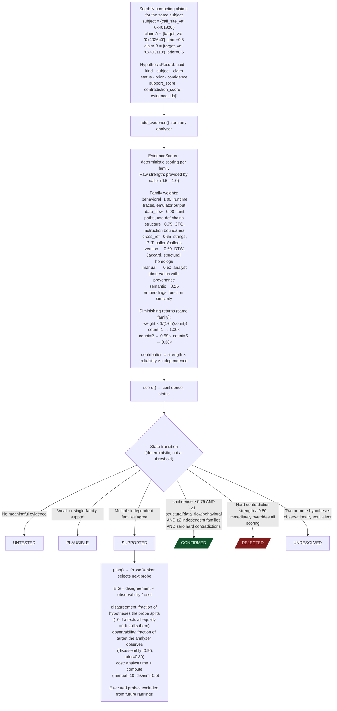

# Hypothesis Engine

Structured competing-hypothesis orchestration for binary reverse engineering. Seeds candidate explanations, scores evidence from every analyzer family, ranks probes by expected information gain, and transitions hypotheses to CONFIRMED or REJECTED via deterministic rules.

**Modules:**
- `ablation.analyzers.hypothesis_models`: data model + JSON persistence
- `ablation.analyzers.evidence_scorer`: confidence scoring + state transitions
- `ablation.analyzers.probe_ranker`: probe candidate generation + EIG ranking
- `ablation.analyzers.hypothesis_engine`: session lifecycle + orchestration

---

## Why this exists

One structural gap blocked systematic RE:

**Without a hypothesis record, every analysis session is amnesiac.**
A taint tracker returns a list of findings. A semantic searcher returns ranked VAs. Without a framework that asks "which of my competing explanations does this evidence support, and what should I run next?", the analyst replays the same investigations in every session and cannot quantify progress. `HypothesisEngine` is the connective tissue: it holds the hypotheses, receives evidence from any analyzer, scores confidence deterministically, and plans the next probe that maximally distinguishes remaining candidates.

---

## Architecture



---

## Quick start

```python
from ablation.analyzers.hypothesis_engine import HypothesisEngine

engine = HypothesisEngine.from_binary('/path/to/binary', architecture='arm64')

# Seed two competing indirect call targets
h_yes, h_no = engine.seed(
    kind='indirect_call_target',
    subject={'call_site_va': '0x401920'},
    claims=[
        {'target_va': '0x4026c0'},
        {'target_va': '0x403110'},
    ],
    prior=0.5,
)

# Record data_flow evidence from TaintTracker supporting h_yes
engine.add_evidence(
    analyzer='ARM64TaintTracker',
    family='data_flow',
    subject={'va': '0x4026c0'},
    observation={'source_to_sink': True, 'path_length': 3},
    relation='supports',
    hypothesis_ids=[h_yes.id],
    strength=0.80,
)

# Plan: rank remaining probes by EIG
print(engine.plan())

# Full report
print(engine.report())

# Persist session
engine.save()
```

---

## Evidence families and weights

| Family | Weight | Examples |
|---|---|---|
| `behavioral` | 1.00 | Runtime traces, emulator output (Phase 3) |
| `data_flow` | 0.90 | Taint paths, use-def chains from TaintTracker |
| `structure` | 0.75 | CFG edge counts, instruction boundaries |
| `cross_reference` | 0.65 | String xrefs, PLT callers, BinaryContext callees |
| `version` | 0.60 | Jaccard homolog, DTW score, anchor scan result |
| `manual` | 0.50 | Analyst observation with explicit provenance |
| `semantic` | 0.25 | BERT embedding similarity from SemanticSearcher |

Semantic evidence scores 0.25 because embedding similarity is useful for prioritization but insufficient for confirmation. Two disassembly-level structural items from different angles outweigh any number of embedding hits.

---

## Probe kinds and EIG parameters

| Kind | Analyzer | Cost | Observability | Notes |
|---|---|---|---|---|
| `disassembly` | Capstone | 0.5 | 0.95 | Fast; covers most structure questions |
| `xref` | XRefGraph | 0.8 | 0.85 | Answers "what calls this" |
| `cfg` | CFGBuilder | 1.0 | 0.90 | Block structure, loop presence |
| `lifter` | BinaryLifter | 1.5 | 0.80 | Pseudo-C IR with register types |
| `semantic` | SemanticSearcher | 2.0 | 0.60 | Embedding similarity sweep |
| `version` | DTWMatcher | 2.5 | 0.70 | Cross-version homolog check |
| `taint` | ARM64TaintTracker | 3.0 | 0.80 | Source-to-sink path confirmation |
| `manual` | analyst | 10.0 | 1.00 | Reserved for decisive ground truth |

A `disassembly` probe at cost=0.5 with high disagreement beats a `taint` probe at cost=3.0 unless the taint probe has dramatically higher observability for this specific question.

---

## Hypothesis kinds

```
code_region          — is this byte range code or data?
data_region          — is this struct/array?
function_entry       — is this VA a function start?
function_boundary    — where does this function end?
indirect_call_target — what does BLR/BLX at VA dispatch to?
memory_region        — what object does this address belong to?
input_source         — is this the network recv entry point?
security_sink        — is this a security-relevant sink?
source_to_sink_path  — does taint reach from source to sink?
version_homolog      — is this the same function across two builds?
architecture_mode    — ARM (A32) or Thumb (T32) at this VA?
```

---

## CONFIRMED transition rules

`CONFIRMED` is a state, not a threshold crossing:

```
confidence >= 0.75
AND at least one item from {structure, data_flow, behavioral}
AND at least two independent evidence families
AND no hard contradiction (strength >= 0.80 on any contradicting item)
```

Hard contradictions are immediate: one contradicting item with strength ≥ 0.80 sets status to `REJECTED` regardless of any support evidence. This prevents accumulating weak supporting evidence that outweighs a decisive contradiction.

---

## API reference

```python
# Session construction
engine = HypothesisEngine.from_binary(binary_path, architecture='arm64')
engine = HypothesisEngine.load('~/.ablation/sessions/S-abc123.json')

# Seeding
hypotheses = engine.seed(kind, subject, claims=[...], prior=0.5)
hypothesis  = engine.seed_one(kind, subject, claim, prior=0.5)

# Evidence recording (confidence updated immediately on each add_evidence call)
ev = engine.add_evidence(
    analyzer, family, subject, observation,
    relation='supports'|'contradicts'|'neutral',
    hypothesis_ids=[...],
    strength=0.5,        # 0.5 = weak, 0.8 = strong, 0.95 = decisive
)
ev = engine.add_hard_contradiction(
    analyzer, family, subject, observation,
    hypothesis_ids, explanation
)

# Planning (dry-run — selects probe, does not execute it)
plan_str = engine.plan(top_n=5)
probe    = engine.next_probe()

# Stepping (Phase 3: execute probe via adapter, record evidence)
probe = engine.step(kind='cfg', approved=True)
steps = engine.run_until_stable(max_steps=8)

# Reporting and persistence
report_str = engine.report()
engine.save()                               # ~/.ablation/sessions/<id>.json
engine.export_report('/path/to/out.json')
```

---

## Session persistence

Sessions live at `~/.ablation/sessions/<session_id>.json`. They contain: binary SHA-256, all hypothesis records with full provenance, all evidence records with analyzer ID + parameters, and all executed probe records. Sessions are deterministic: given the same binary and the same probe sequence, the same hypotheses reach the same states.

---

## Scoring internals

`EvidenceScorer.score()` computes `(confidence, status, contradiction_notes)`:

```python
scorer = EvidenceScorer(configuration={'family_weights': {...}})
confidence, status, notes = scorer.score(hypothesis, evidence_items)
scorer.update_hypothesis(hypothesis, evidence_items)  # writes scores in place
print(score_report(hypothesis, evidence_items))
```

`ProbeRanker.plan_report()` prints EIG for every unexecuted probe kind across all active hypotheses:

```python
ranker = ProbeRanker()
probes = ranker.generate(hypotheses, executed_kinds=[], max_candidates=10)
probe  = ranker.top_probe(hypotheses)
print(ranker.plan_report(hypotheses, top_n=5))
```
