# LoongArch64 Analysis Stack

Pure-Python LoongArch64 (LA64) decoder, CFG builder, and interprocedural taint tracker. Capstone 5.x has no LoongArch support, so the entire decode path is Python. Instruction table source: binutils 2.41 `opcodes/loongarch-opc.c`. Targets stripped ELF binaries compiled for the lp64 ABI: TencentOS 4.6 server packages, Loongson firmware, EDK2/GRUB2 EFI modules, and kernel drivers.

---

## Why this exists

Two gaps blocked LoongArch64 security analysis before this stack:

**1. No disassembler for LA64 in any Python-accessible library.**
Capstone 5.x does not support LoongArch. Radare2 supports it but has no Python API compatible with Ablation's pipeline. The only path was a pure-Python decoder built directly from the binutils opcode table. Every LA64 tool in Ablation depends on `loongarch_decoder` at the bottom.

**2. KASAN/KCOV instrumentation inflated kernel function instruction counts by ~40%.**
A kernel binary built with `CONFIG_KASAN=y` inserts a 4–6 instruction shadow-map-check preamble before virtually every memory access. Without stripping this noise, taint analysis on the debug kernel misattributes the instrumentation hooks as real program logic and produces thousands of false positive call edges. `loongarch_decoder_v2` tags and strips these ghosts.

---

## Module stack

```mermaid
flowchart TD
    A[/"/path/to/binary.elf"/] --> B["loongarch_decoder (V1)\nFixed-width 32-bit LE instruction decode\nALU · immediate · CSR/TLB/privilege · FP compare\nload/store · atomics · barriers · float load/store\nbranch/call/return\nLSX/LASX → .word (deferred)\njirl polymorphism: $zero/$ra/$ra → ret/call/br"]

    B --> C["loongarch_decoder_v2 (KASAN/KCOV-aware)\nPass 1 — BL tagging:\n  every bl targeting KASAN_SYMBOL_PREFIXES\n  or KCOV_SYMBOL_PREFIXES → is_instrumentation=True\nPass 2 — preamble walk:\n  from each tagged BL, walk backward up to 6 insns\n  tag: srli.d / lu12i.w / addi.d / ld.b / andi / add.d\n  stop: on call, branch, store, or function start\ndecode_frames_clean() skips all instrumentation"]

    C --> D["isa_loongarch64 + insn_loongarch64\nRegister model: $zero · $ra · $tp · $sp\n  $a0-$a7 · $t0-$t8 · $fp · $s0-$s8\nlp64 ABI: ARG_REGS=($a0..$a7), RET_REGS=($a0,$a1)\ninsn_loongarch64: typed Reg/Imm operands from op_str"]

    D --> E["cfg_loongarch64\nLeader set: entry VA + branch targets + fallthrough\nSplits at terminators (branch, call, ret, ertn, break)\nCalls treated as fall-through (callee abstracted)\nIndirect branches → no successors"]

    E --> F["analysis_loongarch64\nFlow-sensitive, path-insensitive fixpoint analysis\nLoop widening: bounded-iteration then widen to top\nState: taint_reg(name, label) / mem_taint(base, off)"]

    F --> G["LoongArch64TaintTracker\nInterprocedural BFS over call graph\nPLT/GOT stub resolution: .rela.plt + .dynsym\nFunction start: symbols + addi.d $sp,$sp,-N prologue\nfrom_path_full() adds: eh_frame FDE / DWARF / BTF"]

    style A fill:#1e293b,stroke:#475569,color:#e2e8f0
    style G fill:#14532d,stroke:#166534,color:#dcfce7
```



---

## Quick start

```python
from ablation.analyzers.taint_tracker_loongarch64 import LoongArch64TaintTracker

tt = LoongArch64TaintTracker.from_path("libc-2.38.so.loongarch64")
findings = tt.run_interprocedural()
print(tt.report(findings))

# Stripped binary — use from_path_full for full function coverage
tt = LoongArch64TaintTracker.from_path_full("libssl.so.3.0.loongarch64")
findings = tt.run_interprocedural()
```

---

## PLT/GOT stub format

LoongArch PLT stubs are 4 instructions × 4 bytes = 16 bytes (same width as AArch64):

```
  PLT stub (one external function):
    pcalau12i  $t3, page_off    ; PC-relative page load — GOT page address
    ld.d       $t3, $t3, off   ; load function pointer from GOT slot
    jirl       $zero, $t3, 0   ; indirect branch — no link (rd=$zero)
    nop                         ; alignment pad

  Key: jirl $zero,$rj,0 is classified as is_branch=True (not a call) because
  rd=$zero means no return address is saved. The decoder handles jirl polymorphism:

  jirl rd  rj  offset  | rd=$zero, rj=$ra, offset=0  → is_ret=True
  jirl rd  rj  offset  | rd=$ra,   rj=any, any        → is_call=True
  jirl rd  rj  offset  | rd=$zero, rj≠$ra, any        → is_branch=True
```

`_load_elf()` merges all PLT stub addresses from `.rela.plt` + `.dynsym` into the symbol map. A `bl <plt_stub_va>` resolves to the exact imported name without requiring the ±16-byte tolerance scan in `_PLT_TOL`.

### LoongArch relocation types

| Constant | Value | Meaning |
|---|---|---|
| `R_LARCH_NONE` | 0 | No-op |
| `R_LARCH_JUMP_SLOT` | 5 | GOT entry for lazy-bind PLT call |
| `R_LARCH_RELATIVE` | 3 | Base-address-relative fixup |
| `R_LARCH_IRELATIVE` | 12 | GNU IFUNC indirect relocation |
| `R_LARCH_TLS_TPREL64` | 11 | Thread-local initial-exec offset |

---

## lp64 register roles

| Range | ABI names | Role |
|---|---|---|
| r0 | `$zero` | Hardwired zero |
| r1 | `$ra` | Return address (caller-saved) |
| r2 | `$tp` | Thread pointer (OS-managed) |
| r3 | `$sp` | Stack pointer |
| r4–r11 | `$a0`–`$a7` | Arguments / return values (caller-saved) |
| r12–r20 | `$t0`–`$t8` | Caller-saved temporaries |
| r21 | `$r21` | Platform-reserved |
| r22 | `$fp` | Frame pointer (callee-saved) |
| r23–r31 | `$s0`–`$s8` | Callee-saved |

---

## Taint propagation rules

| Instruction class | Propagation |
|---|---|
| ALU 3-reg (`add.d`, `mul.d`, ...) | `rd = taint(rj) ∪ taint(rk)` |
| ALU reg-imm (`addi.d`, `ori`, ...) | `rd = taint(rj)` |
| `andi rd, rj, mask` | `rd = taint(rj)` with `bound = mask` if mask is 2^n-1 |
| Load (`ld.d`, `ldx.d`, ...) | `rd = mem_taint(base, off)` |
| Store (`st.d`, `stx.d`, ...) | `mem(base, off) = taint(rd)` |
| Atomic (`amadd.d`, ...) | `rd = old_mem_taint; mem = taint(rk) ∪ old` |
| `lu12i.w`, `pcaddi` | `rd = clean` (address constant — not tainted) |
| `addi.d $sp,$sp,-N` | Frame allocation — rebases `$sp`-relative memory slots |
| `addi.d $fp,$sp,N` | Records `$fp = $sp + N` in the frame-pointer map |
| Float ops | Not tracked at GPR level |

---

## Syscall tracking

When the constant-folding path has a value for `$a7` (set by `ori $a7,$zero,N` or `addi.d $a7,$zero,N`), the syscall is classified from the 318-entry asm-generic unistd.h table (Linux 6.6).

**ABI:** syscall number in `$a7`; args in `$a0`–`$a5`; return value in `$a0`.

| Track | Examples | Effect |
|---|---|---|
| `source` | read(63), recvfrom(207), recvmsg(212), getrandom(278) | `$a0` tainted with `syscall:network` |
| `sink` | execve(221), execveat(281), bpf(280), ptrace(117), kexec_load(104) | Finding emitted if any `$a0`–`$a5` tainted |
| `escalation` | setuid(146), setgid(144), setresuid(147), capset(91) | Finding emitted at CRITICAL severity |

When `$a7` is unknown or tainted, caller-saved registers are conservatively clobbered.

```python
from ablation.analyzers.syscall_loongarch64 import classify_syscall

classify_syscall(207)   # ('recvfrom', 'source')
classify_syscall(221)   # ('execve', 'sink')
classify_syscall(146)   # ('setuid', 'escalation')
```

---

## Exception path CFG treatment

| Mnemonic | CFG treatment | Taint treatment |
|---|---|---|
| `ertn` | No successors (exception return) | Terminates scan of exception handler |
| `break N` | No successors (trap) | Terminates scan |
| `dbcl N` | No successors (debug call) | Terminates scan |
| `syscall 0` | Fall-through | Classify via `$a7`; source taints `$a0`, sink emits finding |

---

## KASAN/KCOV stripping

A TencentOS kernel built with `CONFIG_KASAN=y` has roughly 40% of its instructions as instrumentation ghosts. Without stripping, taint analysis on the debug kernel produces thousands of false edges into `__asan_load8_noabort` and similar.

```python
from ablation.analyzers.loongarch_decoder_v2 import LoongArchDecoderV2

# Load symbol VAs from System.map (parses "<va> <type> <name>" format)
dec = LoongArchDecoderV2.from_system_map("/path/to/System.map")

# Full decode with instrumentation tags visible
for frame in dec.decode_frames_v2(section_bytes, base_addr):
    if frame.is_instrumentation:
        print(f"  [ghost {frame.idiom}] {frame.va:#x}")

# Clean decode — only real program instructions
for frame in dec.decode_frames_clean(section_bytes, base_addr):
    print(frame)

# Coverage stats
stats = dec.count_instrumentation(section_bytes, base_addr)
print(stats)
# {"total": 208, "instrumentation": 84, "real": 124, "pct_instrumentation": 40.4}
```

---

## Function start detection

`from_path()` uses two sources:
1. Symbol table entries (`st_value` in `.symtab` / `.dynsym`) within `.text`.
2. `addi.d $sp, $sp, -N` (N > 0) — standard GCC/Clang LA64 prologue.

`from_path_full()` adds three DWARF/CFI sources:

| Source | Section | When present | Yields |
|---|---|---|---|
| `.eh_frame` FDE records | `.eh_frame` | GCC default (stripped OK) | Function start VAs |
| DWARF subprogram entries | `.debug_info` | Requires `-g` build | Name + start + end VA |
| BTF func_info | `.BTF` + `.BTF.ext` | Kernel modules | Name + VA |

Use `from_path_full()` for stripped TencentOS binaries. `.eh_frame` recovers leaf functions and tail-call-optimised bodies that have no `addi.d $sp` prologue. When `.debug_info` is present, `high_pc` values are stored in `tt._dwarf_ends` for precise function end VAs.

---

## Kernel module sources and sinks

For kernel modules, `_SOURCE_NAMES` and `_SINK_NAMES` extend to kernel-space names:

| Function | Track | Notes |
|---|---|---|
| `copy_from_user`, `get_user`, `strncpy_from_user` | source | User-to-kernel memory copy |
| `memdup_user`, `nla_get_string`, `nla_data` | source | Netlink / sysfs attribute reads |
| `copy_to_user`, `put_user` | sink | Kernel-to-user memory copy |
| `call_usermodehelper`, `kernel_execve` | sink (CRITICAL) | Exec from kernel space |
| `commit_creds`, `prepare_kernel_cred` | escalation (CRITICAL) | Privilege escalation |
| `kmalloc`, `kzalloc`, `vmalloc` | sink (HIGH) | Size-controlled allocation |
