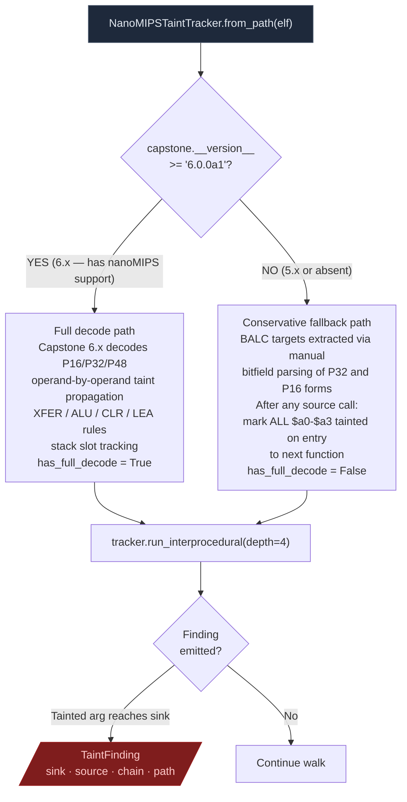
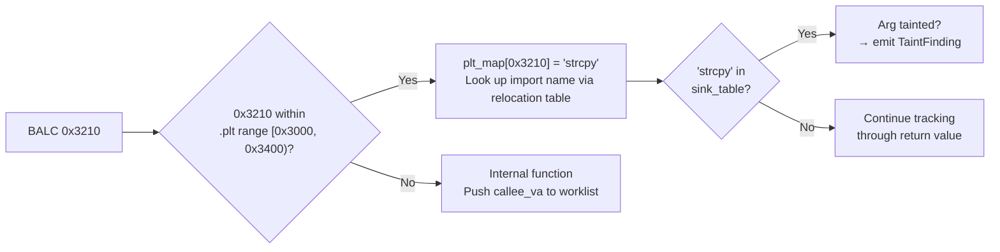

# nanoMIPS Taint Analysis

Interprocedural taint tracker for nanoMIPS binaries. Two-path execution: full register-level decode via Capstone 6.x, or conservative frame-walk fallback on Capstone 5.x.

Targets: Ingenic X-series SoCs (JZ4780, X1000, X2000), MediaTek Helio embedded, MIPS32r6 microcontrollers.

---

## Why this exists

Two things were not possible before `NanoMIPSTaintTracker`:

**1. Any automated taint analysis on nanoMIPS at all.**
nanoMIPS is a variable-width ISA (16, 32, and 48-bit instructions) with no branch delay slots and different call instructions than MIPS32. BALC replaces JAL/JALR; JRC $ra replaces JR $ra. No public taint tool handled this before Ablation. The tracker was built from the binutils 2.41 nanoMIPS opcode table and the Ingenic X1000 SDK firmware as the reference binary.

**2. Reliable BALC call target resolution.**
The two BALC forms (P32 and P16) encode call targets as signed PC-relative offsets in non-obvious bitfield layouts. Getting the target wrong means the interprocedural walk misses the callee entirely. The tracker extracts both forms exactly: P32 BALC target = VA + 4 + sign_extend_26(bits[25:0]) shifted left 1. P16 BALC target = VA + 2 + sign_extend_10(bits[9:0]) shifted left 1.

---

## ISA overview

nanoMIPS uses three instruction widths. The width is determined by bits[15:11] of the first halfword:

```
  nanoMIPS instruction widths
  ─────────────────────────────────────────────────
  P16 (16-bit):  bits[15:11] in range 0x10-0x17, 0x1A-0x1F
  P32 (32-bit):  bits[15:11] < 0x10 or other ranges
  P48 (48-bit):  bits[15:11] = 0x18 (LI48, ADDIU48)

  The 48-bit encoding is rare. Most code is P32 with P16
  for small operations (short branches, stack adjustments).

  Call instructions (no branch delay slot):
    BALC P32:  opcode[31:26] = 0x2a
               target = VA + 4 + sign_extend_26(insn[25:0]) << 1
               range: +/-64 MB from current PC

    BALC P16:  opcode[15:10] = 0b110010 (0x32)
               target = VA + 2 + sign_extend_10(insn[9:0]) << 1
               range: +/-1 KB from current PC

    JALRC P32: indirect call via register

  Return:
    JRC $ra    (no delay slot; replaces MIPS32 JR $ra)

  ABI registers (O32-compatible subset):
    $a0-$a3   first four function arguments
    $v0/$v1   return values
    $t0-$t9   caller-saved temporaries
    $s0-$s7   callee-saved (preserved across calls)
    $ra ($31) return address
    $sp ($29) stack pointer
```

MIPS32 delay slots required the instruction after a branch or call to execute before the branch took effect. nanoMIPS eliminates delay slots entirely, so the instruction immediately after a BALC is the first instruction of the fall-through path. The tracker accounts for this when walking the call graph.

---

## Two execution paths



The fallback is deliberately conservative. After any call to a known source (`recv`, `read`, etc.), all four argument registers are marked tainted on entry to the next function. This avoids false negatives at the cost of more candidates to triage manually. The full decode path is precise: only the actual register that receives the `recv` return value carries taint.

---

## PLT stub unwrapping

nanoMIPS PLT stubs are 12 bytes. Each stub loads the GOT address and jumps through it. The tracker identifies `.plt` section boundaries and resolves PLT call targets to import names before the interprocedural walk begins.



Without PLT unwrapping, every call to `strcpy` or `system` terminates the interprocedural trace at the stub VA. The trace stops before it can confirm the dangerous sink was reached.

---

## Usage

```python
from ablation.analyzers.taint_tracker_nanomips import NanoMIPSTaintTracker

tracker = NanoMIPSTaintTracker.from_path('firmware.elf')
print(f"Full decode: {tracker.has_full_decode}")

findings = tracker.run_interprocedural(depth=4)
print(tracker.report(findings))
```

Custom sinks for vendor-specific exec wrappers:

```python
tracker = NanoMIPSTaintTracker.from_path('firmware.elf',
    custom_sinks={'vendor_exec': {0: 0}})
findings = tracker.run_interprocedural()
```

---

## Sources and sinks

| Category | Functions |
|---|---|
| Sources | `recv`, `recvfrom`, `read`, `fgets`, `gets`, `fread`, `recvmsg` |
| Exec sinks | `system`, `popen`, `execve`, `execl`, `execvp` |
| Memory sinks | `strcpy`, `strcat`, `sprintf`, `snprintf`, `memcpy`, `memmove`, `bcopy` |
| I/O sinks | `write`, `send`, `sendto` |
