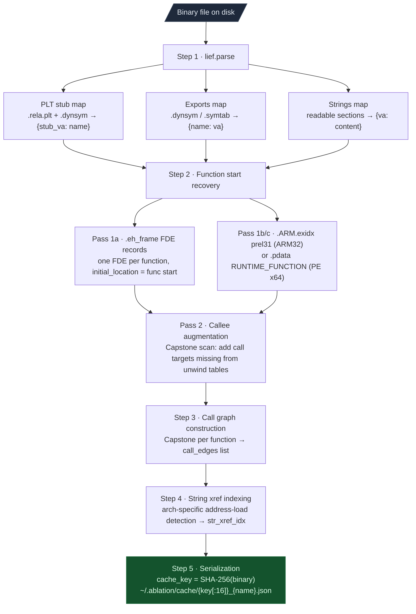
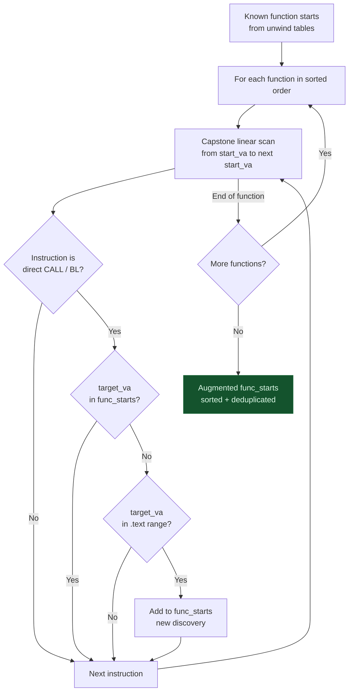
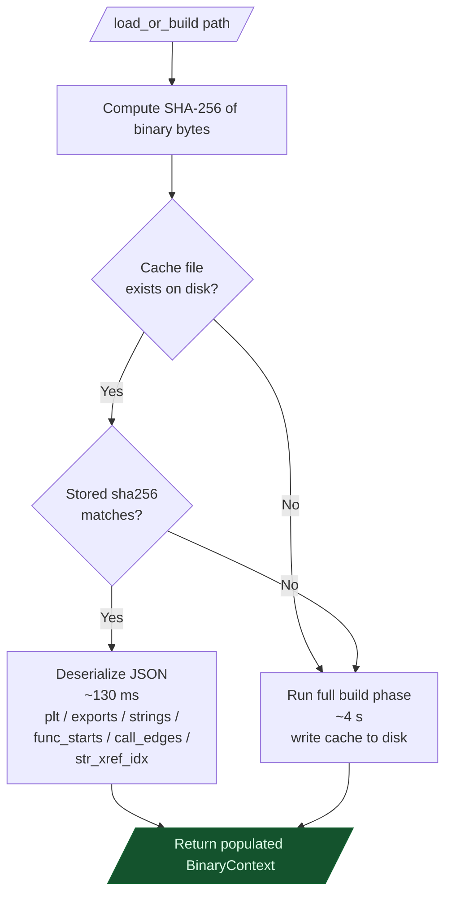
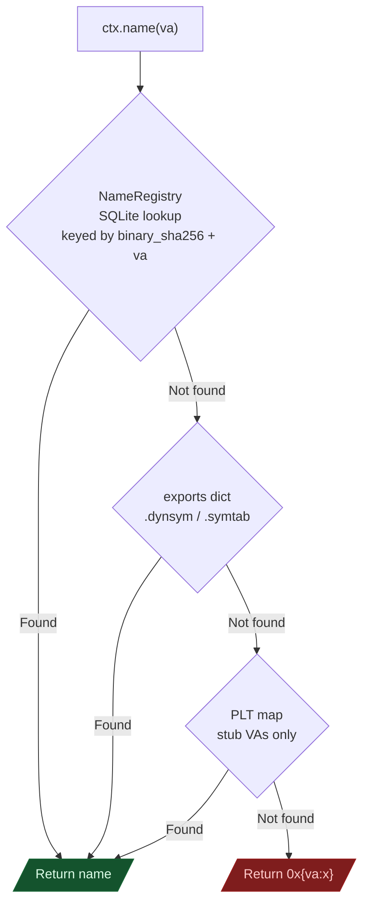
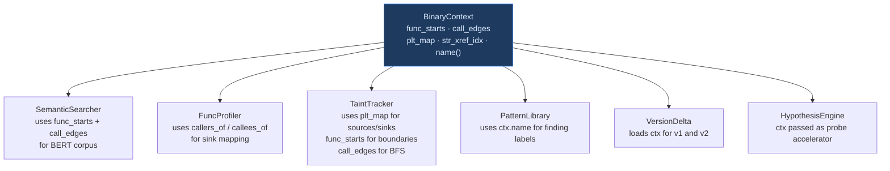

# On-Demand Analysis

Every session with a binary starts by loading `BinaryContext`. It builds a lightweight index of the binary once and reloads that index in under 200 milliseconds on every subsequent session. The cost of analyzing a new binary falls to a few seconds the first time and becomes nearly instant after that.

---

## Why this exists

### The startup time problem

IDA Pro's autoanalysis on a 50 MB firmware binary runs for 5 to 20 minutes before the UI is interactive. Ghidra's analysis pipeline is similar. Every session restart pays that full cost again. If you are iterating on a taint tracker or testing a new semantic query, that wait becomes a serious obstacle to experimentation.

BinaryContext solves this by separating the expensive work from the repeatable work. The expensive part runs once: parse the binary, recover function starts, build the call graph. The result is serialized to a JSON file keyed on the binary's SHA-256 hash. Every subsequent session deserializes that file directly. Python's JSON parser reads 10 MB of pre-parsed data in about 80 milliseconds. Add 50 milliseconds to compute the SHA-256, and the total reload time is roughly 130 milliseconds.

The SHA-256 key ensures the cache never goes stale. Any change to the binary produces a different hash and triggers a full rebuild. There is no version tag, no timestamp, no partial invalidation. The binary itself is the truth, and the hash is the gate.

### The GUI dependency problem

Getting "which functions call `strcpy`?" in IDA requires the GUI to be open, fully analyzed, and holding a license seat. `ctx.callers_of('strcpy')` answers the same question from the command line, in a script, or inside a taint tracker. No GUI. No license. The call graph lives in memory as a flat Python list.

This matters most in automated pipelines. A taint tracker calling `callers_of` on 200 different sinks in sequence would be unusable against an IDA backend. Against an in-memory list, it runs in milliseconds.

---

## Build phase

The build phase runs once per binary. It has five steps. Understanding each step tells you what the index can and cannot give you.



---

### Step 1 — Format parse and symbol extraction

The first step uses `lief` to parse the binary format and extract three symbol tables: PLT imports, exported symbols, and `.rodata` strings.

**Understanding the PLT**

The PLT (Procedure Linkage Table) is ELF's mechanism for lazy symbol binding. When you compile C code that calls `strcpy`, the compiler generates a call to a PLT stub rather than the actual `strcpy` address. On the first call, the stub invokes the dynamic linker, which resolves the symbol and patches the GOT entry. On subsequent calls, the GOT entry already holds the real address, so the stub jumps directly there.

For reverse engineering, the PLT stub is what matters. Every call to `strcpy` goes through the same stub VA. If you know that PLT stub at `0x3000` is `strcpy`, you find every caller by scanning for calls to `0x3000`. BinaryContext builds this mapping automatically from `.rela.plt`.

The ELF linker records PLT-to-symbol mappings in `.rela.plt` as `Elf64_Rela` structs:

```
  Elf64_Rela layout (24 bytes per entry):
  ┌─────────────────────────────────────────────────────────────┐
  │  r_offset   8 bytes  VA of the GOT slot to be patched       │
  │  r_info     8 bytes  upper 32 bits = .dynsym index          │
  │                      lower 32 bits = reloc type             │
  │                      (R_X86_64_JUMP_SLOT = 7 for PLT)       │
  │  r_addend   8 bytes  always 0 for JUMP_SLOT entries         │
  └─────────────────────────────────────────────────────────────┘

  Resolution chain:
    sym_index   = r_info >> 32
    sym_name    = dynsym[sym_index].st_name    → index into .dynstr
    import_name = .dynstr[sym_name]            → null-terminated string
    stub_va     = plt_va + 16 + (N * 16)       → N = entry position

  x86-64 PLT stub (16 bytes per import):
  ┌─────────────────────────────────────────────────────────────┐
  │  offset  0:  FF 25 XX XX XX XX   JMP [RIP+disp]  → GOT slot │
  │  offset  6:  68 NN 00 00 00      PUSH N  (reloc index)      │
  │  offset 11:  E9 XX XX XX XX      JMP PLT[0]  (resolver)     │
  └─────────────────────────────────────────────────────────────┘
  After the dynamic linker runs, GOT[slot] holds the real address.
  The JMP at offset 0 goes directly there on every subsequent call.
```

PE binaries use the IAT (Import Address Table) with the same concept: a table of function pointers patched at load time. BinaryContext reads the import directory's INT and IAT to build `iat_map[thunk_va] = 'module!function'`.

---

### Step 2 — Function start recovery

Recovering function starts in a stripped binary is a two-pass process. The first pass reads the binary's own unwind data. The second pass fills the gaps.

**Why unwind tables survive strip(1)**

C++ exception handling and signal delivery both need to unwind the call stack. To unwind a frame, the runtime needs to know which function owns a given PC value and what that function does to the stack. GCC solves this by emitting one Frame Description Entry (FDE) per function in `.eh_frame`. The FDE records the function's start VA, its byte length, and instructions for restoring the previous frame.

The critical point: `strip(1)` cannot remove `.eh_frame`. The runtime linker reads it at program startup to register unwind information with the OS. Remove it and exception handling breaks. So in any binary compiled with GCC or Clang at default settings, `.eh_frame` contains a complete function start list, even when the symbol table is gone. This is a design feature of the C++ ABI that becomes a gift for reverse engineering.

```
  .eh_frame record types:

  CIE (Common Information Entry) — one per compilation unit:
  ┌─────────────────────────────────────────────────────────────┐
  │  length         4 B   total CIE size minus length field     │
  │  CIE_id         4 B   always 0 (distinguishes CIE vs FDE)  │
  │  version        1 B   1 = DWARF 2, 3 = DWARF 3             │
  │  augmentation   str   "zR" = pointer format encoded below   │
  │  code_align   uleb128 instruction size quantum (1 for x86)  │
  │  data_align   sleb128 stack slot size factor (-8 for x64)   │
  │  return_addr  uleb128 register number of return address     │
  │  aug_data      var    pointer encoding byte (pcrel / abs)   │
  │  initial_insns var    CFA baseline rules (push rbp, etc.)   │
  └─────────────────────────────────────────────────────────────┘

  FDE (Frame Description Entry) — one per function:
  ┌─────────────────────────────────────────────────────────────┐
  │  length         4 B   total FDE size minus length field     │
  │  CIE_ptr        4 B   byte offset back to parent CIE        │
  │  initial_location ptr  ← FUNCTION START VA                  │
  │  address_range  ptr    ← function byte length               │
  │  aug_data_len uleb128  augmentation data length             │
  │  aug_data       var    LSDA pointer for C++ exceptions       │
  │  call_frame_insns var  how to unwind registers per PC offset │
  └─────────────────────────────────────────────────────────────┘

  initial_location encoding (from CIE augmentation byte):
    DW_EH_PE_pcrel (0x10):  abs_va = FDE_field_VA + encoded_value
    DW_EH_PE_absptr (0x00): abs_va = encoded_value directly
```

ARM32 binaries use `.ARM.exidx` instead. Each entry is two 32-bit words. The first encodes the function start as a prel31 value: `abs_va = (field_va & ~1) + sign_extend(value, 31)`. PE x86-64 binaries use `.pdata`, an array of `RUNTIME_FUNCTION` structs with `BeginAddress` fields.

**Callee augmentation: recovering what unwind tables miss**

Unwind tables are comprehensive but not complete. Hand-written assembly functions, early-exit stubs, compiler-generated cold paths, and tail-call targets sometimes have no FDE. They do get called from known functions, so BinaryContext can discover them by scanning call targets.



What callee augmentation recovers in practice: functions compiled with `-fno-unwind-tables`, trampolines and wrapper stubs called from multiple sites, and inline assembly blocks the compiler treats as separate function boundaries.

---

### Step 3 — Call graph construction

With function boundaries established, BinaryContext disassembles each function body and extracts every direct call it makes. The result is a flat list of `(caller_va, callee_va, label)` tuples.

Indirect calls — `BLR`, `CALL [rax]`, `JALR $t9` — are skipped at this stage because the callee address is not statically determinable. VtableResolver handles C++ virtual dispatch separately.

| Architecture | Direct call instructions detected |
|---|---|
| x86-64 | `CALL rel32` / `CALL r/m64` |
| ARM64 | `BL imm26` (BLR is indirect — skipped) |
| ARM32 | `BL imm24` / `BLX imm24` |
| MIPS32 | `JAL imm26` / `JALR $ra,$t9` |
| LA64 | `BL offset26` / `JIRL $ra,rj,0` |
| nanoMIPS | `BALC` P32/P16 (bitfield resolved) |

The final `call_edges` list for a large firmware binary typically holds 50,000 to 300,000 entries. It lives entirely in memory. A linear scan over 200,000 entries costs about 2 milliseconds in CPython, so no additional index is needed.

---

### Step 4 — String cross-reference index

Strings in `.rodata` are inert until something loads their address. The cross-reference index connects function bodies to the strings they reference. This is what makes `ctx.strings_in_func(va)` fast — the index was built during the disassembly pass, not on demand.

The challenge is that "load a string address" looks different on every ISA. BinaryContext tracks architecture-specific patterns across instruction boundaries:

```
  x86-64 — RIP-relative LEA:
    LEA rX, [RIP + disp32]
      target = insn_va + insn_length + sign_extend32(disp)

  ARM64 — two-instruction ADRP + ADD pair:
    ADRP Xn, label               ; loads page address into Xn
      pending_adrp[Xn] = (insn_va & ~0xFFF) + (imm21 << 12)
    ADD  Xn, Xn, #offset         ; adds within-page offset
      full_va = pending_adrp[Xn] + offset
      del pending_adrp[Xn]

  ARM32 — literal pool load:
    LDR Rd, [PC, #N]
      pool_va = (insn_va + 8) & ~3 + N
      addr    = read_u32(binary, pool_va - load_addr)

  MIPS32 — LUI + ADDIU pair:
    LUI   $t0, hi16              ; upper 16 bits
      pending_lui[$t0] = hi16 << 16
    ADDIU $t0, $t0, lo16         ; lower 16 bits (sign-extended)
      full_va = pending_lui[$t0] + sign_extend16(lo16)
      del pending_lui[$t0]
```

For each architecture, if the resolved address falls in `strings_map`, it is recorded: `str_xref_idx[func_va].append(string_va)`.

---

### Step 5 — Serialization and the cache key

```
  Cache file naming:
    key  = SHA-256(all binary bytes)                      (64 hex chars)
    path = ~/.ablation/cache/<key[:16]>_<basename>.json

  Two versions of the same binary coexist without collision:
    firmware_v1.so → a3f9b2c1d4e5f678_firmware_v1.json
    firmware_v2.so → b7c4d3e2f1a0b9c8_firmware_v2.json

  Build timing for a 50 MB stripped ELF (19,000 functions):
    lief parse                  ~80 ms
    .eh_frame FDE scan          ~30 ms
    callee augmentation        ~250 ms
    call graph (Capstone)      ~3.5 s    ← bottleneck
    string xref indexing       ~100 ms
    JSON serialize + write     ~200 ms
    ───────────────────────────────────
    First run total            ~4.2 s

    Reload (SHA-256 + JSON parse): ~130 ms
```

---

## Reload phase



A "stored sha256 doesn't match" case happens when two different binaries share a filename (e.g., two versions of `libssl.so`) and the first 16 hex digits of their SHA-256 happen to differ but the basename is the same. The inner SHA-256 check catches this and forces a rebuild rather than returning stale data.

---

## What is indexed

| Attribute | Type | Content |
|---|---|---|
| `ctx.plt` | `{int: str}` | PLT stub VA to import name |
| `ctx.exports` | `{str: int}` | Export name to VA |
| `ctx.strings` | `{int: str}` | String VA to content |
| `ctx.func_starts` | `list[int]` | Sorted function entry VAs |
| `ctx.call_edges` | `list[tuple]` | `(caller_va, callee_va, label)` |
| `ctx.str_xref_idx` | `{int: list[int]}` | Func VA to referenced string VAs |

---

## The name overlay

`ctx.name(va)` returns a human-readable name for any VA. This is the single most important rule in Ablation: always use `ctx.name(va)` rather than printing raw hex. Function names accumulate over time. A VA that is opaque hex in session one might have a confirmed name by session three. Using `ctx.name(va)` consistently means that improvement propagates everywhere automatically.



The NameRegistry is a SQLite database at `~/.ablation/names.db`. Names are keyed on `(binary_sha256, va)`, not on filename. Renaming or moving the binary file does not lose the overlay.

```sql
CREATE TABLE function_names (
    binary_sha256  TEXT NOT NULL,
    va             INTEGER NOT NULL,
    name           TEXT NOT NULL,
    source         TEXT,        -- 'confirmed' / 'pclntab' / 'pdb' / etc.
    timestamp      INTEGER,
    PRIMARY KEY (binary_sha256, va)
);
```

`ctx.set_name(va, name, source='confirmed')` inserts at Layer 1. Call it the moment you confirm a function's purpose. The name will appear in every future session and every tool that calls `ctx.name(va)`.

---

## callers_of and callees_of

Both methods walk `call_edges` in memory. The graph is a flat Python list because the query patterns Ablation needs — "all callers of X" and "all callees of function at VA" — are both linear scans, and a 200,000-entry scan costs about 2 ms in CPython.

```python
call_edges = [
    (0x4000, 0x3000, 'strcpy'),   # func 0x4000 calls strcpy PLT stub
    (0x4000, 0x4280, '0x4280'),   # func 0x4000 calls internal func
    (0x4120, 0x3000, 'strcpy'),   # func 0x4120 also calls strcpy
    (0x4280, 0x3010, 'malloc'),   # func 0x4280 calls malloc
]

# All callers of strcpy — filter by label
ctx.callers_of('strcpy')
# → [(0x4000, 'strcpy'), (0x4120, 'strcpy')]

# Same result using the PLT stub VA directly
ctx.callers_of(0x3000)

# All callees of a specific function — filter by from_va
ctx.callees_of(0x4000)
# → [(0x3000, 'strcpy'), (0x4280, '0x4280')]
```

For repeated queries in a hot loop, build an inverted index once:

```python
from collections import defaultdict

callers_idx = defaultdict(list)
for (f, t, l) in ctx.call_edges:
    callers_idx[l].append((f, l))
    callers_idx[t].append((f, l))

# O(1) lookup from here
callers_idx['strcpy']
```

---

## Where BinaryContext fits in the pipeline

BinaryContext is the foundation every other Ablation tool builds on. Understanding its contract tells you when it is enough and when you need to reach for something heavier.



BinaryContext does not replace a full decompiler for deep manual RE. It covers the analysis surface needed for automated vulnerability scanning: PLT imports, exported functions, string xrefs, and the call graph. That surface is enough for taint analysis, semantic search, and pattern matching — the three tools that find most vulnerabilities in stripped firmware.

---

## Usage

```python
from ablation.analyzers.binary_context import BinaryContext

# First run: 0.5-5 s depending on binary size
ctx = BinaryContext.load_or_build('/path/to/binary.so')
print(ctx.summary())
# BinaryContext: firmware_v2.so
# Functions: 19432  Strings: 41206  Call edges: 198341
# PLT imports: 89   Exports: 12

# All callers of strcpy
for (va, label) in ctx.callers_of('strcpy'):
    print(f"  0x{va:x}  {ctx.name(va)}")

# All callees of a function
for (va, label) in ctx.callees_of(0x4000):
    print(f"  -> 0x{va:x}  {label}")

# Strings referenced by a function
for (sva, content) in ctx.strings_in_func(0x4000):
    print(f"  0x{sva:x}  {content!r}")

# Which functions reference a specific string?
for fva in ctx.funcs_referencing_string(0x6010):
    print(f"  {ctx.name(fva)}")

# Confirm a function name — persists across all future sessions
ctx.set_name(0x4000, 'parse_radius_packet', source='confirmed')
print(ctx.name(0x4000))   # 'parse_radius_packet'
```
