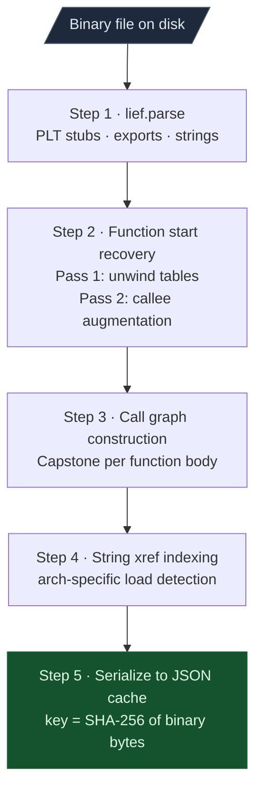
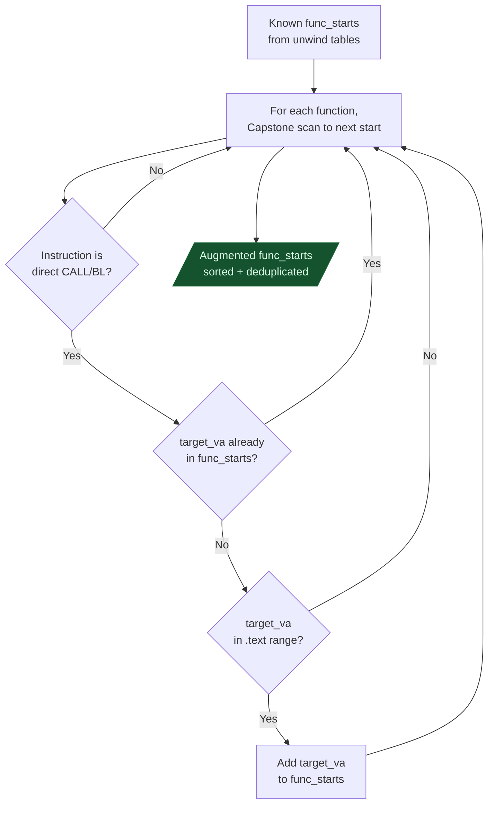
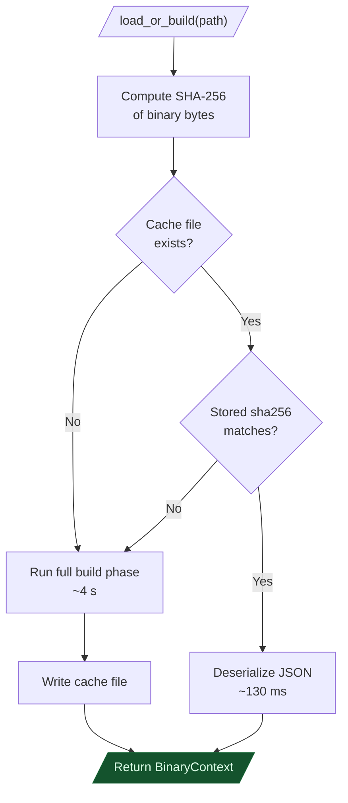
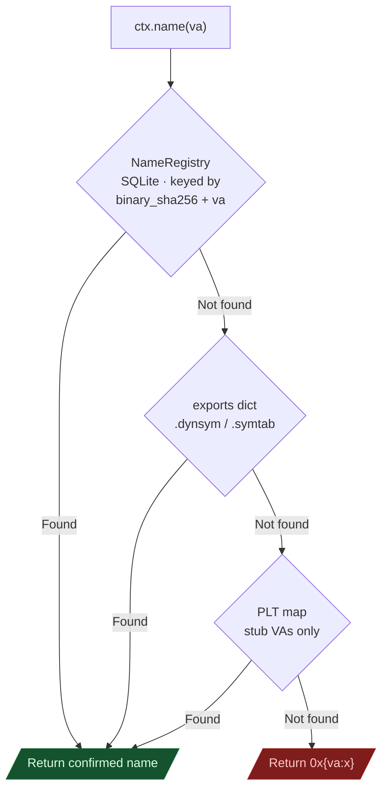
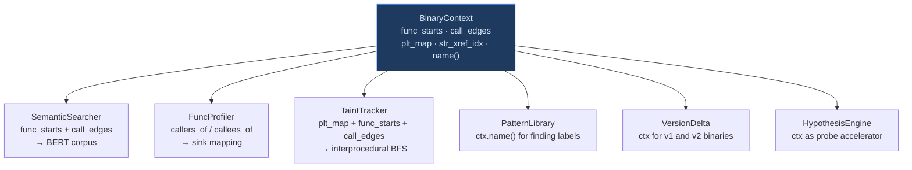

# On-Demand Analysis

Every session with a binary starts by loading `BinaryContext`. It builds a lightweight index of the binary once and reloads that index in under 200 milliseconds on every subsequent session. The cost of analyzing a new binary falls to a few seconds the first time and becomes nearly instant after that.

---

## Why this exists

### The startup time problem

IDA Pro's autoanalysis on a 50 MB firmware binary runs for 5 to 20 minutes before the UI is interactive. Ghidra's analysis pipeline is similar. Every session restart pays that full cost again. If you are iterating on a taint tracker or testing a new semantic query, that wait becomes a serious obstacle to experimentation.

BinaryContext solves this by separating the expensive work from the repeatable work. The expensive part runs once: parse the binary, recover function starts, build the call graph. The result is serialized to a JSON file keyed on the binary's SHA-256 hash. Every subsequent session deserializes that file directly. Python's JSON parser reads 10 MB of pre-parsed data in about 80 milliseconds. Add 50 milliseconds to compute the SHA-256, and the total reload time is roughly 130 milliseconds.

The SHA-256 key ensures the cache never goes stale. Any change to the binary produces a different hash and triggers a full rebuild. There is no version tag, no timestamp, no partial invalidation. The binary itself is the truth, and the hash is the gate.

### The GUI dependency problem

Getting "which functions call `strcpy`?" in IDA requires the GUI to be open, fully analyzed, and holding a license seat. `ctx.callers_of('strcpy')` answers the same question from the command line, in a script, or inside a taint tracker. No GUI. No license. The call graph lives in memory as a flat Python list, so filtering it is a single linear scan in Python.

---

## Build phase

The build phase runs once per binary. Understanding each of the five steps tells you what the index can and cannot give you.



---

### Step 1 — Format parse and symbol extraction

The first step uses `lief` to parse the binary format and extract three symbol tables: PLT imports, exported symbols, and `.rodata` strings.

**Understanding the PLT**

The PLT (Procedure Linkage Table) is ELF's mechanism for lazy symbol binding. When you compile C code that calls `strcpy`, the compiler generates a call to a PLT stub. On the first call, the stub invokes the dynamic linker, which resolves the symbol and patches the GOT entry. On subsequent calls, the GOT entry already holds the real address, so the stub jumps directly there.

Every call to `strcpy` goes through the same stub VA. If you know that PLT stub at `0x3000` maps to `strcpy`, you find every caller by scanning for calls to `0x3000`. BinaryContext builds this mapping from `.rela.plt`.

The ELF linker records PLT-to-symbol mappings in `.rela.plt`. Each entry is an `Elf64_Rela` struct:

| Field | Size | Description |
|---|---|---|
| `r_offset` | 8 bytes | VA of the GOT slot to be patched at runtime |
| `r_info` | 8 bytes | Upper 32 bits: `.dynsym` index. Lower 32 bits: reloc type (7 = `JUMP_SLOT`) |
| `r_addend` | 8 bytes | Always 0 for PLT entries |

Resolution chain: `sym_index = r_info >> 32` → `dynsym[sym_index].st_name` → index into `.dynstr` → `import_name`.

The x86-64 PLT stub is 16 bytes per import:

| Offset | Bytes | Instruction | Purpose |
|---|---|---|---|
| 0 | `FF 25 XX XX XX XX` | `JMP [RIP+disp]` | Jump through GOT slot |
| 6 | `68 NN 00 00 00` | `PUSH N` | Push relocation index |
| 11 | `E9 XX XX XX XX` | `JMP PLT[0]` | Call the dynamic linker resolver |

After the dynamic linker runs, the GOT slot holds the real function address. The `JMP` at offset 0 goes directly there on every subsequent call, bypassing the `PUSH + JMP` tail entirely.

PE binaries use the IAT (Import Address Table) with the same concept: a table of function pointers patched at load time. BinaryContext reads the import directory's INT and IAT to build `iat_map[thunk_va] = 'module!function'`.

---

### Step 2 — Function start recovery

Recovering function starts in a stripped binary is a two-pass process. The first pass reads the binary's own unwind data. The second pass fills the gaps.

**Why unwind tables survive strip(1)**

C++ exception handling and signal delivery both need to unwind the call stack. GCC solves this by emitting one Frame Description Entry (FDE) per function in `.eh_frame`. The FDE records the function's start VA and byte length. `strip(1)` cannot remove `.eh_frame` because the runtime linker reads it at startup to register unwind information with the OS. Remove it and exception handling breaks. In any binary compiled with GCC or Clang at default settings, `.eh_frame` contains a complete function start list even when the symbol table is gone. This is a design feature of the C++ ABI that becomes a gift for reverse engineering.

**CIE (Common Information Entry)** — one per compilation unit:

| Field | Type | Description |
|---|---|---|
| `length` | 4 bytes | Total CIE size minus the length field itself |
| `CIE_id` | 4 bytes | Always 0 (distinguishes CIE from FDE) |
| `version` | 1 byte | 1 = DWARF 2, 3 = DWARF 3 |
| `augmentation` | string | `"zR"` = pointer format encoded in aug_data |
| `code_align` | uleb128 | Instruction size quantum (1 for x86) |
| `data_align` | sleb128 | Stack slot size factor (−8 for x86-64) |
| `return_addr_reg` | uleb128 | Register number of return address |
| `aug_data` | variable | Pointer encoding byte (pcrel / absolute) |
| `initial_insns` | variable | CFA baseline rules (e.g., `push rbp`) |

**FDE (Frame Description Entry)** — one per function, contains the function start VA:

| Field | Type | Description |
|---|---|---|
| `length` | 4 bytes | Total FDE size minus the length field |
| `CIE_ptr` | 4 bytes | Byte offset back to the parent CIE |
| `initial_location` | ptr | **Function start VA** |
| `address_range` | ptr | Function byte length |
| `aug_data_len` | uleb128 | Length of augmentation data |
| `aug_data` | variable | LSDA pointer for C++ exceptions (if any) |
| `call_frame_insns` | variable | How to restore registers at each PC offset |

The `initial_location` encoding depends on the CIE's augmentation byte:
- `DW_EH_PE_pcrel (0x10)`: `abs_va = FDE_field_va + encoded_value`
- `DW_EH_PE_absptr (0x00)`: `abs_va = encoded_value` directly

ARM32 binaries use `.ARM.exidx` instead. Each entry is two 32-bit words. The first encodes the function start as a prel31 value: `abs_va = (field_va & ~1) + sign_extend(value, 31)`. PE x86-64 binaries use `.pdata`, which is an array of `RUNTIME_FUNCTION { BeginAddress, EndAddress, UnwindInfoAddress }` structs.

**Pass 2: Callee augmentation**

Unwind tables are comprehensive but not complete. Hand-written assembly, early-exit stubs, and tail-call targets sometimes have no FDE. They do get called from known functions, so BinaryContext discovers them by scanning call targets.



The pass runs once. Newly discovered callees are added to `func_starts` but their own bodies are not rescanned in the same pass.

---

### Step 3 — Call graph construction

With function boundaries established, BinaryContext disassembles each function body and extracts every direct call it makes. The result is a flat list of `(caller_va, callee_va, label)` tuples. Indirect calls are skipped because the callee address is not statically determinable. VtableResolver handles C++ virtual dispatch separately.

| Architecture | Direct call instructions detected |
|---|---|
| x86-64 | `CALL rel32` / `CALL r/m64` |
| ARM64 | `BL imm26` (`BLR` is indirect — skipped) |
| ARM32 | `BL imm24` / `BLX imm24` |
| MIPS32 | `JAL imm26` / `JALR $ra,$t9` |
| LA64 | `BL offset26` / `JIRL $ra,rj,0` |
| nanoMIPS | `BALC` P32/P16 (bitfield resolved) |

---

### Step 4 — String cross-reference index

Strings in `.rodata` are inert until something loads their address. The cross-reference index connects function bodies to the strings they reference, so `ctx.strings_in_func(va)` is a simple dict lookup rather than a full rescan.

"Load a string address" looks different on every ISA. BinaryContext tracks arch-specific patterns across instruction boundaries:

```python
# x86-64 — RIP-relative load
# LEA rX, [RIP + disp32]
target = insn_va + insn_length + sign_extend32(disp)

# ARM64 — two-instruction ADRP + ADD pair
# ADRP Xn, label  →  pending_adrp[Xn] = (insn_va & ~0xFFF) + (imm21 << 12)
# ADD  Xn, Xn, #offset  →  full_va = pending_adrp[Xn] + offset

# ARM32 — literal pool
# LDR Rd, [PC, #N]  →  pool_va = (insn_va + 8) & ~3 + N
#                       addr = read_u32(binary, pool_va - load_addr)

# MIPS32 — LUI + ADDIU pair
# LUI   $t0, hi16   →  pending_lui[$t0] = hi16 << 16
# ADDIU $t0, $t0, lo16  →  full_va = pending_lui[$t0] + sign_extend16(lo16)
```

If the resolved address falls in `strings_map`, it is recorded as `str_xref_idx[func_va].append(string_va)`.

---

### Step 5 — Serialization

| Field | JSON type | Content |
|---|---|---|
| `sha256` | string | Full 64-character hex hash |
| `plt` | object | `{"stub_va": "import_name"}` |
| `exports` | object | `{"name": va}` |
| `strings` | object | `{"va": "content"}` |
| `func_starts` | array | Sorted integer VAs |
| `call_edges` | array | `[caller_va, callee_va, label]` triples |
| `str_xref_idx` | object | `{"func_va": [string_va, ...]}` |

Cache path: `~/.ablation/cache/<sha256[:16]>_<basename>.json`. Multiple versions of the same binary coexist because different content produces a different SHA-256 prefix.

Build timing for a 50 MB stripped ELF with 19,000 functions:

| Step | Time |
|---|---|
| `lief.parse` | ~80 ms |
| `.eh_frame` FDE scan | ~30 ms |
| Callee augmentation | ~250 ms |
| Call graph (Capstone) | ~3.5 s |
| String xref indexing | ~100 ms |
| JSON serialize + write | ~200 ms |
| **First run total** | **~4.2 s** |
| **Reload (SHA-256 + JSON parse)** | **~130 ms** |

---

## Reload phase



A "stored sha256 doesn't match" case happens when two different binaries share a filename and their first 16 SHA-256 hex digits collide. The inner check forces a rebuild so stale data is never returned.

---

## What is indexed

| Attribute | Type | Content |
|---|---|---|
| `ctx.plt` | `{int: str}` | PLT stub VA to import name |
| `ctx.exports` | `{str: int}` | Export name to VA |
| `ctx.strings` | `{int: str}` | String VA to content |
| `ctx.func_starts` | `list[int]` | Sorted function entry VAs |
| `ctx.call_edges` | `list[tuple]` | `(caller_va, callee_va, label)` |
| `ctx.str_xref_idx` | `{int: list[int]}` | Func VA to referenced string VAs |

---

## The name overlay

`ctx.name(va)` returns a human-readable name for any VA. Always use it rather than printing raw hex. Function names accumulate over time, so using `ctx.name(va)` consistently means every confirmed name propagates everywhere automatically.



The NameRegistry stores names in a SQLite database at `~/.ablation/names.db`:

```sql
CREATE TABLE function_names (
    binary_sha256  TEXT NOT NULL,
    va             INTEGER NOT NULL,
    name           TEXT NOT NULL,
    source         TEXT,   -- 'confirmed' / 'pclntab' / 'pdb' / etc.
    timestamp      INTEGER,
    PRIMARY KEY (binary_sha256, va)
);
```

Renaming or moving the binary does not lose the overlay because names are keyed on the SHA-256 hash, not the filename. `ctx.set_name(0x4000, 'parse_radius_packet', source='confirmed')` writes here. Call it the moment you confirm a function's purpose.

---

## callers_of and callees_of

Both methods walk `call_edges` in memory. The graph is a flat Python list because the query patterns Ablation needs are both linear scans, and 200,000 entries cost about 2 ms in CPython.

```python
call_edges = [
    (0x4000, 0x3000, 'strcpy'),   # 0x4000 calls strcpy PLT stub
    (0x4000, 0x4280, '0x4280'),   # 0x4000 calls internal func
    (0x4120, 0x3000, 'strcpy'),   # 0x4120 also calls strcpy
    (0x4280, 0x3010, 'malloc'),
]

ctx.callers_of('strcpy')    # → [(0x4000, 'strcpy'), (0x4120, 'strcpy')]
ctx.callers_of(0x3000)      # same result — VA form also works
ctx.callees_of(0x4000)      # → [(0x3000, 'strcpy'), (0x4280, '0x4280')]
```

For repeated queries in a hot loop, build an inverted index once:

```python
from collections import defaultdict
callers_idx = defaultdict(list)
for (f, t, l) in ctx.call_edges:
    callers_idx[l].append((f, l))
    callers_idx[t].append((f, l))
callers_idx['strcpy']   # O(1) lookup
```

---

## Pipeline position

BinaryContext is the foundation every other Ablation tool builds on.



---

## Usage

```python
from ablation.analyzers.binary_context import BinaryContext

# First run builds and caches (0.5-5 s). Every run after: ~130 ms.
ctx = BinaryContext.load_or_build('/path/to/binary.so')
print(ctx.summary())

# All callers of strcpy across the entire binary
for (va, label) in ctx.callers_of('strcpy'):
    print(f"  0x{va:x}  {ctx.name(va)}")

# All callees of a specific function
for (va, label) in ctx.callees_of(0x4000):
    print(f"  -> 0x{va:x}  {label}")

# Strings referenced by a function
for (sva, content) in ctx.strings_in_func(0x4000):
    print(f"  0x{sva:x}  {content!r}")

# Which functions reference a given string?
for fva in ctx.funcs_referencing_string(0x6010):
    print(f"  {ctx.name(fva)}")

# Confirm a name — persists across all future sessions
ctx.set_name(0x4000, 'parse_radius_packet', source='confirmed')
```
