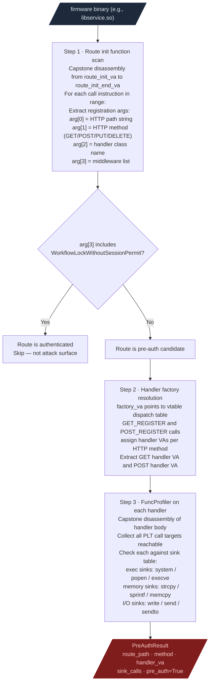
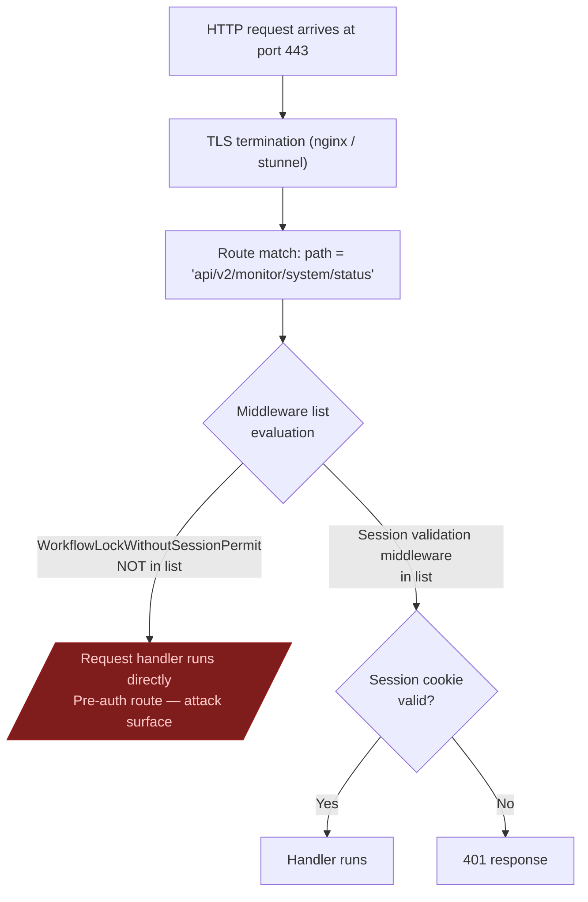

# Pre-Authentication Exposure

Traverses the control flow graph from the network entry point and identifies every code path that reaches a security-sensitive operation before an authentication gate. Produces a reachability map so manual review starts at the authentication boundary, not before it.

---

## Why this exists

One thing blocked pre-auth surface mapping before `PreAuthRouteAuditor`:

**Manual route table reading was the only option.**
Web framework route tables in compiled firmware binaries are initialized at runtime through registration calls such as `route_url_register(path, handler_class)`. Finding which routes skip authentication required reading the route init function manually, identifying the registration call pattern, extracting handler class names, and then tracing those handlers to see whether they gate on session validation. For a binary with 400 routes that takes days. `PreAuthRouteAuditor` does it in a single function call.

---

## How it works

The auditor targets flatui-style web frameworks (FortiManager, FortiAnalyzer web management backends) but the control flow graph traversal approach applies to any route-registration framework where the authentication check is expressed as a middleware parameter at registration time.

### Full pipeline



### What "pre-auth" means in this framework



Flatui-style frameworks encode the middleware list as a bitfield or a set of string constants passed to the registration call. The auditor reads that argument at the call site and checks whether the session validation constant is present. A missing constant means the handler is reachable without authentication.

---

## Usage

VA constants must be updated per firmware version. Read the route init function VA from the binary before calling:

```python
from ablation.analyzers.preauth_route_auditor import PreAuthRouteAuditor

auditor = PreAuthRouteAuditor.from_path('/path/to/libservice.so')
results = auditor.run(
    route_init_va=0x27b324,
    route_init_end_va=0x288d50,
    factory_va=0x2a5000,
    factory_end_va=0x2b0000,
)
print(results.fmt())
```

Each result in `results.routes` has:

| Field | Content |
|---|---|
| `path` | HTTP path string (e.g., `api/v2/monitor/system/status`) |
| `method` | `GET` / `POST` / `PUT` / `DELETE` |
| `handler_va` | VA of the handler function |
| `sink_calls` | List of dangerous PLT calls reachable from the handler |
| `pre_auth` | `True` if no session validation middleware is present |

---

## PocGenerator

Once pre-auth routes are confirmed, `PocGenerator` produces minimal curl commands that reproduce each finding at the protocol level.

```python
from ablation.analyzers.poc_generator import PocGenerator

poc = PocGenerator.generate_all(results.pre_auth_routes())
for item in poc:
    print(item.curl_command)
    print(f"  Expected response delta: {item.expected_delta}")
    print(f"  CWE: {item.cwe}")
```

Each PoC includes:

- Minimal curl command with the auth bypass path
- Expected response difference between authenticated and unauthenticated calls (confirms the bypass without guessing)
- CWE classification for the PSIRT submission
- Severity scoring based on the sinks reachable from the handler

The PoC output is paste-ready for a disclosure report. The curl command reproduces the bypass and the expected delta documents why the response confirms pre-auth access rather than just a 401 with a different body.
