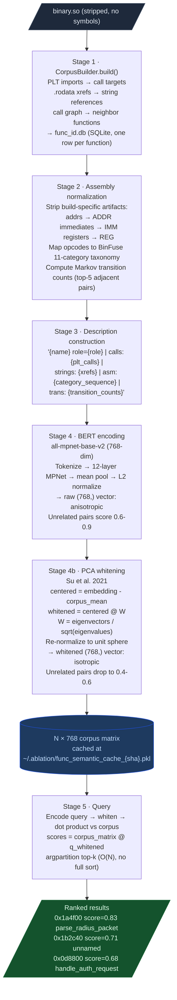
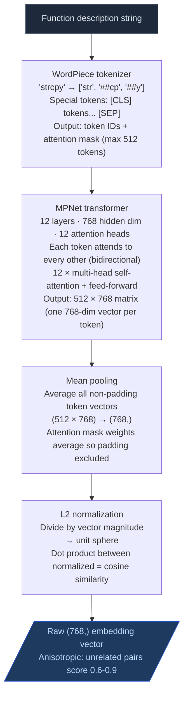

# Semantic Search

Each function gets a behavioral fingerprint. You search by describing what the function does, not by guessing its name.

---

## Why this exists

Three things that weren't possible before in Ablation:

**1. Triage without symbols.** On a stripped 19,000-function binary, there are no names to grep, no type information, and no call-graph labels. Triage meant reading disassembly for every function that might be relevant, so on a binary that size it became the entire job. Describe the vulnerability in English. `SemanticSearcher` returns the 5-10 functions most structurally similar to that description before any disassembly.

**2. Cross-architecture pattern reuse.** A heap overflow in an ARM32 router and the same class of bug in an x86-64 BMC look completely different at the opcode level. Without normalization, a pattern confirmed on one binary gives zero signal on another. BinFuse opcode categorization maps both to the same category sequence: `ARITHMETIC_OP->COMPARISON_OP->CONDITIONAL_OP`. A confirmed pattern from one vendor replays on a different architecture because the normalized form strips away the opcode differences that don't affect behavior.

**3. Calibrated similarity scores.** Raw BERT cosine similarity between unrelated functions runs 0.6-0.9 because BERT embeddings cluster near the mean of their manifold. That makes every function look like every other function. PCA whitening fixes this: after whitening, unrelated pairs drop to 0.4-0.6 and true structural matches stay above 0.8, so the score threshold table is meaningful.

Build the corpus once. Every `query()` call after that addresses all three gaps.

---

## How it works

The pipeline has five stages: description extraction, assembly normalization, BERT encoding, PCA whitening, and query.

### Stage overview



---

### Stage 1: The function database

The corpus starts in a SQLite database at `~/.ablation/func_id.db`. Each row covers one function: virtual address, name if any, role, PLT calls made, string xrefs, and struct accesses. `CorpusBuilder` populates it. Only rows with `confidence IN ('CONFIRMED', 'ANGR_INFERRED')` enter the search corpus because dead-code stubs and linker padding would pollute results.

### Stage 2: Assembly normalization

Before encoding, each function's disassembly drops build-specific artifacts:

```
0x7ffff000    ->  <ADDR>      addresses vary per build / relocation
4096          ->  <IMM>       large immediates vary by compiler
rax / x0 / r3 ->  <REG>      register allocation varies by optimization level
```

Each opcode then maps to one of 11 semantic categories from the BinFuse taxonomy (Chang et al., TrustCom 2025):

| Category | Representative opcodes |
|---|---|
| `ARITHMETIC_OP` | add, sub, mul, imul, udiv, sdiv, fadd, fsub, madd |
| `DATA_TRANSFER_OP` | mov, ldr, str, lea, push, pop, adrp, movz, ldp, stp |
| `COMPARISON_OP` | cmp, test, tst, fcmp, cmn |
| `LOGIC_OP` | and, or, xor, eor, bic, orn, andn, mvn |
| `BIT_SHIFT_OP` | shl, shr, sar, lsl, lsr, asr, ror |
| `UNCONDITIONAL_OP` | jmp, b, bl, call, ret, blr, bx, blx |
| `CONDITIONAL_OP` | je/jne, beq/bne, cbz/cbnz, tbz/tbnz |
| `MEMORY_MGMT_OP` | rep/movs/stos, prefetch, clflush, nop, mfence |
| `PROCESSOR_STATE_OP` | pushf/popf, cpuid, rdtsc, mrs/msr, svc, hlt |
| `SYNCHRONIZATION_OP` | lock/xadd, cmpxchg, dmb/dsb/isb, ldaxr/stlxr |
| `VECTOR_MGMT_OP` | vmovdqu, vpaddb, vpcmpeq, ld1/st1 (ARM NEON) |

This encoding is cross-architecture. x86's `mov rax, [rbp-8]` and ARM64's `ldr x0, [sp, #8]` both produce `DATA_TRANSFER_OP`. A network parser written for MIPS32 and the same parser recompiled for AArch64 produce the same category sequence.

After per-instruction mapping, a Markov transition string is appended:

```python
# Top-5 most frequent adjacent-category transitions
pairs = Counter(f"{cats[i]}->{cats[i+1]}" for i in range(len(cats)-1))
# Output: "DATA_TRANSFER_OP->ARITHMETIC_OP(12) ARITHMETIC_OP->COMPARISON_OP(7) ..."
```

The transitions capture behavioral rhythm. A bounds-checking loop has a distinctive `ARITHMETIC_OP->COMPARISON_OP->CONDITIONAL_OP` cycle. A memcpy-style loop looks like `DATA_TRANSFER_OP->ARITHMETIC_OP->CONDITIONAL_OP` repeating. Two functions with the same transition profile are structurally similar regardless of which registers or immediates they use.

### Stage 3: Description construction

The normalized assembly is not fed to the model alone. It combines with function metadata into a single text string:

```
{name} role={role} | calls: {call_targets[:12]} | strings: {string_xrefs[:8]} | asm: {normalized_asm}
```

The `calls:` and `strings:` fields carry the most signal on stripped binaries. A function that calls `malloc`, `strcpy`, and `syslog` and references `"auth failed"` is described as exactly that, regardless of its own opcode mix. On deeply stripped binaries with no string xrefs, the normalized assembly category sequence and Markov transitions carry the full load.

Operand type normalization follows BinDeep (Tian et al., 2020): keeping memory reference patterns (`MEM[REG]`, `MEM[REG+IMM]`) alongside category labels adds approximately 1.2% F1 over opcode-only encoding (BinDeep Table 3).

### Stage 4: Embedding and whitening

#### What the model is

The model is `sentence-transformers/all-mpnet-base-v2`. It produces 768-dimensional vectors. MPNet (Microsoft, 2020) is a masked language model trained on a modified objective that combines masked prediction with permuted prediction, capturing bidirectional context more accurately than BERT's original masked-token approach. The `all-mpnet-base-v2` checkpoint is fine-tuned on over 1 billion sentence pairs for semantic similarity tasks (Reimers and Gurevych, 2019).

What "fine-tuned for semantic similarity" means in practice: the model has learned that "copies string without checking length" and "strcpy without bounds validation" should land in the same region of the 768-dimensional embedding space, even though the token sequences share no words.

#### How it converts text to a vector



The `encode()` call runs all four steps. Batch size 64 means 64 function descriptions run through the transformer in one forward pass, which is more efficient than encoding one at a time.

```python
vectors = model.encode(descriptions, normalize_embeddings=True, batch_size=64)
```

#### The anisotropy problem

Raw sentence-transformer embeddings are anisotropic. The 768 dimensions are not used equally. Most of the variance is concentrated along a small number of principal components that correspond to high-frequency language features (sentence length, common words) rather than semantic content. Two embeddings tend to land close together along those dominant dimensions regardless of whether they are semantically related.

The practical effect: cosine similarity between two randomly chosen sentences from a technical corpus typically runs 0.6-0.9 after L2 normalization. A threshold of 0.6 would return nearly the entire corpus for any query. A threshold of 0.9 would discard true matches. Neither is usable as written.

Ethayarajh (2019) measured this across BERT, GPT-2, and ELMo and found all three severely anisotropic. Su et al. (2021) named the fix: PCA whitening.

#### PCA whitening

Whitening transforms the embedding space so that the variance in every direction is 1.0. It removes the dominant principal components that carry no semantic signal, so the remaining dimensions reflect actual content similarity.

```python
mean = embeddings.mean(axis=0)                  # corpus centroid
centered = embeddings - mean                    # center at origin

cov = np.cov(centered.T)                        # 768 x 768 covariance matrix
vals, vecs = np.linalg.eigh(cov)                # eigendecomposition
# vals: 768 eigenvalues (variance in each principal direction)
# vecs: 768 x 768 matrix of eigenvectors (principal directions)

W = vecs @ np.diag(1.0 / np.sqrt(vals))        # whitening matrix
# Dividing by sqrt(eigenvalue) rescales each direction to unit variance

whitened = centered @ W
whitened /= np.linalg.norm(whitened, axis=-1, keepdims=True)
```

At query time, the same mean and whitening matrix are applied to the query vector:

```python
q_raw = model.encode(description, normalize_embeddings=True)
q_whitened = (q_raw - mean) @ W
q_whitened /= np.linalg.norm(q_whitened)
scores = self._vectors @ q_whitened
```

After whitening, the distribution is isotropic: the same variance in every direction. Generic pairs drop to 0.4-0.6. True structural matches stay above 0.8. That gap is why the score threshold table works.

The whitened vectors are cached at `~/.ablation/func_semantic_cache_{hash}.pkl`, keyed on the SHA-256 of `func_id.db`. The cache invalidates automatically when the database changes.

### Stage 5: Query

```python
def query(self, description: str, top_k: int = 5):
    q = model.encode(description, normalize_embeddings=True)
    scores = self._vectors @ q                         # matrix-vector dot product
    idx = np.argpartition(scores, -top_k)[-top_k:]    # O(N) — no full sort needed
    idx = idx[np.argsort(scores[idx])[::-1]]           # sort only the top-k slice
    return [SimilarFunction(...) for i in idx]
```

`np.argpartition` is O(N) rather than O(N log N) because it only guarantees the top-k positions are in place and does not sort the rest. On a 10,000-function corpus this takes roughly 10ms on CPU. The full sort then runs only over the top-k slice.

---

## SemanticSearcher

**File:** `ablation/analyzers/semantic_search.py`

Run this first on every new binary or new vulnerability class. Two functions performing the same operation produce similar embeddings even when they have different opcodes, different VAs, and come from different vendors.

### Build corpus and search

```python
from ablation.analyzers.binary_context import BinaryContext
from ablation.analyzers.corpus_builder import CorpusBuilder
from ablation.analyzers.semantic_search import SemanticSearcher

ctx = BinaryContext.load_or_build('/path/to/binary.so')

# Step 1: build behavioral descriptions into func_id.db
cb = CorpusBuilder()
n = cb.build('/path/to/binary.so', product='my-product', version='1.0')
print(f"  {n} functions described")

# Step 2: build BERT embeddings, scoped to this binary
# from_context resolves binary_id via ctx.sha256, encodes only this
# binary's functions, and pre-builds the corpus.
searcher = SemanticSearcher.from_context(ctx)

# Step 3: query
results = searcher.query(
    "TLV parser that advances pointer without minimum length check",
    top_k=10
)

for r in results:
    print(f"  0x{r.va:x}  score={r.score:.3f}  {r.name or hex(r.va)}")
```

First build encodes this binary's functions with all-mpnet-base-v2 on CPU. On an 11k-function binary that takes about 9 minutes. Subsequent runs load the cached pickle in 0.1s. Queries run in under 1 second once the corpus is loaded.

Use the bare constructor only when you need cross-binary search across all functions in func_id.db. That path warns and can take several hours depending on how many binaries are in the database.

```python
# cross-binary search (uncommon; warns on unscoped build)
searcher = SemanticSearcher(str(Path.home() / '.ablation/func_id.db'))
searcher.build_corpus()
```

### Writing effective queries

Queries follow a structured format. Each part steers BERT toward a narrower cluster:

```
<ROLE_HINT> | role=<function_role> | calls: <extern_calls> | vuln: <vuln_description>
```

| Part | Purpose | Example |
|---|---|---|
| Role hint | Cluster anchor; limits search to protocol parsers, memory managers, etc. | `AV_PARSER`, `PROTOCOL_PARSER`, `OBJECT_MANAGER` |
| `role=` | Specific function role within the cluster | `tlv_advance`, `buffer_copy`, `allocation` |
| `calls:` | External functions this function calls | `memcpy memmove malloc free` |
| `vuln:` | The specific vulnerability in plain English | `zero-length field causes infinite loop` |

**Example queries:**

```python
# DoS: infinite loop on zero-length field
"PROTOCOL_PARSER | role=tlv_advance | calls: memcpy memmove | "
"vuln: TLV pointer advance loop with no minimum length check; "
"zero-length field causes infinite loop"

# Memory: stack buffer overflow
"AV_SCANNER | role=string_copy | calls: strcpy strcat sprintf | "
"vuln: strcpy or sprintf into fixed-size stack buffer without length check"

# Memory: integer overflow before allocation
"AV_SCANNER | role=allocation | calls: malloc realloc calloc | "
"vuln: integer multiplication or addition before malloc without overflow check"
```

### Score interpretation

| Score | Interpretation |
|---|---|
| >= 0.55 | Strong match; triage immediately |
| 0.40 - 0.55 | Plausible match; check callees and strings |
| 0.30 - 0.40 | Weak match; skip unless no better candidates exist |
| < 0.30 | Noise |

Default threshold: 0.30. Raise to 0.40 on large binaries (>15,000 functions) to reduce noise.

---

## CorpusBuilder

**File:** `ablation/analyzers/corpus_builder.py`

`CorpusBuilder` writes the behavioral description database (`func_id.db`) that `SemanticSearcher` encodes. Each row records PLT calls made, strings referenced, export name if any, call-graph neighbors, and byte size.

```python
from ablation.analyzers.corpus_builder import CorpusBuilder

cb = CorpusBuilder()

# Build for one binary
n = cb.build('/path/to/binary.so', product='my-target', version='1.0')

# Build for an entire firmware image directory
n = cb.build_dir('/path/to/rootfs/', product='my-target', version='1.0',
                 extensions=['.so'])
```

**Output:** `~/.ablation/func_id.db` (SQLite). `SemanticSearcher` reads this on `build_corpus()`.

---

## PatternLibrary

**File:** `ablation/analyzers/pattern_library.py`

Every confirmed finding from any engagement registers a semantic query. On any future binary, those queries replay automatically. The library grows with every engagement.

### Record a confirmed pattern

```python
from ablation.analyzers.pattern_library import PatternLibrary

pl = PatternLibrary()

pl.record_hit(
    query="TLV pointer advance loop with no minimum length check",
    binary_sha="<sha256_of_binary>",
    va=0x1000,
    confirmed=True,
    vuln_class="infinite_loop",
    cvss=7.5,
    notes="confirmed finding -- protocol parser",
)
```

### Sweep a new binary with all confirmed patterns

```python
pl_results = pl.sweep(searcher, top_k=8, min_score=0.30)
print(pl.fmt_sweep(pl_results, binary_name='target.so'))
```

Output shows each confirmed pattern, its CVSS score, and the top candidates in the new binary. Patterns with CVSS >= 7.0 are highlighted for immediate triage.

### Ingest confirmed findings from FindingRegistry (flywheel)

`ingest_from_registry()` pulls every confirmed finding from a `FindingRegistry` and adds it as a pattern. Call this at the start of each engagement to pull in all past confirmed findings without any manual `pl.add()` calls.

```python
from ablation.analyzers.finding_registry import FindingRegistry
from ablation.analyzers.pattern_library import PatternLibrary

reg = FindingRegistry()
pl  = PatternLibrary()

n = pl.ingest_from_registry(reg)  # idempotent — only adds findings not already present
print(f"{n} new patterns ingested")

pl_results = pl.sweep(searcher, top_k=8, min_score=0.30)
print(pl.fmt_sweep(pl_results, binary_name='target.so'))
```

### Pattern storage

| Path | Purpose |
|---|---|
| `~/.ablation/patterns.json` | User-local; not committed to git |
| `ablation/data/seed_corpus.json` | Ships with Ablation; published CVEs as seed corpus on first install |

### Running a sweep

```bash
ablation sweep /path/to/target.so
ablation sweep /path/to/target.so --min-score 0.35 --top-k 10
ablation sweep /path/to/target.so --sarif results.sarif
```

Extend `VULN_PROFILES` in `sweeps/base_sweep.py` before sweeping against a new vulnerability class.
