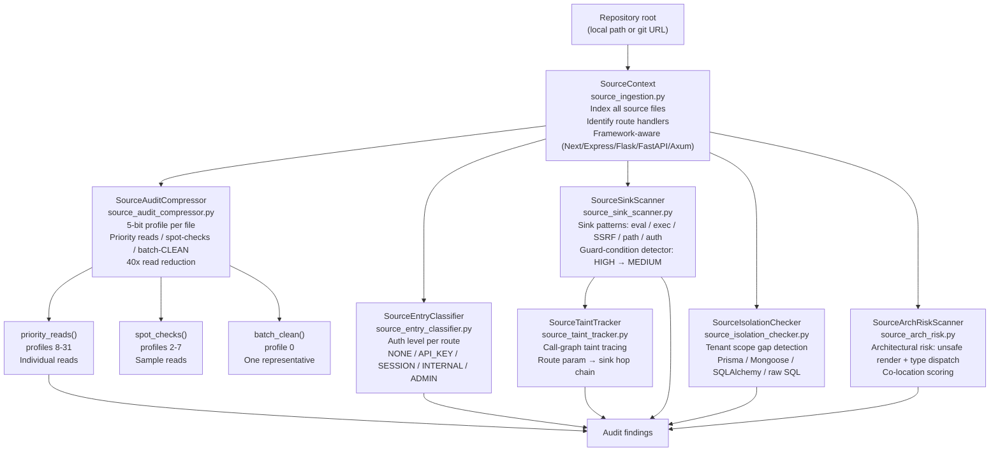

# Source Code Auditor

Audit any large source codebase for security vulnerabilities without reading every file.
The toolchain indexes files, profiles their risk signals, and directs your reads to the
files that actually matter.

---

## Why this exists

5 things that were not possible before in Ablation:

**1. No codebase-scale triage.** Binary RE has SemanticSearcher to reduce thousands of
functions to a shortlist. Source audits had no equivalent. Reading a 2000-file TypeScript
monorepo file by file consumed 2000 LLM reads. There was no way to get from "here is a
repo" to "here are the 40 files worth reading" without manual grep work.

**2. No entry point ranking.** Knowing that a sink exists tells you nothing unless you
also know whether the route calling it is authenticated. Before this toolchain, auth
classification was manual: read each route handler, understand the middleware stack,
decide whether a login gate was present. SourceEntryClassifier automates this, so the
first output is a ranked list of unauthenticated endpoints.

**3. No isolation gap detection.** Multi-tenant SaaS bugs (Prisma queries missing
`orgId`, SQLAlchemy queries without `user_id` scope) are invisible to grep and static
analysis tools that do not understand the ORM. SourceIsolationChecker pattern-matches
every `findUnique` / `findMany` call against the set of scope fields the application
defines, and flags the gaps without any manual query inspection.

**4. No architectural risk scoring.** A file with `unsafeHTML()` is risky. A file with
`unsafeHTML()` inside a `type_dispatch` switch is catastrophic because every future
extension of the switch is a new XSS vector. SourceArchRiskScanner detects the
co-location pattern, not just the individual signal.

**5. No source-level taint tracing.** SSRF and command-injection findings from static
pattern matching have high false-positive rates without a data flow chain. Before
SourceTaintTracker, confirming a finding meant manually tracing from the route parameter
through every intermediate function to the sink. The tracker builds the call graph and
reports each hop so confirmation is reading, not hunting.

---

## Architecture

The six analyzers build on each other in a fixed pipeline. SourceContext is always first.
SourceAuditCompressor runs next to filter files. The remaining four run in parallel on
the filtered set.



---

## SourceContext

**File:** `ablation/analyzers/source_ingestion.py`

SourceContext is the source-side analog of BinaryContext: it indexes a repository once
and provides the file list and helpers that every downstream analyzer needs. Build it
once; pass it to all other analyzers via `from_context(ctx)`.

### Build and load

```python
from ablation.analyzers.source_ingestion import SourceContext

# From an existing local clone
ctx = SourceContext.from_path("/tmp/authentik")
print(ctx.summary())

# Clone from remote (shallow clone, faster for large repos)
ctx = SourceContext.from_git("https://github.com/goauthentik/authentik", "/tmp/authentik")
```

### What gets indexed

| Field | Type | Description |
|---|---|---|
| `repo_root` | `Path` | Absolute path to the repository root |
| `all_files` | `List[SourceFile]` | Every source file (ts, tsx, js, py, rs, go, java, rb, php) |
| `route_files` | `List[SourceFile]` | Subset identified as HTTP route handlers |
| `summary()` | `str` | File count by language, route count, repo name |

### SourceFile fields

Each `SourceFile` carries three attributes used throughout the pipeline:

| Attribute | Type | Description |
|---|---|---|
| `path` | `Path` | Absolute path on disk |
| `rel_path` | `str` | Path relative to `repo_root`; used in all report output |
| `suffix` | `str` | File extension (e.g., `.ts`, `.py`) |

The `read()` helper returns the file's text content. All downstream analyzers call this
rather than opening the file directly.

### Framework-aware route detection

`route_files` is not just "files in a `routes/` directory." SourceContext applies
per-framework heuristics:

| Framework | Detection signal |
|---|---|
| Next.js | Files in `pages/api/` or `app/` with exported `GET`/`POST`/`handler` |
| Express | Files importing `express.Router` or calling `app.get|post|put|delete` |
| Flask | Files importing `flask.Blueprint` or using `@app.route` decorator |
| FastAPI | Files importing `fastapi.APIRouter` or using `@router.get|post` decorators |
| Axum | Files containing `Router::new()` or `axum::routing::get|post` |

### CLI

```bash
python3 -m ablation.analyzers.source_ingestion /tmp/authentik
python3 -m ablation.analyzers.source_ingestion --clone https://github.com/goauthentik/authentik /tmp/authentik
```

### Example output

```
SourceContext  authentik
  source files  : 2861
  route files   : 147
  languages     : ts(1204) tsx(412) py(891) js(354)
```

---

## SourceAuditCompressor

**File:** `ablation/analyzers/source_audit_compressor.py`

The triage layer. Assigns every file a 5-bit risk profile and groups files into buckets.
The profile is a bitmask: each bit signals one security-relevant pattern detected in the
file. Files sharing a profile are grouped; batch-CLEAN files (profile 0) need only one
read to confirm the pattern.

A 2861-file authentik codebase compresses to 72 priority reads without dropping any
high-severity coverage.

### The 5-bit profile

Each bit is detected independently via regex scan:

| Bit | Weight | Signal | Triggers on |
|---|---|---|---|
| 4 (MSB) | 16 | `unsafe_render` | `unsafeHTML()`, `innerHTML=`, `dangerouslySetInnerHTML`, `eval()`, `new Function()` |
| 3 | 8 | `href_binding` | Dynamic `href=${...}` attribute binding (Lit/JSX) |
| 2 | 4 | `url_assign` | `window.location.assign()`, `window.open(var)`, `navigateToUrl()` |
| 1 | 1 | `user_data` | API object fields (`.name`, `.email`, `.body`) rendered in templates |
| 0 (LSB) | 1 | `shared_module` | Reusable base class or shared utility (amplifies risk in combined profiles) |

Reading the profile in binary immediately tells you which signals are present. Profile 24
(`11000`) means `unsafe_render` + `href_binding`. Profile 17 (`10001`) means
`unsafe_render` + `shared_module`, which is the highest-risk combination because the
shared module is imported everywhere.

### Audit action by profile range

| Profile range | Binary form | Present signals | Audit action |
|---|---|---|---|
| 16-31 | `1xxxx` | unsafe rendering | **Individual read** — every file |
| 8-15 | `01xxx` | href binding only | **Individual read** — every file |
| 4-7 | `001xx` | URL assignment only | **Spot-check** — read a sample |
| 2-3 | `0001x` | user-data rendering only | **Spot-check** — read a sample |
| 1 | `00001` | shared module, no sinks | **Batch** — one representative |
| 0 | `00000` | no signals | **Batch-CLEAN** — one representative |

The audit decision follows directly from the profile: if bit 4 is set, the file goes in
the individual-read pile regardless of the other bits. You never need to read the file to
make this decision.

### Bucket object

`compress()` returns a list of `ProfileBucket` objects:

| Field | Type | Description |
|---|---|---|
| `profile` | `int` | The 5-bit profile integer |
| `profile_str` | `str` | Binary string, e.g. `"10001"` |
| `active_bits` | `List[str]` | Signal names for set bits, e.g. `["unsafe_render", "shared_module"]` |
| `files` | `List[SourceFile]` | Files in this bucket, sorted by `rel_path` |
| `audit_tier` | `str` | `"individual"`, `"spot-check"`, or `"batch"` |

### Usage

```python
from ablation.analyzers.source_ingestion import SourceContext
from ablation.analyzers.source_audit_compressor import SourceAuditCompressor

ctx = SourceContext.from_path("/tmp/authentik")
compressor = SourceAuditCompressor.from_context(ctx)
buckets = compressor.compress()

print(compressor.report(buckets))

# Files requiring individual reads (profiles >= 8)
for bucket in compressor.priority_reads(buckets):
    print(f"profile={bucket.profile_str}: {len(bucket.files)} files  [{', '.join(bucket.active_bits)}]")
    for fp in bucket.files:
        print(f"  {fp.rel_path}")

# Spot-check candidates (profiles 2-7)
for bucket in compressor.spot_checks(buckets):
    print(f"profile={bucket.profile_str}: {len(bucket.files)} files")

# Batch-CLEAN candidates (profile 0)
batch = compressor.batch_clean(buckets)
print(f"Batch-CLEAN: {len(batch)} files — read one representative")

# Estimated reads saved
ratio = compressor.compression_ratio(buckets)
print(f"Compression: {ratio:.1%} fewer reads")
```

### Filter by extension

```python
# TypeScript only
files = [f for f in ctx.all_files if f.suffix in {".ts", ".tsx"}]
compressor = SourceAuditCompressor(ctx)
buckets = compressor.compress(files=files)
```

### Example output

```
SourceAuditCompressor  authentik  (2861 files)

  Profile  Binary  Signals                        Files  Tier
  -------  ------  ----------------------------  ------  ----------
  24       11000   unsafe_render, href_binding        3  individual
  17       10001   unsafe_render, shared_module      11  individual
  16       10000   unsafe_render                     44  individual
  9        01001   href_binding, shared_module        2  individual
  8        01000   href_binding                       8  individual
  4        00100   url_assign                        19  spot-check
  2        00010   user_data                         31  spot-check
  1        00001   shared_module                     92  batch
  0        00000   (none)                          2651  batch-CLEAN

  Priority reads  : 68  (profiles >= 8)
  Spot-checks     : 50  (profiles 2-7)
  Batch-CLEAN     : 2743 (profiles 0-1)
  Compression     : 97.6%  (2861 → 68 reads)
```

### CLI

```bash
python3 -m ablation.analyzers.source_audit_compressor /tmp/authentik
python3 -m ablation.analyzers.source_audit_compressor /tmp/authentik --ext ts
python3 -m ablation.analyzers.source_audit_compressor /tmp/authentik --profile 8
python3 -m ablation.analyzers.source_audit_compressor /tmp/authentik --show-files
```

---

## SourceEntryClassifier

**File:** `ablation/analyzers/source_entry_classifier.py`

Classifies every HTTP route handler file by its authentication level. Run this before
deep reading. The output is an attack surface map: which routes are exposed to anonymous
users, which require a session, which require admin privilege.

Unauthenticated routes with dangerous sinks are the highest-priority finding class. This
classifier makes that cross-product query possible.

### Auth levels (weakest to strongest)

| Level | Constant | What it means |
|---|---|---|
| `NONE` | `AUTH_NONE` | No authentication check found in handler or middleware chain |
| `API_KEY` | `AUTH_API_KEY` | API key or HTTP Basic auth required |
| `SESSION` | `AUTH_SESSION` | User session required (cookie, JWT, or OAuth token) |
| `INTERNAL` | `AUTH_INTERNAL` | Service-to-service HMAC or admin key required |
| `ADMIN` | `AUTH_ADMIN` | Global admin credential required |

### How auth level is detected

The classifier inspects two things: inline patterns in the handler file, and the
middleware list applied to the route.

**Inline patterns** include: imports of auth utilities (`requireAuth`, `isAuthenticated`,
`login_required`, `Depends(get_current_user)`), decorator usage (`@login_required`,
`@permission_required`), and session checks (`req.session.userId`, `request.user`).

**Middleware chain** is detected from framework-specific registration patterns:
`router.use(authMiddleware)` in Express, `app.include_router(router, dependencies=...)`
in FastAPI, `middleware = [...]` in Django settings.

A file that imports no auth utility and appears in no middleware chain is classified
`AUTH_NONE`. The classifier errs on the side of under-reporting auth: a false `NONE`
triggers a manual review; a false `SESSION` would silently drop a finding.

### EntryClassification fields

| Field | Type | Description |
|---|---|---|
| `rel_path` | `str` | Route file path relative to repo root |
| `auth_level` | `str` | One of the five constants above |
| `auth_signals` | `List[str]` | Specific patterns that determined the level |
| `methods` | `List[str]` | HTTP methods handled (`GET`, `POST`, etc.) |
| `framework` | `str` | Framework the route belongs to |

### Usage

```python
from ablation.analyzers.source_ingestion import SourceContext
from ablation.analyzers.source_entry_classifier import SourceEntryClassifier

ctx = SourceContext.from_path("/tmp/langfuse")
clf = SourceEntryClassifier.from_context(ctx)
results = clf.classify()
print(clf.report(results))

# Unauthenticated endpoints — highest priority
unauth = [r for r in results if r.auth_level == "NONE"]
for r in unauth:
    print(f"  {r.rel_path}  [{', '.join(r.methods)}]")
```

### Example output

```
SourceEntryClassifier  langfuse  (147 routes)

  NONE      : 12  ← audit these first
  API_KEY   : 8
  SESSION   : 97
  INTERNAL  : 18
  ADMIN     : 12

  AUTH_NONE routes:
    pages/api/public/scores/index.ts           [GET, POST]
    pages/api/public/traces/index.ts           [GET, POST]
    pages/api/public/observations/index.ts     [GET]
    pages/api/public/generations/index.ts      [GET, POST]
    pages/api/public/datasets/index.ts         [GET, POST]
    ...
```

### CLI

```bash
python3 -m ablation.analyzers.source_entry_classifier /tmp/langfuse
python3 -m ablation.analyzers.source_entry_classifier /tmp/langfuse --level NONE
```

---

## SourceSinkScanner

**File:** `ablation/analyzers/source_sink_scanner.py`

Scans for dangerous sink patterns across a repository. Each hit maps to a CWE, a
severity, and the exact source line. A guard-condition detector identifies environment
variables or conditional flags around sinks and reduces the severity of gated findings
from HIGH to MEDIUM.

### Sink classes

| Sink class | CWE | Examples |
|---|---|---|
| Code eval | CWE-94 | `vm.runInContext()`, `vm.runInNewContext()`, `eval()`, `new Function()` |
| Subprocess | CWE-78 | `child_process.exec()`, `child_process.spawn()`, `subprocess.run()`, `os.system()` |
| SSRF | CWE-918 | `fetch(userInput)`, `axios.get(req.query.url)`, `http.get(param)` |
| Path traversal | CWE-22 | `fs.readFile(userPath)`, `open(req.params.file)`, `Path(user_input)` |
| Unguarded endpoint | CWE-284 | Admin-prefixed routes without auth middleware |

### Guard-condition detection

A sink gated behind an environment variable check (e.g., the Langfuse code eval
dispatcher pattern) is not exploitable by an unauthenticated attacker. The scanner looks
for env-var guards, feature flags, and conditional blocks within 10 lines of a sink. A
guarded find is reported as MEDIUM instead of HIGH with the guard condition shown.

Example — guarded eval (MEDIUM):
```python
if os.getenv("LANGFUSE_CODE_EVAL_DISPATCHER") == "insecure-local":
    vm.runInContext(code, sandbox)   # guarded: LANGFUSE_CODE_EVAL_DISPATCHER
```

Example — unguarded eval (HIGH):
```python
result = vm.runInContext(userScript, ctx)
```

### SinkFinding fields

| Field | Type | Description |
|---|---|---|
| `rel_path` | `str` | File path relative to repo root |
| `line` | `int` | Line number |
| `sink_class` | `str` | One of the five sink classes above |
| `severity` | `str` | `HIGH` or `MEDIUM` (after guard detection) |
| `cwe` | `str` | CWE identifier |
| `snippet` | `str` | The matched source line |
| `guard_note` | `str | None` | Guard condition description, if present |

### Usage

```python
from ablation.analyzers.source_sink_scanner import SourceSinkScanner

ctx = SourceContext.from_path("/tmp/langfuse")
scanner = SourceSinkScanner.from_context(ctx)
findings = scanner.scan()
print(scanner.report(findings))

highs = [f for f in findings if f.severity == "HIGH"]
```

### Example output

```
SourceSinkScanner  langfuse  (23 findings)

  CWE-94  HIGH    worker/src/ee/services/evaluation-service/evaluation-service.ts:312
          vm.runInContext(code, sandbox)
          → code eval: no guard detected

  CWE-94  MEDIUM  worker/src/ee/services/evaluation-service/evaluation-service.ts:280
          vm.runInNewContext(userCode, ctx, {timeout: 5000})
          → code eval: guarded by LANGFUSE_CODE_EVAL_DISPATCHER == "insecure-local"

  CWE-918 HIGH    pages/api/public/traces/index.ts:89
          const resp = await fetch(body.callbackUrl)
          → SSRF: callbackUrl from request body, no allowlist
  ...
```

### CLI

```bash
python3 -m ablation.analyzers.source_sink_scanner /tmp/langfuse
python3 -m ablation.analyzers.source_sink_scanner /tmp/langfuse --severity HIGH
```

---

## SourceIsolationChecker

**File:** `ablation/analyzers/source_isolation_checker.py`

Finds database queries that fetch or mutate data without scoping to the authenticated
tenant. In multi-tenant SaaS, every Prisma `findUnique` and `findMany` that does not
include `orgId`, `projectId`, or `userId` in the where clause is a potential IDOR.

The checker understands the ORM: it does not grep for string patterns, it identifies
call sites and inspects the argument object. A `prisma.user.findUnique({ where: { id }
})` without `{ where: { id, orgId } }` is flagged regardless of how the argument is
formatted across lines.

### ORM support

| ORM | Detected patterns |
|---|---|
| Prisma (TypeScript) | `.findUnique()`, `.findMany()`, `.findFirst()`, `.update()`, `.delete()` on any model |
| Mongoose (JavaScript) | `.findById()`, `.find()`, `.findOne()`, `.updateOne()`, `.deleteOne()` |
| SQLAlchemy (Python) | `.query().filter()`, `.filter_by()` without user/tenant field |
| Raw SQL | `SELECT ... WHERE` without `user_id =`, `org_id =`, or `tenant_id =` |

### Scope fields

The checker infers scope fields from the schema or model definitions. Default scope
field names: `orgId`, `projectId`, `userId`, `tenantId`, `accountId`, `organizationId`.
Custom field names can be added via `checker.add_scope_field("workspaceId")`.

### IsolationFinding fields

| Field | Type | Description |
|---|---|---|
| `rel_path` | `str` | File path relative to repo root |
| `line` | `int` | Line number |
| `model` | `str` | ORM model name (e.g., `Trace`, `User`) |
| `operation` | `str` | ORM operation (e.g., `findUnique`, `findMany`) |
| `severity` | `str` | `CONFIRMED` or `PLAUSIBLE` |
| `missing_scope` | `List[str]` | Scope fields absent from the where clause |
| `snippet` | `str` | Query source snippet |

### Usage

```python
from ablation.analyzers.source_isolation_checker import SourceIsolationChecker

ctx = SourceContext.from_path("/tmp/langfuse")
checker = SourceIsolationChecker.from_context(ctx)
findings = checker.scan()
print(checker.report(findings))
```

### Example output

```
SourceIsolationChecker  langfuse  (8 findings)

  CONFIRMED  pages/api/public/traces/[traceId].ts:31
             prisma.trace.findUnique({ where: { id: traceId } })
             missing scope: orgId, projectId

  CONFIRMED  pages/api/public/observations/[observationId].ts:24
             prisma.observation.findUnique({ where: { id } })
             missing scope: projectId
  ...
```

### CLI

```bash
python3 -m ablation.analyzers.source_isolation_checker /tmp/langfuse
python3 -m ablation.analyzers.source_isolation_checker /tmp/langfuse --severity CONFIRMED
```

---

## SourceArchRiskScanner

**File:** `ablation/analyzers/source_arch_risk.py`

Detects "safe now, catastrophic later" architectural patterns. A file with only
`unsafeHTML()` is risky. A file with `unsafeHTML()` inside a `type_dispatch` switch is
categorically more dangerous: each new case added to the switch becomes a new rendering
path, and developers adding new cases do not think about sanitization.

The risk model scores co-location of signal pairs. Two signals in the same function or
template block score higher than two signals in different functions in the same file.

### Signal pairs and scores

| Signal A | Signal B | Score | Reason |
|---|---|---|---|
| `unsafe_render` | `type_dispatch` | HIGH | Future dispatch cases = unreviewed render paths |
| `unsafe_render` | `string_selector` | HIGH | String-keyed component registry = arbitrary template injection risk |
| `unsafe_render` | `registry_lookup` | HIGH | Dynamically-selected renderer bypasses static analysis |
| `unsafe_render` | `shared_module` | HIGH | Shared base class = every subclass inherits the risk |
| `href_binding` | `type_dispatch` | MEDIUM | Open redirect risk across all dispatch cases |
| `url_assign` | `user_data` | MEDIUM | Unvalidated redirect from user-supplied destination |

### ArchRiskFinding fields

| Field | Type | Description |
|---|---|---|
| `rel_path` | `str` | File path |
| `severity` | `str` | `HIGH` or `MEDIUM` |
| `tag` | `str` | Signal pair identifier, e.g. `unsafe_render+type_dispatch` |
| `signals` | `List[str]` | The co-located signal names |
| `context_snippets` | `List[str]` | Source lines for each signal |
| `score` | `int` | Co-location score (higher = signals in same function) |

### Usage

```python
from ablation.analyzers.source_arch_risk import SourceArchRiskScanner

ctx = SourceContext.from_path("/tmp/authentik")
scanner = SourceArchRiskScanner.from_context(ctx)
findings = scanner.scan()
print(scanner.report(findings))
```

### Example output

```
SourceArchRiskScanner  authentik  (4 findings)

  HIGH  web/src/elements/notifications/NotificationDrawer.ts:88
        tag: unsafe_render+type_dispatch
        unsafeHTML(getMessageForLevel(this.notification.level))
        switch (this.notification.level) { case "alert": ... }
        → unsafe render inside type dispatch: each new level is a new XSS vector
```

---

## SourceTaintTracker

**File:** `ablation/analyzers/source_taint_tracker.py`

Traces data flows from user-controlled sources to dangerous sinks. Produces `TaintPath`
objects showing every `TaintHop` in the call chain. Each hop names the file, line, and
function where the tainted value is passed.

This is the confirmation step after SourceSinkScanner: a sink hit from the scanner may
have a real data flow from user input, or it may operate only on trusted internal data.
SourceTaintTracker distinguishes the two.

### Source types

The tracker seeds taint from these sources:

| Source type | Examples |
|---|---|
| Route parameters | `req.params.id`, `ctx.params.name`, `request.path_params["key"]` |
| Query strings | `req.query.url`, `request.args["q"]`, `searchParams.get("filter")` |
| Request body | `req.body.code`, `request.json()`, `await req.json()` |
| Headers | `req.headers["x-forwarded-for"]`, `request.headers.get("origin")` |

### Call graph construction

The tracker builds a per-file call graph by extracting function definitions and their
call sites. Inter-file calls are resolved by matching imported names against the export
list of the imported module. The graph is bounded: by default, the tracker follows chains
up to 5 hops deep.

### TaintPath fields

| Field | Type | Description |
|---|---|---|
| `sink` | `SinkFinding` | The sink at the end of the chain |
| `source` | `SourceRef` | The user-controlled input at the start |
| `hops` | `List[TaintHop]` | Every intermediate function call |
| `confidence` | `str` | `CONFIRMED` or `PLAUSIBLE` |

Each `TaintHop` carries `rel_path`, `line`, and `func_name`.

A path is `CONFIRMED` when every hop is a direct argument pass (no conditional
branching, no reassignment to an unrelated variable). A path is `PLAUSIBLE` when the
tracker found a chain but at least one hop is an indirect call or passes through a
conditional.

### Usage

```python
from ablation.analyzers.source_sink_scanner import SourceSinkScanner
from ablation.analyzers.source_taint_tracker import SourceTaintTracker

ctx = SourceContext.from_path("/tmp/langfuse")

# SourceTaintTracker takes sink_hits from SourceSinkScanner as input
sink_hits = SourceSinkScanner.from_context(ctx).scan()
tracker = SourceTaintTracker.from_context(ctx)
paths = tracker.trace_all(sink_hits)
print(SourceTaintTracker.report(paths, ctx))

# Walk paths manually
for path in paths:
    print(f"{path.sink.rel_path}:{path.sink.line}  [{path.confidence}]")
    for hop in path.hops:
        print(f"  → {hop.rel_path}:{hop.line}  {hop.func_name}()")
```

### Example output

```
SourceTaintTracker  langfuse  (3 confirmed paths)

  CONFIRMED  CWE-94  worker/src/ee/services/evaluation-service/evaluation-service.ts:312
    source   pages/api/v1/datasets/[datasetId]/runs/index.ts:41  req.body.config.code
    hop 1    worker/src/ee/services/evaluation-service/index.ts:88  runEvaluationJob()
    hop 2    worker/src/ee/services/evaluation-service/evaluation-service.ts:198  evaluate()
    sink     worker/src/ee/services/evaluation-service/evaluation-service.ts:312  vm.runInContext()
```

---

## Running a full source audit

All six analyzers compose cleanly. Standard sequence:

```python
from ablation.analyzers.source_ingestion import SourceContext
from ablation.analyzers.source_audit_compressor import SourceAuditCompressor
from ablation.analyzers.source_entry_classifier import SourceEntryClassifier
from ablation.analyzers.source_sink_scanner import SourceSinkScanner
from ablation.analyzers.source_isolation_checker import SourceIsolationChecker
from ablation.analyzers.source_arch_risk import SourceArchRiskScanner
from ablation.analyzers.source_taint_tracker import SourceTaintTracker

ctx = SourceContext.from_path("/tmp/target")

# 1. Build ranked read list — start here for any repo
buckets = SourceAuditCompressor.from_context(ctx).compress()

# 2. Map exposed entry points — unauthenticated routes first
entry_results = SourceEntryClassifier.from_context(ctx).classify()
unauth = [r for r in entry_results if r.auth_level == "NONE"]

# 3. Flag dangerous sinks — HIGH findings need taint confirmation
sink_findings = SourceSinkScanner.from_context(ctx).scan()

# 4. Find tenant isolation gaps
iso_findings = SourceIsolationChecker.from_context(ctx).scan()

# 5. Detect architectural risk
arch_findings = SourceArchRiskScanner.from_context(ctx).scan()

# 6. Confirm taint paths for HIGH sinks
paths = SourceTaintTracker.from_context(ctx).trace_all(
    [f for f in sink_findings if f.severity == "HIGH"]
)
```

### Cross-query: unauthenticated routes with HIGH sinks

The highest-priority finding combines SourceEntryClassifier + SourceSinkScanner:

```python
unauth_paths = set(r.rel_path for r in unauth)
critical = [f for f in sink_findings
            if f.severity == "HIGH" and f.rel_path in unauth_paths]
```

A `CONFIRMED` taint path from a `NONE`-auth route to a `CWE-94` or `CWE-78` sink is a
pre-authentication remote code execution finding.

For the full step-by-step workflow with a worked example, see
[Source Code Audit Workflow](../workflows/source-code-audit.md).
