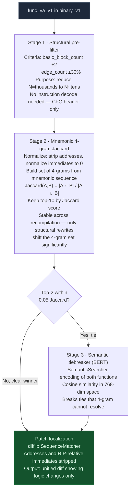
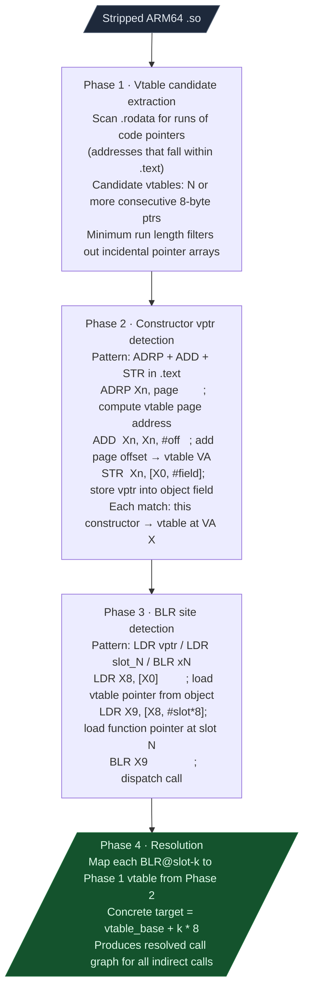

# Structural Analysis Modules

Cross-version function tracking, weighted multi-signal similarity, C++ vtable reconstruction, and matrix-profile binary diffing.

---

## Why this exists

Three problems blocked systematic cross-version RE:

**1. Binary VAs change between firmware releases.**
When a vendor patches a vulnerability, the fixed function may be at a completely different address in the new build. Symbol names are stripped. There is no stable identifier. VersionDelta finds the function by its structural shape across releases so the confirmed name overlay can be ported forward without re-doing the entire analysis.

**2. PLT-call Jaccard matches only ~12% of functions.**
A function with zero or one external PLT call has no meaningful PLT-overlap score. Most functions fall in this category. StructuralSim replaces single-signal PLT Jaccard with a five-signal composite that works on any function regardless of its call density: opcode histogram, immediate value overlap, PLT calls, branch density, and size proximity.

**3. C++ virtual dispatch in stripped binaries is opaque.**
`BLR xN` has no symbol. The object's class is stripped. VtableResolver recovers the vtable layout from `.rodata` pointer arrays and constructor `ADRP+ADD+STR` sequences, then resolves every BLR site to its concrete target function set.

---

## VersionDelta

**File:** `ablation/analyzers/version_delta.py`



### Usage

```python
from ablation.analyzers.version_delta import VersionDelta

vd = VersionDelta(
    binary_v1='/path/to/firmware_v1.so',
    binary_v2='/path/to/firmware_v2.so',
)

result = vd.track(func_va_v1=0x1000)
print(f"Homolog in v2: 0x{result.va_v2:x}  confidence={result.confidence:.2f}")
print(f"Stage resolved at: {result.stage}")   # structural / 4gram / bert
print(result.patch_diff)

# Batch: all changed functions between two versions (ranked by change_score)
changed = vd.changed_functions(top_n=50)
for fn in changed:
    print(f"0x{fn.va_v1:x} -> 0x{fn.va_v2:x}  change_score={fn.change_score:.3f}")
```

### Confidence interpretation

| Confidence | Meaning |
|---|---|
| >= 0.90 | Near-certain match |
| 0.70 - 0.90 | Likely match; verify with strings_in_func |
| 0.50 - 0.70 | Possible match; manual verification recommended |
| < 0.50 | Ambiguous; function may have been split, merged, or removed |

Functions with `change_score >= 0.20` had meaningful code changes, not just recompilation address shifts.

### Anchor scan (implementation variant classification)

```python
from ablation.analyzers.version_delta import AnchorScanResult, ERA_DISCRIMINATOR_ANCHORS

result = vd.run_anchor_scan('/path/to/binary')
for anchor_name, scan_result in result.items():
    if scan_result.found:
        print(f"  {anchor_name}: impl_v{scan_result.era} at offset 0x{scan_result.hit_offset:x}")
```

Masked byte-pattern anchors classify the implementation variant. Useful for large corpora (28+ builds of the same firmware component) to distinguish ELF32 vs ELF64 calling conventions and major-version register-allocation differences.

---

## StructuralSim

**File:** `ablation/analyzers/structural_sim.py`

### Five-signal composite

| Signal | Weight | Details |
|---|---|---|
| Opcode category histogram | High | Cosine similarity on 12-category frequency vector: DATA, ARITH, BIT, CMP, BRANCH, CALL, RET, FRAME, MEMOP, FLOAT, SIMD, OTHER |
| Immediate value Jaccard | High | Shared integer constants: struct offsets, magic bytes, buffer sizes. RIP-relative offsets filtered (position-dependent). |
| PLT call overlap | Medium | Shared external function call set |
| Branch density proximity | Low | Control flow shape: linear / switch / loop-heavy |
| Size proximity | Low | Instruction count ratio |

Why immediates unlock cross-version matching: struct field offsets, magic constants, and buffer sizes survive recompilation. `cmp rax, 0x1000` (4KB limit check) is a stable fingerprint across optimization levels. PLT-only matching fails on functions that call no external symbols; immediate-value overlap works on all of them.

```python
from ablation.analyzers.structural_sim import StructuralSim

sim = StructuralSim('/path/to/binary_v1.so', '/path/to/binary_v2.so')
score = sim.compare(func_va_v1=0x1000, func_va_v2=0x1200)
print(f"Composite: {score.composite:.3f}")
print(f"  opcode_hist  = {score.opcode_hist:.3f}")
print(f"  imm_jaccard  = {score.imm_jaccard:.3f}")
print(f"  plt_overlap  = {score.plt_overlap:.3f}")
```

A composite score >= 0.70 across two different vendors' binaries means the functions share a common ancestor (same open-source library or standard protocol implementation). When one vendor's version has a confirmed vulnerability, that score predicts whether the other vendor carries the same flaw.

---

## VtableResolver

**File:** `ablation/analyzers/vtable_resolver.py`

Static vtable reconstruction and BLR indirect call resolution for stripped ARM64 binaries.



```python
from ablation.analyzers.vtable_resolver import VtableResolver

resolver = VtableResolver('/path/to/libwechatnetwork.so')
result = resolver.resolve()

for vt in result.vtables:
    print(f"vtable 0x{vt.va:x}: {len(vt.slots)} slots")
    for i, slot_va in enumerate(vt.slots):
        print(f"  slot[{i}] -> 0x{slot_va:x}")

for blr in result.resolved_blr:
    print(f"BLR@0x{blr.site:x} slot={blr.slot} -> "
          f"targets={[hex(t) for t in blr.targets]}")
```

---

## MatrixProfileDiff (STOMP algorithm)

**File:** `ablation/analyzers/matrix_profile_diff.py`

Matrix Profile-based sequence anomaly detection for binary diffing. Finds the most changed subsequence between two function instruction sequences using the STOMP algorithm.

### How STOMP works

The matrix profile of a sequence T is a vector where entry i holds the z-normalized Euclidean distance from subsequence T[i..i+m] to its nearest neighbor in T. For binary diffing, two sequences T1 (v1 instructions) and T2 (v2 instructions) are compared: the cross-matrix-profile between T1 and T2 finds the subsequence in T1 whose nearest match in T2 is most distant; that is the most changed region.

```
  T1 = [mnem_v1_0, mnem_v1_1, ..., mnem_v1_n]
  T2 = [mnem_v2_0, mnem_v2_1, ..., mnem_v2_m]

  z-normalized subsequence:
    mean = sum(T[i:i+m]) / m
    std  = sqrt(sum((T[i:i+m] - mean)^2) / m)
    z_T[i] = (T[i:i+m] - mean) / std

  Cross-matrix-profile:
    MP[i] = min over j: dist(z_T1[i], z_T2[j])

  Anomaly region:
    (start_idx, end_idx) = argmax(MP)   -- highest min-distance = most changed
```

STOMP processes this incrementally in O(n log n) by reusing the dot products from step i to compute step i+1, avoiding the O(n²m) naive cost.

```python
from ablation.analyzers.matrix_profile_diff import MatrixProfileDiff

diff = MatrixProfileDiff()
result = diff.compare_functions(
    insns_v1=[(va, mnem, op) for va, mnem, op in func_v1_insns],
    insns_v2=[(va, mnem, op) for va, mnem, op in func_v2_insns],
)
print(result.anomaly_region)   # (start_idx, end_idx) of most-changed subsequence
print(result.change_score)     # 0.0 = identical, 1.0 = completely different
```

MatrixProfileDiff complements VersionDelta when the changed region is a long insertion or deletion rather than a point substitution. VersionDelta's `difflib` output is better for single-instruction substitutions. STOMP is better for finding inserted bounds checks (3-5 new instructions in a loop body) or removed authentication blocks.
