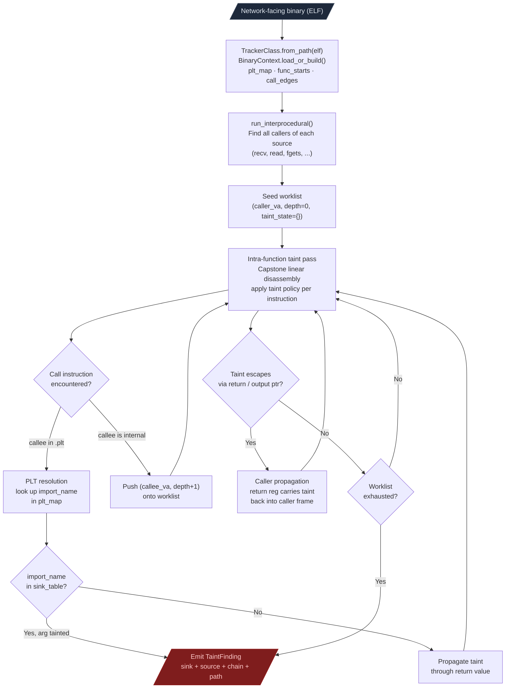
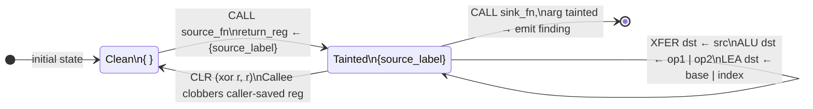
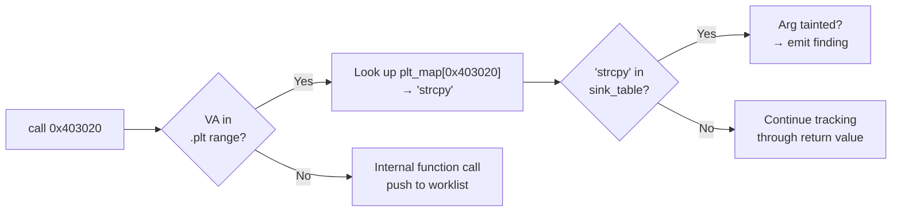

# Taint Analysis

Interprocedural data-flow tracking from network entry points to security-sensitive sinks. The tracker follows tainted data across function call boundaries, resolves PLT stubs to import names at every hop, and covers 14 architectures under one API.

---

## Why this exists

Three things were not possible before the taint stack existed in Ablation:

**1. Cross-architecture vulnerability scanning without a commercial disassembler.**
IDA Pro and Binary Ninja can taint-track x86-64 with plugins, but neither has first-class support for LoongArch64, nanoMIPS, V850, or ARC. Every target on a new architecture required writing a fresh one-off taint model in a disassembler scripting API, and that work was lost at the end of the engagement. Ablation's taint stack covers 14 architectures under one API. Every confirmed finding feeds back into the shared PatternLibrary.

**2. Interprocedural traces that cross PLT boundaries.**
Single-function taint analysis stops at every `call strcpy` or `call malloc`. The PLT entry is a stub, not real code, so a single-function analysis sees the call and stops. Ablation's interprocedural engine walks the call graph, resolves each PLT stub to its import name, and continues tracking through calling functions. A taint path that crosses three callers and reaches a `strcpy` in a helper function surfaces as one finding with the complete call trace.

**3. Stack slot tracking across architecture ABI differences.**
x86-64, ARM64, MIPS32, PPC32, and LoongArch64 pass arguments differently: register counts, callee-save conventions, stack frame layout. A generic tracker that ignores ABI details produces false positives on any architecture that does not match its assumptions. Each tracker models the target ABI precisely: register width, argument registers, caller-saved vs callee-saved sets, stack growth direction.

---

## How it works

### Full pipeline



---

### The taint lattice

All trackers implement the libdft taint policy (Andriesse, *Practical Binary Analysis*, ch. 11), adapted for static analysis. The policy defines a two-element lattice over each register and memory location. A location is either clean (`{}`) or tainted with a source label (`{source_label}`). The label tracks which source the taint originated from, so multi-source binaries produce separate findings per source.



| Instruction class | Propagation rule |
|---|---|
| `XFER` (mov / ldr / str) | `dst_taint = src_taint` |
| `ALU` (add / sub / and) | `dst_taint = taint(op1) \| taint(op2)` |
| `CLR` (xor r, r) | `dst_taint = {}`: clears unconditionally |
| `LEA` | `dst_taint = taint(base) \| taint(index)` |
| `CALL` (source fn) | Return register ← `{source_label}` |
| `CALL` (sink fn) | If relevant arg register is tainted → emit finding |
| `CALL` (other fn) | Caller-saved registers ← `{}`; callee-saved preserved |

The meet operator is set union: `{A} | {B} = {A, B}`. In a single-source binary this reduces to boolean OR. In a multi-source binary, `{recv, fgets}` on a single memory location means two independent code paths feed it. A sink finding with two labels means two separate attack vectors converge at the same dangerous call.

The `CLR` rule is the most important false-positive filter. `xor rax, rax` on x86-64 zeroes `rax` unconditionally regardless of tainted state. Without this rule, taint survives zero-initialization sequences and produces false positives on every stack frame that homes a tainted register before clearing it.

---

### PLT resolution

The PLT (Procedure Linkage Table) is a region of stub functions. The tracker identifies stubs by VA range and maps each to its symbol name via the relocation table. The actual GOT resolution that happens at runtime is irrelevant for static analysis.



On PPC32 with GOT2 PIC, call sequences go through a `.got2` trampoline. `PPC32GOT2Resolver` unwraps these before the interprocedural walk begins so every call edge in the call graph already points to an import name, not a trampoline VA.

---

### Stack slot tracking by architecture

Stack slot tracking extends the register taint model to memory. When a tainted register is stored to a stack-relative address, that address is added to the slot map. When any register is loaded from a tracked slot before a sink call, the taint transfers to the destination register.

| Architecture | Frame pointer | Stack argument homing | Notes |
|---|---|---|---|
| x86-64 | `rbp` (optional) | Not required by SysV ABI | rsp-relative tracking; push/pop delta maintained |
| ARM64 | `x29` (`fp`) | Not required by AAPCS64 | `sp+0` = x0 home slot when compiler chooses to home |
| MIPS32 (O32) | `$fp` | **Required**: `$sp+0..+12` for `$a0`–`$a3` | Mandatory homing is why naive trackers fail on MIPS32 |
| PPC32 | `r30` (GOT2 base) | `r1+24..+28` for `r3`–`r4` | `r30` carries no taint semantics in PIC code |
| LoongArch64 (LP64) | `$fp` (`$r22`) | Not required | `$ra` (`$r1`) is callee-saved; cleared of taint on return |

The MIPS32 mandatory homing deserves a detailed explanation because it is the most common source of false positives on that architecture. At every O32 function entry, the compiler stores all four argument registers (`$a0`–`$a3`) to `[$sp+0]` through `[$sp+12]` whether they are used or not. This is the "argument home area." The tracker must recognize the store-and-reload pair as the same data, not as a stack-to-stack taint path through a new variable.

---

## Architecture coverage

| Architecture | Tracker class | Module | Notes |
|---|---|---|---|
| x86-64 | `TaintTracker` | `taint_tracker_x86` | Full: RIP-relative strings, stack delta, SIMD clear |
| x86-32 | `X86_32TaintTracker` | `taint_tracker_x86_32` | CDECL32; PIC and non-PIC PLT |
| ARM64 | `ARM64TaintTracker` | `taint_tracker_arm64` | `from_path_full` injects `.eh_frame` func starts |
| ARM32 | `ARM32TaintTracker` | `taint_tracker_arm32` | `thumb=True` for Thumb2 binaries |
| MIPS32 | `MIPS32TaintTracker` | `taint_tracker_mips32` | `endian='big'` for RouterOS/Cisco |
| MIPS64 | `MIPS64TaintTracker` | `taint_tracker_mips64` | `endian='big'` for IOS/OCTEON |
| nanoMIPS | `NanoMIPSTaintTracker` | `taint_tracker_nanomips` | Two-path: Capstone 6.x or conservative fallback |
| PPC32 | `PPC32TaintTracker` | `taint_tracker_ppc32` | `endian='big'`; GOT2-PIC call resolution |
| PPC64 | `PPC64TaintTracker` | `taint_tracker_ppc64` | IBM POWER, AIX; `endian='big'` |
| LoongArch64 | `LoongArch64TaintTracker` | `taint_tracker_loongarch64` | Pure Python; Capstone has no LA64 support |
| RISC-V 32 | `RISCV32TaintTracker` | `taint_tracker_riscv32` | HiSilicon WS63 via `ext_decoder=HiSiliconRV32ExtDecoder` |
| RISC-V 64 | `RISCV64TaintTracker` | `taint_tracker_riscv64` | SiFive, VisionFive 2 |
| ARC | `ARCTaintTracker` | `taint_tracker_arc` | Check `ARCDecoder().has_full_decode` before running |
| V850 | `V850TaintTracker` | `taint_tracker_v850` | RH850/G3M ECU; endian auto-detected via lief |

---

## Sources and sinks

| Category | Functions |
|---|---|
| Network sources | `recv`, `recvfrom`, `recvmsg`, `read`, `fread`, `fgets`, `gets`, `getchar`, `fgetc` |
| Exec sinks | `system`, `popen`, `execve`, `execl`, `execvp`, `execvpe` |
| Memory sinks | `strcpy`, `strcat`, `sprintf`, `snprintf`, `vsprintf`, `memcpy`, `memmove`, `bcopy` |
| Scripting sinks | `Tcl_Eval`, `lua_dostring`, `fm_exec_cli` |

Custom sinks are added per engagement via `custom_sinks={'my_exec': {0: 0}}` where the dict maps argument position (0-indexed) to minimum tainted length. Add vendor-specific sinks via `VendorProfile`:

```python
from ablation.analyzers.vendor_profile import VendorProfile
profile = VendorProfile.from_vendor('fortinet')
profile.apply_to(tracker)
```

---

## Usage

All trackers share the same constructor and entry point:

```python
from ablation.analyzers.taint_tracker_arm64 import ARM64TaintTracker

# Stripped binary — use from_path_full for complete function coverage
findings = ARM64TaintTracker.from_path_full('/path/to/firmware').run_interprocedural()
for f in findings:
    print(f)
```

For x86-64 with a pre-built context and custom sinks:

```python
from ablation.analyzers.xref_graph import XRefGraph
from ablation.analyzers.taint_tracker_x86 import TaintTracker

xg = XRefGraph.from_path(binary).build()
tracker = TaintTracker(binary, xref=xg, custom_sinks={'my_sink': {0: 0}})
findings = tracker.run_interprocedural()
```

---

## Reading findings

Each `TaintFinding` includes:

| Field | Content |
|---|---|
| `sink_name` | Name of the dangerous function reached |
| `sink_va` | VA of the call site in the binary |
| `source_name` | Name of the taint source (e.g., `recv`) |
| `arg_index` | Which argument to the sink is tainted (0-indexed) |
| `chain` | `[(va, register, operation)]` steps from source to sink |
| `path` | `[caller_va, ...]` function VAs traversed interprocedurally |

A finding with `path=[0x1000, 0x2000, 0x3000]` means taint entered at `0x1000`, passed through `0x2000`, and reached the sink call in `0x3000`. The `chain` within each function shows exactly which registers carried the taint at each instruction.
