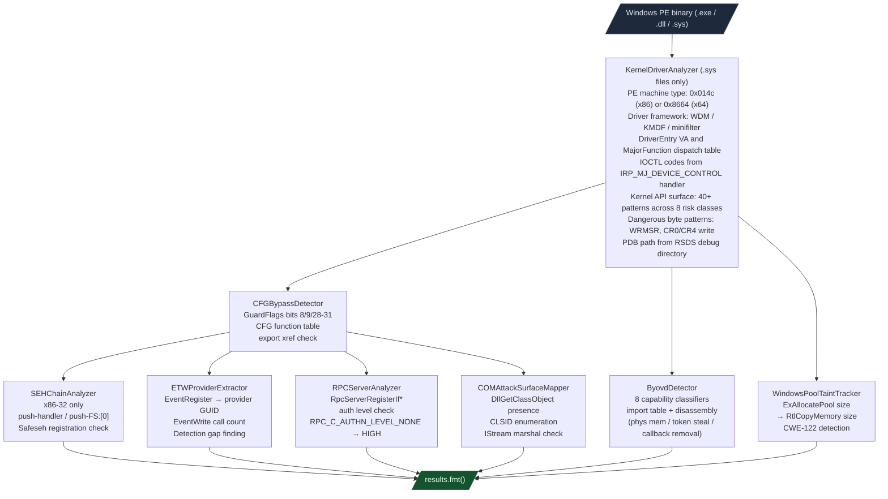
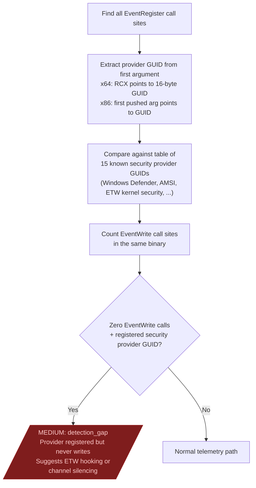
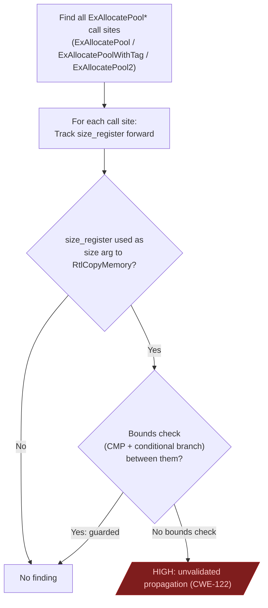

# Windows PE Security Analysis

Seven security analyzers in one pass over a Windows PE binary. Covers CFG, SafeSEH, ETW, RPC, COM, kernel pool overflows, and BYOVD capabilities.

---

## Why this exists

Two things were not possible before the Windows PE stack:

**1. A single-call security audit across the full Windows PE attack surface.**
Each analyzer previously required a separate tool with a separate output format and separate manual interpretation. Running them in sequence meant context-switching between tools and manually correlating findings. Ablation runs all seven in one session startup with consistent finding format and severity levels.

**2. BYOVD capability classification on signed drivers.**
Identifying that a driver has physical memory read/write, token stealing, or callback removal capability required manual reading of import tables and disassembly of `DriverEntry`. `ByovdDetector` classifies eight capability classes from the kernel API surface of any `.sys` file in seconds.

---

## How the seven analyzers fit together



---

## CFGBypassDetector

Microsoft Control Flow Guard (CFG) records all valid indirect call targets in a bitmap embedded in the PE. When the binary loads, the OS enforces that indirect calls only target entries in that bitmap. `CFGBypassDetector` reads `IMAGE_LOAD_CONFIG.GuardFlags` and the CFG function table.

```
  GuardFlags bit layout (IMAGE_LOAD_CONFIG_DIRECTORY):
    bit 8  (0x100):  CF_INSTRUMENTED — CFG enabled
    bit 9  (0x200):  CFW_INSTRUMENTED — export suppression enabled
    bits 28-31:      CF_FUNCTION_TABLE_SIZE_MASK — entry stride extra bytes

  CFG function table entry stride:
    base  = 4 bytes (VA offset, 4-byte aligned relative to image base)
    extra = GuardFlags >> 28     (0 for most binaries)
    total = 4 + extra bytes per entry
```

| Finding | Severity | Condition |
|---|---|---|
| `cfg_disabled` | HIGH | bit 8 of GuardFlags == 0 |
| `cfg_table_absent` | HIGH | No CFG function table in load config |
| `no_export_suppression` | MEDIUM | bit 9 of GuardFlags == 0 |
| `export_not_in_table` | MEDIUM | Exported function missing from CFG table |

An exported function absent from the CFG table is an indirect call target an attacker can use to bypass CFG because the guard only checks entries in the table.

---

## SEHChainAnalyzer

Structured Exception Handling (SEH) is an x86-32 mechanism that stores exception handler addresses on the stack. Without SafeSEH, an attacker who overwrites a stack frame's SEH record can redirect execution to an arbitrary address at exception time. `SEHChainAnalyzer` audits SafeSEH registration and scans for unregistered handler installations. x86-32 only: x64 uses table-based exception handling (`.pdata`) which is not vulnerable to this attack class.

```
  IMAGE_LOAD_CONFIG_DIRECTORY (x86-32):
    SEHandlerTable:  VA of the SafeSEH handler table
    SEHandlerCount:  number of registered handlers

  Scan: find push-handler / push-FS:[0] sequences in .text:
    PUSH <handler_va>
    PUSH DWORD PTR FS:[0]   (install SEH frame on stack)

  For each found handler_va:
    is handler_va in SEHandlerTable?
      NO → MEDIUM: handler_not_in_table (CWE-755)
```

| Finding | Severity | Condition |
|---|---|---|
| `safesh_disabled` | HIGH | SEHandlerTable == 0 or SEHandlerCount == 0 |
| `handler_not_in_table` | MEDIUM | Handler installed but not registered in SafeSEH table |

---

## ETWProviderExtractor

Event Tracing for Windows (ETW) is the kernel telemetry channel that security products (EDRs, AV, audit logging) use for real-time event streams. A driver that registers an ETW provider but never calls `EventWrite` may be suppressing security telemetry.



---

## RPCServerAnalyzer

RPC server interfaces registered without authentication expose every operation they implement to unauthenticated callers.

```
  Find RpcServerRegisterIf* call sites:
    RpcServerRegisterIf
    RpcServerRegisterIfEx  (third arg = auth level)
    RpcServerRegisterIf2

  RPC_C_AUTHN_LEVEL values:
    0x01  RPC_C_AUTHN_LEVEL_NONE     (NO authentication — HIGH severity)
    0x02  RPC_C_AUTHN_LEVEL_CONNECT  (connection-level only)
    0x04  RPC_C_AUTHN_LEVEL_PKT      (per-packet)
    0x06  RPC_C_AUTHN_LEVEL_PKT_INTEGRITY
    0x08  RPC_C_AUTHN_LEVEL_PKT_PRIVACY
```

`ana.endpoint_strings()` returns named pipe and port strings for the RPC endpoints, ready for use in a PoC that tests reachability.

---

## COMAttackSurfaceMapper

COM servers registered in a PE expose an attack surface through their class factories. An attacker who can influence which COM server handles a CLSID can redirect `CoCreateInstance` to a malicious DLL.

```
  Presence check:
    DllGetClassObject export present?
    YES → this binary is a COM server

  CLSID enumeration:
    scan .rdata and .data for GUID patterns
    match against registry-registered CLSIDs

  CoCreateInstance call sites:
    resolve CLSID argument
    CLSID used in calls but not registered in this binary?
    YES → MEDIUM: com_hijack_risk (CWE-426)

  IStream scan:
    IStream serialization near COM factory?
    YES → MEDIUM: com_marshal (CWE-502)
```

---

## WindowsPoolTaintTracker

Finds unvalidated `ExAllocatePool` size arguments flowing into `RtlCopyMemory` (CWE-122). This is the kernel equivalent of a heap overflow: allocation size and copy size use the same register without a bounds check between them.



Combine with `KernelDriverAnalyzer` to avoid re-parsing the PE: `WindowsPoolTaintTracker(path, kda_report=existing_report)`.

---

## Usage

Run all seven in sequence. Pass `kda_report` to avoid re-parsing the PE for BYOVD and pool analysis:

```python
from ablation.analyzers.kernel_driver_analyzer import KernelDriverAnalyzer
from ablation.analyzers.byovd_detector import ByovdDetector
from ablation.analyzers.cfg_bypass_detector import CFGBypassDetector
from ablation.analyzers.seh_chain_analyzer import SEHChainAnalyzer
from ablation.analyzers.etw_provider_extractor import ETWProviderExtractor
from ablation.analyzers.rpc_server_analyzer import RPCServerAnalyzer
from ablation.analyzers.com_attack_surface_mapper import COMAttackSurfaceMapper
from ablation.analyzers.windows_pool_taint_tracker import WindowsPoolTaintTracker

path = '/path/to/target.sys'

kda   = KernelDriverAnalyzer.from_path(path).analyze()
byovd = ByovdDetector(path, kda_report=kda).detect()
cfg   = CFGBypassDetector.from_path(path).scan()
seh   = SEHChainAnalyzer.from_path(path).scan()    # x86-32 only
etw   = ETWProviderExtractor.from_path(path).scan()
rpc   = RPCServerAnalyzer.from_path(path).scan()
com   = COMAttackSurfaceMapper.from_path(path).scan()
pool  = WindowsPoolTaintTracker(path, kda_report=kda).scan()
```

For user-mode DLLs and EXEs, skip `KernelDriverAnalyzer`, `ByovdDetector`, and `WindowsPoolTaintTracker`. Run `CFGBypassDetector`, `ETWProviderExtractor`, `RPCServerAnalyzer`, and `COMAttackSurfaceMapper`.

---

## Architecture support

| Analyzer | x86-32 | x86-64 |
|---|---|---|
| CFGBypassDetector | yes | yes |
| SEHChainAnalyzer | yes | no (SafeSEH is x86-32 only) |
| ETWProviderExtractor | yes | yes |
| RPCServerAnalyzer | yes | yes |
| COMAttackSurfaceMapper | yes | yes |
| WindowsPoolTaintTracker | no | yes |
| KernelDriverAnalyzer | yes | yes |
| ByovdDetector | yes | yes |
