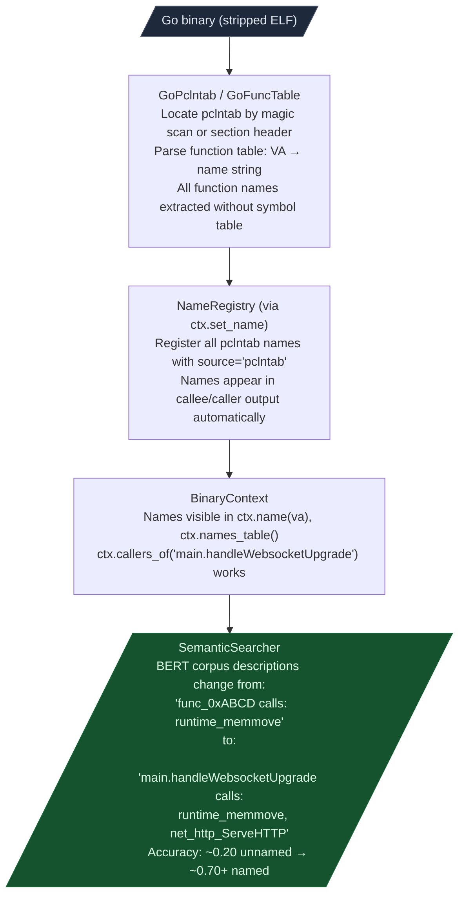
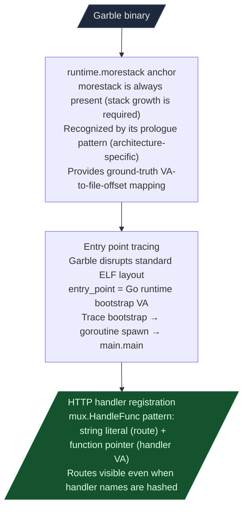

# Go Binary RE Workflow

The Go compiler always embeds the full function name table (`pclntab`) in the binary for runtime stack traces — even after `strip(1)`. Ablation extracts this table before BERT encoding, lifting semantic search accuracy from roughly 0.20 to 0.70+ on stripped Go binaries.

---

## Why this exists

Two gaps blocked Go binary RE:

**1. `strip(1)` removes symbols, but the Go runtime requires `pclntab` for stack unwinding.**
Go's runtime stack unwinder reads function names, start VAs, and end VAs from the `pclntab` section at every `panic()`, `runtime.Caller()`, and `goroutine` stack dump. The linker cannot strip it. This is a design feature of the Go runtime that becomes a RE gift: every stripped Go binary contains a complete function name table.

**2. Garble replaces pclntab names with content-addressed hashes.**
`mvdan/garble` replaces function names with hashes derived from the function's content. `GoFuncTable` returns names like `a.b` or `$1a2b3c4d` — not useful for semantic search. `GoGarbleRe` recovers structure by finding `runtime.morestack` as a ground-truth anchor and tracing HTTP handler registration patterns.

---

## pclntab format

The pclntab section begins with a 4-byte magic that identifies the Go version:

```
  pclntab header layout:
    offset 0: magic (4 bytes) — identifies format version
    offset 4: padding (2 bytes)
    offset 6: instruction size quantum (1 byte)
    offset 7: pointer size in bytes (1 byte, 4 or 8)

  Magic values:
    0xFFFFFFF1  Go 1.20+  64-bit with separate funcnametab section
    0xFFFFFFFA  Go 1.16-1.19  64-bit function table
    0xFFFFFFFB  Go 1.12-1.15  32-bit function table

  Function table entry (Go 1.16+):
    [func_VA: 8 bytes][func_offset_in_nametab: 4 bytes]

  Name resolution:
    1.20+: funcnametab is a separate rodata section; entry gives offset into it
    pre-1.20: name offset is relative to pclntab itself
    In both cases: GoFuncTable resolves to {VA: name_string}
```

The format is architecture-independent. x86-64, arm64, mips, and riscv64 Go binaries all use the same pclntab structure.

---

## Workflow



---

## Step 1: Extract pclntab names

```python
from ablation.analyzers.go_pclntab import GoFuncTable
from ablation.analyzers.binary_context import BinaryContext

data = open('/path/to/go_binary', 'rb').read()

# Returns None if the binary is not Go or pclntab is absent
ft = GoFuncTable.from_binary(data)

if ft:
    print(f"Go version: {ft.go_version}")
    print(f"Functions: {ft.n_funcs}")

    ctx = BinaryContext.load_or_build('/path/to/go_binary')
    for va, name in ft.names.items():
        ctx.set_name(va, name, source='pclntab')

    print(f"Registered {len(ft.names)} names from pclntab")
    print(ctx.names_table(limit=20))
```

---

## Step 2: Semantic sweep with named functions

```python
from ablation.analyzers.corpus_builder import CorpusBuilder
from ablation.analyzers.xref_graph import XRefGraph
from ablation.analyzers.semantic_search import SemanticSearcher

ctx = BinaryContext.load_or_build('/path/to/go_binary')
cb = CorpusBuilder()
cb.build('/path/to/go_binary', product='my-go-app', version='1.0')

xg = XRefGraph.from_path('/path/to/go_binary').build()
searcher = SemanticSearcher('/path/to/go_binary', xg=xg)
searcher.build_corpus()

results = searcher.query(
    "HTTP handler that reads request body without size limit check",
    top_k=10
)
```

---

## Step 3: Dangerous callers scan

Go binaries frequently use `os/exec` for shell operations. `GoSubprocessScanner` finds all call sites:

```python
from ablation.analyzers.go_subprocess_scanner import GoSubprocessScanner

scanner = GoSubprocessScanner('/path/to/go_binary')
hits = scanner.scan()
for h in hits:
    print(f"0x{h.va:x}  {ctx.name(h.va)}: {h.call_type}  arg={h.arg_summary}")
```

Scans for: `os/exec.Command`, `exec.CommandContext`, `syscall.Exec`, `os.StartProcess`, `syscall.RawSyscall` with `SYS_EXECVE`.

---

## Garble-obfuscated builds

`mvdan/garble` replaces pclntab function names with content-addressed hashes. `GoFuncTable` returns names like `$1a2b3c4d` — not useful for semantic search. Use `GoGarbleRe` instead:

### How GoGarbleRe works



```python
from ablation.analyzers.go_garble_re import GoGarbleRe

garble_re = GoGarbleRe('/path/to/garbled_binary')

# Entry point
entry = garble_re.find_entry_point()
print(f"Entry: 0x{entry:x}")

# HTTP handler registration patterns (mux.HandleFunc)
handlers = garble_re.find_http_handlers()
for h in handlers:
    print(f"  route={h.route!r}  handler=0x{h.handler_va:x}")

# VA-to-file-offset mapping from morestack anchor
text_va, text_offset = garble_re.find_text_section()
```

---

## Go string resolver

Go binaries use `runtime.concatstrings` for string concatenation rather than `.rodata` references. `GoStringResolver` reconstructs string constants from `concatstrings` call sites:

```python
from ablation.analyzers.go_string_resolver import GoStringResolver

resolver = GoStringResolver('/path/to/go_binary')
strings = resolver.resolve()

for va, s in strings.items():
    print(f"0x{va:x}: {s!r}")
```

This populates string context that `BinaryContext`'s `.rodata` scan misses for Go binaries, so `ctx.strings_in_func(va)` returns meaningful results after resolver injection.
