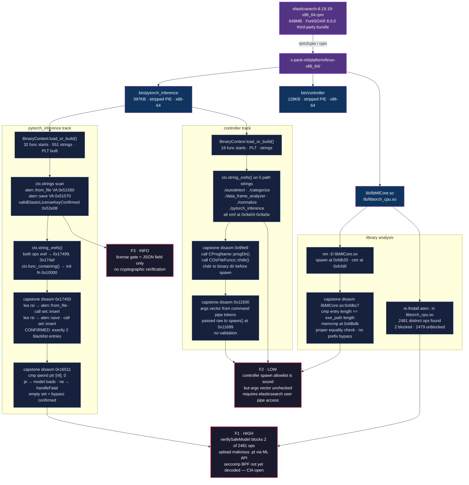

## Elasticsearch 8.19.19 x-pack-ml RE Workflow

```mermaid
flowchart TD
    RPM["elasticsearch-8.19.19-x86_64.rpm<br/>649MB · FortiSOAR 8.0.0 third-party bundle"]

    RPM -->|rpm2cpio / cpio| EXTRACT["x-pack-ml/platform/linux-x86_64/"]

    EXTRACT --> PI["bin/pytorch_inference<br/>397KB · stripped PIE · x86-64"]
    EXTRACT --> CTRL["bin/controller<br/>128KB · stripped PIE · x86-64"]
    EXTRACT --> LIBS["lib/libMlCore.so<br/>lib/libtorch_cpu.so"]

    subgraph TRACK_PI ["pytorch_inference track"]
        direction TB
        BCI["BinaryContext.load_or_build()<br/>32 func starts · 551 strings · PLT built"]
        BCI --> SS["ctx.strings scan<br/>aten::from_file VA 0x51560<br/>aten::save VA 0x51570<br/>validElasticLicenseKeyConfirmed 0x52e08"]
        SS --> XREF["ctx.string_xrefs()<br/>both ops xref → 0x17499, 0x174af<br/>ctx.func_containing() → init fn 0x10000"]
        XREF --> DA1["capstone disasm 0x17450<br/>lea rsi → aten::from_file · call set::insert<br/>lea rsi → aten::save · call set::insert<br/>CONFIRMED: exactly 2 blacklist entries"]
        DA1 --> DA2["capstone disasm 0x16511<br/>cmp qword ptr [r9], 0<br/>je → model loads · ne → handleFatal<br/>empty set = bypass confirmed"]
    end

    subgraph TRACK_LIBS ["library analysis"]
        direction TB
        NM["nm -D libMlCore.so<br/>spawn at 0xfdb20 · ctor at 0xfcfd0"]
        NM --> DA3["capstone disasm libMlCore.so:0xfdbc7<br/>cmp entry length == exe_path length<br/>memcmp at 0xfdbdb<br/>proper equality check · no prefix bypass"]
        LSCAN["re.findall aten:: in libtorch_cpu.so<br/>2481 distinct ops found<br/>2 blocked · 2479 unblocked"]
    end

    subgraph TRACK_CTRL ["controller track"]
        direction TB
        BCC["BinaryContext.load_or_build()<br/>18 func starts · PLT · strings"]
        BCC --> XREF2["ctx.string_xrefs() on 5 path strings<br/>./autodetect · ./categorize<br/>./data_frame_analyzer · ./normalize<br/>./pytorch_inference<br/>all xref at 0x9a04-0x9a5e"]
        XREF2 --> DA4["capstone disasm 0x99e9<br/>call CProgName::progDir()<br/>call COsFileFuncs::chdir()<br/>chdir to binary dir before spawn"]
        DA4 --> DA5["capstone disasm 0x11500<br/>args vector from command pipe tokens<br/>passed raw to spawn() at 0x11699<br/>no validation"]
    end

    PI --> BCI
    PI --> BCC
    LIBS --> NM
    LIBS --> LSCAN

    DA2 --> F1
    LSCAN --> F1["F1 · HIGH<br/>verifySafeModel blocks 2 of 2481 ops<br/>upload malicious .pt via ML API<br/>seccomp BPF not yet decoded — CIA open"]

    DA3 --> F2
    XREF2 --> F2["F2 · LOW<br/>controller spawn allowlist is sound<br/>but args vector unchecked<br/>requires elasticsearch user pipe access"]

    DA5 --> F2

    SS --> F3["F3 · INFO<br/>license gate = JSON field only<br/>no cryptographic verification"]

    classDef finding fill:#1a1a2e,stroke:#e94560,stroke-width:2px,color:#fff
    classDef tool fill:#16213e,stroke:#0f3460,stroke-width:1px,color:#e5e7eb
    classDef binary fill:#0f3460,stroke:#533483,stroke-width:2px,color:#fff
    classDef input fill:#533483,stroke:#7c3aed,stroke-width:2px,color:#fff

    class F1,F2,F3 finding
    class BCI,BCC,NM,LSCAN,SS,XREF,XREF2,DA1,DA2,DA3,DA4,DA5 tool
    class PI,CTRL,LIBS binary
    class RPM,EXTRACT input
```
